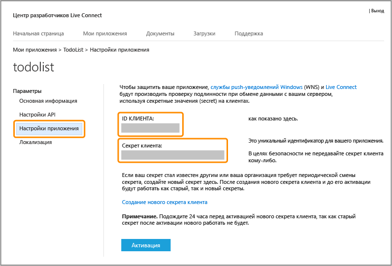

<properties
	pageTitle="Регистрация для проверки подлинности Майкрософт | Microsoft Azure"
	description="Узнайте, как зарегистрироваться, чтобы использовать аутентификацию Майкрософт в приложении мобильных служб Azure."
	authors="ggailey777"
	services="mobile-services"
	documentationCenter="Mobile"
	manager="dwrede"
	editor=""/>

<tags 
	ms.service="mobile-services" 
	ms.workload="mobile" 
	ms.tgt_pltfrm="NA" 
	ms.devlang="multiple" 
	ms.topic="article" 
	ms.date="11/30/2015" 
	ms.author="glenga"/>

# Регистрация приложения для использования учетной записи Майкрософт с целью проверки подлинности.

[AZURE.INCLUDE [mobile-service-note-mobile-apps](../../includes/mobile-services-note-mobile-apps.md)]

&nbsp;

[AZURE.INCLUDE [mobile-services-selector-register-identity-provider](../../includes/mobile-services-selector-register-identity-provider.md)]

## Обзор

В этом разделе показано, как зарегистрировать мобильное приложение для использования учетной записи Майкрософт в качестве поставщика удостоверений с мобильными службами Azure. Одни и те же действия применяются как для управляемой службой, так и управляемой клиентом проверки подлинности с помощью пакета Live SDK.

##Регистрация приложения Магазина Windows в Центре разработки для Windows

Приложения Магазина Windows сначала должны быть зарегистрированы в Центре разработки для Windows.

>[AZURE.NOTE]Информация в этом разделе неприменима к приложениям Windows Phone 8, Windows Phone 8.1 Silverlight, а также приложениям, отличным от Windows.

1. Если вы еще не зарегистрировали свое приложение, перейдите в [Центр разработки для Windows](https://dev.windows.com/dashboard/Application/New), войдите с использованием своей учетной записи Майкрософт, введите имя своего приложения, а затем щелкните **Зарезервировать имя приложения**.

3. Откройте проект приложения для Windows в Visual Studio и в обозревателе решений щелкните правой кнопкой мыши проект приложения Магазина Windows. Выберите **Магазин**, а затем — **Связать приложение с Магазином…**.

  	

5. В окне мастера щелкните **Войти** и войдите в систему с помощью учетной записи Майкрософт, выберите зарезервированное имя приложения, затем щелкните **Далее** > **Связать**.

6. (Необязательно.) Чтобы зарегистрировать универсальное приложение для Windows 8.1, повторите шаги 4 и 5 для проекта Магазина Windows Phone.

6. На странице создания приложения в центре разработки для Windows щелкните **Службы** > **Push-уведомления**.

7. На странице **Push-уведомления** щелкните **Сайт служб Live** в разделе **Служба push-уведомлений Windows (WNS) и мобильные службы Microsoft Azure**.

Откроется страница учетной записи Майкрософт для вашего приложения. Далее вы получите учетные данные аутентификации, необходимые Azure для использования аутентификации Майкрософт для вашего приложения.

## Настройка регистрации учетной записи Майкрософт и подключение к мобильным службам

Первый шаг в этом разделе касается только приложений Windows Phone 8, Windows Phone 8.1 Silverlight и приложений, отличных от Магазина Windows. Для этих приложений также можно игнорировать пакет идентификатора безопасности (SID), который доступен только для приложений Магазина Windows.

1. Для приложений не для Магазина Windows перейдите на страницу [Мои приложения](http://go.microsoft.com/fwlink/p/?LinkId=262039) в Центре разработки для учетных записей Майкрософт, войдите с помощью своей учетной записи Майкрософт (если требуется), щелкните **Создать приложение**, введите **имя приложения** и нажмите кнопку **Принимаю**.

   	Имя приложения резервируется для учетной записи Майкрософт, и отображается страница учетной записи Майкрософт для вашего приложения.

2. На странице учетной записи Майкрософт для своего приложения щелкните **Параметры API**, выберите параметр **Мобильное или классическое клиентское приложение**, задайте URL-адрес мобильной службы как **Целевой домен**, укажите в параметре **URL-адрес перенаправления** один из приведенных ниже форматов, а затем нажмите кнопку **Сохранить**.

	+ **Серверная служба .NET**: `https://<mobile_service>.azure-mobile.net/signin-microsoft`
	+ **Серверная служба JavaScript**: `https://<mobile_service>.azure-mobile.net/login/microsoftaccount`

	 >[AZURE.NOTE]Убедитесь, что для типа интерфейса мобильных служб используется правильный формат пути URL-адреса перенаправления. Если он неправильный, аутентификация не будет успешной. **Корневой домен** должен быть подставлен автоматически. &nbsp;

    

4. Щелкните **Параметры приложений** и запишите значения полей **Идентификатор клиента**, **Секрет клиента** и **Идентификатор безопасности пакета**.

   	

    > [AZURE.NOTE]Секрет клиента — это важные учетные данные безопасности. Не сообщайте никому этот секрет клиента и не распространяйте его вместе со своим приложением. Поле "Идентификатор безопасности пакета" отображается при регистрации только приложений Магазина Windows.

4. На [классическом портале Azure] откройте вкладку **Идентификатор** мобильной службы, введите идентификатор клиента, секрет клиента и идентификатор безопасности пакета, полученные от поставщика удостоверений, а затем нажмите кнопку **Сохранить**.

	>[AZURE.NOTE]Не требуется задавать значение идентификатора безопасности пакета для приложений Windows Phone 8, Windows Phone Store 8.1 Silverlight или приложений, отличных от Windows.

Мобильная служба и приложение теперь настроены для работы с учетной записью Майкрософт.

<!-- Anchors. -->

<!-- Images. -->

<!-- URLs. -->

[Submit an app page]: http://go.microsoft.com/fwlink/p/?LinkID=266582
[My Applications]: http://go.microsoft.com/fwlink/p/?LinkId=262039

[классическом портале Azure]: https://manage.windowsazure.com/

<!---HONumber=AcomDC_1210_2015-->