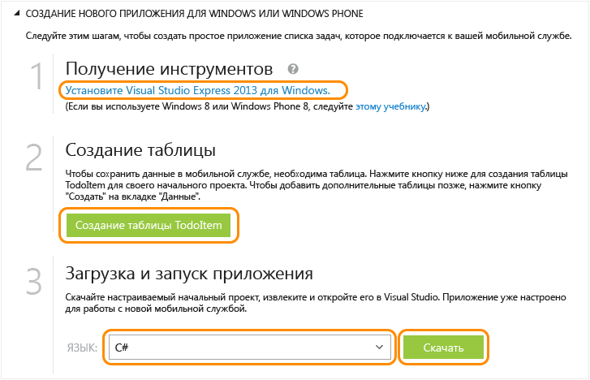

<properties 
	pageTitle="Приступая к работе с мобильными службами для приложений для Магазина Windows | Центр мобильных разработок" 
	description="Следуйте указаниям этого учебника, чтобы приступить к использованию мобильных служб Azure для разработки приложений Магазина Windows на C# или JavaScript." 
	services="mobile-services" 
	documentationCenter="windows" 
	authors="ggailey777" 
	manager="dwrede" 
	editor=""/>

<tags 
	ms.service="mobile-services" 
	ms.workload="mobile" 
	ms.tgt_pltfrm="" 
	ms.devlang="dotnet" 
	ms.topic="hero-article" 
	ms.date="02/10/2015" 
	ms.author="glenga"/>

# Приступая к работе с мобильными службами

[AZURE.INCLUDE [mobile-services-selector-get-started](../../includes/mobile-services-selector-get-started.md)]

В этом учебнике показано, как добавить облачную серверную службу в универсальное приложение Windows с помощью мобильных служб Azure. Решения для универсальных приложений Windows включают проекты для приложений Магазинов Windows 8.1 и Windows Phone 8.1 и общий проект. Дополнительные сведения см. в разделе [Создание универсальных приложений Windows для Windows и Windows Phone](http://msdn.microsoft.com/library/windows/apps/xaml/dn609832.aspx).

В этом учебнике будет создана новая мобильная служба и простое приложение *To do list*, которое хранит данные приложения в новой мобильной службе. Мобильная служба, которая будет создана, использует JavaScript для бизнес-логики на стороне сервера. Сведения о создании мобильной службы, которая позволит создавать в Visual Studio бизнес-логику на серверной стороне на языках, поддерживаемых на платформе .NET, см. в разделе о серверной версии .NET.

>[AZURE.NOTE]В этом разделе показано, как создать новый проект мобильной службы и универсальное приложение Windows с помощью портала управления Azure. Используя Visual Studio 2013, можно также добавить новый проект мобильной службы в существующее решение Visual Studio. Дополнительные сведения см. в разделе [Добавление мобильных служб к существующему приложению](mobile-services-javascript-backend-windows-universal-dotnet-get-started-data.md).

>Чтобы добавить мобильную службу в проект приложения для Windows Phone 8.0 или Windows Phone Store 8.1, см. раздел [Добавление мобильных служб к существующему приложению Windows Phone](mobile-services-windows-phone-get-started-data.md).

[AZURE.INCLUDE [mobile-services-windows-universal-get-started](../../includes/mobile-services-windows-universal-get-started.md)]

Для работы с этим учебником требуется:

* Активная учетная запись Azure. Если у вас нет учетной записи, можно зарегистрироваться для получения бесплатной пробной версии Azure и получить до 10 бесплатных мобильных служб, которые можно использовать и после окончания пробного периода. Дополнительные сведения см. в разделе [Бесплатная пробная версия Azure](http://www.windowsazure.com/pricing/free-trial/?WT.mc_id=A0E0E5C02&amp;returnurl=http%3A%2F%2Fazure.microsoft.com%2Fru-ru%2Fdocumentation%2Farticles%2Fmobile-services-javascript-backend-windows-store-javascript-get-started%2F).
* [Visual Studio 2013 Express для Windows] 

## Создание мобильной службы

[AZURE.INCLUDE [mobile-services-create-new-service](../../includes/mobile-services-create-new-service.md)]

## Создание нового универсального приложения для Windows

После создания мобильной службы вы можете следовать простым шагам быстрого запуска на портале управления, чтобы создать новое приложение или изменить существующее приложение и подключить его к вашей мобильной службе. 

В этом разделе будет создано новое приложение для магазина Windows, подключаемое к вашей мобильной службе.

1.  На портале управления щелкните **Мобильные службы**, а затем выберите только что созданную мобильную службу.

   
2. На вкладке быстрого начала работы щелкните **Windows** в разделе **Выбор платформы**, а затем разверните узел **Создание нового приложения для магазина Windows**.

   	Здесь показаны три простых шага по созданию приложения для магазина Windows, подключаемого к вашей мобильной службе.

  	

3. Если это еще не сделано, загрузите и установите [Visual Studio 2013 Express для Windows] на локальном компьютере или виртуальной машине.

4. Чтобы создать таблицу для хранения данных приложения, нажмите кнопку **Создание таблицы TodoItem**.

5. В разделе **Загрузить и запустить приложение** выберите язык для своего приложения, а затем нажмите кнопку **Загрузить**. 

  	При этом будут загружены файлы проекта для примера по созданию приложения *To do list*, подключаемого к вашей мобильной службе. Сохраните сжатый файл проекта на локальном компьютере и запомните путь к нему.

## Запустите приложение Windows

[AZURE.INCLUDE [mobile-services-javascript-backend-run-app](../../includes/mobile-services-javascript-backend-run-app.md)]

>[AZURE.NOTE]Код, который обращается к вашей мобильной службе для запроса и вставки данных, можно просмотреть в файле MainPage.xaml.cs.

## Дальнейшие действия
Теперь, когда вы закончили быстрый запуск, узнайте, как выполнять дополнительные важные задачи в мобильных службах: 

* [Добавление мобильных служб к существующему приложению][Начало работы с данными]
   Дополнительные сведения о хранении данных и запросах к ним с помощью мобильных служб.

* [Начало работы с автономной синхронизацией данных]
   Узнайте, как обеспечить быстрый отклик и надежность приложений с помощью синхронизации автономных данных.

* [Добавление проверки подлинности к приложению мобильных служб ][Начало работы с проверкой подлинности]
   Дополнительные сведения о проверке подлинности пользователей приложения с использованием поставщика удостоверений.

* [Добавление push-уведомлений к приложению][Начало работы с push-приложениями] 
   Сведения об отправке в приложение простейших push-уведомлений.

Дополнительные сведения об универсальных приложениях Windows см. в разделе [Поддержка нескольких клиентов из одной мобильной службы](mobile-services-how-to-use-multiple-clients-single-service.md#shared-vs).

<!-- Anchors. -->
[Приступая к работе с мобильными службами]:#getting-started
[Создание новой мобильной службы]:#create-new-service
[Определение экземпляра мобильной службы]:#define-mobile-service-instance
[Дальнейшие действия]:#next-steps

<!-- Images. -->

<!-- URLs. -->
[Приступая к работе с данными]: mobile-services-javascript-backend-windows-universal-dotnet-get-started-data.md
[Приступая к работе с данными]: ../mobile-services-windows-store-dotnet-get-started-data.md
[Начало работы с автономной синхронизацией данных]: mobile-services-windows-store-dotnet-get-started-offline-data.md
[Приступая к работе с аутентификацией]: ../mobile-services-windows-store-dotnet-get-started-users.md
[Приступая к работе с push-уведомлениями]: ../mobile-services-javascript-backend-windows-store-dotnet-get-started-push.md
[Visual Studio 2013 Express для Windows]: http://go.microsoft.com/fwlink/?LinkId=257546
[Пакет SDK для мобильных служб]: http://go.microsoft.com/fwlink/?LinkId=257545
[Портал управления]: https://manage.windowsazure.com/
[Приступая к работе с данными в мобильных службах с помощью Visual Studio 2012]: ../mobile-services-windows-store-dotnet-get-started-data-vs2012.md

<!--HONumber=52--> 