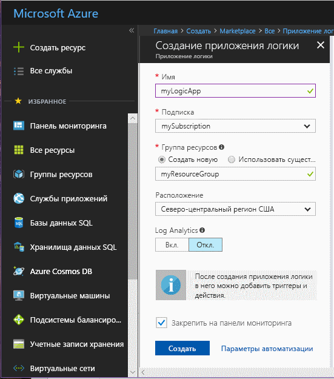
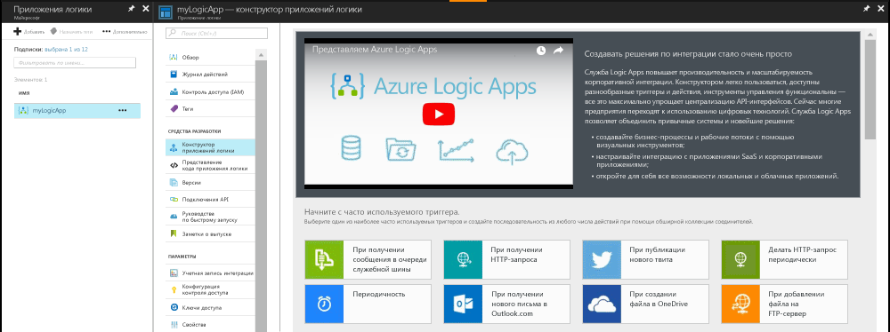
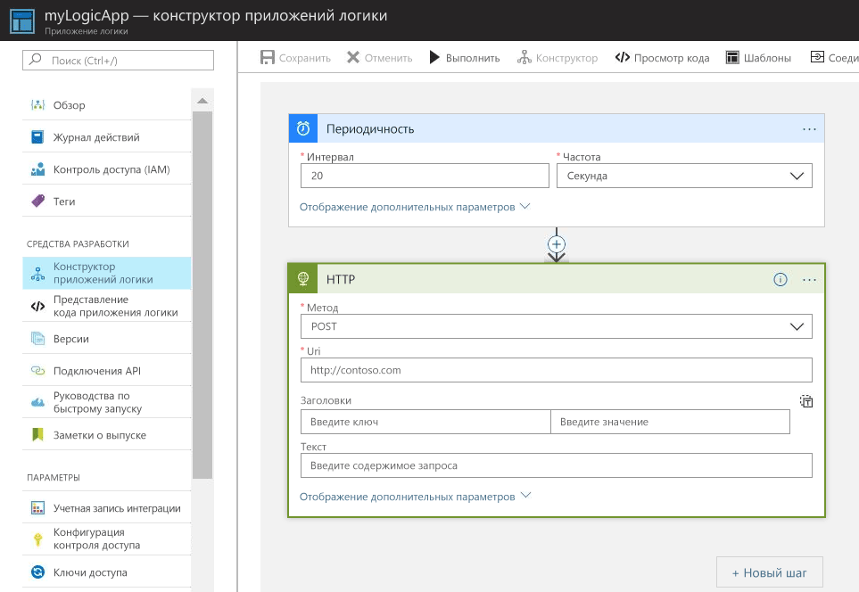
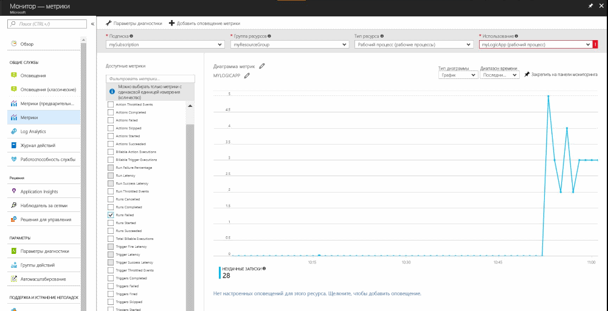
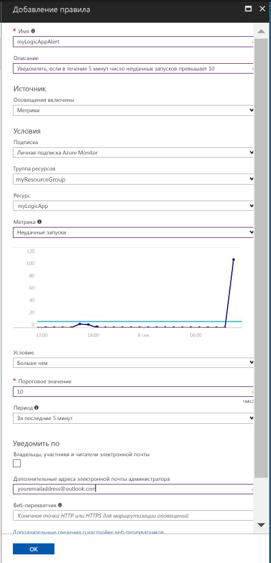

# Получение уведомлений при выполнении условия в значении метрики

Azure Monitor предоставляет доступ к метрикам многим ресурсам Azure. Эти метрики передают значения производительности и работоспособности этих ресурсов. Во многих случаях значения метрик могут указывать, что с ресурсом возникла проблема. Вы можете создать оповещения метрик, чтобы отслеживать ненормальное поведение и получать уведомления при его возникновении. Это краткое руководство содержит сведения по созданию приложения логики, созданию задания и визуализации метрик для приложения логики. Здесь также описаны сведения о создании оповещений и получении уведомлений о метриках для ресурса приложения логики.

Дополнительные сведения о метриках и оповещениях метрик см. в статьях [Обзор метрик в Microsoft Azure](./monitoring-overview-metrics.md) и [Что такое оповещения в Microsoft Azure?](./monitoring-overview-alerts.md). 

Если у вас еще нет подписки Azure, создайте [бесплатную](https://azure.microsoft.com/free/) учетную запись Azure, прежде чем начинать работу.

## Выполните вход на портал Azure.

Войдите на [портале Azure](https://portal.azure.com/).

## Создание приложения логики

1. Нажмите кнопку **Создать ресурс** в верхнем левом углу окна портала Azure.

2. Найдите и выберите **приложение логики**. Нажмите кнопку **Создать** .

3. Введите имя приложения (myLogicApp) и имя группы ресурсов (myResourceGroup). Используйте свою подписку.  Используйте расположение по умолчанию. Установите флажок **Закрепить на панели мониторинга**.  Затем нажмите кнопку **Создать**. 

      

4. Приложение логики должно быть закреплено на панели мониторинга. Перейдите к приложению логики, щелкнув его.

5. На панели приложения логики выберите **Logic App Designer** (Конструктор приложений логики).

       

6. Установите значения, как показано на следующей диаграмме.

    . 

7. В конструкторе выберите триггер **повторения**.

8. Установите интервал времени с частотой в 20 секунд, чтобы убедиться, что ваше приложение логики запускается каждые 20 секунд.

9. Нажмите кнопку **Новый шаг** и выберите **Добавить действие**.

10. Выберите параметр **HTTP**, а затем **HTTP-HTTP**.

11. Установите для параметра **Метод** значение POST, а для параметра **URI** укажите веб-адрес по своему выбору.

12. Выберите команду **Сохранить**.

13. Для отображения действий для запуска приложения логики может потребоваться около 5 минут.  

## Просмотр метрик для приложения логики

1. В левой области навигации выберите **Монитор**.

2. Выберите вкладку **Метрики** и введите информацию в полях **Подписка**, **Группа ресурсов**, **Тип ресурса** и **Ресурс** для приложения логики.

3. В списке метрик выберите **Runs Started** (Начало запуска).

4. Измените **диапазон времени** диаграммы для отображения данных за последний час.

5. Должна появиться диаграмма со сведениями об общем количестве запусков приложения логики за последний час. Если они не отображаются, убедитесь, что вы подождали хотя бы 5 минут на предыдущем шаге. Затем обновите страницу в браузере. 

    

## Создание оповещений метрики для приложения логики

1.  В правой верхней части панели метрик нажмите кнопку **Add metric alert** (Добавить оповещение метрики).

2. Введите имя для оповещения метрики myLogicAppAlert и предоставьте краткое описание оповещения.

3. Задайте для параметра **Условие** оповещения метрики значение "Больше чем", для параметра **Пороговое значение** — "10", а для параметра **Период** — "За последние 5 минут".

4. Наконец, введите адрес электронной почты в разделе **Additional administrator email(s)** (Дополнительные адреса электронной почты). Эти оповещения гарантируют, что вы будете получать электронные сообщения, если в приложении логики будет выполнено более 10 неудачных операций за 5 минут.

    

## Получение уведомлений об оповещениях метрик для приложения логики
1. В течение нескольких минут вы должны получить электронное сообщение с оповещением от Microsoft Azure, о том что ваше оповещение активировано.

2. Вернитесь к своему приложению логики и измените интервал для триггера повторений на 1 и установите частоту в один час.

3. В течение нескольких минут вы должны получить электронное сообщение с оповещением от Microsoft Azure, о том что создание оповещения завершено.

## Очистка ресурсов

Другие краткие руководства в этой коллекции созданы на основе этого документа. Если вы планируете продолжать работу с этими руководствами по быстрому запуску или обычными руководствами, не удаляйте созданные ресурсы. Если вы не планируете продолжать работу, удалите все созданные ресурсы, выполнив на портале Azure следующие действия.

1. В левом меню на портале Azure выберите **Монитор**.

2. Выберите вкладку **Оповещения**, найдите и выберите оповещение, созданное при работе с этим кратким руководством.

3. На панели оповещений метрик выберите **Удалить**.

4. В меню слева на портале Azure найдите **Приложение логики**, а затем выберите **Приложения логики**.

5. На панели в текстовом поле выберите приложение логики, созданное при работе с этим кратким руководством, а затем щелкните **Удалить**.

## Дополнительная информация

Из этого краткого руководства вы узнали, как создать оповещения метрик для ресурсов. Чтобы получить дополнительные сведения об оповещениях метрик, щелкните указанную ниже плитку.

> [!div class="nextstepaction"]
> [Аудит и получение уведомлений о важных действиях в подписке Azure](./monitor-quick-audit-notify-action-in-subscription.md )
