# Приступая к работе с Azure Monitor
Служба платформы Azure Monitor — это единый источник для мониторинга ресурсов Azure. С помощью Azure Monitor можно визуализировать, запрашивать, маршрутизировать, архивировать метрики и журналы, полученные от ресурсов Azure, и выполнять другие действия с ними. Эти операции можно выполнять с помощью портала Azure, [командлетов Monitor PowerShell](insights-powershell-samples.md), [кроссплатформенного интерфейса командной строки](insights-cli-samples.md) и [интерфейсов REST API Azure Monitor](https://msdn.microsoft.com/library/dn931943.aspx). В этой статье на примере работы с порталом рассматриваются некоторые ключевые компоненты Azure Monitor.

## Пошаговое руководство
1. На портале выберите **Все службы** и найдите пункт **Мониторинг**. Щелкните значок звездочки, чтобы добавить этот пункт в список избранного, чтобы он всегда был легко доступен на панели навигации слева.

    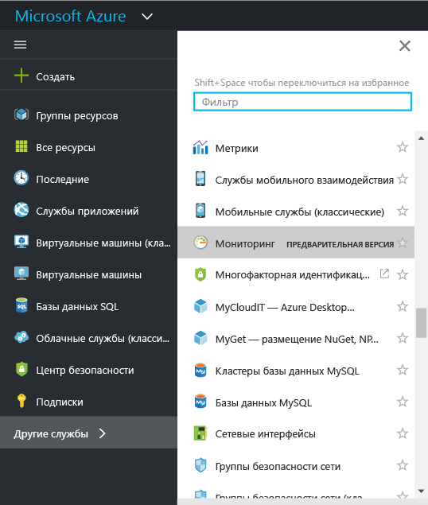
2. Щелкните **Мониторинг**, чтобы открыть страницу **Мониторинг**. На этой странице отображено единое представление всех параметров мониторинга и данных. Сначала открывается раздел **Обзор**. Здесь отображается сводка всех оповещений и ошибок системы мониторинга, а также рекомендаций по работоспособности службы, касающихся ресурсов в вашей подписке.  

    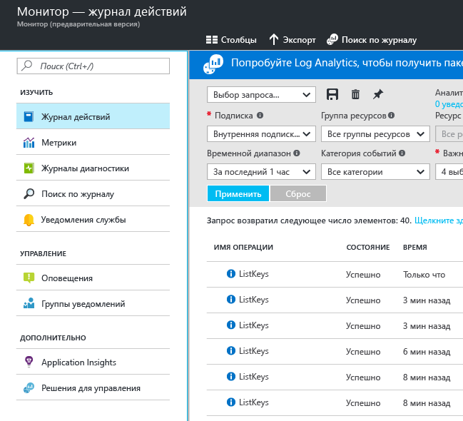

    В Azure Monitor есть три основных категории данных мониторинга: **журнал действий**, **метрики** и **журналы диагностики**.
3. Щелкните **Журналом действий** , чтобы отобразить раздел журнала действий.

    В [**журнале действий**](monitoring-overview-activity-logs.md) описываются все операции, выполняемые с ресурсами в подписке. Журнал действий содержит информацию обо всех операциях создания, обновления или удаления, выполненными с ресурсами в подписке, включая сведения о пользователе, времени и действии. Например, журнал действий покажет, когда было остановлено веб-приложение и кто его остановил. События в журнале действий платформы хранятся и доступны для запросов в течение 90 дней.

    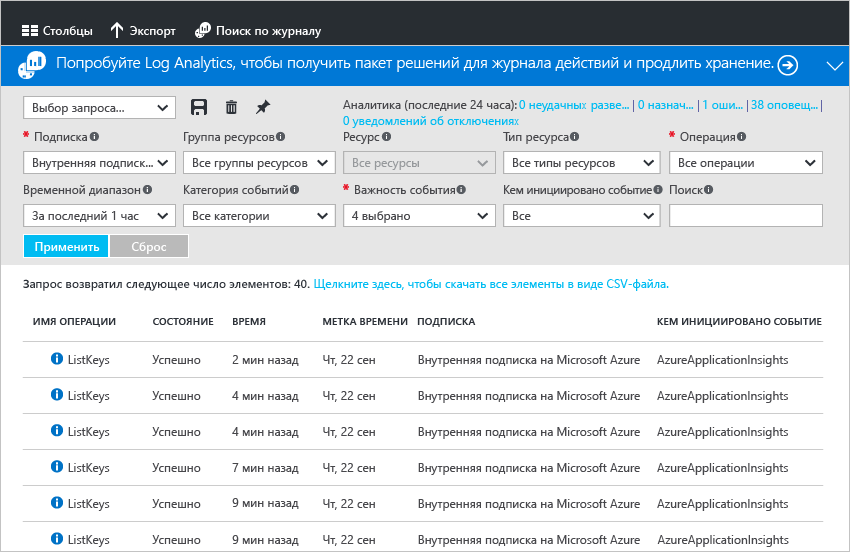

    Можно создавать и сохранять запросы для распространенных фильтров, а затем закрепить наиболее важные запросы на панели мониторинга на портале, чтобы всегда знать о событиях, которые соответствуют указанным условиям.
4. Отфильтруйте представление для отображения определенной группы ресурсов за прошлую неделю, а затем нажмите кнопку **Сохранить** . Присвойте запросу имя.

    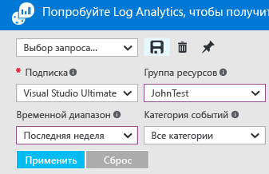
5. Теперь нажмите кнопку **Закрепить** .

    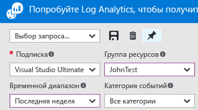

    Большинство представлений в этом пошаговом руководстве можно закрепить на панели мониторинга. Это поможет вам создать единый источник информации о рабочих данных в службах.
6. Вы вернетесь к панели мониторинга. Как видите, теперь запрос (и количество результатов) отображается на панели мониторинга. Это удобно, если нужно быстро просмотреть любые важные действия, недавно выполненные в подписке, например присвоение роли или удаление виртуальной машины.

    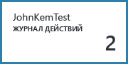
7. Вернитесь к элементу **Мониторинг** и щелкните раздел **Метрики**. Сначала следует выбрать ресурс с помощью фильтра и раскрывающегося списка параметров в верхней части страницы.

    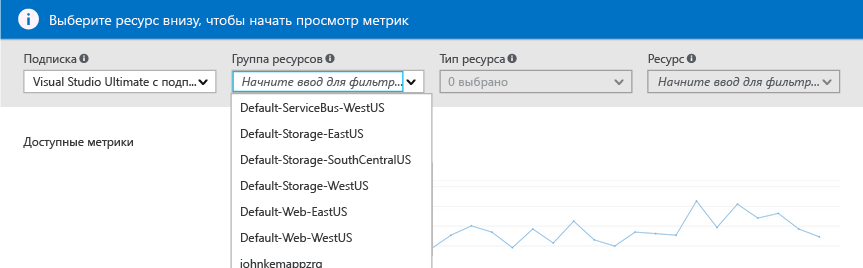

    Все ресурсы Azure генерируют [**метрики**](monitoring-overview-metrics.md). В этом представлении все метрики собраны в одном расположении, чтобы вы могли быстро оценить состояние ресурсов. Кроме того, ознакомьтесь с нашим [новым методом построения диаграмм](https://aka.ms/azuremonitor/new-metrics-charts), выбрав вкладку **Metrics (preview)** (Метрики (предварительная версия)).
8. После выбора ресурса все доступные метрики отображаются в левой части страницы. Можно отобразить на диаграмме сразу несколько метрик, выбрав их и изменив тип графика и диапазон времени. Можно также просмотреть все оповещения метрик для данного ресурса.

    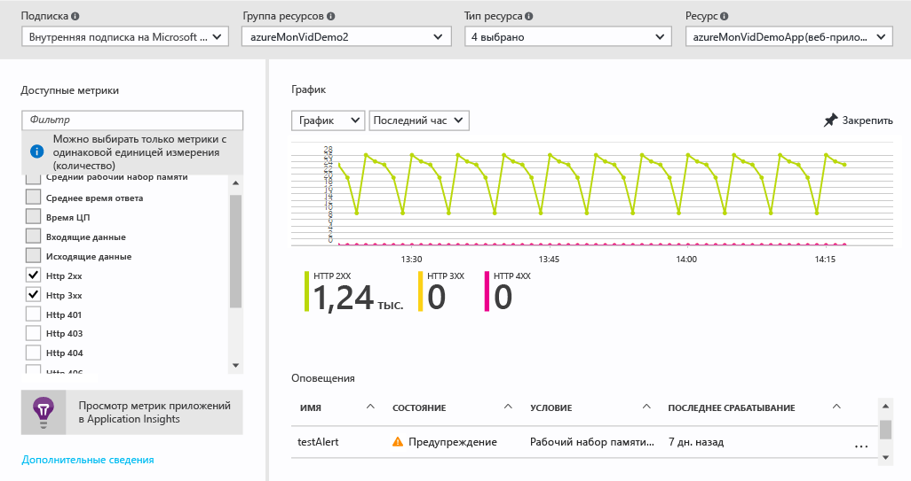

   > [!NOTE]
   > Некоторые метрики доступны только после включения для ресурса службы [Application Insights](../application-insights/app-insights-overview.md) и (или) расширения системы диагностики Azure на платформе Windows или Linux.
   >
   >

9. Если диаграмма вас полностью устраивает, можете нажать кнопку **Закрепить** , чтобы закрепить ее на панели мониторинга.
10. Вернитесь на страницу **Мониторинг** и щелкните **Журналы диагностики**.

    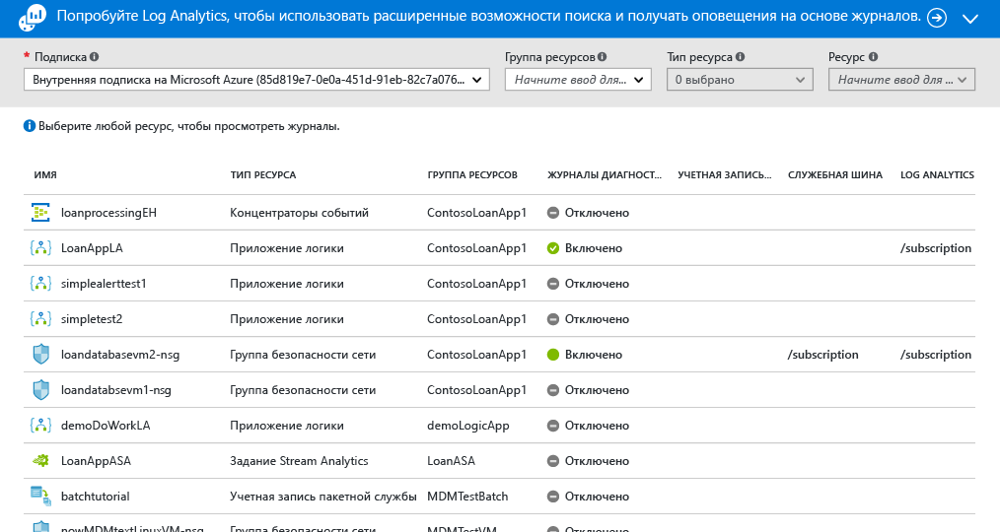

    [**Журналы диагностики**](monitoring-overview-of-diagnostic-logs.md), генерируемые *ресурсом*, содержат данные о его работе. Например, счетчики правила группы безопасности сети и журналы рабочих процессов приложения логики относятся к журналам диагностики. Эти журналы можно сохранять в учетной записи хранения, передавать в концентратор событий и (или) отправлять в [Log Analytics](../log-analytics/log-analytics-overview.md). Служба Log Analytics от Майкрософт — это решение для оперативной аналитики с возможностью расширенного поиска и создания оповещений.

    На портале можно просмотреть и отфильтровать список всех ресурсов в подписке, чтобы выяснить, включен ли для них сбор журналов диагностики.
    > [!NOTE]
    > Отправка многомерных метрик с помощью параметров диагностики сейчас не поддерживается. Метрики с измерениями экспортируются как преобразованные в плоскую структуру одномерные метрики, агрегированные по значениям измерений.
    >
    > *Пример.* Метрику "Входящие сообщения" в концентраторе событий можно изучить и вывести в виде диаграммы на уровне очереди. Но при экспорте с помощью параметров диагностики метрика будет представлена в виде всех входящих сообщений для всех очередей концентратора событий.
    >
    >

11. Щелкните ресурс на странице журналов диагностики. Если журналы диагностики хранятся в учетной записи хранения, то вы увидите список ежечасных журналов, которые можно скачать напрямую.

    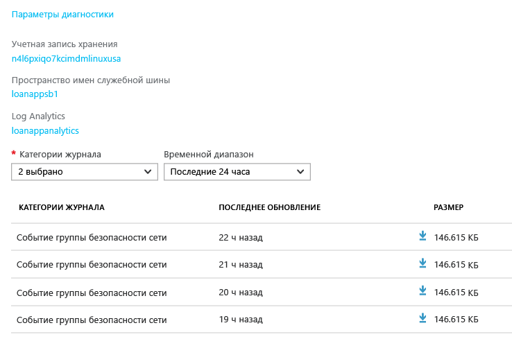

    Можно также щелкнуть **Параметры диагностики**, чтобы настроить архивирование в учетную запись хранения, потоковую передачу в концентратор событий или отправку в рабочую область Log Analytics.

    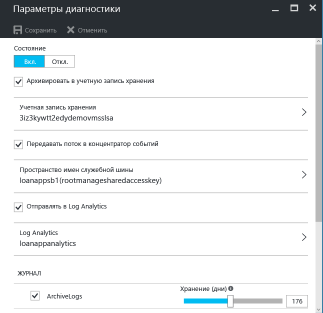

    Если настроена отправка журналов диагностики в Log Analytics, то их можно находить в разделе **Поиск по журналу** на портале.
12. Перейдите к разделу **Оповещения (классические)** страницы мониторинга.

    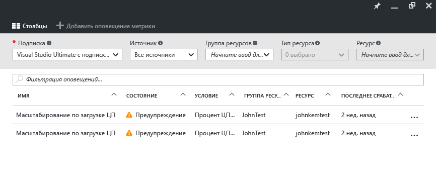

    Здесь вы можете управлять всеми [**классическими оповещениями**](monitoring-overview-alerts.md) для ресурсов Azure. Сюда входят оповещения на основе метрик, событий журнала действий, веб-тестов Application Insights (расположения) и упреждающей диагностики Application Insights. Оповещения связаны с группами действий. [Группы действий](monitoring-action-groups.md) позволяют уведомлять пользователей или выполнять определенные действия при срабатывании оповещения.

13. Щелкните **Add metric alert** (Добавить оповещение метрики), чтобы создать оповещение.

    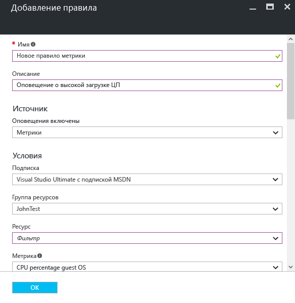

    Затем можно закрепить оповещение на панели мониторинга, чтобы его состояние можно было просмотреть в любое время.

    В Azure Monitor теперь также есть [**новые оповещения**](https://aka.ms/azuremonitor/near-real-time-alerts) (предварительная версия), которые могут выполняться поминутно.

14. Раздел "Мониторинг" содержит ссылки на приложения [Application Insights](../application-insights/app-insights-overview.md) и решения по управлению [Log Analytics](../log-analytics/log-analytics-overview.md). Эти отдельные продукты Майкрософт, тесно интегрированные с Azure Monitor.
15. Если вы не используете Application Insights или Log Analytics, вполне вероятно, что Azure Monitor совместим с вашими текущими продуктами для мониторинга, ведения журнала и создания оповещений. На странице наших [партнеров](monitoring-partners.md) приведен полный список продуктов и инструкции по интеграции.

Следуя этим инструкциям и закрепляя все важные для вас элементы на панели мониторинга, вы можете создавать комплексные представления приложения и инфраструктуры, имеющие следующий вид.

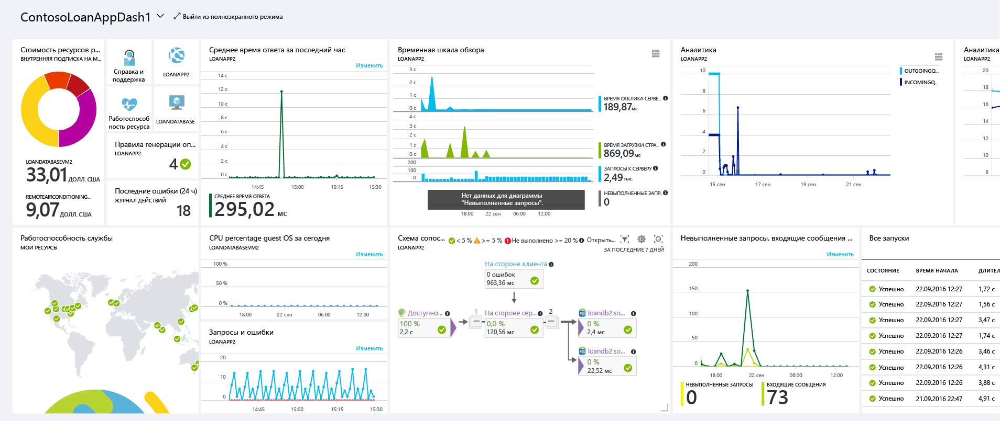

## Дополнительная информация
* Прочтите [обзор всех средств мониторинга Azure](monitoring-overview.md), чтобы понять, как служба Azure Monitor взаимодействует с ними.
