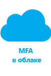
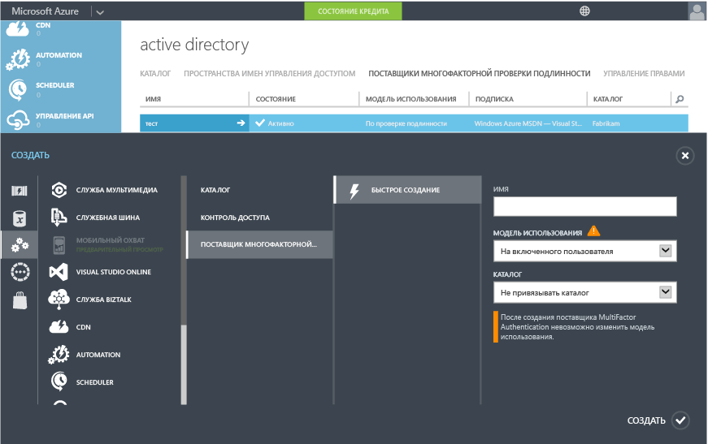

<properties 
	pageTitle="Приступая к работе с Azure Multi-Factor Authentication в облаке" 
	description="Эта страница посвящена службе Azure Multi-Factor Authentication. Она содержит сведения по началу работы с Azure Multi-Factor Authentication в облаке." 
	services="multi-factor-authentication" 
	documentationCenter="" 
	authors="billmath" 
	manager="stevenpo" 
	editor="curtand"/>

<tags 
	ms.service="multi-factor-authentication" 
	ms.workload="identity" 
	ms.tgt_pltfrm="na" 
	ms.devlang="na" 
	ms.topic="get-started-article" 
	ms.date="08/24/2015" 
	ms.author="billmath"/>

# Приступая к работе с Azure Multi-Factor Authentication в облаке

Теперь, определив, что многофакторную проверку подлинности мы будем использовать в облаке, давайте перейдем к делу. Обратите внимание, что при использовании Multi-Factor Authentication для Office 365 или Multi-Factor Authentication для администраторов Azure можно перейти к шагу 3. В этом документе также рассматривается

1. **Зарегистрируйтесь, чтобы оформить подписку Azure.**
	- Если у вас еще нет подписки Azure, вам необходимо зарегистрироваться для ее оформления. Если вы только начинаете работать с Azure Multi-Factor Authentication, вы можете воспользоваться пробной подпиской.
2. **Создайте поставщик Multi-Factor Authentication либо назначьте пользователям лицензию Azure AD Premium или Enterprise Mobility Suite.**
	- Вам потребуется создать поставщик Azure Multi-Factor Authentication и назначить его вашему каталогу либо назначить лицензии пользователям Azure AD Premium или EMS. Служба Azure Multi Factor Authentication включена в предложение Azure Active Directory Premium, а следовательно, и в Enterprise Mobility Suite. Если вы используете Azure AD Premium или EMS, не нужно создавать поставщик Multi Factor Authentication. Вместо этого, чтобы включить Multi Factor Authentication для пользователя Azure AD Premium или EMS, следует назначить этому пользователю лицензию Azure AD Premium или EMS, после чего администратор сможет назначить пользователю Multi Factor Authentication через портал управления. См. ниже раздел о том, как назначать пользователям лицензии.
3. **Включите Multi-Factor Authentication для пользователей.** 
	- Включите Azure Multi-Factor Authentication для пользователей через портал Office 365 или Azure. В разделе ниже вы найдете сведения о том, как это сделать.
4. **Отправьте пользователям сообщение электронной почты, чтобы уведомить их о включении Multi-Factor Authentication.**
	- После включения многофакторной проверки подлинности в учетных записях пользователей рекомендуется сообщить им об этом по электронной почте. При следующем входе в учетную запись пользователям будет предложено завершить процесс, так что они будут знать, чего ожидать. В разделе ниже см. пример шаблона сообщения электронной почты.

## Создание поставщика Azure Multi Factor Authentication
Многофакторная проверка подлинности доступна по умолчанию для глобальных администраторов, у которых есть клиент Azure Active Directory. Однако если вы хотите распространить многофакторную проверку подлинности на всех пользователей и (или) вам нужно, чтобы глобальные администраторы могли пользоваться преимуществами таких функций, как портал управления, настраиваемые приветствия и отчеты, то необходимо приобрести и настроить поставщик Azure Multi Factor Authentication.

### Создание поставщика Azure Multi Factor Authentication
--------------------------------------------------------------------------------

1. Войдите на портал Azure с учетной записью администратора.
2. Выберите слева элемент Active Directory.
3. На странице Active Directory вверху выберите вкладку «Поставщики Azure Multi Factor Authentication». В нижней части страницы нажмите кнопку **Создать**.
4. В списке «Службы приложений» выберите пункт «Поставщики активной проверки подлинности» и выберите команду «Быстро создать».
5. Заполните перечисленные ниже поля и нажмите кнопку «Создать».
	1. «Имя» — имя поставщика активной проверки подлинности.
	2. «Модель использования» — модель использования поставщика Multi-Factor Authentication.
		- «На проверку подлинности» — покупательская модель, в которой оплачивается каждая проверка подлинности. Обычно используется в сценариях, использующих Azure Multi-Factor Authentication в приложении.
		- «На включенного пользователя» — покупательская модель, в которой оплачивается каждый включенный пользователь. Обычно используется в сценариях, таких как Office 365.
	2. «Каталог» — клиент Azure Active Directory, с которым связан поставщик Multi-Factor Authentication. Обратите внимание на такие моменты:
		- Каталог Azure AD не требуется для создания поставщика Multi-Factor Authentication. Если вы планируете использовать только сервер Azure Multi-Factor Authentication или пакет SDK, это поле можно оставить пустым.
		- Если вы хотите распространить многофакторную проверку подлинности на всех пользователей и (или) вам нужно, чтобы глобальные администраторы могли пользоваться преимуществами таких функций, как портал управления, настраиваемые приветствия и отчеты, необходимо связать поставщик Multi-Factor Authentication с каталогом Azure AD.
		- Средства синхронизации DirSync или AAD Sync требуются только при синхронизации локальной среды Active Directory с каталогом Azure AD. Если вы используете только каталог Azure AD, который не синхронизируется с локальным экземпляром Active Directory, DirSync и AAD Sync не требуются.
		

5. После нажатия кнопки «Создать» будет создан поставщик Multi-Factor Authentication и появится сообщение «Поставщик многофакторной проверки подлинности успешно создан». Нажмите кнопку «ОК».

## Назначение пользователям лицензии Azure AD Premium или Enterprise Mobility

Если вы приобрели Azure AD Premium или Enterprise Mobility Suite, поставщик Multi-Factor Authentication создавать не нужно. Следует просто назначить пользователю лицензию, а потом включить для него многофакторную проверку подлинности.

### Назначение лицензии Azure AD Premium или Enterprise Mobility Suite
--------------------------------------------------------------------------------
<ol>

<li>Войдите на портал Azure с учетной записью администратора.</li>
<li>Выберите **Active Directory** слева.</li>
<li>На странице "Active Directory" дважды щелкните каталог пользователей, которых вы хотите активировать.</li>
<li>В верхней части страницы каталога выберите вкладку **Лицензии**.</li>
<li>На странице "Лицензии" выберите "Active Directory Premium" или "Enterprise Mobility Suite", а затем нажмите кнопку **Назначить**.</li>

<li>В диалоговом окне выберите пользователей, которым требуется назначить лицензии, и щелкните значок галочки, чтобы сохранить изменения.</li>

## Включение многофакторной проверки подлинности для пользователей

Учетные записи пользователей в службе Azure Multi-Factor Authentication имеют три различных состояния:

Состояние | Описание |Затронуты ли приложения, не основанные на браузере| Примечания 
:-------------: | :-------------: |:-------------: |:-------------: |
Отключено | Состояние по умолчанию для нового пользователя, не зарегистрированного в многофакторной проверке подлинности.|Нет|Сейчас пользователь не использует многофакторную проверку подлинности.
Включено |Пользователь зарегистрирован в многофакторной проверке подлинности.|Нет. Они будут продолжать работать, пока не завершится процесс регистрации.|Пользователь включен, но не завершил процесс регистрации. Ему будет предложено завершить процесс при следующем входе в систему.
Принудительно|Пользователь зарегистрирован и завершил процесс регистрации для использования многофакторной проверки подлинности.|Да. Они не будут работать, пока не будут созданы и использованы пароли приложений. | Пользователь завершил или не завершил процесс регистрации. Если он завершил процесс регистрации, он использует многофакторную проверку подлинности. В противном случае ему будет предложено завершить процесс при следующем входе в систему.
Теперь, когда мы создали поставщик проверки подлинности или назначили пользователям лицензии, нужно включить многофакторную проверку подлинности для пользователей в каталоге. Чтобы включить многофакторную проверку подлинности для пользователей, воспользуйтесь приведенной ниже процедурой.

### Включение многофакторной проверки подлинности
--------------------------------------------------------------------------------
1.  Войдите на портал управления Azure с учетной записью администратора.
2.  Слева щелкните элемент Active Directory.
3.  В разделе "Каталог" выберите каталог пользователя, которого вы хотите включить.
4.  В верхней части щелкните "Пользователи".
5.  В нижней части страницы щелкните «Управление Multi-Factor Authentication».
6.  Найдите пользователя, для которого нужно включить многофакторную проверку подлинности. Возможно, потребуется изменить представление в верхней части страницы. Убедитесь, что пользователь имеет состояние «Отключен», и установите флажок рядом с его именем.
7.  Справа появятся две команды — «Включить» и «Управление параметрами пользователя». Выберите команду «Включить». Появится всплывающее окно с дальнейшими действиями, которые необходимо выполнить с пользователями. Щелкните «Включить многофакторную проверку подлинности».
8.  После активации пользователей рекомендуется отправить им электронное сообщение о том, как использовать приложения, не основанные на браузере, и избежать блокировки.

Чтобы изменить состояние пользователя с помощью Windows PowerShell, можно использовать указанные ниже команды. Значение параметра `$st.State` можно изменить на одно из состояний, упомянутых выше.

		$st = New-Object -TypeName Microsoft.Online.Administration.StrongAuthenticationRequirement
		$st.RelyingParty = "*"
		$st.State = “Enabled”
		$sta = @($st)
		Set-MsolUser -UserPrincipalName bsimon@contoso.com -StrongAuthenticationRequirements $sta

## Отправка электронных сообщений пользователям

После активации пользователей рекомендуется отправить им электронное сообщение о том, что им необходимо указать контактную информацию. Ниже приведен шаблон электронного сообщения, который можно использовать и который содержит ссылку на видео для пользователей.

		Subject: ACTION REQUIRED: Your password for Outlook and other apps needs updated

		Body:

		For added security, we have enabled multi-factor authentication for your account. 

		Action Required: You will need to complete the enrollment steps below to make your account secure with multi-factor authentication.  

		What to expect once MFA is enabled:

		Multi-factor authentication requires a password that you know and a phone that you have in order to sign into browser applications and to access Office 365, Azure portals.

		For Office 365 non-browser applications such as outlook, lync, a mail client on your mobile device etc, a special password called an app password is required instead of your account password to sign in. App passwords are different than your account password, and are generated during the multi-factor authentication set up process. 

		Please follow these enrollment steps to avoid interruption of your Office 365 service:

			1.  Sign in to the Office 365 Portal at http://portal.microsoftonline.com.
			2.  Follow the instructions to set up your preferred multi-factor authentication method when signing into Office 365 using a web browser. 
			3.  Create one app password for each device.
			4.  Enter the same app password in all applicable apps on that device e.g. Outlook, Mail client, Lync, Word, Powerpoint, Excel, CRM etc. 
			5.  Update your Office client applications or other mobile applications to use an app password.

		You can visit http://aka.ms/mfasetup to create app passwords or change your MFA Setting.  Please bookmark this.

		NOTE: Before entering an app password, you will need to clear the sign-in information (delete sign-in info), restart the application,   and sign-in with the username and app password. Follow the steps documented : http://technet.microsoft.com/library/dn270518.aspx#apppassword.

		Watch a video showing these steps at http://g.microsoftonline.com/1AX00en/175.

		Best Regards,
		Your Administrator

## Дальнейшие действия
Настроив многофакторную проверку подлинности в облаке, можно перейти к следующему шагу, описанному в разделе [Настройка Azure Multi-Factor Authentication](multi-factor-authentication-whats-next.md). Вы узнаете о создании отчетов, предупреждении о мошенничестве, настройке голосовых сообщений и всех функциях, которые предлагает служба Azure Multi-Factor Authentication.

<!---HONumber=Oct15_HO3-->