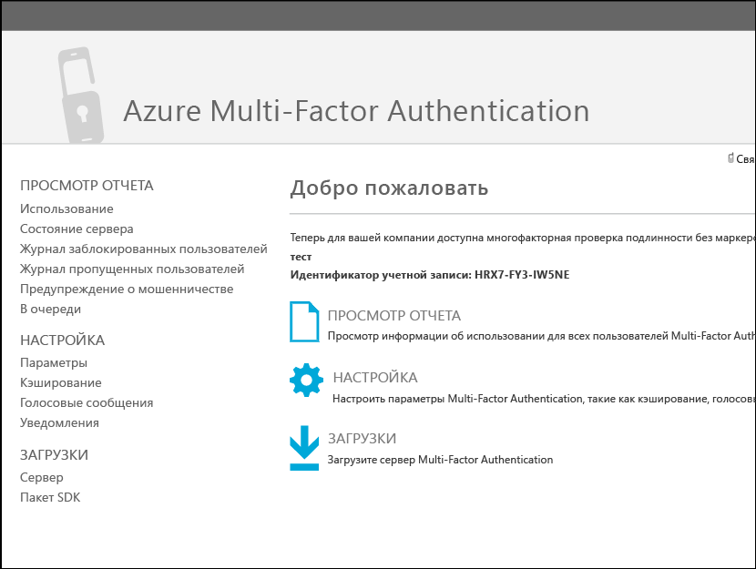
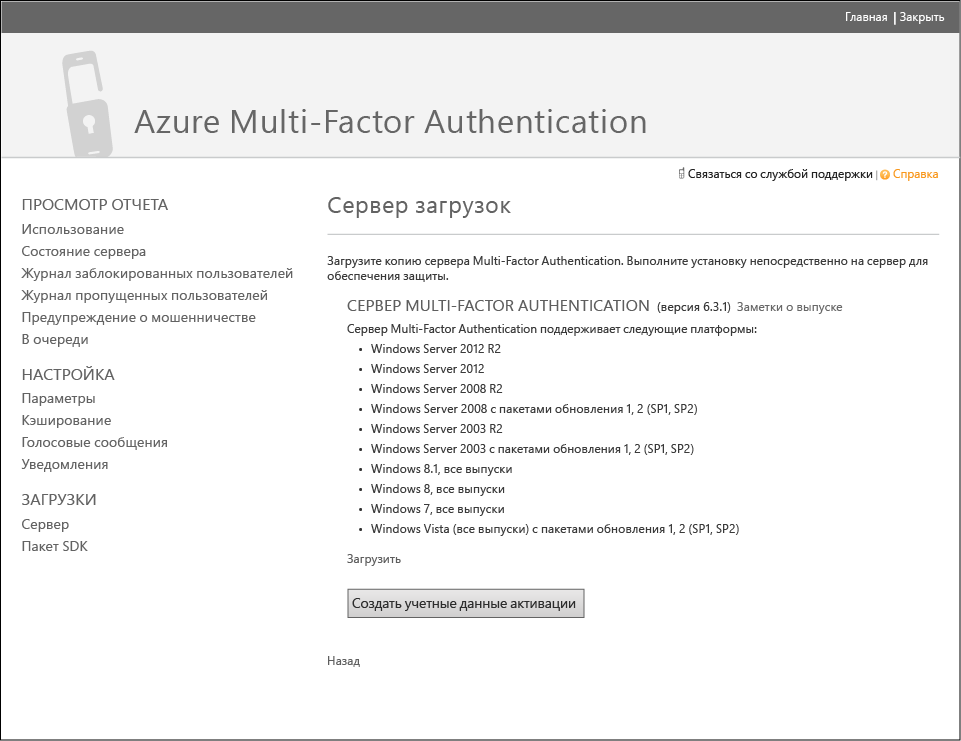
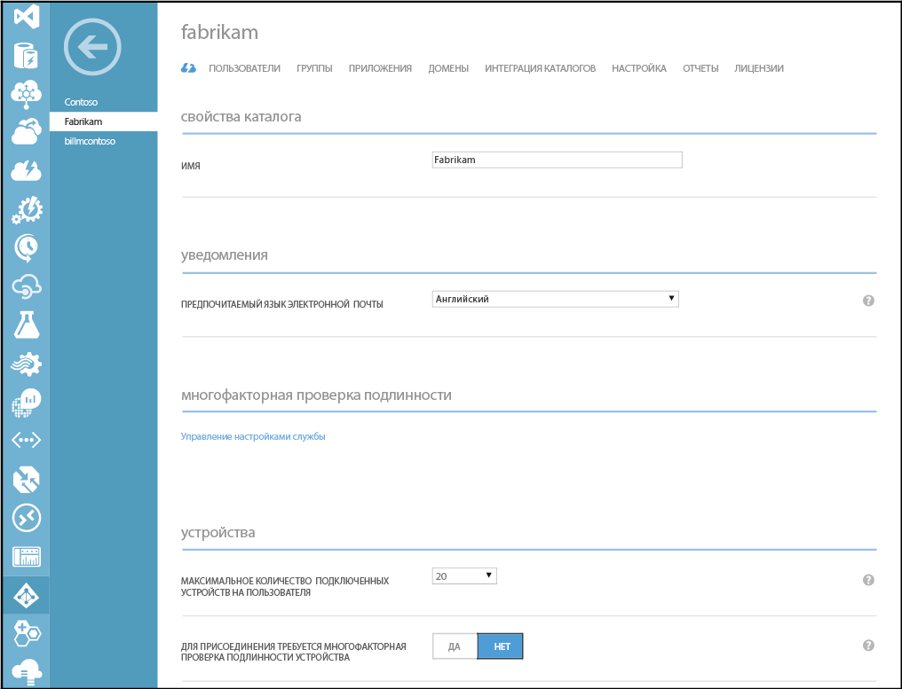
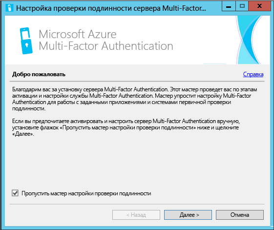
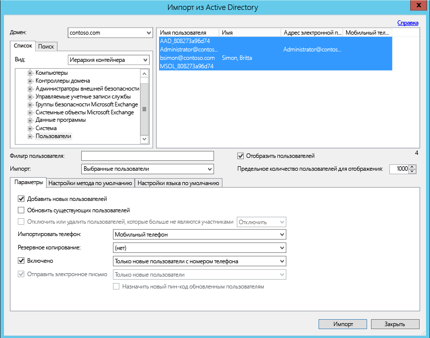
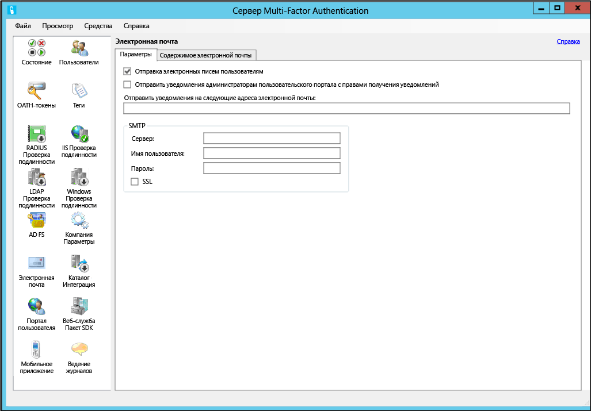
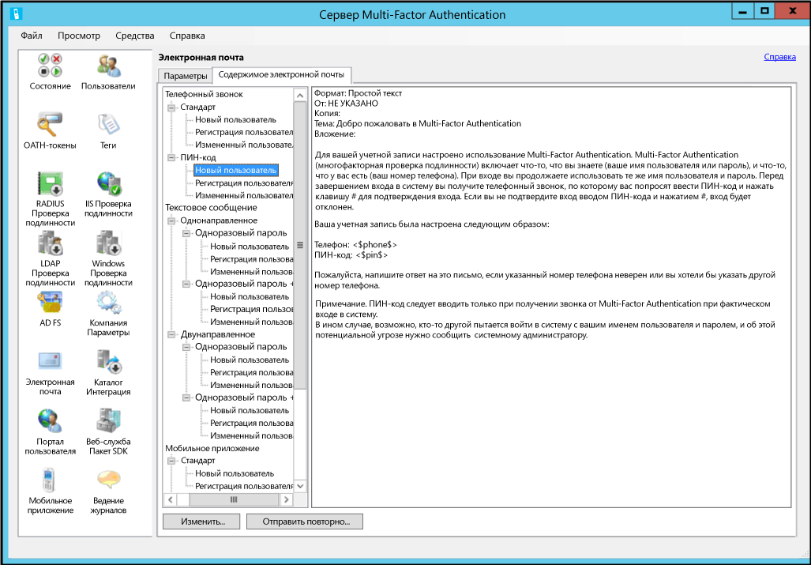

<properties 
	pageTitle="Приступая к работе с сервером Azure Multi-Factor Authentication"
	description="Эта страница посвящена работе со службой Azure Multi-Factor Authentication. Она содержит информацию о том, как начать работу с сервером Azure MFA."
	services="multi-factor-authentication"
	keywords="сервер проверки подлинности, страница активации приложения многофакторной проверки подлинности azure, загрузка сервера проверки подлинности"
	documentationCenter=""
	authors="kgremban"
	manager="femila"
	editor="curtand"/>

<tags
	ms.service="multi-factor-authentication"
	ms.workload="identity"
	ms.tgt_pltfrm="na"
	ms.devlang="na"
	ms.topic="get-started-article"
	ms.date="08/15/2016"
	ms.author="kgremban"/>

# Приступая к работе с сервером Azure Multi-Factor Authentication

Теперь, когда мы определили, нужно ли использовать локальную многофакторную проверку подлинности, давайте приступим к работе. На этой странице рассматривается процедура установки сервера и его настройка в локальной службе Active Directory. Если сервер PhoneFactor уже установлен и вы ищете информацию о его обновлении, см. статью [Переход с агента PhoneFactor на сервер Azure Multi-Factor Authentication](multi-factor-authentication-get-started-server-upgrade.md). Если же вам нужна информация только об установке веб-службы, см. статью [Приступая к работе с веб-службой мобильного приложения сервера Azure Multi-Factor Authentication](multi-factor-authentication-get-started-server-webservice.md).

## Загрузка сервера Azure Multi-Factor Authentication

Существует два разных способа загрузки сервера Azure Multi-Factor Authentication: Оба выполняются через портал Azure. Первый способ — это управление поставщиком многофакторной проверки подлинности напрямую. Второй — через параметры службы. Для второго варианта требуется либо поставщик Multi-Factor Authentication, либо лицензия Azure MFA, Azure AD Premium или Enterprise Mobility Suite.

### Загрузка сервера Azure Multi-Factor Authentication с портала Azure
--------------------------------------------------------------------------------

1. Войдите на портал Azure с учетной записью администратора.
2. Выберите слева элемент Active Directory.
3. На странице Active Directory вверху выберите вкладку **Поставщики многофакторной проверки подлинности**.
4. В нижней части страницы щелкните **Управление**.
5. Откроется новая страница. Выберите элемент **Загрузки** 
6. Над элементом **Создать учетные данные для активации** щелкните **Загрузить** 
7. Сохраните загружаемый файл.

### Загрузка сервера многофакторной проверки подлинности Azure с помощью параметров службы

1. Войдите на портал Azure с учетной записью администратора.
2. Выберите слева элемент Active Directory.
3. Дважды щелкните свой экземпляр Azure AD.
4. В верхней части экрана щелкните ссылку **Настроить** 
5. В разделе многофакторной проверки подлинности выберите **Управление параметрами службы**.
6. На странице параметров службы в нижней части экрана щелкните ссылку **Перейти на портал**. 
7. Откроется новая страница. Щелкните **Загрузить**.
8. Над элементом **Создать учетные данные для активации** щелкните **Загрузить**.
9. Сохраните загружаемый файл.

## Установка и настройка сервера Azure Multi-Factor Authentication
Загрузив сервер, установите и настройте его. Убедитесь, что серверный ПК, на который вы устанавливаете сервер, соответствует следующим требованиям.

Требования к серверу Azure Multi-Factor Authentication|Описание|
:------------- | :------------- |
Оборудование|<li>200 МБ места на жестком диске</li><li>32- или 64-разрядный процессор</li><li>не менее 1 ГБ ОЗУ</li>
Программное обеспечение|<li>Windows Server 2008 или более новая версия, если узел работает под управлением серверной ОС</li><li>Windows 7 или более поздняя версия, если узел работает под управлением клиентской ОС</li><li>Microsoft .NET Framework 4.0</li><li>IIS 7.0 или более поздняя версия, если вы устанавливаете SDK для пользовательского портала или веб-службы</li>

### Требования к брандмауэру сервера Azure Multi-Factor Authentication
--------------------------------------------------------------------------------
На каждом сервере MFA порт 443 должен быть открыт для передачи данных на следующие адреса:

- https://pfd.phonefactor.net
- .https://pfd2.phonefactor.net
- https://css.phonefactor.net

Если в брандмауэре на порту 443 есть ограничения для исходящего трафика, необходимо открыть следующие диапазоны IP-адресов:

IP-подсеть|Маска сети|Диапазон IP-адресов
:------------- | :------------- | :------------- |
134\.170.116.0/25|255\.255.255.128|134\.170.116.1–134.170.116.126
134\.170.165.0/25|255\.255.255.128|134\.170.165.1–134.170.165.126
70\.37.154.128/25|255\.255.255.128|70\.37.154.129–70.37.154.254

Если вы не используете функции подтверждения событий Azure Multi-Factor Authentication и пользователи не проходят проверку подлинности при помощи мобильных приложений Multi-Factor Authentication с устройств в корпоративной сети, диапазоны IP-адресов можно сократить:

IP-подсеть|Маска сети|Диапазон IP-адресов
:------------- | :------------- | :------------- |
134\.170.116.72/29|255\.255.255.248|134\.170.116.72–134.170.116.79
134\.170.165.72/29|255\.255.255.248|134\.170.165.72–134.170.165.79
70\.37.154.200/29|255\.255.255.248|70\.37.154.201–70.37.154.206

### Установка и настройка сервера Azure Multi-Factor Authentication
--------------------------------------------------------------------------------

1. Дважды щелкните исполняемый файл, чтобы начать установку.
2. На экране "Выбор папки для установки" убедитесь, что выбрана правильная папка, и нажмите кнопку "Далее".
3. После завершения установки нажмите кнопку "Готово". Запустится мастер настройки.
4. На экране приветствия мастера настройки установите флажок **Пропустить использование мастера настройки проверки подлинности** и нажмите кнопку **Далее**.  После этого окно мастера закроется и запустится сервер.

5. На странице, с которой вы загрузили сервер, нажмите кнопку **Создать учетные данные для активации**. Скопируйте эти данные в соответствующие поля на сервере Azure MFA и нажмите кнопку **Активировать**.

Выше мы описали быструю установку с помощью мастера настройки. Вы можете повторно запустить мастер проверки подлинности, выбрав его в меню Tools (Сервис) на сервере.

##Импорт пользователей из Active Directory

Теперь, когда сервер Azure MFA установлен и настроен, вы можете быстро импортировать на него пользователей.

### Импорт пользователей из Active Directory
--------------------------------------------------------------------------------

1. На сервере Azure MFA в левой части окна выберите элемент **Пользователи**.
2. Внизу выберите команду **Импортировать из Active Directory**.
3. Теперь вы можете искать в каталоге AD отдельных пользователей. Вы также можете искать подразделения и входящих в них пользователей. В этом случае будет указано подразделение, к которому принадлежит пользователь.
4. Выделите всех пользователей справа и нажмите кнопку **Импортировать**. Должно появиться всплывающее окно с сообщением о том, что импорт выполнен успешно. Закройте окно импорта.

## Отправка электронного письма пользователям
Теперь, когда пользователи импортированы на сервер Azure Multi-Factor Authentication, рекомендуется отправить этим пользователям электронное письмо, информирующее о том, что они были зарегистрированы для многофакторной проверки подлинности.

На сервере Azure Multi-Factor Authentication существуют различные способы настройки многофакторной проверки подлинности для пользователей. Например, если вы знаете номера телефонов пользователей или импортировали их на сервер Azure Multi-Factor Authentication из телефонной книги компании, то из электронного письма пользователи узнают о том, что для них была настроена многофакторная проверка подлинности Azure, получат некоторые инструкции по ее использованию и узнают номер телефона, с помощью которого будет осуществляться проверка подлинности.

Содержимое электронного письма будет различным в зависимости от метода проверки подлинности, установленного для пользователя (например, телефонный звонок, текстовое сообщение, мобильное приложение). Например, если пользователь должен использовать ПИН-код при проверке подлинности, в электронном письме будет указано начальное значение ПИН-кода. ПИН-код обычно требуется изменить при первой проверке подлинности.

Если номера телефонов пользователей не были настроены или импортированы на сервер Azure Multi-Factor Authentication или для пользователей была настроена проверка подлинности с помощью мобильного приложения, им можно отправлять электронное письмо, которое сообщит о том, что для этих пользователей была настроена многофакторная проверка подлинности Azure, и перенаправит пользователей на пользовательский портал Azure Multi-Factor Authentication для завершения регистрации. В письмо будет включена ссылка для доступа к пользовательскому порталу. При щелчке по этой ссылке откроется окно веб-браузера с пользовательским порталом Azure Multi-Factor Authentication.

### Настройка электронной почты и шаблонов электронной почты

Щелкнув по значку электронной почты в левой части окна, можно настроить параметры отправки этих сообщений электронной почты. Здесь можно указать параметры SMTP почтового сервера и отправить проверочное пустое письмо, установив флажок "Отправить письма пользователям".

На вкладке "Содержимое электронного письма" будут отображены различные шаблоны электронной почты. В зависимости от настроек многофакторной проверки подлинности можно выбрать тот шаблон, который максимально вам подходит.

## Как сервер Azure Multi-Factor Authentication обрабатывает данные пользователя?

При использовании локального сервера Multi-Factor Authentication (MFA) данные пользователя хранятся на локальных серверах. В облаке данные пользователя постоянно не хранятся. Когда пользователь выполняет двухфакторную проверку подлинности, сервер MFA отправляет данные в облачную службу Azure Multi-Factor Authentication для проверки подлинности. При отправке запросов проверки подлинности в облачную службу в запросы и журналы включаются указанные ниже поля, что позволяет использовать их в отчетах о проверке подлинности клиентов или об использовании. Некоторые поля являются необязательными и могут включаться и выключаться на сервере Multi-Factor Authentication. Взаимодействие сервера MFA сервера с облачной службой многофакторной проверки подлинности осуществляется по протоколу SSL/TLS через порт 443 для исходящих подключений. В число этих полей входят следующие.

- Уникальный идентификатор: имя пользователя или внутренний идентификатор сервера MFA
- Имя и фамилия: необязательно
- Адрес электронной почты: необязательно
- Номер телефона: при выполнении голосовых вызовов или проверки подлинности с помощью SMS
- Маркер устройства: при выполнении проверки подлинности мобильного приложения
- Режим проверки подлинности
- Результат проверки подлинности
- Имя сервера MFA
- IP-адрес сервера MFA
- IP-адрес клиента: если он доступен

Кроме указанных выше полей, результат проверки подлинности (пройдена или получен отказ) и причины отказов также хранятся с данными проверки подлинности и могут быть получены из отчетов о проверке подлинности или использовании.

## Дополнительные конфигурации сервера Azure Multi-Factor Authentication
Дополнительные сведения о настройке приведены в таблице ниже.

Метод|Описание
:------------- | :------------- |
[Пользовательский портал](multi-factor-authentication-get-started-portal.md)| Сведения об установке и настройке пользовательского портала, включая развертывание и самостоятельную регистрацию пользователей.
[Служба федерации Active Directory](multi-factor-authentication-get-started-adfs.md)|Сведения о настройке Azure Multi-Factor Authentication с AD FS.
[Проверка подлинности RADIUS](multi-factor-authentication-get-started-server-radius.md)| Сведения об установке и настройке сервера Azure Multi-Factor Authentication с использованием RADIUS.
[Проверка подлинности IIS](multi-factor-authentication-get-started-server-iis.md)|Сведения об установке и настройке сервера Azure Multi-Factor Authentication с IIS.
[Проверка подлинности Windows](multi-factor-authentication-get-started-server-windows.md)| Сведения об установке и настройке сервера Azure Multi-Factor Authentication с проверкой подлинности Windows.
[Проверка подлинности LDAP](multi-factor-authentication-get-started-server-ldap.md)|Сведения об установке и настройке сервера Azure Multi-Factor Authentication с проверкой подлинности LDAP.
[Шлюз удаленных рабочих столов и сервер Azure Multi-Factor Authentication, использующие проверку подлинности RADIUS](multi-factor-authentication-get-started-server-rdg.md)| Сведения об установке и настройке сервера Azure Multi-Factor Authentication со шлюзом удаленных рабочих столов и проверкой подлинности RADIUS.
[Синхронизация с Active Directory Windows Server](multi-factor-authentication-get-started-server-dirint.md)|Сведения об установке и настройке синхронизации между Active Directory и сервером Azure Multi-Factor Authentication.
[Развертывание веб-службы мобильных приложений сервера Azure Multi-Factor Authentication](multi-factor-authentication-get-started-server-webservice.md)|Сведения об установке и настройке веб-службы сервера Azure Multi-Factor Authentication.

<!---HONumber=AcomDC_0928_2016-->