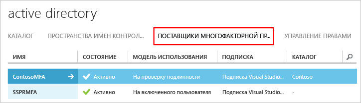

# Приступая к работе с сервером Azure Multi-Factor Authentication

Теперь, когда мы определили, что нужно использовать локальный сервер Многофакторной идентификации, давайте приступим к работе. На этой странице рассматривается процедура установки сервера и его настройка в локальной службе Active Directory. Если сервер PhoneFactor уже установлен и вы ищете сведения о его обновлении, см. статью [Переход с агента PhoneFactor на сервер Azure Multi-Factor Authentication](multi-factor-authentication-get-started-server-upgrade.md). Если же вам нужны сведения только об установке веб-службы, см. статью [Приступая к работе с веб-службой мобильного приложения сервера Azure Multi-Factor Authentication](multi-factor-authentication-get-started-server-webservice.md).

## Загрузка сервера Azure Multi-Factor Authentication
Существует два разных способа загрузки сервера Azure Multi-Factor Authentication: Оба выполняются через портал Azure. Первый способ — это управление поставщиком многофакторной проверки подлинности напрямую. Второй — через параметры службы. Для второго варианта требуется поставщик Многофакторной идентификации или лицензия Azure MFA, Azure AD Premium или Enterprise Mobility Suite.

> [!Important]
> Эти варианты похожи, но очень важно знать, который из них следует использовать. Если у пользователей есть лицензии, которые поставляются с MFA, для загрузки сервера не нужно создавать поставщик Многофакторной идентификации. Вместо этого, чтобы скачать сервер, воспользуйтесь вторым вариантом на странице параметров службы. 

### Вариант 1. Скачивание сервера Многофакторной идентификации Azure с классического портала Azure

Используйте этот вариант скачивания, если поставщик Многофакторной идентификации уже установлен, так как вы платите за MFA для каждого включенного пользователя или для каждого пользователя, прошедшего проверку подлинности. 

1. Войдите на [классический портал Azure](https://manage.windowsazure.com) с учетной записью администратора.
2. Выберите **Active Directory**слева.
3. На странице Active Directory щелкните **Поставщики многофакторной проверки подлинности**
    .
4. В нижней части страницы щелкните **Управление**. Откроется новая страница.
5. Щелкните **Загрузки**.
6. Над кнопкой **Создать учетные данные для активации** щелкните ссылку **Загрузить**.
   
7. Сохраните загружаемый файл.

### Вариант 2. Скачивание сервера Многофакторной идентификации Azure с использованием параметров службы

Используйте этот вариант скачивания, если у вас есть лицензия Enterprise Mobility Suite, Azure AD Premium или Enterprise Cloud Suite. 

1. Войдите на [классический портал Azure](https://manage.windowsazure.com) с учетной записью администратора.
2. Выберите **Active Directory**слева.
3. Дважды щелкните свой экземпляр Azure AD.
4. В верхней части экрана щелкните ссылку **Настроить**
5. В разделе **Многофакторной идентификации** щелкните **Управление параметрами службы**.
6. На странице параметров службы в нижней части экрана щелкните ссылку **Перейти на портал**. Откроется новая страница.
   
7. Выберите элемент **Загрузить**
8. Над кнопкой **Создать учетные данные для активации** щелкните ссылку **Загрузить**.
    
9. Сохраните загружаемый файл.

## Установка и настройка сервера Azure Multi-Factor Authentication
Загрузив сервер, установите и настройте его.  Убедитесь, что серверный ПК, на который вы устанавливаете сервер, соответствует следующим требованиям.

| Требования к серверу Azure Multi-Factor Authentication | Описание |
|:--- |:--- |
| Оборудование |<li>200 МБ места на жестком диске</li><li>32- или 64-разрядный процессор</li><li>Не менее 1 ГБ ОЗУ</li> |
| Программное обеспечение |<li>Windows Server 2008 или более поздняя версия, если узел работает под управлением серверной ОС</li><li>Windows 7 или более поздняя версия, если узел работает под управлением клиентской ОС</li><li>Microsoft .NET Framework 4.0</li><li>IIS 7.0 или более поздняя версия, если вы устанавливаете SDK для пользовательского портала или веб-службы</li> |

### Требования к брандмауэру сервера Azure Multi-Factor Authentication
- - -
На каждом сервере MFA порт 443 должен быть открыт для передачи данных на следующие адреса:

* https://pfd.phonefactor.net;
* https://pfd2.phonefactor.net;
* https://css.phonefactor.net.

Если в брандмауэре на порту 443 есть ограничения для исходящего трафика, откройте следующие диапазоны IP-адресов:

| IP-подсеть | Маска сети | Диапазон IP-адресов |
|:--- |:--- |:--- |
| 134.170.116.0/25 |255.255.255.128 |134.170.116.1–134.170.116.126 |
| 134.170.165.0/25 |255.255.255.128 |134.170.165.1–134.170.165.126 |
| 70.37.154.128/25 |255.255.255.128 |70.37.154.129–70.37.154.254 |

Если вы не используете функции подтверждения событий и пользователи не проходят проверку подлинности при помощи мобильных приложений с устройств в корпоративной сети, диапазоны IP-адресов можно сократить:

| IP-подсеть | Маска сети | Диапазон IP-адресов |
|:--- |:--- |:--- |
| 134.170.116.72/29 |255.255.255.248 |134.170.116.72–134.170.116.79 |
| 134.170.165.72/29 |255.255.255.248 |134.170.165.72–134.170.165.79 |
| 70.37.154.200/29 |255.255.255.248 |70.37.154.201–70.37.154.206 |

### Установка и настройка сервера Azure Multi-Factor Authentication

1. Дважды щелкните исполняемый файл. После этого начнется установка.
2. На экране "Выбор папки для установки" убедитесь, что выбрана правильная папка, и нажмите кнопку **Далее**.
3. После завершения установки нажмите кнопку **Готово**.  Запустится мастер настройки.
4. На экране приветствия мастера настройки установите флажок **Пропустить использование мастера настройки проверки подлинности** и нажмите кнопку **Далее**.  В результате мастер закроется, а сервер перезапустится.
    
5. На странице, с которой вы загрузили сервер, нажмите кнопку **Создать учетные данные для активации** . Скопируйте эти данные в соответствующие поля на сервере Azure MFA и нажмите кнопку **Activate**(Активировать).

Выше мы описали быструю установку с помощью мастера настройки.  Вы можете повторно запустить мастер проверки подлинности, выбрав его в меню "Сервис" на сервере.

## Импорт пользователей из Active Directory
Теперь, когда сервер Azure MFA установлен и настроен, вы можете быстро импортировать на него пользователей.

1. На сервере Azure MFA в левой части окна выберите элемент **Пользователи**.
2. Внизу выберите команду **Импортировать из Active Directory**.
3. Теперь вы можете искать в каталоге AD отдельных пользователей. Вы также можете искать подразделения и входящих в них пользователей.  В этом случае будет указано подразделение, к которому принадлежит пользователь.
4. Выделите всех пользователей справа и нажмите кнопку **Импортировать**.  Должно появиться всплывающее окно с сообщением о том, что импорт выполнен успешно.  Закройте окно импорта.

## Отправка электронного письма пользователям
Теперь, после импорта пользователей на сервер MFA, мы рекомендуем отправить им электронное сообщение о том, что они зарегистрированы для прохождения двухфакторной проверки подлинности.

Содержимое отправленного сообщения зависит от настройки двухфакторной проверки подлинности для пользователей. Например, если вы импортировали номера телефонов пользователей из каталога организации, сообщение должно содержать номера телефонов по умолчанию, чтобы пользователи знали, чего ожидать. Аналогично, если номера телефонов пользователей не были импортированы или для пользователей настроено использование мобильного приложения, отправляйте им электронное письмо, в котором им предлагается завершить регистрацию учетной записи, используя гиперссылку на портал пользовательский Многофакторной идентификации Azure.

Содержимое электронного письма также будет различным в зависимости от метода проверки подлинности, установленного для пользователя (телефонный звонок, SMS или мобильное приложение).  Например, если пользователь должен использовать ПИН-код при проверке подлинности, в электронном письме будет указано начальное значение ПИН-кода.  ПИН-код требуется изменить при первой проверке подлинности.

### Настройка электронной почты и шаблонов электронной почты
Щелкните значок электронной почты в левой части окна, чтобы настроить параметры отправки этих сообщений. Здесь можно указать параметры SMTP почтового сервера и отправить письмо, установив флажок **Send emails to users** (Отправить письма пользователям).

На вкладке Email Content (Содержимое электронного письма) отображаются различные шаблоны электронной почты. В зависимости от настроек многофакторной проверки подлинности можно выбрать тот шаблон, который максимально вам подходит.

## Как сервер Azure Multi-Factor Authentication обрабатывает данные пользователя?
При использовании локального сервера Multi-Factor Authentication (MFA) данные пользователя хранятся на локальных серверах. В облаке данные пользователя постоянно не хранятся. Когда пользователь выполняет двухфакторную проверку подлинности, сервер MFA отправляет данные в облачную службу Многофакторной идентификации Azure для проверки подлинности. При отправке запросов проверки подлинности в облачную службу в запросы и журналы включаются указанные ниже поля, что позволяет использовать их в отчетах о проверке подлинности клиентов или об использовании. Некоторые поля являются необязательными и могут включаться и выключаться на сервере Multi-Factor Authentication. Взаимодействие сервера MFA сервера с облачной службой многофакторной проверки подлинности осуществляется по протоколу SSL/TLS через порт 443 для исходящих подключений. В число этих полей входят следующие.

* Уникальный идентификатор: имя пользователя или внутренний идентификатор сервера MFA
* Имя и фамилия (необязательно).
* Адрес электронной почты (необязательно).
* Номер телефона (при выполнении голосовых вызовов или проверке подлинности по SMS).
* Маркер устройства: при выполнении проверки подлинности мобильного приложения
* Режим проверки подлинности
* Результат проверки подлинности.
* Имя сервера MFA.
* IP-адрес сервера MFA
* IP-адрес клиента: если он доступен

Кроме указанных выше полей, результат проверки подлинности (пройдена или получен отказ) и причины отказов также хранятся с данными проверки подлинности и могут быть получены из отчетов о проверке подлинности или использовании.

## Дальнейшие действия
Дополнительные сведения о расширенной настройке доступны по ссылкам в следующей таблице.

| Метод | Описание |
|:--- |:--- |
| [Пользовательский портал](multi-factor-authentication-get-started-portal.md) |Сведения об установке и настройке пользовательского портала, включая развертывание и самостоятельную регистрацию пользователей. |
| [Служба федерации Active Directory](multi-factor-authentication-get-started-adfs.md) |Сведения о настройке Azure Multi-Factor Authentication с AD FS. |
| [Проверка подлинности RADIUS](multi-factor-authentication-get-started-server-radius.md) |Сведения об установке и настройке сервера Azure Multi-Factor Authentication с использованием RADIUS. RADIUS позволяет интегрировать различные сторонние системы с сервером Azure MFA. |
| [Проверка подлинности IIS](multi-factor-authentication-get-started-server-iis.md) |Сведения об установке и настройке сервера Azure Multi-Factor Authentication с IIS. Службы IIS позволяют интегрировать различные сторонние системы с сервером Azure MFA. |
| [Проверка подлинности Windows](multi-factor-authentication-get-started-server-windows.md) |Сведения об установке и настройке сервера Azure Multi-Factor Authentication с проверкой подлинности Windows. |
| [Проверка подлинности LDAP](multi-factor-authentication-get-started-server-ldap.md) |Сведения об установке и настройке сервера Azure Multi-Factor Authentication с проверкой подлинности LDAP. LDAP позволяет интегрировать различные сторонние системы с сервером Azure MFA. |
| [Шлюз удаленных рабочих столов и сервер Azure Multi-Factor Authentication, использующие проверку подлинности RADIUS](multi-factor-authentication-get-started-server-rdg.md) |Сведения об установке и настройке сервера Azure Multi-Factor Authentication со шлюзом удаленных рабочих столов и проверкой подлинности RADIUS. |
| [Синхронизация с Active Directory Windows Server](multi-factor-authentication-get-started-server-dirint.md) |Сведения об установке и настройке синхронизации между Active Directory и сервером Azure Multi-Factor Authentication. |
| [Развертывание веб-службы мобильных приложений сервера Azure Multi-Factor Authentication](multi-factor-authentication-get-started-server-webservice.md) |Сведения об установке и настройке веб-службы сервера Azure Multi-Factor Authentication. |
| [Расширенные сценарии с использованием Многофакторной идентификации Azure и VPN сторонних поставщиков](multi-factor-authentication-advanced-vpn-configurations.md) | Пошаговые руководства для конфигурации устройств Cisco, Citrix и Juniper VPN. |

<!--HONumber=Feb17_HO3-->

