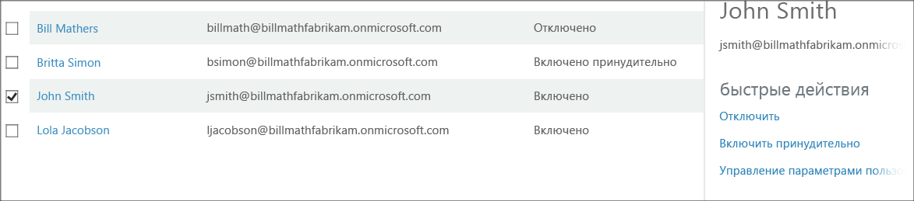

<properties 
	pageTitle="Состояние пользователей в службе Microsoft Azure Multi-Factor Authentication"
	description="Сведения о состоянии пользователей в Azure MFA."
	services="multi-factor-authentication"
	documentationCenter=""
	authors="kgremban"
	manager="femila"
	editor="curtand"/>

<tags
	ms.service="multi-factor-authentication"
	ms.workload="identity"
	ms.tgt_pltfrm="na"
	ms.devlang="na"
	ms.topic="article"
	ms.date="08/04/2016"
	ms.author="kgremban"/>

# Состояние пользователей в службе Azure Multi-Factor Authentication

Учетные записи пользователей в службе Azure Multi-Factor Authentication имеют три различных состояния:

Состояние | Описание |Затронутые приложения, не использующие браузер| Примечания
:-------------: | :-------------: |:-------------: |:-------------: |
Отключено | Состояние по умолчанию для нового пользователя, не зарегистрированного в многофакторной проверке подлинности.|Нет|Пользователь не использует многофакторную проверку подлинности.
Включено |Пользователь зарегистрирован в многофакторной проверке подлинности.|Нет. Они будут продолжать работать, пока не завершится регистрация.|Пользователь включен, но не завершил процесс регистрации. Ему будет предложено завершить процесс при следующем входе в систему.
Принудительно|Пользователь зарегистрирован и завершил процесс регистрации для использования многофакторной проверки подлинности.|Да. Для приложений нужны пароли приложений. | Пользователь завершил или не завершил процесс регистрации. Если пользователь завершил регистрацию, он будет использовать многофакторную проверку подлинности. Если нет, пользователю будет предложено завершить процесс при следующем входе в систему.

## Изменение состояния пользователя
Изменения состояния пользователя зависят от того, настроены ли они для MFA и прошел ли пользователь эту процедуру. Если MFA включена для пользователя, состояние изменится с "отключено" на "включено". После того как пользователь, состояние которого было изменено на "включено", войдет в систему и завершит процедуру, состояние изменится на "применено".

### Просмотр состояния пользователя
--------------------------------------------------------------------------------
1.  Войдите на **классический портал Azure** с учетной записью администратора.
2.  В левой части щелкните **Active Directory**.
3.  В разделе **Каталог** щелкните каталог пользователя, которого нужно включить. 
4.  В верхней части щелкните **Пользователи**.
5.  В нижней части страницы щелкните **Управление Multi-Factor Auth**. 
6.  Откроется новая вкладка браузера. Вы сможете просмотреть состояние пользователя. 

###Изменения состояния "отключено" на "включено"
1.  Войдите на **классический портал Azure** с учетной записью администратора.
2.  В левой части щелкните **Active Directory**.
3.  В разделе **Каталог** щелкните каталог пользователя, которого нужно включить. 
4.  В верхней части щелкните **Пользователи**.
5.  В нижней части страницы щелкните **Управление Multi-Factor Auth**. 
6.  Откроется новая вкладка браузера. Найдите пользователя, для которого нужно включить многофакторную проверку подлинности. Возможно, потребуется изменить представление в верхней части страницы. Для состояния должно быть установлено значение **Отключено.** 
7.  Установите **флажок** рядом с именем пользователя.
7.  В правой части окна щелкните **Включить**. 
8.  Щелкните **Включить проверку Multi-Factor Auth**. 
9.  Следует отметить, что состояние пользователя изменилось с **Отключено** на **Включено**. 
10.  После включения рекомендуется уведомить пользователей по электронной почте. В сообщении также следует рассказать, как использовать приложения, не использующие браузер, чтобы пользователя не заблокировали.

### Изменения состояния "включено" или "применено" на "отключено"
1.  Войдите на **классический портал Azure** с учетной записью администратора.
2.  В левой части щелкните **Active Directory**.
3.  В разделе **Каталог** щелкните каталог пользователя, которого нужно включить. 
4.  В верхней части щелкните **Пользователи**.
5.  В нижней части страницы щелкните **Управление Multi-Factor Auth**. 
6.  Откроется новая вкладка браузера. Найдите пользователя, которого нужно отключить. Возможно, потребуется изменить представление в верхней части страницы. Убедитесь, что состояние пользователя — **включено** или **применено**.
7.  Установите **флажок** рядом с именем пользователя.
7.  В правой части окна щелкните **Отключить**. 
8.  Вам будет предложено подтвердить действие. Щелкните **Да**. 
9.  Вы должны увидеть, что изменение успешно применено. Нажмите кнопку **Закрыть**. 

<!---HONumber=AcomDC_0921_2016-->