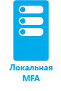

<properties
	pageTitle="Что такое Azure Multi-Factor Authentication? | Microsoft Azure"
	description="В этом разделе объясняется, что такое многофакторная проверка подлинности, зачем нужно ее использовать, приводятся дополнительные сведения о многофакторной проверке подлинности клиента и различных методах и доступных версиях. Azure Multi-factor Authentication — это метод проверки идентичности пользователя, при котором используются дополнительные средства, а не только имя пользователя и пароль. Это дополнительный уровень безопасности, который применяется для входа пользователя в систему и выполнения транзакций."
	keywords="общие сведения об MFA, обзор MFA, что такое многофакторная проверка подлинности"
	services="multi-factor-authentication"
	documentationCenter=""
	authors="kgremban"
	manager="femila"
	editor="curtland"/>

<tags
	ms.service="multi-factor-authentication"
	ms.workload="identity"
	ms.tgt_pltfrm="na"
	ms.devlang="na"
	ms.topic="article"
	ms.date="08/22/2016"
	ms.author="kgremban"/>

# Что такое Azure Multi-factor Authentication?
Azure Multi-factor Authentication — это метод проверки подлинности, который требует применения более одного метода проверки и добавляет критически важный второй уровень безопасности для операций входа и транзакций пользователя. Во время работы он требует использования двух и более методов проверки следующего характера:

- Что-то, что известно вам (обычно это пароль).
- Что-то, что у вас есть (доверенное устройство, которое непросто дублируется, такое как телефон).
- Что-то, относящееся непосредственно к вам (биометрические данные).

 &#160;&#160;&#160;&#160;&#160; &#160;&#160;&#160;&#160;&#160; &#160;&#160;&#160;&#160;&#160; &#160;&#160;&#160;&#160;&#160; &#160;&#160;&#160;&#160;&#160;

Azure Multi-Factor Authentication — это метод проверки идентичности пользователя, при котором используются дополнительные средства, а не только имя пользователя и пароль. Это второй уровень безопасности, который применяется для входа пользователя в систему и выполнения транзакций.

Azure Multi-Factor Authentication помогает защитить доступ к данным и приложениям, при этом не усложняя процесс входа пользователя в систему. Служба обеспечивает строгую проверку подлинности с помощью простых способов проверки — телефонного звонка, текстового сообщения, уведомления в мобильном приложении, кода подтверждения или OATH-токенов третьей стороны.

Общие сведения о принципах работы Multi-Factor Authentication см. в следующем видео.

>[AZURE.VIDEO multi-factor-authentication-overview]

##Что такое Azure Multi-Factor Authentication?

Сегодня Интернетом пользуется все больше и больше людей. Благодаря смартфонам, планшетам, ноутбукам и ПК люди получают различные возможности подключения и постоянного пребывания в сети. Пользователи могут получать доступ к своим учетным записям и приложениям практически из любого места. Это позволяет выполнять большие объемы работы и предоставлять более высокий уровень обслуживания клиентов.

Azure Multi-Factor Authentication — это простое в использовании, масштабируемое и надежное решение, которое предоставляет дополнительный способ проверки подлинности, обеспечивая постоянную защиту пользователей.

| | |
:-------------: | :-------------: | :-------------: | :-------------: |
**Простота в использовании**|**Масштабируемость**|**Постоянная защита**|**Надежность**

- **Простота в использовании**. Azure Multi-Factor Authenticaton легко настроить и использовать. Дополнительная защита с помощью Azure Multi-Factor Authentication позволяет везде использовать собственные устройства и управлять ими. В большинстве случаев настроить службу можно всего несколькими щелчками.
- **Масштабируемость**. Azure Multi-Factor Authenticaton использует возможности облака и интегрируется с локальной средой AD и пользовательскими приложениями. Такая защита подходит даже для больших критически важных сценариев.
- **Постоянная защита**. Azure Multi-Factor Authentication предоставляет строгую проверку подлинности с использованием наивысших отраслевых стандартов.
- **Надежность**. Мы гарантируем 99,9 % доступность Azure Multi-Factor Authentication. Служба считается недоступной, когда не удается получить или обработать запросы на проверку подлинности для многофакторной проверки подлинности.

Дополнительные сведения о преимуществах использования Azure Multi-Factor Authentication см. в следующем видео.

>[AZURE.VIDEO windows-azure-multi-factor-authentication]

## Принципы работы службы Azure Multi-Factor Authentication

Безопасность многофакторной проверки подлинности заключается в многоуровневом подходе. Нарушения нескольких факторов проверки подлинности представляет нетривиальную задачу для злоумышленников. Даже если злоумышленнику удается получить пароль пользователя, им нельзя воспользоваться без доверенного устройства. Если же пользователь теряет устройство, человек, нашедший его, не сможет воспользоваться им, не зная пароль.

Azure Multi-Factor Authentication помогает защитить доступ к данным и приложениям, при этом не усложняя процесс входа пользователя в систему. Эта служба предлагает дополнительную защиту за счет дополнительного способа проверки подлинности и, используя ряд простых способов проверки подлинности, обеспечивает строгую проверку. Вот эти способы:

- телефонный вызов;
- текстовое сообщение;
- уведомление от мобильного приложения — это позволяет пользователям выбрать наиболее удобный для них вариант;
- код проверки в мобильном приложении;
- OATH-токены сторонних производителей.

Дополнительные сведения о принципах работы службы см. в следующем видео.

>[AZURE.VIDEO multi-factor-authentication-deep-dive-securing-access-on-premises]

## Методы, доступные для многофакторной проверки подлинности
При входе в систему пользователю отправляется запрос дополнительной проверки. Ниже приведены методы, которые могут использоваться для такой второй проверки.

Метод проверки | Описание
------------- | ------------- |
Телефонный вызов | Вызов направляется на смартфон пользователя. Пользователю предлагают щелкнуть символ #, чтобы подтвердить, что входит именно он или она. На этом процесс проверки заканчивается. Этот параметр можно настраивать, указывая любой другой код для ввода.
Текстовое сообщение | На смартфон пользователя отправляется текстовое сообщение с шестизначным кодом. Чтобы завершить проверку, введите этот код.
Уведомление от мобильного приложения | На смартфон пользователя отправляется запрос о выполнении проверки. Пользователю предлагается нажать в мобильном приложении кнопку "Подтвердить", чтобы завершить проверку. Этот способ используется, если уведомление от приложения выбрано в качестве основного способа проверки. Если такое сообщение получено не в момент выполнения входа в систему, то можно отправить отчет о попытке мошенничества.</li> 
 Приложение Microsoft Authenticator доступно для [Windows Phone](http://go.microsoft.com/fwlink/?Linkid=825071), [Android](http://go.microsoft.com/fwlink/?Linkid=825072) и [iOS](http://go.microsoft.com/fwlink/?Linkid=825073).
Код проверки в мобильном приложении | В мобильное приложение, запущенное на смартфоне пользователя, отправляется код проверки. Это происходит, если отправка кода проверки выбрана в качестве основного способа проверки.</li> 
 Приложение Microsoft Authenticator доступно для [Windows Phone](http://go.microsoft.com/fwlink/?Linkid=825071), [Android](http://go.microsoft.com/fwlink/?Linkid=825072) и [iOS](http://go.microsoft.com/fwlink/?Linkid=825073).

## Доступные версии службы Azure Multi-Factor Authentication
Доступны три различные версии службы Azure Multi-Factor Authentication. В таблице ниже приводится более подробное описание каждой из них.

Version (версия) | Описание
------------- | ------------- |
Многофакторная проверка подлинности для Office 365 | Эта версия работает исключительно с приложениями Office 365, и ей можно управлять с портала Office 365. В связи с этим администраторы теперь могут защитить свои ресурсы Office 365 с помощью многофакторной проверки подлинности. Эта версия поставляется с подпиской Office 365.
Многофакторная проверка подлинности для администраторов Azure | Все возможности многофакторной проверки подлинности для Office 365 будут предоставляться администраторам Azure на бесплатной основе. Теперь каждая учетная запись администратора подписки Azure может получить дополнительную защиту, включив эту базовую функцию многофакторной проверки подлинности. Добавив функции многофакторной проверки подлинности к своей учетной записи, администратор может получить доступ к порталу Azure для создания виртуальной машины, веб-сайта, управления хранилищем и работы с мобильными или любыми другими службами Azure.
Azure Multi-Factor Authentication | Azure Multi-Factor Authentication предлагает широчайший набор возможностей. Например, доступны дополнительные варианты настройки с помощью портала управления Azure, расширенные возможности отчетности и поддержка большого количества локальных и облачных приложений. Служба Azure Multi-Factor Authentication является частью Azure Active Directory Premium и входит в набор Enterprise Mobility Suite.

## Сравнение функций в разных версиях
Приведенная ниже таблица содержит список функций, доступных в различных версиях службы Azure Multi-Factor Authentication.

Функция | Multi-Factor Authentication для Office 365 (эта версия включена в пакет номеров SKU службы Office 365 )|Multi-Factor Authentication для администраторов Azure (версия включена в подписку Azure) | Служба Azure Multi-Factor Authentication (версия включена в выпуск Azure AD Premium и в набор Enterprise Mobility Suite)
------------- | :-------------: |:-------------: |:-------------: |
Администраторы могут защитить учетные записи с помощью Multi-Factor Authentication| * | * (Доступно только для учетных записей администраторов Azure)|*
Мобильное приложение в качестве второго фактора|* | * | *
Телефонный вызов в качестве второго фактора|* | * | *
SMS в качестве второго фактора|* | * | *
Пароли приложений для клиентов, которые не поддерживают Multi-Factor Authentication|* | * | *
Администраторский контроль над методами проверки подлинности| *|* | *
Режим ПИН-кода| | | *
Предупреждение о мошенничестве| | | *
Отчеты Multi-Factor Authentication| | | *
Разовый обход| | | *
Настраиваемые приветствия для телефонных вызовов| | | *
Настройка идентификатора вызывающей стороны для телефонных вызовов| | | *
Подтверждение события| | | *
Надежные IP-адреса| | | *
Запоминание данных MFA для доверенных устройств |* | * | *
Пакет SDK службы Multi-Factor Authentication | | | * Требуется поставщик Multi-Factor Authentication и полная подписка Azure.
Multi-Factor Authentication для локальных приложений, использующих сервер Multi-Factor Authentication| | | *

## Как получить службу Azure Multi-Factor Authentication

Если вы хотите применить полную функциональность Azure Multi-Factor Authentication вместо функциональности, предоставляемой пользователям Office 365 и администраторам Azure, получить ее можно несколькими способами:

1.	Приобрести лицензии Azure Multi-Factor Authentication и назначить их пользователям.
2.	Приобрести лицензии, включающие Multi-Factor Authentication, такие как Azure Active Directory Premium, Enterprise Mobility Suite или Enterprise Cloud Suite, и назначить их пользователям.
3.	Создать поставщика Azure Multi-Factor Authentication в рамках подписки Azure. Если у вас еще нет подписки Azure, то вы можете зарегистрироваться для получения бесплатной пробной подписки Azure. Пробные подписки необходимо преобразовать в стандартные подписки до истечения срока действия пробной версии.

При использовании поставщика Azure Multi-Factor Authentication доступны две модели использования, которые тарифицируются по подписке Azure:

- **На каждого пользователя**. В основном этот вариант выбирают предприятия, чтобы использовать многофакторную проверку подлинности для определенного количества сотрудников, которым регулярно требуется аутентификация.
- **На отдельные проверки подлинности**. В основном этот вариант выбирают предприятия, чтобы использовать многофакторную проверку подлинности для больших групп внешних пользователей, которым аутентификация требуется нечасто.

Azure Multi-Factor Authentication предоставляет методы выборочной проверки для облака и сервера. Это означает, что можно выбрать, какие методы доступны пользователям для прохождения многофакторной проверки подлинности. Сейчас эта функция находится на этапе общедоступной предварительной версии для облачной многофакторной проверки подлинности. Дополнительные сведения см. в разделе о [выборе методов проверки](multi-factor-authentication-whats-next.md#selectable-verification-methods).

Дополнительные сведения о ценах см. в разделе [Цены на Azure Multi-Factor Authentication.](https://azure.microsoft.com/pricing/details/multi-factor-authentication/)

Выберите модель тарификации по пользователям или по использованию, которая лучше всего подходит для вашей организации. Затем ознакомьтесь с разделом [Приступая к работе](multi-factor-authentication-get-started.md).

## Выбор решения многофакторной безопасности

Так как существует несколько вариантов использования Azure Multi-Factor Authentication, наиболее подходящая версия определяется на основе нескольких факторов. Вот эти факторы:

-	[Что я пытаюсь защитить?](#what-am-i-trying-to-secure)
-	[Где находятся пользователи?](#where-are-the-users-located)

В разделах этой статьи представлены рекомендации по определению каждого из них.

### Что я пытаюсь защитить

Чтобы выяснить, какое решение многофакторной проверки подлинности вам нужно, сначала определите, что вы пытаетесь защитить с помощью второго метода проверки подлинности. Это приложение в службе Azure? Или это система удаленного доступа, к примеру? Определив объект, который необходимо защитить, мы четко увидим, где именно нужно активировать многофакторную проверку подлинности.

Что вы пытаетесь защитить| Multi-Factor Authentication в облаке|Сервер Multi-Factor Authentication
------------- | :-------------: | :-------------: |
Собственные приложения корпорации Майкрософт|* |* |
Приложения SaaS в коллекции приложений|* |* |
Приложения IIS, опубликованные через прокси приложения Azure AD|* |* |
Приложения IIS, опубликованные не через прокси приложения Azure AD | |* |
Удаленный доступ, например VPN или RDG| |* |

### Где находятся пользователи

На основе информации о местонахождении пользователей можно определить, какое решение нам нужно: облачная многофакторная проверка подлинности или локальная с помощью сервера Multi-Factor Authentication.

Местонахождение пользователей| Решение
------------- | :------------- |
Azure Active Directory| Multi-Factor Authentication в облаке|
Azure AD и локальная служба AD с использованием федерации в AD FS| Доступны оба варианта — Multi-Factor Authentication в облаке и сервер Multi-Factor Authentication
Azure AD и локальная служба AD с использованием DirSync, Azure AD Sync, Azure AD Connect без синхронизации паролей|Доступны оба варианта — Multi-Factor Authentication в облаке и сервер Multi-Factor Authentication
Azure AD и локальная служба AD с использованием DirSync, Azure AD Sync, Azure AD Connect с синхронизацией паролей|Multi-Factor Authentication в облаке
Локальная служба Active Directory|Сервер Multi-Factor Authentication

В приведенной ниже таблице сравниваются возможности службы Multi-Factor Authentication в облаке и сервера Multi-Factor Authentication.

 | Multi-Factor Authentication в облаке | Сервер Multi-Factor Authentication
------------- | :-------------: | :-------------: |
Уведомление от мобильного приложения в качестве второго фактора | ● | ● |
Код подтверждения мобильного приложения в качестве второго фактора | ● | ●
Телефонный вызов в качестве второго фактора | ● | ●
Одностороннее SMS в качестве второго фактора | ● | ●
Двустороннее SMS в качестве второго фактора | | ●
Маркеры оборудования в качестве второго фактора | | ●
Пароли приложений для клиентов, не поддерживающих Multi-Factor Authentication | ● |  
Администраторский контроль над методами проверки подлинности | ● | ●
Режим ПИН-кода | | ●
Предупреждение о мошенничестве | ● | ●
Отчеты Multi-Factor Authentication | ● | ●
Разовый обход | | ●
Настраиваемые приветствия для телефонных вызовов | ● | ●
Настройка идентификатора вызывающей стороны для телефонных звонков | ● | ●
Надежные IP-адреса | ● | ●
Запоминание данных MFA для доверенных устройств| ● |  
Условный доступ | ● | ●
Кэш | | ●

Определившись с вариантом (облачная многофакторная проверка подлинности или локальный сервер Multi-Factor Authentication), можно начинать настройку и использование службы Azure Multi-Factor Authentication. **Выберите значок, соответствующий вашему сценарию.**

  &#160;&#160;&#160;&#160;&#160;&#160;&#160;&#160;&#160;&#160;&#160;&#160;&#160;&#160;&#160;&#160;&#160;&#160;&#160;&#160;&#160;&#160;&#160;&#160;&#160; &#160;&#160;&#160;&#160;&#160; 

<!---HONumber=AcomDC_0921_2016-->