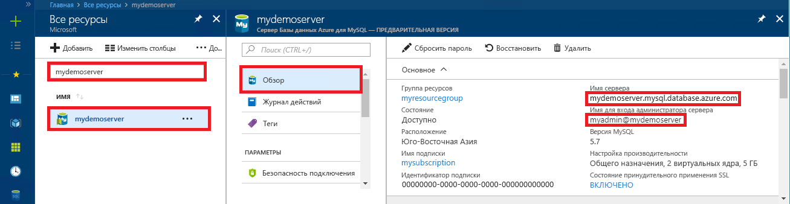

# <a name="azure-database-for-mysql-use-connectorc-to-connect-and-query-data"></a>База данных Azure для MySQL: подключение и запрос данных с помощью Connector/C++
В этом кратком руководстве объясняется, как подключиться к базе данных Azure для MySQL с помощью приложения C++. Здесь также показано, как использовать инструкции SQL для запроса, вставки, обновления и удаления данных в базе данных. В этой статье предполагается, что у вас уже есть опыт разработки на C++ и вы только начали работу с базой данных Azure для MySQL.

## <a name="prerequisites"></a>предварительным требованиям
В качестве отправной точки в этом кратком руководстве используются ресурсы, созданные в соответствии со следующими руководствами:
- [Create an Azure Database for MySQL server using Azure portal](./quickstart-create-mysql-server-database-using-azure-portal.md) (Создание базы данных Azure для сервера MySQL с помощью портала Azure)
- [Create an Azure Database for MySQL server using Azure CLI](./quickstart-create-mysql-server-database-using-azure-cli.md) (Создание сервера базы данных Azure для MySQL с помощью Azure CLI)

Также вам потребуется:
- установить [.NET Framework](https://www.microsoft.com/net/download);
- установить [Visual Studio](https://www.visualstudio.com/downloads/);
- установить [MySQL Connector/C++](https://dev.mysql.com/downloads/connector/cpp/); 
- установить [Boost](http://www.boost.org/).

## <a name="install-visual-studio-and-net"></a>Установка Visual Studio и .NET
В этом разделе предполагается, что у вас уже есть опыт разработки с использованием .NET.

### <a name="windows"></a>**Windows**
- Установите Visual Studio Community 2017, полнофункциональную расширяемую бесплатную интегрированную среду разработки для создания современных приложений для Android, iOS, Windows, а также веб-приложений, приложений базы данных и облачных служб. Можно установить полнофункциональную платформу .NET Framework или только .NET Core. Фрагменты кода в кратком руководстве будут работать в обоих случаях. Если среда Visual Studio уже установлена на вашем компьютере, то вы можете пропустить следующие два шага.
   1. Скачайте [установщик Visual Studio 2017](https://www.visualstudio.com/thank-you-downloading-visual-studio/?sku=Community&rel=15). 
   2. Запустите установщик и выполните указанные действия, чтобы завершить установку.

### <a name="configure-visual-studio"></a>**Настройка Visual Studio**
1. В Visual Studio последовательно выберите элементы "Проект" -> "Свойства" -> "Компоновщик" -> "Общие" -> "Дополнительные каталоги библиотек" и добавьте каталог lib\opt соединителя C++ (например, C:\Program Files (x86)\MySQL\MySQL Connector C++ 1.1.9\lib\opt).
2. В Visual Studio последовательно выберите "Проект" -> "Свойства" -> "C/C++" -> "Общие" -> "Дополнительные каталоги включаемых файлов":
   - Добавьте каталог \include соединителя C++ (например, C:\Program Files (x86)\MySQL\MySQL Connector C++ 1.1.9\include\).
   - Добавьте корневой каталог библиотеки Boost (например, C:\boost_1_64_0\).
3. В Visual Studio последовательно выберите "Проект" -> "Свойства" -> "Компоновщик" -> "Ввод" -> "Дополнительные зависимости" и добавьте в текстовое поле **mysqlcppconn.lib**.
4. Скопируйте файл **mysqlcppconn.dll** из папки библиотеки соединителя C++, указанной на шаге 3, в каталог, где хранится исполняемый файл приложения, или добавьте его в переменную среды, чтобы приложение смогло найти его.

## <a name="get-connection-information"></a>Получение сведений о подключении
Получите сведения о подключении, необходимые для подключения к базе данных Azure.для MySQL. Вам потребуется полное имя сервера и учетные данные для входа.

1. Войдите на [портал Azure](https://portal.azure.com/).
2. В меню слева на портале Azure щелкните **Все ресурсы** и выполните поиск по имени созданного сервера (например, **mydemoserver**).
3. Щелкните имя сервера.
4. Запишите **имя сервера** и **имя для входа администратора сервера** с панели сервера **Обзор**. Если вы забыли свой пароль, можно также сбросить пароль с помощью этой панели.
 

## <a name="connect-create-table-and-insert-data"></a>Подключение, создание таблицы и вставка данных
Используйте приведенный ниже код для подключения и загрузки данных с помощью инструкций SQL **CREATE TABLE** и **INSERT INTO**. В коде используется класс sql::Driver с методом connect(), чтобы установить подключение к MySQL. Затем код использует методы createStatement() и execute() для выполнения команд базы данных. 

Замените значения параметров Host, DBName, User и Password значениями, указанными при создании сервера и базы данных. 

```c++
#include <stdlib.h>
#include <iostream>
#include "stdafx.h"

#include "mysql_connection.h"
#include <cppconn/driver.h>
#include <cppconn/exception.h>
#include <cppconn/prepared_statement.h>
using namespace std;

//for demonstration only. never save your password in the code!
const string server = "tcp://yourservername.mysql.database.azure.com:3306";
const string username = "username@servername";
const string password = "yourpassword";

int main()
{
    sql::Driver *driver;
    sql::Connection *con;
    sql::Statement *stmt;
    sql::PreparedStatement *pstmt;

    try
    {
        driver = get_driver_instance();
        con = driver->connect(server, username, password);
    }
    catch (sql::SQLException e)
    {
        cout << "Could not connect to server. Error message: " << e.what() << endl;
        system("pause");
        exit(1);
    }

    //please create database "quickstartdb" ahead of time
    con->setSchema("quickstartdb");

    stmt = con->createStatement();
    stmt->execute("DROP TABLE IF EXISTS inventory");
    cout << "Finished dropping table (if existed)" << endl;
    stmt->execute("CREATE TABLE inventory (id serial PRIMARY KEY, name VARCHAR(50), quantity INTEGER);");
    cout << "Finished creating table" << endl;
    delete stmt;

    pstmt = con->prepareStatement("INSERT INTO inventory(name, quantity) VALUES(?,?)");
    pstmt->setString(1, "banana");
    pstmt->setInt(2, 150);
    pstmt->execute();
    cout << "One row inserted." << endl;

    pstmt->setString(1, "orange");
    pstmt->setInt(2, 154);
    pstmt->execute();
    cout << "One row inserted." << endl;

    pstmt->setString(1, "apple");
    pstmt->setInt(2, 100);
    pstmt->execute();
    cout << "One row inserted." << endl;

    delete pstmt;
    delete con;
    system("pause");
    return 0;
}
```

## <a name="read-data"></a>Считывание данных

Используйте указанный ниже код с инструкцией SQL **SELECT** для подключения и чтения данных. В коде используется класс sql::Driver с методом connect(), чтобы установить подключение к MySQL. Затем код использует методы prepareStatement() и executeQuery() для выполнения команд SELECT. Далее код использует метод next() для перехода к записям в итоговом наборе. Наконец, с помощью методов getInt() и getString() код проанализирует значения в записи.

Замените значения параметров Host, DBName, User и Password значениями, указанными при создании сервера и базы данных. 

```c++
#include <stdlib.h>
#include <iostream>
#include "stdafx.h"

#include "mysql_connection.h"
#include <cppconn/driver.h>
#include <cppconn/exception.h>
#include <cppconn/resultset.h>
#include <cppconn/prepared_statement.h>
using namespace std;

//for demonstration only. never save your password in the code!
const string server = "tcp://yourservername.mysql.database.azure.com:3306";
const string username = "username@servername";
const string password = "yourpassword";

int main()
{
    sql::Driver *driver;
    sql::Connection *con;
    sql::PreparedStatement *pstmt;
    sql::ResultSet *result;

    try
    {
        driver = get_driver_instance();
        //for demonstration only. never save password in the code!
        con = driver->connect(server, username, password);
    }
    catch (sql::SQLException e)
    {
        cout << "Could not connect to server. Error message: " << e.what() << endl;
        system("pause");
        exit(1);
    }

    con->setSchema("quickstartdb");

    //select  
    pstmt = con->prepareStatement("SELECT * FROM inventory;");
    result = pstmt->executeQuery();

    while (result->next())
        printf("Reading from table=(%d, %s, %d)\n", result->getInt(1), result->getString(2).c_str(), result->getInt(3));

    delete result;
    delete pstmt;
    delete con;
    system("pause");
    return 0;
}
```

## <a name="update-data"></a>Обновление данных
Используйте указанный ниже код с инструкцией SQL **UPDATE** для подключения и чтения данных. В коде используется класс sql::Driver с методом connect(), чтобы установить подключение к MySQL. Затем код использует методы prepareStatement() и executeQuery() для выполнения команд UPDATE. 

Замените значения параметров Host, DBName, User и Password значениями, указанными при создании сервера и базы данных. 

```c++
#include <stdlib.h>
#include <iostream>
#include "stdafx.h"

#include "mysql_connection.h"
#include <cppconn/driver.h>
#include <cppconn/exception.h>
#include <cppconn/resultset.h>
#include <cppconn/prepared_statement.h>
using namespace std;

//for demonstration only. never save your password in the code!
const string server = "tcp://yourservername.mysql.database.azure.com:3306";
const string username = "username@servername";
const string password = "yourpassword";

int main()
{
    sql::Driver *driver;
    sql::Connection *con;
    sql::PreparedStatement *pstmt;

    try
    {
        driver = get_driver_instance();
        //for demonstration only. never save password in the code!
        con = driver->connect(server, username, password);
    }
    catch (sql::SQLException e)
    {
        cout << "Could not connect to server. Error message: " << e.what() << endl;
        system("pause");
        exit(1);
    }
    
    con->setSchema("quickstartdb");

    //update
    pstmt = con->prepareStatement("UPDATE inventory SET quantity = ? WHERE name = ?");
    pstmt->setInt(1, 200);
    pstmt->setString(2, "banana");
    pstmt->executeQuery();
    printf("Row updated\n");

    delete con;
    delete pstmt;
    system("pause");
    return 0;
}
```


## <a name="delete-data"></a>Удаление данных
Используйте следующий код с инструкцией SQL **DELETE** для подключения и чтения данных. В коде используется класс sql::Driver с методом connect(), чтобы установить подключение к MySQL. Затем код использует методы prepareStatement() и executeQuery() для выполнения команд DELETE.

Замените значения параметров Host, DBName, User и Password значениями, указанными при создании сервера и базы данных. 

```c++
#include <stdlib.h>
#include <iostream>
#include "stdafx.h"

#include "mysql_connection.h"
#include <cppconn/driver.h>
#include <cppconn/exception.h>
#include <cppconn/resultset.h>
#include <cppconn/prepared_statement.h>
using namespace std;

//for demonstration only. never save your password in the code!
const string server = "tcp://yourservername.mysql.database.azure.com:3306";
const string username = "username@servername";
const string password = "yourpassword";

int main()
{
    sql::Driver *driver;
    sql::Connection *con;
    sql::PreparedStatement *pstmt;
    sql::ResultSet *result;

    try
    {
        driver = get_driver_instance();
        //for demonstration only. never save password in the code!
        con = driver->connect(server, username, password);
    }
    catch (sql::SQLException e)
    {
        cout << "Could not connect to server. Error message: " << e.what() << endl;
        system("pause");
        exit(1);
    }
    
    con->setSchema("quickstartdb");
        
    //delete
    pstmt = con->prepareStatement("DELETE FROM inventory WHERE name = ?");
    pstmt->setString(1, "orange");
    result = pstmt->executeQuery();
    printf("Row deleted\n");    
    
    delete pstmt;
    delete con;
    delete result;
    system("pause");
    return 0;
}
```

## <a name="next-steps"></a>Дополнительная информация
> [!div class="nextstepaction"]
> [Перенос базы данных MySQL в базу данных Azure для MySQL с помощью резервного копирования и восстановления](concepts-migrate-dump-restore.md)
