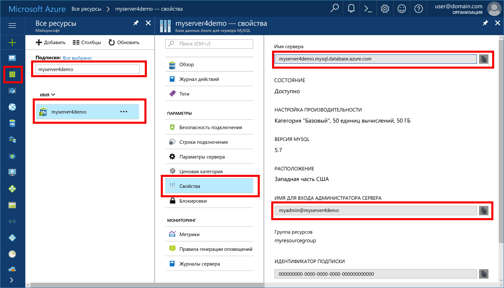

# <a name="azure-database-for-mysql-use-net-c-to-connect-and-query-data"></a>База данных Azure для MySQL: подключение и запрос данных с помощью .NET (C#)
В этом кратком руководстве объясняется, как подключиться к базе данных Azure для MySQL с помощью приложения C#. Здесь также показано, как использовать инструкции SQL для запроса, вставки, обновления и удаления данных в базе данных. В этой статье предполагается, что у вас уже есть опыт разработки на C# и вы только начали работу с базой данных Azure для MySQL.

## <a name="prerequisites"></a>Предварительные требования
В качестве отправной точки в этом кратком руководстве используются ресурсы, созданные в соответствии со следующими материалами:
- [Create an Azure Database for MySQL server using Azure portal](./quickstart-create-mysql-server-database-using-azure-portal.md) (Создание сервера базы данных Azure для MySQL с помощью портала Azure)
- [Create an Azure Database for MySQL server using Azure CLI](./quickstart-create-mysql-server-database-using-azure-cli.md) (Создание сервера базы данных Azure для MySQL с помощью Azure CLI)

Также вам потребуется:
- Установить [.NET](https://www.microsoft.com/net/download). Выполните действия в статье по ссылке, чтобы установить .NET конкретно для вашей платформы (Windows, Ubuntu Linux или macOS). 
- Установить [Visual Studio](https://www.visualstudio.com/downloads/).
- Установить [драйвер ODBC для MySQL](https://dev.mysql.com/downloads/connector/odbc/).

## <a name="get-connection-information"></a>Получение сведений о подключении
Получите сведения о подключении, необходимые для подключения к базе данных Azure.для MySQL. Вам потребуется полное имя сервера и учетные данные для входа.

1. Войдите на [портал Azure](https://portal.azure.com/).
2. В меню слева на портале Azure щелкните **Все ресурсы** и выполните поиск по имени созданного сервера, например **myserver4demo**.
3. Щелкните имя сервера.
4. Откройте страницу **свойств** сервера. Запишите значения **имени сервера** и **имени для входа администратора сервера**.
 
5. Если вы забыли данные для входа на сервер, перейдите на страницу **Обзор**, чтобы просмотреть имя администратора сервера и при необходимости сбросить пароль.

## <a name="connect-create-table-and-insert-data"></a>Подключение, создание таблицы и вставка данных
Используйте приведенный ниже код для подключения и загрузки данных с помощью инструкций SQL **CREATE TABLE** и **INSERT INTO**. В коде используется класс ODBC с методом [Open()](https://msdn.microsoft.com/en-us/library/system.data.odbc.odbcconnection.open(v=vs.110).aspx), чтобы установить подключение к MySQL. Затем код использует метод [CreateCommand()](https://msdn.microsoft.com/en-us/library/system.data.odbc.odbcconnection.createcommand(v=vs.110).aspx), устанавливает свойство CommandText и вызывает метод [ExecuteNonQuery()](https://msdn.microsoft.com/en-us/library/system.data.odbc.odbccommand.executenonquery(v=vs.110).aspx), чтобы выполнить команды базы данных. 

Замените значения параметров Host, DBName, User и Password значениями, указанными при создании сервера и базы данных. 

```csharp
using System;
using System.Collections.Generic;
using System.Linq;
using System.Text;
using System.Threading.Tasks;
using MySql.Data;
using System.Data.Odbc;

namespace driver
{
    class MySQLCreate
    {
        static void Main(string[] args)
        {
            var conn = new OdbcConnection("DRIVER={MySQL ODBC 5.3 unicode Driver}; Server=myserver4demo.mysql.database.azure.com; Port=3306;" +
            " Database=quickstartdb; Uid=myadmin@myserver4demo; Pwd=server_admin_password; sslverify=0; Option=3;MULTI_STATEMENTS=1");

            Console.Out.WriteLine("Opening connection");
            conn.Open();

            var command = conn.CreateCommand();
            command.CommandText = "DROP TABLE IF EXISTS inventory;";
            command.ExecuteNonQuery();
            Console.Out.WriteLine("Finished dropping table (if existed)");

            command.CommandText = "CREATE TABLE inventory (id serial PRIMARY KEY, name VARCHAR(50), quantity INTEGER);";
            command.ExecuteNonQuery();
            Console.Out.WriteLine("Finished creating table");

            command.CommandText =
                String.Format(
                    @"INSERT INTO inventory (name, quantity) VALUES ({0}, {1});
                    INSERT INTO inventory (name, quantity) VALUES ({2}, {3});
                    INSERT INTO inventory (name, quantity) VALUES ({4}, {5});",
                    "\'banana\'", 150,
                    "\'orange\'", 154,
                    "\'apple\'", 100
                    );

            int nRows = command.ExecuteNonQuery();
            Console.Out.WriteLine(String.Format("Number of rows inserted={0}", nRows));

            Console.Out.WriteLine("Closing connection");
            conn.Close();

            Console.WriteLine("Press RETURN to exit");
            Console.ReadLine();
        }

    }
}

```

## <a name="read-data"></a>Считывание данных

Используйте указанный ниже код с инструкцией SQL **SELECT** для подключения и чтения данных. В коде используется класс ODBC с методом [Open()](https://msdn.microsoft.com/en-us/library/system.data.odbc.odbcconnection.open(v=vs.110).aspx), чтобы установить подключение к MySQL. Затем код использует метод [CreateCommand()](https://msdn.microsoft.com/en-us/library/system.data.odbc.odbcconnection.createcommand(v=vs.110).aspx) и [ExecuteReader()](https://msdn.microsoft.com/en-us/library/system.data.odbc.odbccommand.executereader(v=vs.110).aspx) для выполнения команд базы данных. После чего используется метод [Read()](https://msdn.microsoft.com/en-us/library/system.data.odbc.odbcdatareader.read(v=vs.110).aspx) для перехода к записям в результирующем наборе. Затем используются метод GetInt32 и метод GetString для анализа значений в записи.

Замените значения параметров Host, DBName, User и Password значениями, указанными при создании сервера и базы данных. 

```csharp
using System;
using System.Collections.Generic;
using System.Linq;
using System.Text;
using System.Threading.Tasks;
using MySql.Data;
using System.Data.Odbc;


namespace driver
{
    class MySQLRead
    {

        static void Main(string[] args)
        {
            var conn = new OdbcConnection("DRIVER={MySQL ODBC 5.3 unicode Driver}; Server=myserver4demo.mysql.database.azure.com; Port=3306;" +
            " Database=quickstartdb; Uid=myadmin@myserver4demo; Pwd=server_admin_password; sslverify=0; Option=3;MULTI_STATEMENTS=1");

            Console.Out.WriteLine("Opening connection");
            conn.Open();

            var command = conn.CreateCommand();
            command.CommandText = "SELECT * FROM inventory;";

            var reader = command.ExecuteReader();
            while (reader.Read())
            {
                Console.WriteLine(
                    string.Format(
                        "Reading from table=({0}, {1}, {2})",
                        reader.GetInt32(0).ToString(),
                        reader.GetString(1),
                        reader.GetInt32(2).ToString()
                        )
                    );
            }

            Console.Out.WriteLine("Closing connection");
            conn.Close();

            Console.WriteLine("Press RETURN to exit");
            Console.ReadLine();
        }
    }
}


```

## <a name="update-data"></a>Обновление данных
Используйте указанный ниже код с инструкцией SQL **UPDATE** для подключения и чтения данных. В коде используется класс ODBC с методом [Open()](https://msdn.microsoft.com/en-us/library/system.data.odbc.odbcconnection.open(v=vs.110).aspx), чтобы установить подключение к MySQL. Затем код использует метод [CreateCommand()](https://msdn.microsoft.com/en-us/library/system.data.odbc.odbcconnection.createcommand(v=vs.110).aspx), устанавливает свойство CommandText и вызывает метод [ExecuteNonQuery()](https://msdn.microsoft.com/en-us/library/system.data.odbc.odbccommand.executenonquery(v=vs.110).aspx), чтобы выполнить команды базы данных.

Замените значения параметров Host, DBName, User и Password значениями, указанными при создании сервера и базы данных. 

```csharp
using System;
using System.Collections.Generic;
using System.Linq;
using System.Text;
using System.Threading.Tasks;
using System.Data.Odbc;

namespace driver
{
    class MySQLUpdate
    {
        static void Main(string[] args)
        {
            var conn = new OdbcConnection("DRIVER={MySQL ODBC 5.3 unicode Driver}; Server=myserver4demo.mysql.database.azure.com; Port=3306;" +
            " Database=quickstartdb; Uid=myadmin@myserver4demo; Pwd=server_admin_password; sslverify=0; Option=3;MULTI_STATEMENTS=1");

            Console.Out.WriteLine("Opening connection");
            conn.Open();

            var command = conn.CreateCommand();
            command.CommandText =
            String.Format("UPDATE inventory SET quantity = {0} WHERE name = {1};",
                200,
                "\'banana\'"
                );

            int nRows = command.ExecuteNonQuery();
            Console.Out.WriteLine(String.Format("Number of rows updated={0}", nRows));

            Console.Out.WriteLine("Closing connection");
            conn.Close();

            Console.WriteLine("Press RETURN to exit");
            Console.ReadLine();
        }
    }
}


```


## <a name="delete-data"></a>Удаление данных
Используйте указанный ниже код с инструкцией SQL **DELETE** для подключения и удаления данных. 

В коде используется класс ODBC с методом [Open()](https://msdn.microsoft.com/en-us/library/system.data.odbc.odbcconnection.open(v=vs.110).aspx), чтобы установить подключение к MySQL. Затем код использует метод [CreateCommand()](https://msdn.microsoft.com/en-us/library/system.data.odbc.odbcconnection.createcommand(v=vs.110).aspx), устанавливает свойство CommandText и вызывает метод [ExecuteNonQuery()](https://msdn.microsoft.com/en-us/library/system.data.odbc.odbccommand.executenonquery(v=vs.110).aspx), чтобы выполнить команды базы данных.

Замените значения параметров Host, DBName, User и Password значениями, указанными при создании сервера и базы данных. 

```csharp
using System;
using System.Collections.Generic;
using System.Linq;
using System.Text;
using System.Threading.Tasks;
using System.Data.Odbc;

namespace driver
{
    class MySQLDelete
    {
        static void Main(string[] args)
        {
            var conn = new OdbcConnection("DRIVER={MySQL ODBC 5.3 unicode Driver}; Server=myserver4demo.mysql.database.azure.com; Port=3306;" +
            " Database=quickstartdb; Uid=myadmin@myserver4demo; Pwd=server_admin_password; sslverify=0; Option=3;MULTI_STATEMENTS=1");

            Console.Out.WriteLine("Opening connection");
            conn.Open();

            var command = conn.CreateCommand();
            command.CommandText =
                String.Format("DELETE FROM inventory WHERE name = {0};",
                    "\'orange\'");
            int nRows = command.ExecuteNonQuery();
            Console.Out.WriteLine(String.Format("Number of rows deleted={0}", nRows));

            Console.Out.WriteLine("Closing connection");
            conn.Close();

            Console.WriteLine("Press RETURN to exit");
            Console.ReadLine();
        }
    }
}

```

## <a name="next-steps"></a>Дальнейшие действия
> [!div class="nextstepaction"]
> [Перенос базы данных MySQL в базу данных Azure для MySQL с помощью резервного копирования и восстановления](concepts-migrate-dump-restore.md)

