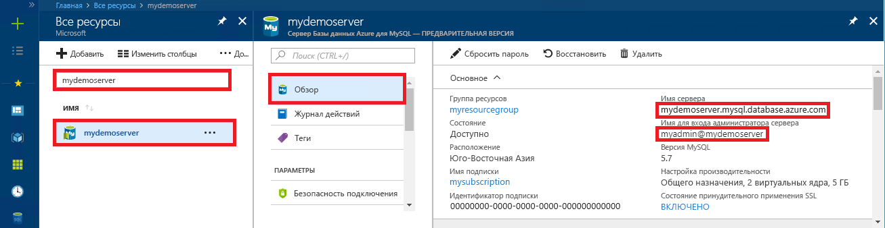

# <a name="azure-database-for-mysql-use-net-c-to-connect-and-query-data"></a>База данных Azure для MySQL: подключение и запрос данных с помощью .NET (C#)
В этом кратком руководстве объясняется, как подключиться к базе данных Azure для MySQL с помощью приложения C#. Здесь также показано, как использовать инструкции SQL для запроса, вставки, обновления и удаления данных в базе данных. В этой статье предполагается, что у вас уже есть опыт разработки на C# и вы только начали работу с базой данных Azure для MySQL.

## <a name="prerequisites"></a>предварительным требованиям
В качестве отправной точки в этом кратком руководстве используются ресурсы, созданные в соответствии со следующими материалами:
- [Create an Azure Database for MySQL server using Azure portal](./quickstart-create-mysql-server-database-using-azure-portal.md) (Создание базы данных Azure для сервера MySQL с помощью портала Azure)
- [Create an Azure Database for MySQL server using Azure CLI](./quickstart-create-mysql-server-database-using-azure-cli.md) (Создание сервера базы данных Azure для MySQL с помощью Azure CLI)

Также вам потребуется:
- Установить [.NET](https://www.microsoft.com/net/download). Выполните действия в статье по ссылке, чтобы установить .NET конкретно для вашей платформы (Windows, Ubuntu Linux или macOS). 
- Установить [Visual Studio](https://www.visualstudio.com/downloads/).

## <a name="create-a-c-project"></a>Создание проекта C#
В окне командной строки выполните следующую команду.

```
mkdir AzureMySqlExample
cd AzureMySqlExample
dotnet new console
dotnet add package MySqlConnector
```

## <a name="get-connection-information"></a>Получение сведений о подключении
Получите сведения о подключении, необходимые для подключения к базе данных Azure.для MySQL. Вам потребуется полное имя сервера и учетные данные для входа.

1. Войдите на [портал Azure](https://portal.azure.com/).
2. В меню слева на портале Azure щелкните **Все ресурсы** и выполните поиск по имени созданного сервера (например, **mydemoserver**).
3. Щелкните имя сервера.
4. Запишите **имя сервера** и **имя для входа администратора сервера** с панели сервера **Обзор**. Если вы забыли свой пароль, можно также сбросить пароль с помощью этой панели.
 

## <a name="connect-create-table-and-insert-data"></a>Подключение, создание таблицы и вставка данных
Используйте указанный ниже код для подключения и скачивания данных с помощью инструкций SQL `CREATE TABLE` и `INSERT INTO`. В этом коде используется класс `MySqlConnection` с методом [OpenAsync()](https://docs.microsoft.com/dotnet/api/system.data.common.dbconnection.openasync#System_Data_Common_DbConnection_OpenAsync), чтобы установить подключение к MySQL. Затем код использует метод [CreateCommand()](https://docs.microsoft.com/dotnet/api/system.data.common.dbconnection.createcommand), устанавливает свойство CommandText и вызывает метод [ExecuteNonQueryAsync()](https://docs.microsoft.com/dotnet/api/system.data.common.dbcommand.executenonqueryasync), чтобы выполнить команды базы данных. 

Замените параметры `Server`, `Database`, `UserID` и `Password` значениями, указанными при создании сервера и базы данных. 

```csharp
using System;
using System.Threading.Tasks;
using MySql.Data.MySqlClient;

namespace AzureMySqlExample
{
    class MySqlCreate
    {
        static async Task Main(string[] args)
        {
            var builder = new MySqlConnectionStringBuilder
            {
                Server = "YOUR-SERVER.mysql.database.azure.com",
                Database = "YOUR-DATABASE",
                UserID = "USER@YOUR-SERVER",
                Password = "PASSWORD",
                SslMode = MySqlSslMode.Required,
            };

            using (var conn = new MySqlConnection(builder.ConnectionString))
            {
                Console.WriteLine("Opening connection");
                await conn.OpenAsync();

                using (var command = conn.CreateCommand())
                {
                    command.CommandText = "DROP TABLE IF EXISTS inventory;";
                    await command.ExecuteNonQueryAsync();
                    Console.WriteLine("Finished dropping table (if existed)");

                    command.CommandText = "CREATE TABLE inventory (id serial PRIMARY KEY, name VARCHAR(50), quantity INTEGER);";
                    await command.ExecuteNonQueryAsync();
                    Console.WriteLine("Finished creating table");

                    command.CommandText = @"INSERT INTO inventory (name, quantity) VALUES (@name1, @quantity1),
                        (@name2, @quantity2), (@name3, @quantity3);";
                    command.Parameters.AddWithValue("@name1", "banana");
                    command.Parameters.AddWithValue("@quantity1", 150);
                    command.Parameters.AddWithValue("@name2", "orange");
                    command.Parameters.AddWithValue("@quantity2", 154);
                    command.Parameters.AddWithValue("@name3", "apple");
                    command.Parameters.AddWithValue("@quantity3", 100);

                    int rowCount = await command.ExecuteNonQueryAsync();
                    Console.WriteLine(String.Format("Number of rows inserted={0}", rowCount));
                }

                // connection will be closed by the 'using' block
                Console.WriteLine("Closing connection");
            }

            Console.WriteLine("Press RETURN to exit");
            Console.ReadLine();
        }
    }
}
```

## <a name="read-data"></a>Считывание данных

Используйте указанный ниже код с инструкцией SQL `SELECT` для подключения и чтения данных. В этом коде используется класс `MySqlConnection` с методом [OpenAsync()](https://docs.microsoft.com/dotnet/api/system.data.common.dbconnection.openasync#System_Data_Common_DbConnection_OpenAsync), чтобы установить подключение к MySQL. Затем код использует метод [CreateCommand()](https://docs.microsoft.com/dotnet/api/system.data.common.dbconnection.createcommand) и [ExecuteReaderAsync()](https://docs.microsoft.com/dotnet/api/system.data.common.dbcommand.executereaderasync) для выполнения команд базы данных. После чего используется метод [ReadAsync()](https://docs.microsoft.com/dotnet/api/system.data.common.dbdatareader.readasync#System_Data_Common_DbDataReader_ReadAsync) для перехода к записям в результирующем наборе. Затем используются метод GetInt32 и метод GetString для анализа значений в записи.

Замените параметры `Server`, `Database`, `UserID` и `Password` значениями, указанными при создании сервера и базы данных. 

```csharp
using System;
using System.Threading.Tasks;
using MySql.Data.MySqlClient;

namespace AzureMySqlExample
{
    class MySqlRead
    {
        static async Task Main(string[] args)
        {
            var builder = new MySqlConnectionStringBuilder
            {
                Server = "YOUR-SERVER.mysql.database.azure.com",
                Database = "YOUR-DATABASE",
                UserID = "USER@YOUR-SERVER",
                Password = "PASSWORD",
                SslMode = MySqlSslMode.Required,
            };

            using (var conn = new MySqlConnection(builder.ConnectionString))
            {
                Console.WriteLine("Opening connection");
                await conn.OpenAsync();

                using (var command = conn.CreateCommand())
                {
                    command.CommandText = "SELECT * FROM inventory;";

                    using (var reader = await command.ExecuteReaderAsync())
                    {
                        while (await reader.ReadAsync())
                        {
                            Console.WriteLine(string.Format(
                                "Reading from table=({0}, {1}, {2})",
                                reader.GetInt32(0),
                                reader.GetString(1),
                                reader.GetInt32(2)));
                        }
                    }
                }

                Console.WriteLine("Closing connection");
            }

            Console.WriteLine("Press RETURN to exit");
            Console.ReadLine();
        }
    }
}
```

## <a name="update-data"></a>Обновление данных
Используйте указанный ниже код с инструкцией SQL `UPDATE` для подключения и чтения данных. В этом коде используется класс `MySqlConnection` с методом [OpenAsync()](https://docs.microsoft.com/dotnet/api/system.data.common.dbconnection.openasync#System_Data_Common_DbConnection_OpenAsync), чтобы установить подключение к MySQL. Затем код использует метод [CreateCommand()](https://docs.microsoft.com/dotnet/api/system.data.common.dbconnection.createcommand), устанавливает свойство CommandText и вызывает метод [ExecuteNonQueryAsync()](https://docs.microsoft.com/dotnet/api/system.data.common.dbcommand.executenonqueryasync), чтобы выполнить команды базы данных. 

Замените параметры `Server`, `Database`, `UserID` и `Password` значениями, указанными при создании сервера и базы данных. 

```csharp
using System;
using System.Threading.Tasks;
using MySql.Data.MySqlClient;

namespace AzureMySqlExample
{
    class MySqlUpdate
    {
        static async Task Main(string[] args)
        {
            var builder = new MySqlConnectionStringBuilder
            {
                Server = "YOUR-SERVER.mysql.database.azure.com",
                Database = "YOUR-DATABASE",
                UserID = "USER@YOUR-SERVER",
                Password = "PASSWORD",
                SslMode = MySqlSslMode.Required,
            };

            using (var conn = new MySqlConnection(builder.ConnectionString))
            {
                Console.WriteLine("Opening connection");
                await conn.OpenAsync();

                using (var command = conn.CreateCommand())
                {
                    command.CommandText = "UPDATE inventory SET quantity = @quantity WHERE name = @name;";
                    command.Parameters.AddWithValue("@quantity", 200);
                    command.Parameters.AddWithValue("@name", "banana");

                    int rowCount = await command.ExecuteNonQueryAsync();
                    Console.WriteLine(String.Format("Number of rows updated={0}", rowCount));
                }

                Console.WriteLine("Closing connection");
            }

            Console.WriteLine("Press RETURN to exit");
            Console.ReadLine();
        }
    }
}
```

## <a name="delete-data"></a>Удаление данных
Используйте указанный ниже код с инструкцией SQL `DELETE` для подключения и удаления данных. 

В этом коде используется класс `MySqlConnection` с методом [OpenAsync()](https://docs.microsoft.com/dotnet/api/system.data.common.dbconnection.openasync#System_Data_Common_DbConnection_OpenAsync), чтобы установить подключение к MySQL. Затем код использует метод [CreateCommand()](https://docs.microsoft.com/dotnet/api/system.data.common.dbconnection.createcommand), устанавливает свойство CommandText и вызывает метод [ExecuteNonQueryAsync()](https://docs.microsoft.com/dotnet/api/system.data.common.dbcommand.executenonqueryasync), чтобы выполнить команды базы данных. 

Замените параметры `Server`, `Database`, `UserID` и `Password` значениями, указанными при создании сервера и базы данных. 

```csharp
using System;
using System.Threading.Tasks;
using MySql.Data.MySqlClient;

namespace AzureMySqlExample
{
    class MySqlDelete
    {
        static async Task Main(string[] args)
        {
            var builder = new MySqlConnectionStringBuilder
            {
                Server = "YOUR-SERVER.mysql.database.azure.com",
                Database = "YOUR-DATABASE",
                UserID = "USER@YOUR-SERVER",
                Password = "PASSWORD",
                SslMode = MySqlSslMode.Required,
            };

            using (var conn = new MySqlConnection(builder.ConnectionString))
            {
                Console.WriteLine("Opening connection");
                await conn.OpenAsync();

                using (var command = conn.CreateCommand())
                {
                    command.CommandText = "DELETE FROM inventory WHERE name = @name;";
                    command.Parameters.AddWithValue("@name", "orange");

                    int rowCount = await command.ExecuteNonQueryAsync();
                    Console.WriteLine(String.Format("Number of rows deleted={0}", rowCount));
                }

                Console.WriteLine("Closing connection");
            }

            Console.WriteLine("Press RETURN to exit");
            Console.ReadLine();
        }
    }
}
```

## <a name="next-steps"></a>Дополнительная информация
> [!div class="nextstepaction"]
> [Перенос базы данных MySQL в базу данных Azure для MySQL с помощью резервного копирования и восстановления](concepts-migrate-dump-restore.md)
