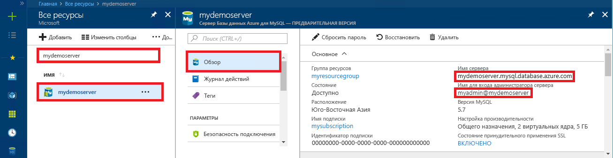

# <a name="azure-database-for-mysql-use-go-language-to-connect-and-query-data"></a>База данных Azure для MySQL: подключение и запрос данных с помощью языка Go
В этом кратком руководстве объясняется, как подключиться к базе данных Azure для MySQL с помощью кода [Go](https://golang.org/) на платформе Windows, Ubuntu Linux или Apple macOS. Здесь также показано, как использовать инструкции SQL для запроса, вставки, обновления и удаления данных в базе данных. В этой статье предполагается, что у вас уже есть опыт разработки на языке Go и вы только начали работу с базой данных Azure для MySQL.

## <a name="prerequisites"></a>предварительным требованиям
В качестве отправной точки в этом кратком руководстве используются ресурсы, созданные в соответствии со следующими материалами:
- [Create an Azure Database for MySQL server using Azure portal](./quickstart-create-mysql-server-database-using-azure-portal.md) (Создание базы данных Azure для сервера MySQL с помощью портала Azure)
- [Create an Azure Database for MySQL server using Azure CLI](./quickstart-create-mysql-server-database-using-azure-cli.md) (Создание сервера базы данных Azure для MySQL с помощью Azure CLI)

## <a name="install-go-and-mysql-connector"></a>Установка Go и соединителя MySQL
Установите [Go](https://golang.org/doc/install) и драйвер [go-sql-driver](https://github.com/go-sql-driver/mysql#installation) для MySQL на своем компьютере. В зависимости от используемой платформы выполните действия, приведенные в соответствующем разделе.

### <a name="windows"></a>Windows
1. [Скачайте](https://golang.org/dl/) и установите Go для Microsoft Windows [согласно инструкциям по установке](https://golang.org/doc/install).
2. Запустите командную строку из меню "Пуск".
3. Создайте папку для проекта, например `mkdir  %USERPROFILE%\go\src\mysqlgo`.
4. Перейдите в папку проекта, например `cd %USERPROFILE%\go\src\mysqlgo`.
5. В качестве значения для переменной среды GOPATH укажите путь к каталогу с исходным кодом. `set GOPATH=%USERPROFILE%\go`.
6. Установите драйвер [go-sql-driver](https://github.com/go-sql-driver/mysql#installation) для MySQL, выполнив команду `go get github.com/go-sql-driver/mysql`.

   Установите Go, а затем выполните следующие команды в командной строке:
   ```cmd
   mkdir  %USERPROFILE%\go\src\mysqlgo
   cd %USERPROFILE%\go\src\mysqlgo
   set GOPATH=%USERPROFILE%\go
   go get github.com/go-sql-driver/mysql
   ```

### <a name="linux-ubuntu"></a>Linux (Ubuntu)
1. Запустите оболочку Bash. 
2. Установите Go, выполнив команду `sudo apt-get install golang-go`.
3. Создайте папку для проекта в корневом каталоге, например `mkdir -p ~/go/src/mysqlgo/`.
4. Перейдите в другую папку, например `cd ~/go/src/mysqlgo/`.
5. В качестве значения для переменной среды GOPATH укажите путь к действительному исходному каталогу, например к текущей папке Go в корневом каталоге. В оболочке Bash выполните команду `export GOPATH=~/go`, чтобы добавить каталог Go в качестве значения переменной GOPATH для текущего сеанса оболочки.
6. Установите драйвер [go-sql-driver](https://github.com/go-sql-driver/mysql#installation) для MySQL, выполнив команду `go get github.com/go-sql-driver/mysql`.

   Выполните следующие команды Bash:
   ```bash
   sudo apt-get install golang-go
   mkdir -p ~/go/src/mysqlgo/
   cd ~/go/src/mysqlgo/
   export GOPATH=~/go/
   go get github.com/go-sql-driver/mysql
   ```

### <a name="apple-macos"></a>Apple macOS
1. Скачайте и установите Go согласно [инструкциям по установке](https://golang.org/doc/install) с учетом вашей платформы. 
2. Запустите оболочку Bash.
3. Создайте папку для проекта в корневом каталоге, например `mkdir -p ~/go/src/mysqlgo/`.
4. Перейдите в другую папку, например `cd ~/go/src/mysqlgo/`.
5. В качестве значения для переменной среды GOPATH укажите путь к действительному исходному каталогу, например к текущей папке Go в корневом каталоге. В оболочке Bash выполните команду `export GOPATH=~/go`, чтобы добавить каталог Go в качестве значения переменной GOPATH для текущего сеанса оболочки.
6. Установите драйвер [go-sql-driver](https://github.com/go-sql-driver/mysql#installation) для MySQL, выполнив команду `go get github.com/go-sql-driver/mysql`.

   Установите Go, а затем выполните следующие команды Bash:
   ```bash
   mkdir -p ~/go/src/mysqlgo/
   cd ~/go/src/mysqlgo/
   export GOPATH=~/go/
   go get github.com/go-sql-driver/mysql
   ```

## <a name="get-connection-information"></a>Получение сведений о подключении
Получите сведения о подключении, необходимые для подключения к базе данных Azure.для MySQL. Вам потребуется полное имя сервера и учетные данные для входа.

1. Войдите на [портал Azure](https://portal.azure.com/).
2. В меню слева на портале Azure щелкните **Все ресурсы** и выполните поиск по имени созданного сервера (например, **mydemoserver**).
3. Щелкните имя сервера.
4. Запишите **имя сервера** и **имя для входа администратора сервера** с панели сервера **Обзор**. Если вы забыли свой пароль, можно также сбросить пароль с помощью этой панели.
 
   

## <a name="build-and-run-go-code"></a>Сборка и выполнение кода Go 
1. Для написания кода на Golang можно использовать простой текстовый редактор, например Блокнот в Microsoft Windows, [vi](http://manpages.ubuntu.com/manpages/xenial/man1/nvi.1.html#contenttoc5) или [Nano](https://www.nano-editor.org/) в Ubuntu, а также TextEdit в macOS. Если вы предпочитаете использовать полнофункциональную интегрированную среду разработки, попробуйте [Gogland](https://www.jetbrains.com/go/) от JetBrains, [Visual Studio Code](https://code.visualstudio.com/) от корпорации Майкрософт или [Atom](https://atom.io/).
2. Вставьте код Go из раздела ниже в текстовые файлы с расширением \*.go и сохраните их в папку проекта, например `%USERPROFILE%\go\src\mysqlgo\createtable.go` в Windows или `~/go/src/mysqlgo/createtable.go` в Linux.
3. Найдите константы `HOST`, `DATABASE`, `USER` и `PASSWORD` в коде и замените приведенные для примера значения своими собственными. 
4. Запустите командную строку или оболочку Bash. Перейдите в папку проекта. В Windows это будет команда `cd %USERPROFILE%\go\src\mysqlgo\`, а в Linux — `cd ~/go/src/mysqlgo/`.  Некоторые из упомянутых редакторов IDE позволяют выполнять отладку и использовать среду выполнения без применения команд оболочки.
5. Выполните код с помощью команды `go run createtable.go`, чтобы скомпилировать и запустить приложение. 
6. Вы также можете создать код в собственном приложении. Для этого введите `go build createtable.go`, а затем выполните `createtable.exe`, чтобы запустить приложение.

## <a name="connect-create-table-and-insert-data"></a>Подключение, создание таблицы и вставка данных
Используйте следующий код для подключения к серверу, создания таблицы и загрузки данных с помощью инструкции SQL **INSERT**. 

Код импортирует три пакета: [пакет sql](https://golang.org/pkg/database/sql/), [драйвер go sql для MySQL](https://github.com/go-sql-driver/mysql#installation) для обмена данными с базой данных Azure для MySQL, а также [пакет fmt](https://golang.org/pkg/fmt/) для вывода входных и выходных данных в командной строке.

Код вызывает метод [sql.Open()](http://go-database-sql.org/accessing.html), чтобы подключиться к базе данных Azure для MySQL, а затем проверяет подключение с помощью метода [db.Ping()](https://golang.org/pkg/database/sql/#DB.Ping). [Дескриптор базы данных](https://golang.org/pkg/database/sql/#DB) используется для всех компонентов. Он содержит пул подключений к серверу базы данных. Код вызывает метод [Exec()](https://golang.org/pkg/database/sql/#DB.Exec) несколько раз, чтобы выполнить несколько команд DDL. Код также использует методы [Prepare()](http://go-database-sql.org/prepared.html) и Exec(), чтобы выполнить подготовленные инструкции с разными параметрами для вставки трех строк. При каждом запуске пользовательский метод checkError() проверяет наличие ошибок и инициирует аварийный выход в случае их обнаружения.

Замените значения констант `host`, `database`, `user` и `password` собственными значениями. 

```Go
package main

import (
    "database/sql"
    "fmt"

    _ "github.com/go-sql-driver/mysql"
)

const (
    host     = "mydemoserver.mysql.database.azure.com"
    database = "quickstartdb"
    user     = "myadmin@mydemoserver"
    password = "yourpassword"
)

func checkError(err error) {
    if err != nil {
        panic(err)
    }
}

func main() {

    // Initialize connection string.
    var connectionString = fmt.Sprintf("%s:%s@tcp(%s:3306)/%s?allowNativePasswords=true", user, password, host, database)

    // Initialize connection object.
    db, err := sql.Open("mysql", connectionString)
    checkError(err)
    defer db.Close()

    err = db.Ping()
    checkError(err)
    fmt.Println("Successfully created connection to database.")

    // Drop previous table of same name if one exists.
    _, err = db.Exec("DROP TABLE IF EXISTS inventory;")
    checkError(err)
    fmt.Println("Finished dropping table (if existed).")

    // Create table.
    _, err = db.Exec("CREATE TABLE inventory (id serial PRIMARY KEY, name VARCHAR(50), quantity INTEGER);")
    checkError(err)
    fmt.Println("Finished creating table.")

    // Insert some data into table.
    sqlStatement, err := db.Prepare("INSERT INTO inventory (name, quantity) VALUES (?, ?);")
    res, err := sqlStatement.Exec("banana", 150)
    checkError(err)
    rowCount, err := res.RowsAffected()
    fmt.Printf("Inserted %d row(s) of data.\n", rowCount)

    res, err = sqlStatement.Exec("orange", 154)
    checkError(err)
    rowCount, err = res.RowsAffected()
    fmt.Printf("Inserted %d row(s) of data.\n", rowCount)

    res, err = sqlStatement.Exec("apple", 100)
    checkError(err)
    rowCount, err = res.RowsAffected()
    fmt.Printf("Inserted %d row(s) of data.\n", rowCount)
    fmt.Println("Done.")
}

```

## <a name="read-data"></a>Считывание данных
Используйте указанный ниже код с инструкцией SQL **SELECT** для подключения и чтения данных. 

Код импортирует три пакета: [пакет sql](https://golang.org/pkg/database/sql/), [драйвер go sql для MySQL](https://github.com/go-sql-driver/mysql#installation) для обмена данными с базой данных Azure для MySQL, а также [пакет fmt](https://golang.org/pkg/fmt/) для вывода входных и выходных данных в командной строке.

Код вызывает метод [sql.Open()](http://go-database-sql.org/accessing.html), чтобы подключиться к базе данных Azure для MySQL, а затем проверяет подключение с помощью метода [db.Ping()](https://golang.org/pkg/database/sql/#DB.Ping). [Дескриптор базы данных](https://golang.org/pkg/database/sql/#DB) используется для всех компонентов. Он содержит пул подключений к серверу базы данных. Код вызывает метод [Query()](https://golang.org/pkg/database/sql/#DB.Query) для выполнения команды SELECT. Затем он запускает метод [Next()](https://golang.org/pkg/database/sql/#Rows.Next), чтобы выполнить итерацию результирующего набора, и метод [Scan()](https://golang.org/pkg/database/sql/#Rows.Scan) для анализа значений столбца, сохраняя значения в переменных. При каждом запуске пользовательский метод checkError() проверяет наличие ошибок и инициирует аварийный выход в случае их обнаружения.

Замените значения констант `host`, `database`, `user` и `password` собственными значениями. 

```Go
package main

import (
    "database/sql"
    "fmt"

    _ "github.com/go-sql-driver/mysql"
)

const (
    host     = "mydemoserver.mysql.database.azure.com"
    database = "quickstartdb"
    user     = "myadmin@mydemoserver"
    password = "yourpassword"
)

func checkError(err error) {
    if err != nil {
        panic(err)
    }
}

func main() {

    // Initialize connection string.
    var connectionString = fmt.Sprintf("%s:%s@tcp(%s:3306)/%s?allowNativePasswords=true", user, password, host, database)

    // Initialize connection object.
    db, err := sql.Open("mysql", connectionString)
    checkError(err)
    defer db.Close()

    err = db.Ping()
    checkError(err)
    fmt.Println("Successfully created connection to database.")

    // Variables for printing column data when scanned.
    var (
        id       int
        name     string
        quantity int
    )

    // Read some data from the table.
    rows, err := db.Query("SELECT id, name, quantity from inventory;")
    checkError(err)
    defer rows.Close()
    fmt.Println("Reading data:")
    for rows.Next() {
        err := rows.Scan(&id, &name, &quantity)
        checkError(err)
        fmt.Printf("Data row = (%d, %s, %d)\n", id, name, quantity)
    }
    err = rows.Err()
    checkError(err)
    fmt.Println("Done.")
}
```

## <a name="update-data"></a>Обновление данных
Используйте указанный ниже код с инструкцией SQL **UPDATE** для подключения и обновления данных. 

Код импортирует три пакета: [пакет sql](https://golang.org/pkg/database/sql/), [драйвер go sql для MySQL](https://github.com/go-sql-driver/mysql#installation) для обмена данными с базой данных Azure для MySQL, а также [пакет fmt](https://golang.org/pkg/fmt/) для вывода входных и выходных данных в командной строке.

Код вызывает метод [sql.Open()](http://go-database-sql.org/accessing.html), чтобы подключиться к базе данных Azure для MySQL, а затем проверяет подключение с помощью метода [db.Ping()](https://golang.org/pkg/database/sql/#DB.Ping). [Дескриптор базы данных](https://golang.org/pkg/database/sql/#DB) используется для всех компонентов. Он содержит пул подключений к серверу базы данных. Код вызывает метод [Exec()](https://golang.org/pkg/database/sql/#DB.Exec) для выполнения команды UPDATE. При каждом запуске пользовательский метод checkError() проверяет наличие ошибок и инициирует аварийный выход в случае их обнаружения.

Замените значения констант `host`, `database`, `user` и `password` собственными значениями. 

```Go
package main

import (
    "database/sql"
    "fmt"

    _ "github.com/go-sql-driver/mysql"
)

const (
    host     = "mydemoserver.mysql.database.azure.com"
    database = "quickstartdb"
    user     = "myadmin@mydemoserver"
    password = "yourpassword"
)

func checkError(err error) {
    if err != nil {
        panic(err)
    }
}

func main() {

    // Initialize connection string.
    var connectionString = fmt.Sprintf("%s:%s@tcp(%s:3306)/%s?allowNativePasswords=true", user, password, host, database)

    // Initialize connection object.
    db, err := sql.Open("mysql", connectionString)
    checkError(err)
    defer db.Close()

    err = db.Ping()
    checkError(err)
    fmt.Println("Successfully created connection to database.")

    // Modify some data in table.
    rows, err := db.Exec("UPDATE inventory SET quantity = ? WHERE name = ?", 200, "banana")
    checkError(err)
    rowCount, err := rows.RowsAffected()
    fmt.Printf("Deleted %d row(s) of data.\n", rowCount)
    fmt.Println("Done.")
}
```

## <a name="delete-data"></a>Удаление данных
Используйте указанный ниже код с инструкцией SQL **DELETE** для подключения и удаления данных. 

Код импортирует три пакета: [пакет sql](https://golang.org/pkg/database/sql/), [драйвер go sql для MySQL](https://github.com/go-sql-driver/mysql#installation) для обмена данными с базой данных Azure для MySQL, а также [пакет fmt](https://golang.org/pkg/fmt/) для вывода входных и выходных данных в командной строке.

Код вызывает метод [sql.Open()](http://go-database-sql.org/accessing.html), чтобы подключиться к базе данных Azure для MySQL, а затем проверяет подключение с помощью метода [db.Ping()](https://golang.org/pkg/database/sql/#DB.Ping). [Дескриптор базы данных](https://golang.org/pkg/database/sql/#DB) используется для всех компонентов. Он содержит пул подключений к серверу базы данных. Код вызывает метод [Exec()](https://golang.org/pkg/database/sql/#DB.Exec) для выполнения команды DELETE. При каждом запуске пользовательский метод checkError() проверяет наличие ошибок и инициирует аварийный выход в случае их обнаружения.

Замените значения констант `host`, `database`, `user` и `password` собственными значениями. 

```Go
package main

import (
    "database/sql"
    "fmt"
    _ "github.com/go-sql-driver/mysql"
)

const (
    host     = "mydemoserver.mysql.database.azure.com"
    database = "quickstartdb"
    user     = "myadmin@mydemoserver"
    password = "yourpassword"
)

func checkError(err error) {
    if err != nil {
        panic(err)
    }
}

func main() {

    // Initialize connection string.
    var connectionString = fmt.Sprintf("%s:%s@tcp(%s:3306)/%s?allowNativePasswords=true", user, password, host, database)

    // Initialize connection object.
    db, err := sql.Open("mysql", connectionString)
    checkError(err)
    defer db.Close()

    err = db.Ping()
    checkError(err)
    fmt.Println("Successfully created connection to database.")

    // Modify some data in table.
    rows, err := db.Exec("DELETE FROM inventory WHERE name = ?", "orange")
    checkError(err)
    rowCount, err := rows.RowsAffected()
    fmt.Printf("Deleted %d row(s) of data.\n", rowCount)
    fmt.Println("Done.")
}
```

## <a name="next-steps"></a>Дополнительная информация
> [!div class="nextstepaction"]
> [Перенос базы данных с помощью экспорта и импорта](./concepts-migrate-import-export.md)
