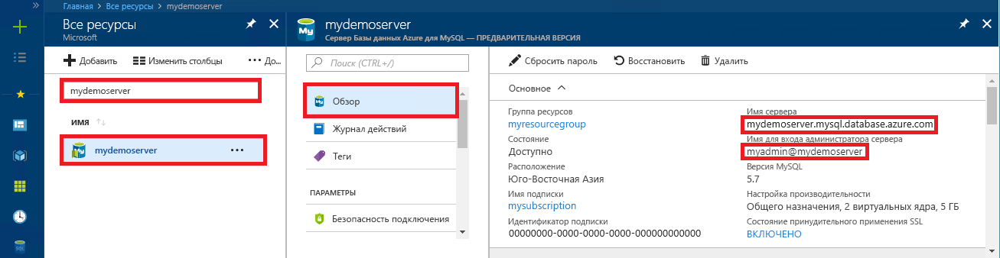

# <a name="azure-database-for-mysql-use-java-to-connect-and-query-data"></a>База данных Azure для MySQL: подключение и запрос данных с помощью Java
В этом кратком руководстве объясняется, как подключиться к службе "База данных Azure для MySQL" с помощью приложения Java и драйвера JDBC [MySQL Connector/J](https://dev.mysql.com/downloads/connector/j/). Здесь также показано, как использовать инструкции SQL для запроса, вставки, обновления и удаления данных в базе данных. В этой статье предполагается, что у вас уже есть опыт разработки на языке Java и вы только начали работу со службой "База данных Azure для MySQL".

На [странице с примерами соединителей MySQL](https://dev.mysql.com/doc/connector-j/5.1/en/connector-j-examples.html) вы можете ознакомиться с множеством других образцов кода.

## <a name="prerequisites"></a>предварительным требованиям
1. В качестве отправной точки в этом кратком руководстве используются ресурсы, созданные в соответствии со следующими материалами:
   - [Create an Azure Database for MySQL server using Azure portal](./quickstart-create-mysql-server-database-using-azure-portal.md) (Создание базы данных Azure для сервера MySQL с помощью портала Azure)
   - [Create an Azure Database for MySQL server using Azure CLI](./quickstart-create-mysql-server-database-using-azure-cli.md) (Создание сервера базы данных Azure для MySQL с помощью Azure CLI)

2. Убедиться, что безопасность подключения базы данных Azure для MySQL настроена с открытым брандмауэром и параметры SSL настроены для успешного подключения приложения.

3. Получите соединитель MySQL Connector/J с помощью одного из следующих способов:
   - Используйте пакет Maven [mysql-connector-java](http://search.maven.org/#search%7Cga%7C1%7Cg%3A%22mysql%22%20AND%20a%3A%22mysql-connector-java%22), чтобы включить [зависимость mysql](https://mvnrepository.com/artifact/mysql/mysql-connector-java/5.1.6) в файл POM для проекта.
   - Скачайте драйвер JDBC [MySQL Connector/J](https://dev.mysql.com/downloads/connector/j/) и включите JAR-файл JDBC (например, mysql-connector-java-5.1.42-bin.jar) в путь к классу приложения. Если возникнут сложности, изучите в документации по своей среде информацию о путях классов (например, [Apache Tomcat](https://tomcat.apache.org/tomcat-7.0-doc/class-loader-howto.html) или [Java SE](http://docs.oracle.com/javase/7/docs/technotes/tools/windows/classpath.html)).

## <a name="get-connection-information"></a>Получение сведений о подключении
Получите сведения о подключении, необходимые для подключения к базе данных Azure.для MySQL. Вам потребуется полное имя сервера и учетные данные для входа.

1. Войдите на [портал Azure](https://portal.azure.com/).
2. В меню слева на портале Azure щелкните **Все ресурсы** и выполните поиск по имени созданного сервера (например, **mydemoserver**).
3. Щелкните имя сервера.
4. Запишите **имя сервера** и **имя для входа администратора сервера** с панели сервера **Обзор**. Если вы забыли свой пароль, можно также сбросить пароль с помощью этой панели.
 

## <a name="connect-create-table-and-insert-data"></a>Подключение, создание таблицы и вставка данных
Используйте указанный ниже код для подключения и загрузки данных с помощью функции с инструкцией SQL **INSERT**. Метод [getConnection()](https://dev.mysql.com/doc/connector-j/5.1/en/connector-j-usagenotes-connect-drivermanager.html) используется для подключения к MySQL. Методы [createStatement()](https://dev.mysql.com/doc/connector-j/5.1/en/connector-j-usagenotes-statements.html) и execute() используются для удаления и создания таблицы. Объект prepareStatement используется для создания команд вставки, а методы setString() и setInt() — для привязки значений параметров. Метод executeUpdate() запускает команду для каждого набора параметров, чтобы вставить значения. 

Замените значения параметров host, database, user и password значениями, указанными при создании сервера и базы данных.

```java
import java.sql.*;
import java.util.Properties;

public class CreateTableInsertRows {

    public static void main (String[] args)  throws Exception
    {
        // Initialize connection variables. 
        String host = "mydemoserver.mysql.database.azure.com";
        String database = "quickstartdb";
        String user = "myadmin@mydemoserver";
        String password = "<server_admin_password>";

        // check that the driver is installed
        try
        {
            Class.forName("com.mysql.jdbc.Driver");
        }
        catch (ClassNotFoundException e)
        {
            throw new ClassNotFoundException("MySQL JDBC driver NOT detected in library path.", e);
        }

        System.out.println("MySQL JDBC driver detected in library path.");

        Connection connection = null;

        // Initialize connection object
        try
        {
            String url = String.format("jdbc:mysql://%s/%s", host, database);

            // Set connection properties.
            Properties properties = new Properties();
            properties.setProperty("user", user);
            properties.setProperty("password", password);
            properties.setProperty("useSSL", "true");
            properties.setProperty("verifyServerCertificate", "true");
            properties.setProperty("requireSSL", "false");

            // get connection
            connection = DriverManager.getConnection(url, properties);
        }
        catch (SQLException e)
        {
            throw new SQLException("Failed to create connection to database.", e);
        }
        if (connection != null) 
        { 
            System.out.println("Successfully created connection to database.");
        
            // Perform some SQL queries over the connection.
            try
            {
                // Drop previous table of same name if one exists.
                Statement statement = connection.createStatement();
                statement.execute("DROP TABLE IF EXISTS inventory;");
                System.out.println("Finished dropping table (if existed).");
    
                // Create table.
                statement.execute("CREATE TABLE inventory (id serial PRIMARY KEY, name VARCHAR(50), quantity INTEGER);");
                System.out.println("Created table.");
                
                // Insert some data into table.
                int nRowsInserted = 0;
                PreparedStatement preparedStatement = connection.prepareStatement("INSERT INTO inventory (name, quantity) VALUES (?, ?);");
                preparedStatement.setString(1, "banana");
                preparedStatement.setInt(2, 150);
                nRowsInserted += preparedStatement.executeUpdate();

                preparedStatement.setString(1, "orange");
                preparedStatement.setInt(2, 154);
                nRowsInserted += preparedStatement.executeUpdate();

                preparedStatement.setString(1, "apple");
                preparedStatement.setInt(2, 100);
                nRowsInserted += preparedStatement.executeUpdate();
                System.out.println(String.format("Inserted %d row(s) of data.", nRowsInserted));
    
                // NOTE No need to commit all changes to database, as auto-commit is enabled by default.
    
            }
            catch (SQLException e)
            {
                throw new SQLException("Encountered an error when executing given sql statement.", e);
            }       
        }
        else {
            System.out.println("Failed to create connection to database.");
        }
        System.out.println("Execution finished.");
    }
}

```

## <a name="read-data"></a>Считывание данных
Используйте указанный ниже код с инструкцией SQL **SELECT** для чтения данных. Метод [getConnection()](https://dev.mysql.com/doc/connector-j/5.1/en/connector-j-usagenotes-connect-drivermanager.html) используется для подключения к MySQL. Методы [createStatement()](https://dev.mysql.com/doc/connector-j/5.1/en/connector-j-usagenotes-statements.html) и executeQuery() используются для подключения и выполнения инструкции SELECT. Результаты обрабатываются с помощью объекта [ResultSet](https://docs.oracle.com/javase/tutorial/jdbc/basics/retrieving.html). 

Замените значения параметров host, database, user и password значениями, указанными при создании сервера и базы данных.

```java
import java.sql.*;
import java.util.Properties;

public class ReadTable {

    public static void main (String[] args)  throws Exception
    {
        // Initialize connection variables.
        String host = "mydemoserver.mysql.database.azure.com";
        String database = "quickstartdb";
        String user = "myadmin@mydemoserver";
        String password = "<server_admin_password>";

        // check that the driver is installed
        try
        {
            Class.forName("com.mysql.jdbc.Driver");
        }
        catch (ClassNotFoundException e)
        {
            throw new ClassNotFoundException("MySQL JDBC driver NOT detected in library path.", e);
        }

        System.out.println("MySQL JDBC driver detected in library path.");

        Connection connection = null;

        // Initialize connection object
        try
        {
            String url = String.format("jdbc:mysql://%s/%s", host, database);

            // Set connection properties.
            Properties properties = new Properties();
            properties.setProperty("user", user);
            properties.setProperty("password", password);
            properties.setProperty("useSSL", "true");
            properties.setProperty("verifyServerCertificate", "true");
            properties.setProperty("requireSSL", "false");
            
            // get connection
            connection = DriverManager.getConnection(url, properties);
        }
        catch (SQLException e)
        {
            throw new SQLException("Failed to create connection to database", e);
        }
        if (connection != null) 
        { 
            System.out.println("Successfully created connection to database.");
        
            // Perform some SQL queries over the connection.
            try
            {
    
                Statement statement = connection.createStatement();
                ResultSet results = statement.executeQuery("SELECT * from inventory;");
                while (results.next())
                {
                    String outputString = 
                        String.format(
                            "Data row = (%s, %s, %s)",
                            results.getString(1),
                            results.getString(2),
                            results.getString(3));
                    System.out.println(outputString);
                }
            }
            catch (SQLException e)
            {
                throw new SQLException("Encountered an error when executing given sql statement", e);
            }       
        }
        else {
            System.out.println("Failed to create connection to database."); 
        }
        System.out.println("Execution finished.");
    }
}
```

## <a name="update-data"></a>Обновление данных
Используйте указанный ниже код с инструкцией SQL **UPDATE** для изменения данных. Метод [getConnection()](https://dev.mysql.com/doc/connector-j/5.1/en/connector-j-usagenotes-connect-drivermanager.html) используется для подключения к MySQL. Методы [prepareStatement()](http://docs.oracle.com/javase/tutorial/jdbc/basics/prepared.html) и executeUpdate() используются для подготовки и выполнения инструкции UPDATE. 

Замените значения параметров host, database, user и password значениями, указанными при создании сервера и базы данных.

```java
import java.sql.*;
import java.util.Properties;

public class UpdateTable {
    public static void main (String[] args)  throws Exception
    {
        // Initialize connection variables. 
        String host = "mydemoserver.mysql.database.azure.com";
        String database = "quickstartdb";
        String user = "myadmin@mydemoserver";
        String password = "<server_admin_password>";

        // check that the driver is installed
        try
        {
            Class.forName("com.mysql.jdbc.Driver");
        }
        catch (ClassNotFoundException e)
        {
            throw new ClassNotFoundException("MySQL JDBC driver NOT detected in library path.", e);
        }
        System.out.println("MySQL JDBC driver detected in library path.");

        Connection connection = null;

        // Initialize connection object
        try
        {
            String url = String.format("jdbc:mysql://%s/%s", host, database);
            
            // set up the connection properties
            Properties properties = new Properties();
            properties.setProperty("user", user);
            properties.setProperty("password", password);
            properties.setProperty("useSSL", "true");
            properties.setProperty("verifyServerCertificate", "true");
            properties.setProperty("requireSSL", "false");

            // get connection
            connection = DriverManager.getConnection(url, properties);
        }
        catch (SQLException e)
        {
            throw new SQLException("Failed to create connection to database.", e);
        }
        if (connection != null) 
        { 
            System.out.println("Successfully created connection to database.");
        
            // Perform some SQL queries over the connection.
            try
            {
                // Modify some data in table.
                int nRowsUpdated = 0;
                PreparedStatement preparedStatement = connection.prepareStatement("UPDATE inventory SET quantity = ? WHERE name = ?;");
                preparedStatement.setInt(1, 200);
                preparedStatement.setString(2, "banana");
                nRowsUpdated += preparedStatement.executeUpdate();
                System.out.println(String.format("Updated %d row(s) of data.", nRowsUpdated));
    
                // NOTE No need to commit all changes to database, as auto-commit is enabled by default.
            }
            catch (SQLException e)
            {
                throw new SQLException("Encountered an error when executing given sql statement.", e);
            }       
        }
        else {
            System.out.println("Failed to create connection to database.");
        }
        System.out.println("Execution finished.");
    }
}
```

## <a name="delete-data"></a>Удаление данных
Используйте указанный ниже код с инструкцией SQL **DELETE** для удаления данных. Метод [getConnection()](https://dev.mysql.com/doc/connector-j/5.1/en/connector-j-usagenotes-connect-drivermanager.html) используется для подключения к MySQL.  Методы [prepareStatement()](http://docs.oracle.com/javase/tutorial/jdbc/basics/prepared.html) и executeUpdate() используются для подготовки и выполнения инструкции UPDATE. 

Замените значения параметров host, database, user и password значениями, указанными при создании сервера и базы данных.

```java
import java.sql.*;
import java.util.Properties;

public class DeleteTable {
    public static void main (String[] args)  throws Exception
    {
        // Initialize connection variables.
        String host = "mydemoserver.mysql.database.azure.com";
        String database = "quickstartdb";
        String user = "myadmin@mydemoserver";
        String password = "<server_admin_password>";
        
        // check that the driver is installed
        try
        {
            Class.forName("com.mysql.jdbc.Driver");
        }
        catch (ClassNotFoundException e)
        {
            throw new ClassNotFoundException("MySQL JDBC driver NOT detected in library path.", e);
        }

        System.out.println("MySQL JDBC driver detected in library path.");

        Connection connection = null;

        // Initialize connection object
        try
        {
            String url = String.format("jdbc:mysql://%s/%s", host, database);
            
            // set up the connection properties
            Properties properties = new Properties();
            properties.setProperty("user", user);
            properties.setProperty("password", password);
            properties.setProperty("useSSL", "true");
            properties.setProperty("verifyServerCertificate", "true");
            properties.setProperty("requireSSL", "false");
            
            // get connection
            connection = DriverManager.getConnection(url, properties);
        }
        catch (SQLException e)
        {
            throw new SQLException("Failed to create connection to database", e);
        }
        if (connection != null) 
        { 
            System.out.println("Successfully created connection to database.");
        
            // Perform some SQL queries over the connection.
            try
            {
                // Delete some data from table.
                int nRowsDeleted = 0;
                PreparedStatement preparedStatement = connection.prepareStatement("DELETE FROM inventory WHERE name = ?;");
                preparedStatement.setString(1, "orange");
                nRowsDeleted += preparedStatement.executeUpdate();
                System.out.println(String.format("Deleted %d row(s) of data.", nRowsDeleted));
    
                // NOTE No need to commit all changes to database, as auto-commit is enabled by default.
            }
            catch (SQLException e)
            {
                throw new SQLException("Encountered an error when executing given sql statement.", e);
            }       
        }
        else {
            System.out.println("Failed to create connection to database.");
        }
        System.out.println("Execution finished.");
    }
}
```

## <a name="next-steps"></a>Дополнительная информация
На [странице с примерами MySQL Connector/J](https://dev.mysql.com/doc/connector-j/5.1/en/connector-j-examples.html) вы можете ознакомиться с множеством других образцов кода.

> [!div class="nextstepaction"]
> [Перенос базы данных MySQL в базу данных Azure для MySQL с помощью резервного копирования и восстановления](concepts-migrate-dump-restore.md)
