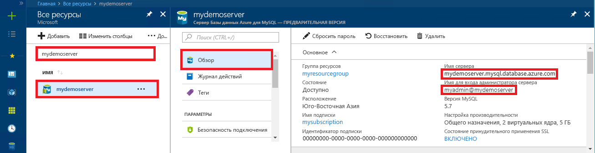

# <a name="azure-database-for-mysql-use-nodejs-to-connect-and-query-data"></a>База данных Azure для MySQL: подключение и запрос данных с помощью Node.js
В этом кратком руководстве описывается, как подключиться к базе данных Azure для MySQL при помощи [Node.js](https://nodejs.org/) на платформе Windows, Ubuntu Linux или Mac. Здесь также показано, как использовать инструкции SQL для запроса, вставки, обновления и удаления данных в базе данных. В этой статье предполагается, что у вас уже есть опыт разработки на языке Node.js и вы только начали работу с базой данных Azure для MySQL.

## <a name="prerequisites"></a>предварительным требованиям
В качестве отправной точки в этом кратком руководстве используются ресурсы, созданные в соответствии со следующими материалами:
- [Create an Azure Database for MySQL server using Azure portal](./quickstart-create-mysql-server-database-using-azure-portal.md) (Создание базы данных Azure для сервера MySQL с помощью портала Azure)
- [Create an Azure Database for MySQL server using Azure CLI](./quickstart-create-mysql-server-database-using-azure-cli.md) (Создание сервера базы данных Azure для MySQL с помощью Azure CLI)

Также вам потребуется:
- установить среду выполнения [Node.js](https://nodejs.org);
- установить пакет [MySQL2](https://www.npmjs.com/package/mysql2) для подключения к MySQL из приложения Node.js. 

## <a name="install-nodejs-and-the-mysql-connector"></a>Установка Node.js и соединителя MySQL
В зависимости от используемой платформы выполните инструкции в соответствующем разделе, чтобы установить Node.js. Используйте NPM, чтобы установить пакет MySQL2 и его зависимости в папку проекта.

### <a name="windows"></a>**Windows**
1. Войдите на [страницу скачиваемых файлов Node.js](https://nodejs.org/en/download/) и выберите нужный установщик Windows.
2. Создайте папку локального проекта, например `nodejsmysql`. 
3. Запустите командную строку, затем с помощью команды смены каталога (cd) перейдите в папку проекта, например `cd c:\nodejsmysql\`.
4. Запустите средство NPM, чтобы установить библиотеку MySQL2 в папке проекта.

   ```cmd
   cd c:\nodejsmysql\
   "C:\Program Files\nodejs\npm" install mysql2
   "C:\Program Files\nodejs\npm" list
   ```

5. Проверьте установку, проверив текст вывода `npm list` для `mysql2@1.3.5`.

### <a name="linux-ubuntu"></a>**Linux (Ubuntu)**
1. Чтобы установить **Node.js** и **NPM** (диспетчер пакетов для Node.js), выполните следующую команду:

   ```bash
   sudo apt-get install -y nodejs npm
   ```

2. Выполните следующие команды, чтобы создать папку проекта `mysqlnodejs` и установить в эту папку пакет mysql2.

   ```bash
   mkdir nodejsmysql
   cd nodejsmysql
   npm install --save mysql2
   npm list
   ```
3. Проверьте установку, проверив текст вывода списка NPM для `mysql2@1.3.5`.

### <a name="mac-os"></a>**Mac OS**
1. Чтобы установить **brew** (простой в использовании диспетчер пакетов для Mac OS X) и **Node.js**, выполните следующую команду:

   ```bash
   ruby -e "$(curl -fsSL https://raw.githubusercontent.com/Homebrew/install/master/install)"
   brew install node
   ```
2. Выполните следующие команды, чтобы создать папку проекта `mysqlnodejs` и установить в эту папку пакет mysql2.

   ```bash
   mkdir nodejsmysql
   cd nodejsmysql
   npm install --save mysql2
   npm list
   ```

3. Проверьте установку, проверив текст вывода `npm list` для `mysql2@1.3.6`. Номера версии могут отличаться, когда будут выпущены новые обновления.

## <a name="get-connection-information"></a>Получение сведений о подключении
Получите сведения о подключении, необходимые для подключения к базе данных Azure.для MySQL. Вам потребуется полное имя сервера и учетные данные для входа.

1. Войдите на [портал Azure](https://portal.azure.com/).
2. В меню слева на портале Azure щелкните **Все ресурсы** и выполните поиск по имени созданного сервера (например, **mydemoserver**).
3. Щелкните имя сервера.
4. Запишите **имя сервера** и **имя для входа администратора сервера** с панели сервера **Обзор**. Если вы забыли свой пароль, можно также сбросить пароль с помощью этой панели.
 

## <a name="running-the-javascript-code-in-nodejs"></a>Выполнение кода JavaScript в Node.js
1. Вставьте код JavaScript в текстовые файлы и сохраните их в папку проекта с расширением файла JS, например C:\nodejsmysql\createtable.js или /home/username/nodejsmysql/createtable.js.
2. Запустите командную строку или оболочку Bash и затем перейдите в папку проекта `cd nodejsmysql`.
3. Чтобы запустить приложение, введите команду Node, за которой следует имя файла, например `node createtable.js`.
4. В Windows, если приложение Node не указано в переменной среды PATH, может потребоваться указать полный путь, чтобы запустить приложение Node, например `"C:\Program Files\nodejs\node.exe" createtable.js`.

## <a name="connect-create-table-and-insert-data"></a>Подключение, создание таблицы и вставка данных
Используйте приведенный ниже код для подключения и загрузки данных с помощью инструкций SQL **CREATE TABLE** и **INSERT INTO**.

Метод [mysql.createConnection()](https://github.com/mysqljs/mysql#establishing-connections) используется для обмена данными с сервером MySQL. Функция [connect()](https://github.com/mysqljs/mysql#establishing-connections) используется для подключения к серверу. Функция [query()](https://github.com/mysqljs/mysql#performing-queries) используется для выполнения SQL-запроса к базе данных MySQL. 

Замените параметры `host`, `user`, `password` и `database` значениями, указанными при создании сервера и базы данных.

```javascript
const mysql = require('mysql2');

var config =
{
    host: 'mydemoserver.mysql.database.azure.com',
    user: 'myadmin@mydemoserver',
    password: 'your_password',
    database: 'quickstartdb',
    port: 3306,
    ssl: true
};

const conn = new mysql.createConnection(config);

conn.connect(
    function (err) { 
    if (err) { 
        console.log("!!! Cannot connect !!! Error:");
        throw err;
    }
    else
    {
       console.log("Connection established.");
           queryDatabase();
    }   
});

function queryDatabase(){
       conn.query('DROP TABLE IF EXISTS inventory;', function (err, results, fields) { 
            if (err) throw err; 
            console.log('Dropped inventory table if existed.');
        })
       conn.query('CREATE TABLE inventory (id serial PRIMARY KEY, name VARCHAR(50), quantity INTEGER);', 
            function (err, results, fields) {
                if (err) throw err;
            console.log('Created inventory table.');
        })
       conn.query('INSERT INTO inventory (name, quantity) VALUES (?, ?);', ['banana', 150], 
            function (err, results, fields) {
                if (err) throw err;
            else console.log('Inserted ' + results.affectedRows + ' row(s).');
        })
       conn.query('INSERT INTO inventory (name, quantity) VALUES (?, ?);', ['orange', 154], 
            function (err, results, fields) {
                if (err) throw err;
            console.log('Inserted ' + results.affectedRows + ' row(s).');
        })
       conn.query('INSERT INTO inventory (name, quantity) VALUES (?, ?);', ['apple', 100], 
        function (err, results, fields) {
                if (err) throw err;
            console.log('Inserted ' + results.affectedRows + ' row(s).');
        })
       conn.end(function (err) { 
        if (err) throw err;
        else  console.log('Done.') 
        });
};
```

## <a name="read-data"></a>Считывание данных
Используйте указанный ниже код с инструкцией SQL **SELECT** для подключения и чтения данных. 

Метод [mysql.createConnection()](https://github.com/mysqljs/mysql#establishing-connections) используется для обмена данными с сервером MySQL. Метод [connect()](https://github.com/mysqljs/mysql#establishing-connections) используется для подключения к серверу. Метод [query()](https://github.com/mysqljs/mysql#performing-queries) используется для выполнения SQL-запроса к базе данных MySQL. Массив результатов используется для хранения результатов запроса.

Замените параметры `host`, `user`, `password` и `database` значениями, указанными при создании сервера и базы данных.

```javascript
const mysql = require('mysql2');

var config =
{
    host: 'mydemoserver.mysql.database.azure.com',
    user: 'myadmin@mydemoserver',
    password: 'your_password',
    database: 'quickstartdb',
    port: 3306,
    ssl: true
};

const conn = new mysql.createConnection(config);

conn.connect(
    function (err) { 
        if (err) { 
            console.log("!!! Cannot connect !!! Error:");
            throw err;
        }
        else {
            console.log("Connection established.");
            readData();
        }   
    });

function readData(){
        conn.query('SELECT * FROM inventory', 
            function (err, results, fields) {
                if (err) throw err;
                else console.log('Selected ' + results.length + ' row(s).');
                for (i = 0; i < results.length; i++) {
                    console.log('Row: ' + JSON.stringify(results[i]));
                }
                console.log('Done.');
            })
       conn.end(
           function (err) { 
                if (err) throw err;
                else  console.log('Closing connection.') 
        });
};
```

## <a name="update-data"></a>Обновление данных
Используйте указанный ниже код с инструкцией SQL **UPDATE** для подключения и чтения данных. 

Метод [mysql.createConnection()](https://github.com/mysqljs/mysql#establishing-connections) используется для обмена данными с сервером MySQL. Метод [connect()](https://github.com/mysqljs/mysql#establishing-connections) используется для подключения к серверу. Метод [query()](https://github.com/mysqljs/mysql#performing-queries) используется для выполнения SQL-запроса к базе данных MySQL. 

Замените параметры `host`, `user`, `password` и `database` значениями, указанными при создании сервера и базы данных.

```javascript
const mysql = require('mysql2');

var config =
{
    host: 'mydemoserver.mysql.database.azure.com',
    user: 'myadmin@mydemoserver',
    password: 'your_password',
    database: 'quickstartdb',
    port: 3306,
    ssl: true
};

const conn = new mysql.createConnection(config);

conn.connect(
    function (err) { 
        if (err) { 
            console.log("!!! Cannot connect !!! Error:");
            throw err;
        }
        else {
            console.log("Connection established.");
            updateData();
        }   
    });

function updateData(){
       conn.query('UPDATE inventory SET quantity = ? WHERE name = ?', [200, 'banana'], 
            function (err, results, fields) {
                if (err) throw err;
                else console.log('Updated ' + results.affectedRows + ' row(s).');
        })
       conn.end(
           function (err) { 
                if (err) throw err;
                else  console.log('Done.') 
        });
};
```

## <a name="delete-data"></a>Удаление данных
Используйте следующий код с инструкцией SQL **DELETE** для подключения и чтения данных. 

Метод [mysql.createConnection()](https://github.com/mysqljs/mysql#establishing-connections) используется для обмена данными с сервером MySQL. Метод [connect()](https://github.com/mysqljs/mysql#establishing-connections) используется для подключения к серверу. Метод [query()](https://github.com/mysqljs/mysql#performing-queries) используется для выполнения SQL-запроса к базе данных MySQL. 

Замените параметры `host`, `user`, `password` и `database` значениями, указанными при создании сервера и базы данных.

```javascript
const mysql = require('mysql2');

var config =
{
    host: 'mydemoserver.mysql.database.azure.com',
    user: 'myadmin@mydemoserver',
    password: 'your_password',
    database: 'quickstartdb',
    port: 3306,
    ssl: true
};

const conn = new mysql.createConnection(config);

conn.connect(
    function (err) { 
        if (err) { 
            console.log("!!! Cannot connect !!! Error:");
            throw err;
        }
        else {
            console.log("Connection established.");
            deleteData();
        }   
    });

function deleteData(){
       conn.query('DELETE FROM inventory WHERE name = ?', ['orange'], 
            function (err, results, fields) {
                if (err) throw err;
                else console.log('Deleted ' + results.affectedRows + ' row(s).');
        })
       conn.end(
           function (err) { 
                if (err) throw err;
                else  console.log('Done.') 
        });
};
```

## <a name="next-steps"></a>Дополнительная информация
> [!div class="nextstepaction"]
> [Перенос базы данных с помощью экспорта и импорта](./concepts-migrate-import-export.md)
