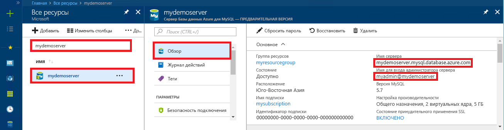

# <a name="azure-database-for-mysql-use-php-to-connect-and-query-data"></a>База данных Azure для MySQL: подключение и запрос данных с помощью PHP
В этом кратком руководстве объясняется, как подключиться к базе данных Azure для MySQL с помощью приложения [PHP](http://php.net/manual/intro-whatis.php). Здесь также показано, как использовать инструкции SQL для запроса, вставки, обновления и удаления данных в базе данных. В этой статье предполагается, что у вас уже есть опыт разработки на языке PHP и вы только начали работу с базой данных Azure для MySQL.

## <a name="prerequisites"></a>предварительным требованиям
В качестве отправной точки в этом кратком руководстве используются ресурсы, созданные в соответствии со следующими материалами:
- [Create an Azure Database for MySQL server using Azure portal](./quickstart-create-mysql-server-database-using-azure-portal.md) (Создание базы данных Azure для сервера MySQL с помощью портала Azure)
- [Create an Azure Database for MySQL server using Azure CLI](./quickstart-create-mysql-server-database-using-azure-cli.md) (Создание сервера базы данных Azure для MySQL с помощью Azure CLI)

## <a name="install-php"></a>Установка PHP
Установите PHP на своем сервере или создайте [веб-приложение](../app-service/app-service-web-overview.md) Azure с PHP.

### <a name="macos"></a>MacOS
- Скачайте [PHP версии 7.1.4](http://php.net/downloads.php).
- Установите PHP и выполните настройку согласно инструкциям в [руководстве по PHP](http://php.net/manual/install.macosx.php).

### <a name="linux-ubuntu"></a>Linux (Ubuntu)
- Скачайте [PHP 7.1.4 (x64) непотокобезопасной версии](http://php.net/downloads.php).
- Установите PHP и выполните настройку согласно инструкциям в [руководстве по PHP](http://php.net/manual/install.unix.php).

### <a name="windows"></a>Windows
- Скачайте [PHP 7.1.4 (x64) непотокобезопасной версии](http://windows.php.net/download#php-7.1).
- Установите PHP и выполните настройку согласно инструкциям в [руководстве по PHP](http://php.net/manual/install.windows.php).

## <a name="get-connection-information"></a>Получение сведений о подключении
Получите сведения о подключении, необходимые для подключения к базе данных Azure.для MySQL. Вам потребуется полное имя сервера и учетные данные для входа.

1. Войдите на [портал Azure](https://portal.azure.com/).
2. В меню слева на портале Azure щелкните **Все ресурсы** и выполните поиск по имени созданного сервера (например, **mydemoserver**).
3. Щелкните имя сервера.
4. Запишите **имя сервера** и **имя для входа администратора сервера** с панели сервера **Обзор**. Если вы забыли свой пароль, можно также сбросить пароль с помощью этой панели.
 

## <a name="connect-and-create-a-table"></a>Подключение и создание таблицы
Используйте указанный ниже код с инструкцией SQL **CREATE TABLE** для подключения и создания таблицы. 

В коде используется класс **улучшенного расширения MySQL** (mysqli), включенный в PHP. Код вызывает методы [mysqli_init](http://php.net/manual/mysqli.init.php) и [mysqli_real_connect](http://php.net/manual/mysqli.real-connect.php), чтобы подключиться к MySQL. Затем код вызывает метод [mysqli_query](http://php.net/manual/mysqli.query.php) для выполнения запроса и метод [mysqli_close](http://php.net/manual/mysqli.close.php), чтобы разорвать подключение.

Замените значения параметров host, username, password и db_name своими значениями. 

```php
<?php
$host = 'mydemoserver.mysql.database.azure.com';
$username = 'myadmin@mydemoserver';
$password = 'your_password';
$db_name = 'your_database';

//Establishes the connection
$conn = mysqli_init();
mysqli_real_connect($conn, $host, $username, $password, $db_name, 3306);
if (mysqli_connect_errno($conn)) {
die('Failed to connect to MySQL: '.mysqli_connect_error());
}

// Run the create table query
if (mysqli_query($conn, '
CREATE TABLE Products (
`Id` INT NOT NULL AUTO_INCREMENT ,
`ProductName` VARCHAR(200) NOT NULL ,
`Color` VARCHAR(50) NOT NULL ,
`Price` DOUBLE NOT NULL ,
PRIMARY KEY (`Id`)
);
')) {
printf("Table created\n");
}

//Close the connection
mysqli_close($conn);
?>
```

## <a name="insert-data"></a>Добавление данных
Используйте указанный ниже код с инструкцией SQL **INSERT** для подключения и вставки данных.

В коде используется класс **улучшенного расширения MySQL** (mysqli), включенный в PHP. Метод [mysqli_prepare](http://php.net/manual/mysqli.prepare.php) используется для создания подготовленной инструкции INSERT, а затем с помощью метода [mysqli_stmt_bind_param](http://php.net/manual/mysqli-stmt.bind-param.php) привязываются параметры для каждого вставленного значения столбца. Код выполняет инструкцию, используя метод [mysqli_stmt_execute](http://php.net/manual/mysqli-stmt.execute.php), и закрывает ее с помощью метода [mysqli_stmt_close](http://php.net/manual/mysqli-stmt.close.php).

Замените значения параметров host, username, password и db_name своими значениями. 

```php
<?php
$host = 'mydemoserver.mysql.database.azure.com';
$username = 'myadmin@mydemoserver';
$password = 'your_password';
$db_name = 'your_database';

//Establishes the connection
$conn = mysqli_init();
mysqli_real_connect($conn, $host, $username, $password, $db_name, 3306);
if (mysqli_connect_errno($conn)) {
die('Failed to connect to MySQL: '.mysqli_connect_error());
}

//Create an Insert prepared statement and run it
$product_name = 'BrandNewProduct';
$product_color = 'Blue';
$product_price = 15.5;
if ($stmt = mysqli_prepare($conn, "INSERT INTO Products (ProductName, Color, Price) VALUES (?, ?, ?)")) {
mysqli_stmt_bind_param($stmt, 'ssd', $product_name, $product_color, $product_price);
mysqli_stmt_execute($stmt);
printf("Insert: Affected %d rows\n", mysqli_stmt_affected_rows($stmt));
mysqli_stmt_close($stmt);
}

// Close the connection
mysqli_close($conn);
?>
```

## <a name="read-data"></a>Считывание данных
Используйте указанный ниже код с инструкцией SQL **SELECT** для подключения и чтения данных.  В коде используется класс **улучшенного расширения MySQL** (mysqli), включенный в PHP. В коде используется метод [mysqli_query](http://php.net/manual/mysqli.query.php) для выполнения SQL-запроса и метод [mysqli_fetch_assoc](http://php.net/manual/mysqli-result.fetch-assoc.php) для получения результирующих строк.

Замените значения параметров host, username, password и db_name своими значениями. 

```php
<?php
$host = 'mydemoserver.mysql.database.azure.com';
$username = 'myadmin@mydemoserver';
$password = 'your_password';
$db_name = 'your_database';

//Establishes the connection
$conn = mysqli_init();
mysqli_real_connect($conn, $host, $username, $password, $db_name, 3306);
if (mysqli_connect_errno($conn)) {
die('Failed to connect to MySQL: '.mysqli_connect_error());
}

//Run the Select query
printf("Reading data from table: \n");
$res = mysqli_query($conn, 'SELECT * FROM Products');
while ($row = mysqli_fetch_assoc($res)) {
var_dump($row);
}

//Close the connection
mysqli_close($conn);
?>
```

## <a name="update-data"></a>Обновление данных
Используйте указанный ниже код с инструкцией SQL **UPDATE** для подключения и обновления данных.

В коде используется класс **улучшенного расширения MySQL** (mysqli), включенный в PHP. Метод [mysqli_prepare](http://php.net/manual/mysqli.prepare.php) используется для создания подготовленной инструкции UPDATE, а затем с помощью метода [mysqli_stmt_bind_param](http://php.net/manual/mysqli-stmt.bind-param.php) привязываются параметры для каждого обновленного значения столбца. Код выполняет инструкцию, используя метод [mysqli_stmt_execute](http://php.net/manual/mysqli-stmt.execute.php), и закрывает ее с помощью метода [mysqli_stmt_close](http://php.net/manual/mysqli-stmt.close.php).

Замените значения параметров host, username, password и db_name своими значениями. 

```php
<?php
$host = 'mydemoserver.mysql.database.azure.com';
$username = 'myadmin@mydemoserver';
$password = 'your_password';
$db_name = 'your_database';

//Establishes the connection
$conn = mysqli_init();
mysqli_real_connect($conn, $host, $username, $password, $db_name, 3306);
if (mysqli_connect_errno($conn)) {
die('Failed to connect to MySQL: '.mysqli_connect_error());
}

//Run the Update statement
$product_name = 'BrandNewProduct';
$new_product_price = 15.1;
if ($stmt = mysqli_prepare($conn, "UPDATE Products SET Price = ? WHERE ProductName = ?")) {
mysqli_stmt_bind_param($stmt, 'ds', $new_product_price, $product_name);
mysqli_stmt_execute($stmt);
printf("Update: Affected %d rows\n", mysqli_stmt_affected_rows($stmt));

//Close the connection
mysqli_stmt_close($stmt);
}

mysqli_close($conn);
?>
```


## <a name="delete-data"></a>Удаление данных
Используйте следующий код с инструкцией SQL **DELETE** для подключения и чтения данных. 

В коде используется класс **улучшенного расширения MySQL** (mysqli), включенный в PHP. Метод [mysqli_prepare](http://php.net/manual/mysqli.prepare.php) используется для создания подготовленной инструкции DELETE, а затем с помощью метода [mysqli_stmt_bind_param](http://php.net/manual/mysqli-stmt.bind-param.php) привязываются параметры для предложения WHERE в инструкции. Код выполняет инструкцию, используя метод [mysqli_stmt_execute](http://php.net/manual/mysqli-stmt.execute.php), и закрывает ее с помощью метода [mysqli_stmt_close](http://php.net/manual/mysqli-stmt.close.php).

Замените значения параметров host, username, password и db_name своими значениями. 

```php
<?php
$host = 'mydemoserver.mysql.database.azure.com';
$username = 'myadmin@mydemoserver';
$password = 'your_password';
$db_name = 'your_database';

//Establishes the connection
$conn = mysqli_init();
mysqli_real_connect($conn, $host, $username, $password, $db_name, 3306);
if (mysqli_connect_errno($conn)) {
die('Failed to connect to MySQL: '.mysqli_connect_error());
}

//Run the Delete statement
$product_name = 'BrandNewProduct';
if ($stmt = mysqli_prepare($conn, "DELETE FROM Products WHERE ProductName = ?")) {
mysqli_stmt_bind_param($stmt, 's', $product_name);
mysqli_stmt_execute($stmt);
printf("Delete: Affected %d rows\n", mysqli_stmt_affected_rows($stmt));
mysqli_stmt_close($stmt);
}

//Close the connection
mysqli_close($conn);
?>
```

## <a name="next-steps"></a>Дополнительная информация
> [!div class="nextstepaction"]
> [Подключение к службе "База данных Azure для MySQL" по SSL](howto-configure-ssl.md)
