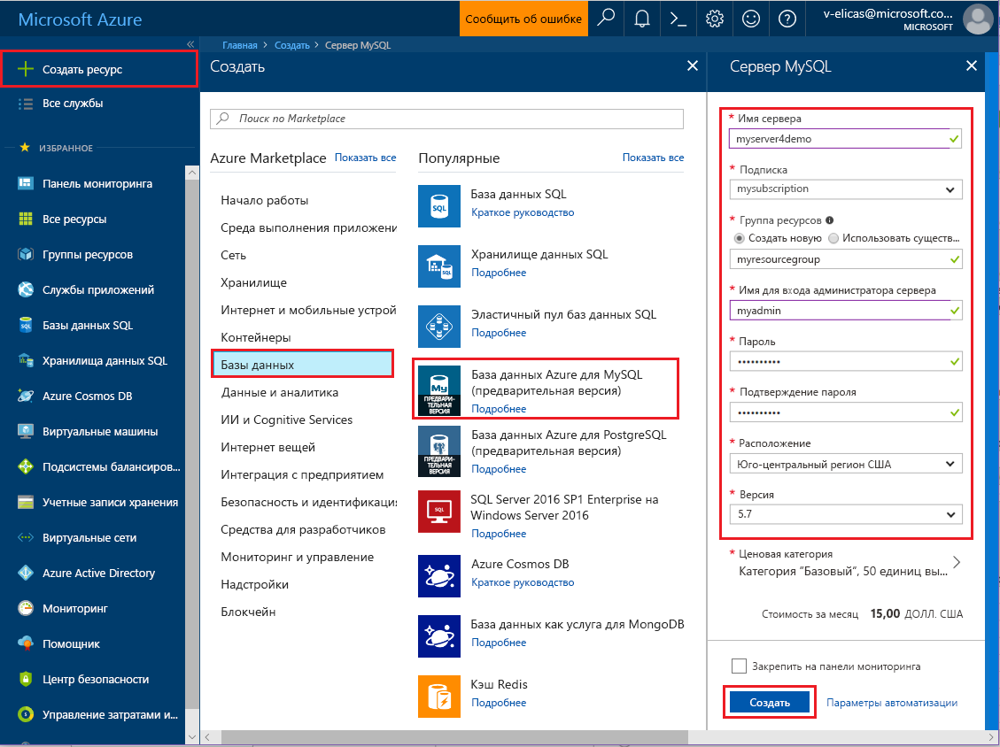
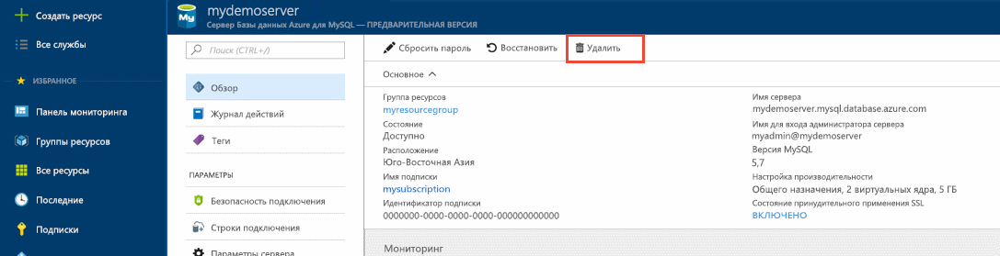

# <a name="create-an-azure-database-for-mysql-server-using-azure-portal"></a>Создание базы данных Azure для сервера MySQL с помощью портала Azure
Эта статья содержит инструкции по быстрому созданию базы данных Azure для сервера MySQL с помощью портала Azure. 

Если у вас еще нет подписки Azure, создайте [бесплатную](https://azure.microsoft.com/free/) учетную запись Azure, прежде чем начинать работу.

## <a name="log-in-to-azure"></a>Вход в Azure
Откройте свой веб-браузер и перейдите на [портал Microsoft Azure](https://portal.azure.com/). Введите свои учетные данные для входа на портал. Панель мониторинга службы является представлением по умолчанию.

## <a name="create-azure-database-for-mysql-server"></a>Создание базы данных Azure для сервера MySQL
1. Щелкните **Создать** в левом верхнем углу портала Azure.

2. Выберите **Базы данных** на странице **Создание** и щелкните **База данных Azure для MySQL** на странице **Базы данных**. Чтобы найти службу на странице создания, можно также ввести в поле поиска **MySQL**.


3. Заполните форму сведений о новом сервере, указав следующую информацию, как показано на предыдущем рисунке.

| **Параметр** | **Рекомендуемое значение** | **Описание поля** |
|---|---|---|
| *Server name* (Имя сервера) | myserver4demo  | Имя сервера должно быть глобально уникальным. |
| *Подписка* | mysubscription | Выберите подписку в раскрывающемся списке. |
| *Группа ресурсов* | myresourcegroup | Создайте новую группу ресурсов или выберите существующую. |
| *Имя для входа администратора сервера* | myadmin | Укажите имя учетной записи администратора СУБД MySQL. |
| *Пароль* |  | Укажите надежный пароль для учетной записи администратора. |
| *Подтверждение пароля.* |  | Подтвердите пароль учетной записи администратора. |
| *Расположение* |  | Выберите доступный регион. |
| *Версия* | 5.7 | Выберите последнюю версию. |
| *Ценовая категория* | Базовый, 50 единиц вычислений, хранилище на 50 ГБ  | Укажите значения для параметров **Ценовая категория**, **Единицы вычислений**, **Хранилище (ГБ)** и нажмите кнопку **ОК**. |
| *Закрепить на панели мониторинга* | Проверка | Рекомендуем установить этот флажок, чтобы ускорить поиск сервера позже |

   Щелкните **Ценовая категория**, чтобы указать ценовую категорию и уровень производительности для новой базы данных. В рамках этого руководства выберите базовый уровень, 50 единиц вычислений и хранилище объемом 50 ГБ. Затем нажмите кнопку **ОК**, чтобы сохранить ценовую категорию.
   
   

   Затем щелкните **Создать**. Через несколько минут в облаке будет создан сервер базы данных Azure для MySQL. На панели инструментов щелкните **Уведомления** (значок колокольчика), чтобы отслеживать процесс развертывания.

## <a name="configure-the-firewall"></a>Настройка брандмауэра
Перед первым подключением к базе данных Azure для MySQL настройте брандмауэр и добавьте IP-адреса общедоступной сети клиента (или диапазон) в список разрешений.

1. По завершении развертывания щелкните **Все ресурсы** в меню слева и введите имя **myserver4demo**, чтобы найти созданный сервер. Щелкните имя сервера в результатах поиска. Откроется страница обзора сервера с параметрами для настройки.

2. В колонке сервера выберите **Безопасность подключения**.

3. Щелкните **Добавить мой IP-адрес**, чтобы добавить IP-адрес локального компьютера или настроить диапазон IP-адресов. Не забудьте щелкнуть **Сохранить** после создания правил.
  

## <a name="get-connection-information"></a>Получение сведений о подключении
Получите полное доменное имя сервера Azure MySQL на портале Azure. Оно используется для подключения к серверу с помощью программы командной строки **mysql.exe**.

1.  На [портале Azure](https://portal.azure.com/) в меню слева щелкните **Все ресурсы** и выберите свой сервер базы данных Azure для MySQL.

2.  Щелкните **Свойства**. Запишите значения параметров **Имя сервера** и **Имя для входа администратора сервера**.
В этом примере серверу присвоено имя *myserver4demo.mysql.database.azure.com*, а имя для входа администратора сервера имеет значение *myadmin@myserver4demo*.

## <a name="connect-to-the-server-using-mysqlexe-command-line-tool"></a>Подключение к серверу с помощью программы командной строки mysqlexe
Используйте [программу командной строки MySQL](https://dev.mysql.com/doc/refman/5.7/en/mysql.html), чтобы подключиться к серверу базы данных Azure для MySQL. Можно запустить программу командной строки MySQL в браузере с помощью Azure Cloud Shell или на компьютере, используя локальные средства MySQL. Для запуска Azure Cloud Shell нажмите кнопку `Try It` в блоке кода в этой статье или перейдите на [портал Azure](https://portal.azure.com) и щелкните значок `>_` на панели инструментов справа вверху. 

1. Введите команду для подключения:
```azurecli-interactive
mysql -h myserver4demo.mysql.database.azure.com -u myadmin@myserver4demo -p
```

2. Просмотрите данные состояния сервера, чтобы проверить, установлено ли подключение. После подключения введите в строке mysql> команду `status`.
```sql
status
```

   

   > [!TIP]
   > Дополнительные команды см. в [разделе 4.5.1 справочного руководства по MySQL 5.7](https://dev.mysql.com/doc/refman/5.7/en/mysql.html).

3. Создайте пустую базу данных. Для этого введите в строке mysql> команду `CREATE DATABASE`.

   ```sql
   CREATE DATABASE quickstartdb;
   ```

   В базу данных Azure для сервера MySQL можно включить одну или несколько баз данных. Можно создать по одной базе данных на каждом сервере, чтобы использовать все ресурсы, или несколько баз данных, чтобы предоставить общий доступ к ресурсам. Количество создаваемых баз данных не ограничено, однако все они совместно используют одни и те же ресурсы сервера.  

4. Введите в строке mysql> команду `SHOW DATABASES`, чтобы отобразить список баз данных.

   ```sql
   SHOW DATABASES;
   ```

## <a name="connect-to-the-server-using-the-mysql-workbench-gui-tool"></a>Подключение к серверу с помощью инструмента графического пользовательского интерфейса MySQL Workbench
1.  Запустите приложение MySQL Workbench на клиентском компьютере. Скачать и установить MySQL Workbench вы можете [здесь](https://dev.mysql.com/downloads/workbench/).

2.  В диалоговом окне **настройки нового подключения** на вкладке **Параметры** введите следующие сведения:

   

| **Параметр** | **Рекомендуемое значение** | **Описание поля** |
|---|---|---|
|   *Имя подключения* | Пример подключения| Укажите метку для этого подключения. |
| *Способ подключения* | Стандартный способ (по протоколу TCP/IP) | Стандартный способ (по протоколу TCP/IP) соответствует требованиям. |
| *Имя узла* | myserver4demo.mysql.database.azure.com | Используйте полное имя сервера. |
| *Порт* | 3306 | Используйте порт по умолчанию — 3306. |
| *Имя пользователя* | myadmin@myserver4demo  | Используйте для входа имя администратора сервера, сохраненное ранее с символом @ и именем сервера. |
| *Пароль* | Ваш пароль. | Нажмите кнопку "Store in Vault..." (Сохранить в хранилище), чтобы сохранить пароль. |

Щелкните **Проверить подключение**, чтобы проверить, все ли параметры верно настроены. Нажмите кнопку "ОК", чтобы сохранить подключение. 

> [!NOTE]
> На сервере по умолчанию применяется протокол SSL. Для успешного подключения его нужно дополнительно настроить. Ознакомьтесь со статьей [Configure SSL connectivity in your application to securely connect to Azure Database for MySQL](./howto-configure-ssl.md) (Настройка SSL-соединений в приложении для безопасного подключения к базе данных Azure для MySQL).  Чтобы не задействовать протокол SSL в рамках этого краткого руководства, на портале Azure перейдите на страницу "Безопасность подключения" и отключите параметр "Принудительно использовать SSL-соединение".

## <a name="clean-up-resources"></a>Очистка ресурсов
Очистите все ресурсы, созданные при работе с кратким руководством, удалив [группу ресурсов Azure](../azure-resource-manager/resource-group-overview.md).

> [!TIP]
> Другие краткие руководства в этой коллекции созданы на основе этого документа. Если вы планируете продолжать работу с этими краткими руководствами, не удаляйте созданные ресурсы. Если вы не планируете продолжать работу, удалите все созданные ресурсы, выполнив на портале Azure следующие действия.

1.  В меню слева на портале Azure щелкните **Группы ресурсов**, а затем выберите **myresourcegroup**.
2.  На странице группы ресурсов щелкните **Удалить**, в текстовом поле введите **myresourcegroup** и щелкните "Удалить".

Чтобы удалить созданный сервер, выполните инструкции ниже.
1.  В меню слева на портале Azure щелкните серверы PostgreSQL и выполните поиск созданного сервера.
2.  В верхней части страницы обзора нажмите кнопку удаления: .
3.  Подтвердите имя сервера, которое вы хотите удалить, чтобы появилась нужная база данных. В текстовое поле введите **myserver4demo** и щелкните "Удалить".


## <a name="next-steps"></a>Дальнейшие действия

> [!div class="nextstepaction"]
> [Проектирование первой базы данных Azure для MySQL](./tutorial-design-database-using-portal.md)


