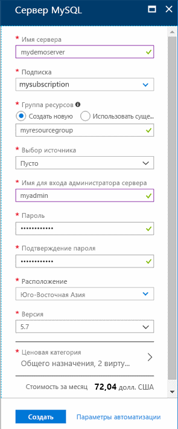
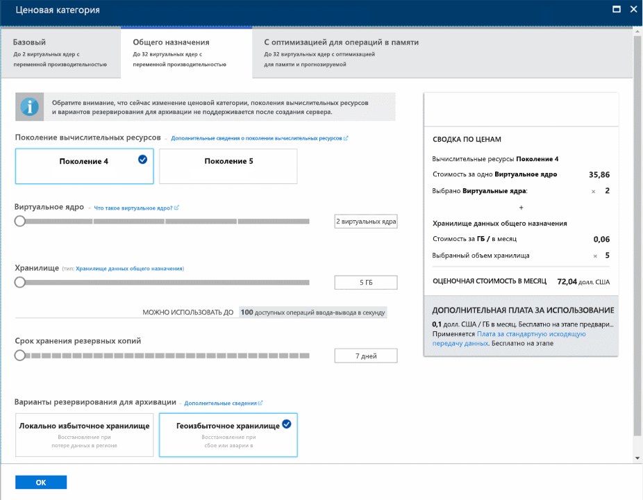
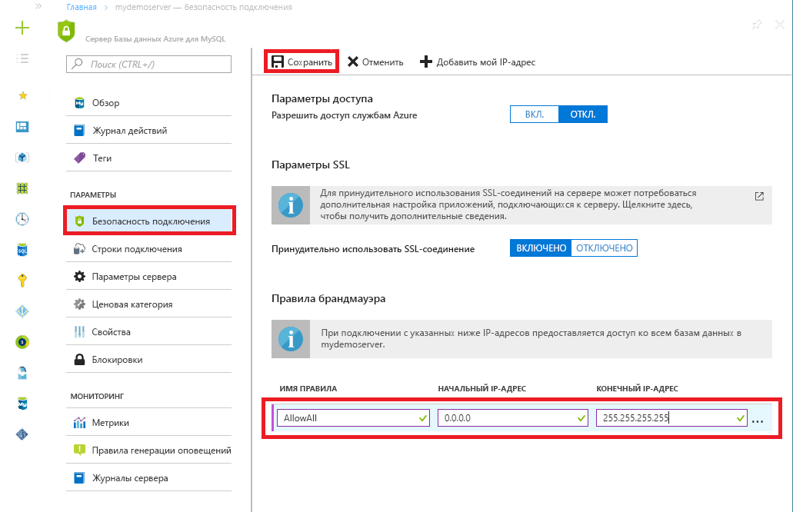

# <a name="tutorial-design-an-azure-database-for-mysql-database-using-the-azure-portal"></a>Руководство по проектированию базы данных в службе "База данных Azure для MySQL" с помощью портала Azure
База данных Azure для MySQL — это управляемая служба, которая позволяет вам запускать, администрировать и масштабировать высокодоступные базы данных MySQL в облаке. С помощью портала Azure можно легко управлять сервером и проектировать базы данных.

Из этого руководства вы узнаете, как с помощью портала Azure выполнять следующие операции:

> [!div class="checklist"]
> * создание базы данных Azure для MySQL;
> * настройка брандмауэра сервера;
> * использование программы командной строки MySQL для создания базы данных;
> * Загрузка примера данных
> * Запрос данных
> * Обновление данных
> * восстановление данных.

## <a name="sign-in-to-the-azure-portal"></a>Выполните вход на портал Azure.
Откройте предпочитаемый веб-браузер и перейдите на [портал Microsoft Azure](https://portal.azure.com/). Введите свои учетные данные для входа на портал. Панель мониторинга службы является представлением по умолчанию.

## <a name="create-an-azure-database-for-mysql-server"></a>Создайте сервер базы данных Azure для MySQL.
Сервер базы данных Azure для MySQL создается с определенным набором [вычислительных ресурсов и ресурсов хранения](./concepts-compute-unit-and-storage.md). Он создается в [группе ресурсов Azure](https://docs.microsoft.com/azure/azure-resource-manager/resource-group-overview).

1. Выберите **Базы данных** > **База данных Azure для MySQL**. Если сервер MySQL не отображается в категории **Базы данных**, щелкните **Показать все**, чтобы просмотреть все доступные службы баз данных. Для быстрого поиска службы вы можете также ввести в поле поиска **База данных Azure для MySQL**.
   
   

2. Щелкните элемент **База данных Azure для MySQL**, а затем нажмите кнопку **Создать**. Заполните Базу данных Azure для формы MySQL.
   
   

    **Параметр** | **Рекомендуемое значение** | **Описание поля** 
    ---|---|---
    имя сервера; | Уникальное имя сервера | Выберите уникальное имя, идентифицирующее базу данных Azure для сервера MySQL. Например, mydemoserver. Имя домена *.mysql.database.azure.com* добавляется к указанному имени сервера. Имя сервера может содержать только строчные буквы, цифры и знак дефиса (-). Его длина должна составлять от 3 до 63 символов.
    Подписка | Ваша подписка | Выберите подписку Azure, которую вы хотите использовать для сервера. Если у вас есть несколько подписок, выберите ту, в которой взимается плата за использование ресурса.
    Группа ресурсов | *myresourcegroup* | Укажите имя новой или имеющейся группы ресурсов.    Группа ресурсов|*myresourcegroup*| Новое имя группы ресурсов или уже имеющееся из подписки.
    Выбор источника | *Пустой* | Чтобы создать сервер с нуля, выберите *Пустой*. (Выберите *Резервное копирование* при создании сервера из геоизбыточного хранилища резервных копий существующего сервера Базы данных Azure для MySQL.)
    учетные данные администратора сервера для входа; | myadmin | Учетная запись для входа, используемая при подключении к серверу. Не используйте для имени учетной записи администратора такие варианты: **azure_superuser**, **admin**, **administrator**, **root**, **guest** или **public**.
    Пароль | *По своему выбору* | Укажите пароль учетной записи администратора сервера. Его длина должна составлять от 8 до 128 символов. Пароль должен содержать символы из трех следующих категорий: прописные латинские буквы, строчные латинские буквы, цифры (0–9) и другие символы (!, $, #, % и т. д.).
    Подтверждение пароля. | *По своему выбору*| Подтвердите пароль учетной записи администратора.
    Расположение | *Ближайший к пользователям регион*| Выберите расположение, наиболее близкое к пользователям или другим приложениям Azure.
    Version (версия) | *Последняя версия*| Последняя версия (если нет особых требований использовать другую версию).
    Ценовой уровень | **Общего назначения**, **Поколение 4**, **2 виртуальных ядра**, **5 ГБ**, **7 дней**, **Геоизбыточное хранилище** | Конфигурации вычислительных ресурсов, хранилища и резервного копирования для нового сервера. Выберите **ценовую категорию**. Затем выберите вкладку **Общего назначения**. *Поколение 4*, *2 виртуальных ядра*, *5 ГБ*, и *7 дней* — это значения по умолчанию для параметров **Поколение вычислительных ресурсов**, **Виртуальное ядро**, **Хранилище** и **Срок хранения резервных копий**. Можно оставить эти ползунки как есть. Чтобы включить резервные копии сервера в географически избыточном хранилище, выберите **Геоизбыточное хранилище** в **параметрах избыточности резервного копирования**. Щелкните **ОК**, чтобы сохранить ценовую категорию. На следующем снимке экрана показаны выбранные параметры.
    
   

3. Нажмите кнопку **Создать**. Через несколько минут в облаке будет создан сервер базы данных Azure для MySQL. На панели инструментов выберите **Уведомления**, чтобы отслеживать процесс развертывания.

## <a name="configure-firewall"></a>Настройка брандмауэра
Базы данных Azure для MySQL защищены брандмауэром. По умолчанию все подключения к серверу и базам данных на сервере отклоняются. Перед первым подключением к базе данных Azure для MySQL настройте брандмауэр, чтобы добавить IP-адрес общедоступной сети клиентского компьютера (или диапазон IP-адресов).

1. Щелкните созданный сервер и выберите **Безопасность подключения**.
   
   
2. Здесь вы можете **добавить свой IP-адрес** или настроить правила брандмауэра. Не забудьте щелкнуть **Сохранить** после создания правил.
Теперь вы можете подключиться к серверу с помощью программы командной строки MySQL или с помощью инструмента с графическим пользовательским интерфейсом MySQL Workbench.

> [!TIP]
> Сервер базы данных Azure для MySQL обменивается данными через порт 3306. Если вы пытаетесь подключиться из корпоративной сети, исходящий трафик через порт 3306 может быть запрещен сетевым брандмауэром. В таком случае вы не сможете подключиться к серверу MySQL Azure, пока ваш отдел ИТ не откроет порт 3306.

## <a name="get-connection-information"></a>Получение сведений о подключении
Полное **имя сервера** и **имя для входа администратора сервера** для базы данных Azure для сервера MySQL можно получить на портале Azure. Полное имя сервера используется для подключения к серверу с помощью программы командной строки MySQL. 

1. На [портале Azure](https://portal.azure.com/) в меню слева щелкните **Все ресурсы**, введите имя и найдите свой сервер базы данных Azure для MySQL. Выберите имя сервера, чтобы просмотреть сведения о нем.

2. На странице **Обзор** запишите **имя сервера** и **имя для входа администратора сервера**. Вы можете нажать кнопку "Копировать" рядом с каждым полем, чтобы скопировать его значение в буфер обмена.
   

В этом примере серверу присвоено имя *mydemoserver.mysql.database.azure.com*, а имя для входа администратора сервера имеет значение *myadmin@mydemoserver*.

## <a name="connect-to-the-server-using-mysql"></a>Подключение к серверу с помощью MySQL
Используйте [программу командной строки MySQL](https://dev.mysql.com/doc/refman/5.7/en/mysql.html), чтобы подключиться к серверу базы данных Azure для MySQL. Можно запустить программу командной строки MySQL из Azure Cloud Shell в браузере или на собственном компьютере, используя локальные инструменты MySQL. Для запуска Azure Cloud Shell нажмите кнопку `Try It` в блоке кода в этой статье или перейдите на портал Azure и щелкните значок `>_` на панели инструментов справа вверху. 

Введите команду для подключения:
```azurecli-interactive
mysql -h mydemoserver.mysql.database.azure.com -u myadmin@mydemoserver -p
```

## <a name="create-a-blank-database"></a>Создание пустой базы данных
Подключившись к серверу, создайте пустую базу данных для работы.
```sql
CREATE DATABASE mysampledb;
```

Выполните следующую команду в командной строке, чтобы подключиться к созданной базе данных:
```sql
USE mysampledb;
```

## <a name="create-tables-in-the-database"></a>Создание таблиц в базе данных
Теперь, когда вы знаете, как подключиться к базе данных Azure для MySQL, можно выполнить некоторые основные задачи.

Сначала создайте таблицу и заполните ее некоторыми данными. Давайте создадим таблицу, в которой хранятся данные инвентаризации.
```sql
CREATE TABLE inventory (
    id serial PRIMARY KEY, 
    name VARCHAR(50), 
    quantity INTEGER
);
```

## <a name="load-data-into-the-tables"></a>Загрузка данных в таблицу
Теперь, когда таблица создана, мы можем вставить в нее данные. Чтобы вставить некоторые строки данных, в открытом окне командной строки выполните следующий запрос:
```sql
INSERT INTO inventory (id, name, quantity) VALUES (1, 'banana', 150); 
INSERT INTO inventory (id, name, quantity) VALUES (2, 'orange', 154);
```

Итак, в созданной ранее таблице содержится две строки данных.

## <a name="query-and-update-the-data-in-the-tables"></a>Запрос и обновление данных в таблицах
Чтобы извлечь сведения из таблицы базы данных, выполните приведенный ниже запрос.
```sql
SELECT * FROM inventory;
```

Вы можете также обновить данные в таблицах, выполнив следующую команду:
```sql
UPDATE inventory SET quantity = 200 WHERE name = 'banana';
```

При извлечении данных строка будет обновляться соответствующим образом.
```sql
SELECT * FROM inventory;
```

## <a name="restore-a-database-to-a-previous-point-in-time"></a>Восстановление базы данных до предыдущей точки во времени
Предположим, вы случайно удалили важную таблицу из базы данных и вам не удается легко восстановить данные. База данных Azure для MySQL позволяет восстановить сервер до точки во времени, создав копии баз данных на новом сервере. Вы можете восстановить удаленные данные с помощью нового сервера. Указанные ниже шаги позволяют восстановить сервер до точки во времени, когда была создана таблица.

1. На портале Azure найдите базу данных Azure для MySQL. На странице **Обзор** на панели инструментов щелкните **Восстановить**. Откроется страница "Восстановление".

   

2. Заполните форму **Восстановление**, указав следующие сведения.
   
   
   
   - **Точка восстановления**. Выберите точку во времени, до которой требуется восстановить данные, в пределах указанного периода времени. Обязательно преобразуйте свое местное время в формат UTC.
   - **Восстановить на новом сервере**. Укажите имя нового сервера, на который нужно восстановить данные.
   - **Расположение**. Регион совпадает с исходным сервером и не может быть изменен.
   - **Ценовая категория**. Ценовая категория совпадает с исходным сервером и не может быть изменена.
   
3. Чтобы [восстановить сервер до точки во времени](./howto-restore-server-portal.md) перед удалением таблицы, нажмите кнопку **OК**. Восстановление сервера приведет к созданию новой копии сервера на заданный момент времени. 

## <a name="next-steps"></a>Дополнительная информация
Из этого руководства вы узнали, как с помощью портала Azure выполнять следующие операции:

> [!div class="checklist"]
> * создание базы данных Azure для MySQL;
> * настройка брандмауэра сервера;
> * использование программы командной строки MySQL для создания базы данных;
> * Загрузка примера данных
> * Запрос данных
> * Обновление данных
> * восстановление данных.

> [!div class="nextstepaction"]
> [Как подключить приложения к базе данных Azure для MySQL](./howto-connection-string.md)
