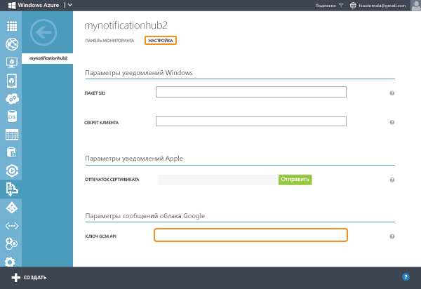

<properties
	pageTitle="Приступая к работе с Центрами уведомлений Azure для приложений Android | Microsoft Azure"
	description="Из этого учебника вы узнаете, как использовать Центры уведомлений Azure для отправки push-уведомлений на устройства Android."
	services="notification-hubs"
	documentationCenter="android"
	authors="wesmc7777"
	manager="dwrede"
	editor=""/>
<tags
	ms.service="notification-hubs"
	ms.workload="mobile"
	ms.tgt_pltfrm="mobile-android"
	ms.devlang="java"
	ms.topic="hero-article"
	ms.date="10/21/2015"
	ms.author="wesmc"/>

# Приступая к работе с Центрами уведомлений для приложений Android

[AZURE.INCLUDE [notification-hubs-selector-get-started](../../includes/notification-hubs-selector-get-started.md)]

##Обзор

В этом учебнике показано, как использовать Центры уведомлений Azure для отправки push-уведомлений в приложение на платформе Android. Вы создадите пустое приложение Android, которое получает push-уведомления с помощью Google Cloud Messaging (GCM). По завершении вы сможете рассылать push-уведомления на все устройства, где запущено ваше приложение, с помощью центра уведомлений.

В этом учебнике описывается простой сценарий вещания с использованием Центров уведомлений. Рекомендуем вам изучить следующий учебник, чтобы узнать об использовании Центров уведомлений для охвата определенных пользователей и групп устройств.

## Перед началом работы

[AZURE.INCLUDE [notification-hubs-hero-slug](../../includes/notification-hubs-hero-slug.md)]

Полный код для этого учебника можно найти на портале [GitHub](https://github.com/Azure/azure-notificationhubs-samples/tree/master/Android/GetStarted).

##Предварительные требования

Для работы с данным учебником требуется следующее:

+ ПО Android Studio, которое можно загрузить с <a href="http://go.microsoft.com/fwlink/?LinkId=389797">сайта Android</a>.
+ Активная учетная запись Azure. Если ее нет, можно создать бесплатную пробную учетную запись всего за несколько минут. Дополнительные сведения см. в разделе [Бесплатная пробная версия Azure](http://azure.microsoft.com/pricing/free-trial/?WT.mc_id=A0E0E5C02&amp;returnurl=http%3A%2F%2Fazure.microsoft.com%2Fru-RU%2Fdocumentation%2Farticles%2Fnotification-hubs-android-get-started%2F).

Завершение изучения этого учебника является необходимым условием для работы со всеми другими учебниками, посвященными Центрам уведомлений для приложений Android.

##Создание проекта с поддержкой Google Cloud Messaging

[AZURE.INCLUDE [mobile-services-enable-Google-cloud-messaging](../../includes/mobile-services-enable-google-cloud-messaging.md)]

##Настройка нового центра уведомлений

[AZURE.INCLUDE [notification-hubs-portal-create-new-hub](../../includes/notification-hubs-portal-create-new-hub.md)]

<ol start="7">
<li>
Перейдите на расположенную сверху вкладку <b>Настройка</b>, введите значение <b>Ключ API</b>, полученное в предыдущем разделе, а затем нажмите кнопку <b>Сохранить</b>.

</li>
</ol>
&emsp;&emsp;

Концентратор уведомлений теперь настроен для работы с GCM. Также у вас есть строки подключения, с помощью которых вы можете зарегистрировать приложение для получения уведомлений и отправки push-уведомлений.

##Подключение приложения к центру уведомлений

###Создание нового проекта Android

1. В Android Studio создайте новый проект Android Studio.

   	![][13]

2. Выберите форм-фактор **Phone and Tablet** (Телефон и планшет) и минимальную версию пакета SDK (с помощью параметра **Minimum SDK**), которые нужно поддерживать. Нажмите кнопку **Далее**.

   	![][14]

3. Выберите значение **Blank Activity** (Пустое действие) для основного действия, нажмите кнопку **Next** (Далее), а затем нажмите кнопку **Finish** (Готово).

###Добавление служб Google Play в проект

[AZURE.INCLUDE [Добавление служб Play](../../includes/notification-hubs-android-studio-add-google-play-services.md)]

###Добавление кода

1. Загрузите <a href="https://go.microsoft.com/fwLink/?LinkID=280126&clcid=0x409">пакет SDK Android для Центров уведомлений</a>. Извлеките содержимое ZIP-файла и скопируйте файлы **notificationhubs\\notification-hubs-0.3.jar** и **notifications\\notifications-1.0.1.jar** в каталог **app\\libs** проекта. Это можно сделать, перетащив файлы в папку **libs** в окне представления проекта Android Studio. Обновите папку **libs**.

    > [AZURE.NOTE]Числа в конце этого имени файла могут меняться в последующих выпусках SDK.

2. Настройте приложение для получения registrationId из GCM и используйте его, чтобы зарегистрировать экземпляр приложения в центре уведомлений.

	Добавьте следующие разрешения в файл AndroidManifest.xml прямо под тегом `</application>`. Обязательно замените `<your package>` именем пакета, отображенным в верхней части файла AndroidManifest.xml (в этом примере — `com.example.testnotificationhubs`).

		<uses-permission android:name="android.permission.INTERNET"/>
		<uses-permission android:name="android.permission.GET_ACCOUNTS"/>
		<uses-permission android:name="android.permission.WAKE_LOCK"/>
		<uses-permission android:name="com.google.android.c2dm.permission.RECEIVE" />

		<permission android:name="<your package>.permission.C2D_MESSAGE" android:protectionLevel="signature" />
		<uses-permission android:name="<your package>.permission.C2D_MESSAGE"/>

3. В класс **MainActivity** над объявлением класса добавьте следующие операторы `import`:

		import android.app.AlertDialog;
		import android.content.DialogInterface;
		import android.os.AsyncTask;
		import com.google.android.gms.gcm.*;
		import com.microsoft.windowsazure.messaging.*;
		import com.microsoft.windowsazure.notifications.NotificationsManager;

4. В верхней части класса добавьте следующие частные члены.

		private String SENDER_ID = "<your project number>";
		private GoogleCloudMessaging gcm;
		private NotificationHub hub;
    	private String HubName = "<Enter Your Hub Name>";
		private String HubListenConnectionString = "<Your default listen connection string>";
	    private static Boolean isVisible = false;

	Обязательно измените три заполнителя:
	* **SENDER\_ID**: задайте для `SENDER_ID` номер проекта, полученный ранее из проекта, созданного в [Google Cloud Console](http://cloud.google.com/console).
	* **HubListenConnectionString**: задайте для `HubListenConnectionString` строку подключения **DefaultListenAccessSignature** к центру. Можно скопировать эту строку подключения, щелкнув **Просмотреть строку подключения** на вкладке **Панель мониторинга** центра на [портале Azure].
	* **HubName**: имя центра уведомлений, которое отображается в верхней части страницы в Azure для вашего центра (**не** полный URL-адрес). Например, используйте `"myhub"`.

5. В метод **OnCreate** класса **MainActivity** добавьте следующий код для выполнения регистрации в центре уведомлений в момент создания действия.

        MyHandler.mainActivity = this;
        NotificationsManager.handleNotifications(this, SENDER_ID, MyHandler.class);
        gcm = GoogleCloudMessaging.getInstance(this);
        hub = new NotificationHub(HubName, HubListenConnectionString, this);
        registerWithNotificationHubs();

6. В **MainActivity.java** добавьте приведенный ниже код для метода **registerWithNotificationHubs()**. Этот метод сообщает об успешном выполнении после регистрации в Google Cloud Messaging и центре уведомлений.

    	@SuppressWarnings("unchecked")
    	private void registerWithNotificationHubs() {
        	new AsyncTask() {
            	@Override
            	protected Object doInBackground(Object... params) {
                	try {
                    	String regid = gcm.register(SENDER_ID);
                    DialogNotify("Registered Successfully","RegId : " +
						hub.register(regid).getRegistrationId());
                	} catch (Exception e) {
                    	DialogNotify("Exception",e.getMessage());
                    	return e;
                	}
                	return null;
            	}
        	}.execute(null, null, null);
    	}

7. Добавьте в действие метод **DialogNotify** для отображения уведомления, когда приложение запущено и отображается. Кроме того, переопределите параметры **onStart** и **onStop**. Это позволит определить, будет ли действие видимым для отображения диалогового окна.

	    @Override
	    protected void onStart() {
	        super.onStart();
	        isVisible = true;
	    }
	
	    @Override
	    protected void onStop() {
	        super.onStop();
	        isVisible = false;
	    }

		/**
		  * A modal AlertDialog for displaying a message on the UI thread
		  * when there's an exception or message to report.
		  *
		  * @param title   Title for the AlertDialog box.
		  * @param message The message displayed for the AlertDialog box.
		  */
    	public void DialogNotify(final String title,final String message)
    	{
	        if (isVisible == false)
	            return;

        	final AlertDialog.Builder dlg;
        	dlg = new AlertDialog.Builder(this);

        	runOnUiThread(new Runnable() {
            	@Override
            	public void run() {
                	AlertDialog dlgAlert = dlg.create();
                	dlgAlert.setTitle(title);
                	dlgAlert.setButton(DialogInterface.BUTTON_POSITIVE,
						(CharSequence) "OK",
						new DialogInterface.OnClickListener() {
                            public void onClick(DialogInterface dialog, int which) {
                                dialog.dismiss();
                            }
                        });
                	dlgAlert.setMessage(message);
                	dlgAlert.setCancelable(false);
                	dlgAlert.show();
            	}
        	});
    	}

8. Поскольку Android не отображает уведомлений, необходимо написать собственный приемник. В файле **AndroidManifest.xml** добавьте следующий элемент в середину элемента `<application>`.

	> [AZURE.NOTE]Замените заполнитель на имя своего пакета.

        <receiver android:name="com.microsoft.windowsazure.notifications.NotificationsBroadcastReceiver"
            android:permission="com.google.android.c2dm.permission.SEND">
            <intent-filter>
                <action android:name="com.google.android.c2dm.intent.RECEIVE" />
                <category android:name="<your package name>" />
            </intent-filter>
        </receiver>

9. В представлении проекта разверните узел **app** > **src** > **main** > **java**. Щелкните правой кнопкой мыши папку пакета в **java**, щелкните **New** (Создать) и выберите **Java Class** (Класс Java).

	![][6]

10. В поле **Name** для нового класса введите **MyHandler** и нажмите кнопку **ОК**.

11. Добавьте следующие операторы import в начало файла **MyHandler.java**:

		import android.app.NotificationManager;
		import android.app.PendingIntent;
		import android.content.Context;
		import android.content.Intent;
		import android.os.Bundle;
		import android.support.v4.app.NotificationCompat;
		import com.microsoft.windowsazure.notifications.NotificationsHandler;

12. Обновите объявление класса следующим образом, чтобы сделать `MyHandler` подклассом `com.microsoft.windowsazure.notifications.NotificationsHandler`, как показано ниже.

		public class MyHandler extends NotificationsHandler {

13. Добавьте в класс `MyHandler` следующий код:

	Этот код переопределяет метод `OnReceive` так, чтобы обработчик показывал `AlertDialog` для отображения полученных уведомлений. Кроме того, обработчик отправляет уведомление в диспетчер уведомлений Android с помощью метода `sendNotification()`.

    	public static final int NOTIFICATION_ID = 1;
    	private NotificationManager mNotificationManager;
    	NotificationCompat.Builder builder;
    	Context ctx;

    	static public MainActivity mainActivity;

    	@Override
    	public void onReceive(Context context, Bundle bundle) {
        	ctx = context;
        	String nhMessage = bundle.getString("message");

        	sendNotification(nhMessage);
        	mainActivity.DialogNotify("Received Notification",nhMessage);
    	}

    	private void sendNotification(String msg) {
        	mNotificationManager = (NotificationManager)
                ctx.getSystemService(Context.NOTIFICATION_SERVICE);

        	PendingIntent contentIntent = PendingIntent.getActivity(ctx, 0,
                new Intent(ctx, MainActivity.class), 0);

			NotificationCompat.Builder mBuilder =
				new NotificationCompat.Builder(ctx)
					.setSmallIcon(R.mipmap.ic_launcher)
					.setContentTitle("Notification Hub Demo")
					.setStyle(new NotificationCompat.BigTextStyle()
					.bigText(msg))
					.setContentText(msg);

			mBuilder.setContentIntent(contentIntent);
			mNotificationManager.notify(NOTIFICATION_ID, mBuilder.build());
		}

14. В Android Studio в строке меню щелкните **Build** (Сборка) > **Rebuild Project** (Повторить сборку проекта), чтобы убедиться в отсутствии ошибок.

##Отправка уведомлений

Можно проверить получение уведомлений в приложении, отправив уведомления на портале Azure с помощью вкладки отладки центра уведомлений, как показано на следующем экране.

![][30]

[AZURE.INCLUDE [notification-hubs-sending-notifications-from-the-portal](../../includes/notification-hubs-sending-notifications-from-the-portal.md)]

## (Необязательно) Отправка уведомлений из приложения

1. В представлении проекта Android Studio разверните узел **App** > **src** > **main** > **res** > **layout**. Откройте файл макета **activity\_main.xml** и щелкните вкладку **Text** (Текст), чтобы обновить текстовое содержимое файла. Добавьте приведенный ниже код, который добавляет новые элементы управления `Button` и `EditText` для отправки уведомлений в центр уведомлений. Добавьте этот код в конец, непосредственно перед `</RelativeLayout>`.

	    <Button
        android:layout_width="wrap_content"
        android:layout_height="wrap_content"
        android:text="@string/send_button"
        android:id="@+id/sendbutton"
        android:layout_centerVertical="true"
        android:layout_centerHorizontal="true"
        android:onClick="sendNotificationButtonOnClick" />

	    <EditText
        android:layout_width="match_parent"
        android:layout_height="wrap_content"
        android:id="@+id/editTextNotificationMessage"
        android:layout_above="@+id/sendbutton"
        android:layout_centerHorizontal="true"
        android:layout_marginBottom="42dp"
        android:hint="@string/notification_message_hint" />

2. В представлении проекта Android Studio разверните узел **App** > **src** > **main** > **res** > **values**. Откройте файл **strings.xml** и добавьте строковые значения, на которые ссылаются новые элементы управления `Button` и `EditText`. Добавьте их в конец файла, непосредственно перед `</resources>`.

        <string name="send_button">Send Notification</string>
        <string name="notification_message_hint">Enter notification message text</string>

3. В файле **MainActivity.java** над объявлением класса `MainActivity` добавьте следующие операторы `import`:

		import java.net.URLEncoder;
		import javax.crypto.Mac;
		import javax.crypto.spec.SecretKeySpec;

		import android.util.Base64;
		import android.view.View;
		import android.widget.EditText;

		import org.apache.http.HttpResponse;
		import org.apache.http.client.HttpClient;
		import org.apache.http.client.methods.HttpPost;
		import org.apache.http.entity.StringEntity;
		import org.apache.http.impl.client.DefaultHttpClient;

3. В файле **MainActivity.java** в начало класса `MainActivity` добавьте следующие члены:

	Обновите `HubFullAccess` с использованием строки подключения к центру **DefaultFullSharedAccessSignature**. Эту строку подключения можно скопировать на [портале Azure], щелкнув **Просмотреть строку подключения** на вкладке **Панель мониторинга** для центра уведомлений.

	    private String HubEndpoint = null;
	    private String HubSasKeyName = null;
	    private String HubSasKeyValue = null;
		private String HubFullAccess = "<Enter Your DefaultFullSharedAccess Connection string>";

4. Действие содержит имя центра и строку подключения с полным общим доступом к центру. Необходимо создать токен подписи программного доступа (SaS) для аутентификации запроса POST для отправки сообщений в центр уведомлений. Это делается путем анализа данных ключа из строки подключения и создания токена SaS, как упоминалось в справочнике по [основным понятиям](http://msdn.microsoft.com/library/azure/dn495627.aspx) REST API.

	В **MainActivity.java** добавьте в класс `MainActivity` следующий метод для анализа строки подключения.

	    /**
    	 * Example code from http://msdn.microsoft.com/library/azure/dn495627.aspx
    	 * to parse the connection string so a SaS authentication token can be
    	 * constructed.
    	 *
    	 * @param connectionString This must be the DefaultFullSharedAccess connection
    	 *                         string for this example.
	     */
	    private void ParseConnectionString(String connectionString)
	    {
	        String[] parts = connectionString.split(";");
	        if (parts.length != 3)
	            throw new RuntimeException("Error parsing connection string: "
	                    + connectionString);

	        for (int i = 0; i < parts.length; i++) {
	            if (parts[i].startsWith("Endpoint")) {
	                this.HubEndpoint = "https" + parts[i].substring(11);
	            } else if (parts[i].startsWith("SharedAccessKeyName")) {
	                this.HubSasKeyName = parts[i].substring(20);
	            } else if (parts[i].startsWith("SharedAccessKey")) {
	                this.HubSasKeyValue = parts[i].substring(16);
	            }
	        }
	    }

5. В **MainActivity.java** добавьте в класс `MainActivity` следующий метод для создания токена аутентификации SaS.

        /**
         * Example code from http://msdn.microsoft.com/library/azure/dn495627.aspx to
         * construct a SaS token from the access key to authenticate a request.
         *
         * @param uri The unencoded resource URI string for this operation. The resource
         *            URI is the full URI of the Service Bus resource to which access is
         *            claimed. For example,
         *            "http://<namespace>.servicebus.windows.net/<hubName>"
         */
        private String generateSasToken(String uri) {

            String targetUri;
            try {
                targetUri = URLEncoder
                        .encode(uri.toString().toLowerCase(), "UTF-8")
                        .toLowerCase();

                long expiresOnDate = System.currentTimeMillis();
                int expiresInMins = 60; // 1 hour
                expiresOnDate += expiresInMins * 60 * 1000;
                long expires = expiresOnDate / 1000;
                String toSign = targetUri + "\n" + expires;

                // Get an hmac_sha1 key from the raw key bytes
                byte[] keyBytes = HubSasKeyValue.getBytes("UTF-8");
                SecretKeySpec signingKey = new SecretKeySpec(keyBytes, "HmacSHA256");

                // Get an hmac_sha1 Mac instance and initialize with the signing key
                Mac mac = Mac.getInstance("HmacSHA256");
                mac.init(signingKey);

                // Compute the hmac on input data bytes
                byte[] rawHmac = mac.doFinal(toSign.getBytes("UTF-8"));

            	// Using android.util.Base64 for Android Studio instead of
	            // Apache commons codec
                String signature = URLEncoder.encode(
                        Base64.encodeToString(rawHmac, Base64.NO_WRAP).toString(), "UTF-8");

                // Construct authorization string
                String token = "SharedAccessSignature sr=" + targetUri + "&sig="
                        + signature + "&se=" + expires + "&skn=" + HubSasKeyName;
                return token;
            } catch (Exception e) {
                DialogNotify("Exception Generating SaS",e.getMessage().toString());
            }

            return null;
        }

6. В **MainActivity.java** добавьте в класс `MainActivity` следующий метод для обработки нажатия кнопки **Send Notification** и отправки уведомления в центр с помощью REST API.

        /**
         * Send Notification button click handler. This method parses the
         * DefaultFullSharedAccess connection string and generates a SaS token. The
         * token is added to the Authorization header on the POST request to the
         * notification hub. The text in the editTextNotificationMessage control
         * is added as the JSON body for the request to add a GCM message to the hub.
         *
         * @param v
         */
        public void sendNotificationButtonOnClick(View v) {
            EditText notificationText = (EditText) findViewById(R.id.editTextNotificationMessage);
            final String json = "{"data":{"message":"" + notificationText.getText().toString() + ""}}";

            new Thread()
            {
                public void run()
                {
                    try
                    {
                        HttpClient client = new DefaultHttpClient();

                        // Based on reference documentation...
                        // http://msdn.microsoft.com/library/azure/dn223273.aspx
                        ParseConnectionString(HubFullAccess);
                        String url = HubEndpoint + HubName + "/messages/?api-version=2015-01";
                        HttpPost post = new HttpPost(url);

                        // Authenticate the POST request with the SaS token
                        post.setHeader("Authorization", generateSasToken(url));

                        // JSON content for GCM
                        post.setHeader("Content-Type", "application/json;charset=utf-8");

                        // Notification format should be GCM
                        post.setHeader("ServiceBusNotification-Format", "gcm");
                        post.setEntity(new StringEntity(json));

                        HttpResponse response = client.execute(post);
                    }
                    catch(Exception e)
                    {
                        DialogNotify("Exception",e.getMessage().toString());
                    }
                }
            }.start();
        }

##Тестирование приложения

####Тестирование в эмуляторе

Если требуется выполнить тестирование в эмуляторе, убедитесь, что образ эмулятора поддерживает уровень API Google, выбранный для приложения. Если образ не поддерживает интерфейс API Google, будет создано исключение **SERVICE\_NOT\_AVAILABLE**.

Кроме того, убедитесь, что вы добавили учетную запись Google в запущенный эмулятор, выбрав **Параметры** > **Учетные записи**. В противном случае попытки регистрации в GCM могут привести к порождению исключения **AUTHENTICATION\_FAILED**.

####Тестирование приложения

1. Запустите приложение и убедитесь, что для успешной регистрации сообщается идентификатор регистрации.

   	![][18]

2. Введите сообщение уведомления для отправки на все устройства Android, которые зарегистрированы в центре.

   	![][19]

3. Нажмите кнопку **Send Notification** (Отправить уведомление). На всех устройствах, на которых запущено приложение, будет показано `AlertDialog` с сообщением уведомления. На устройствах, на которых приложение не запущено, но которые были ранее зарегистрированы для получения уведомлений, полученное уведомление будет добавлено в диспетчер уведомлений. Уведомления можно просматривать, проводя пальцем вниз от левого верхнего угла.

   	![][21]

##Дальнейшие действия

В этом простом примере осуществляется рассылка уведомлений на все устройства Windows через портал или консольное приложение. В качестве следующего шага рекомендуем ознакомиться с учебником [Уведомление пользователей посредством Центров уведомлений]. В нем описана процедура отправки уведомлений с сервера ASP.NET определенным пользователям с использованием тегов.

Если необходимо разделить пользователей по группам интересов, см. раздел [Использование концентраторов уведомлений для передачи экстренных новостей].

Дополнительные сведения о Центрах уведомлений см. в статье [Общие сведения о Центрах уведомлений].

<!-- Images. -->
[6]: ./media/notification-hubs-android-get-started/notification-hub-android-new-class.png

[12]: ./media/notification-hubs-android-get-started/notification-hub-connection-strings.png

[13]: ./media/notification-hubs-android-get-started/notification-hubs-android-studio-new-project.png
[14]: ./media/notification-hubs-android-get-started/notification-hubs-android-studio-choose-form-factor.png
[15]: ./media/notification-hubs-android-get-started/notification-hub-create-android-app4.png
[16]: ./media/notification-hubs-android-get-started/notification-hub-create-android-app5.png
[17]: ./media/notification-hubs-android-get-started/notification-hub-create-android-app6.png

[18]: ./media/notification-hubs-android-get-started/notification-hubs-android-studio-registered.png
[19]: ./media/notification-hubs-android-get-started/notification-hubs-android-studio-set-message.png

[20]: ./media/notification-hubs-android-get-started/notification-hub-create-console-app.png
[21]: ./media/notification-hubs-android-get-started/notification-hubs-android-studio-received-message.png
[22]: ./media/notification-hubs-android-get-started/notification-hub-scheduler1.png
[23]: ./media/notification-hubs-android-get-started/notification-hub-scheduler2.png
[29]: ./media/mobile-services-android-get-started-push/mobile-eclipse-import-Play-library.png

[30]: ./media/notification-hubs-android-get-started/notification-hubs-debug-hub-gcm.png

[31]: ./media/notification-hubs-android-get-started/notification-hubs-android-studio-add-ui.png

<!-- URLs. -->
[Get started with push notifications in Mobile Services]: ../mobile-services-javascript-backend-android-get-started-push.md
[Mobile Services Android SDK]: https://go.microsoft.com/fwLink/?LinkID=280126&clcid=0x409
[Referencing a library project]: http://go.microsoft.com/fwlink/?LinkId=389800
[портале Azure]: https://manage.windowsazure.com/
[Общие сведения о Центрах уведомлений]: http://msdn.microsoft.com/library/jj927170.aspx
[Уведомление пользователей посредством Центров уведомлений]: notification-hubs-aspnet-backend-android-notify-users.md
[Использование концентраторов уведомлений для передачи экстренных новостей]: notification-hubs-aspnet-backend-android-breaking-news.md

<!---HONumber=Oct15_HO4-->