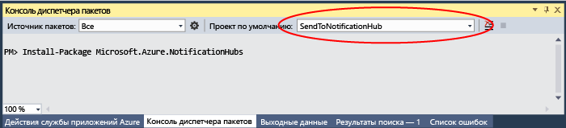

# <a name="get-started-with-notification-hubs-using-baidu"></a>Приступая к работе с Центрами уведомлений с помощью Baidu
[!INCLUDE [notification-hubs-selector-get-started](../../includes/notification-hubs-selector-get-started.md)]

Push-облако Baidu — это китайская облачная служба, которую можно использовать для отправки push-уведомлений на мобильные устройства. 

Так как Google Play и FCM (Firebase Cloud Messaging) в Китае недоступны, необходимо использовать различные магазины приложений и службы push-уведомлений. Baidu — одна из них. Именно она сейчас используется в центре уведомлений.

## <a name="prerequisites"></a>предварительным требованиям
Для работы с руководством требуется следующее:

* Пакет SDK для Android (предполагается, что вы используете Android Studio), который можно скачать с <a href="http://go.microsoft.com/fwlink/?LinkId=389797">сайта Android</a>.
* [Пакет Android SDK для Baidu Push]

> [!NOTE]
> Для работы с этим учебником необходима активная учетная запись Azure. Если ее нет, можно создать бесплатную пробную учетную запись всего за несколько минут. Дополнительные сведения см. в разделе [Бесплатная пробная версия Azure](https://azure.microsoft.com/pricing/free-trial/?WT.mc_id=A0E0E5C02&amp;returnurl=http%3A%2F%2Fazure.microsoft.com%2Fen-us%2Fdocumentation%2Farticles%2Fnotification-hubs-baidu-get-started%2F).
> 
> 

## <a name="create-a-baidu-account"></a>Создание учетной записи Baidu
Чтобы использовать Baidu, необходимо иметь учетную запись Baidu. Если она у вас уже есть, войдите на [портал Baidu] и перейдите к следующему шагу. В противном случае создайте учетную запись Baidu, следуя приведенным ниже инструкциям.  

1. Откройте [портал Baidu] и перейдите по ссылке **登录** (**Вход**). Щелкните **立即注册** (**Зарегистрироваться сейчас**), чтобы начать процесс регистрации учетной записи.
   
    

2. Введите требуемые сведения — номер телефона и/или адрес электронной почты, пароль и код подтверждения, — а затем нажмите кнопку 注册 (**Зарегистрироваться**).
   
    

3. На указанный вами адрес электронной почты будет отправлено сообщение со ссылкой для активации учетной записи Baidu.
   
    

4. Войдите в свой почтовый ящик, откройте это сообщение и перейдите по ссылке, чтобы активировать учетную запись Baidu.
   
    

После активации войдите на [портал Baidu]с помощью созданной учетной записи.

## <a name="create-a-baidu-cloud-push-project"></a>Создание облачного push-проекта Baidu
Во время создания push-проекта Baidu вы получите код приложения, ключ API и секретный ключ.

1. После входа на [портал Baidu] щелкните **更多>>** (**Дополнительно**).
   
    

2. Прокрутите вниз раздел **站长与开发者服务** (**Службы для веб-мастеров и разработчиков**) и щелкните **百度云推送** (**Служба push-уведомлений облака Baidu**).
   
    

3. На следующей странице щелкните **登录** (**Вход**) в правом верхнем углу.
   
    

4. Затем щелкните **创建应用** (**Создание приложения**) на этой странице.

    

5. На следующей странице щелкните 创建新应用 (**Создание нового приложения**).
   
    

6. Введите имя приложения и щелкните 创建 (**Создать**).
   
    

7. После успешного создания проекта службы push-уведомлений облака Baidu отобразится страница с **идентификатором приложения**, **ключом API** и **секретным ключом**. Запишите ключ API и секретный ключ, которые будут использоваться позже.
   
    

8. Настройте проект для отправки push-уведомлений, щелкнув 创建通知 (**Создать уведомление**) на панели слева.
   
    


## <a name="configure-a-new-notification-hub"></a>Настройка нового центра уведомлений
[!INCLUDE [notification-hubs-portal-create-new-hub](../../includes/notification-hubs-portal-create-new-hub.md)]


&emsp;&emsp;6. В центре уведомлений выберите **Службы уведомлений** и затем **Baidu (Android China)**.

&emsp;&emsp;

&emsp;&emsp;7. Прокрутите до раздела параметров уведомлений Baidu. Введите ключ API и секретный ключ, полученный из консоли Baidu, в проекте службы push-уведомлений облака Baidu. Нажмите кнопку "Сохранить".

&emsp;&emsp;

Теперь центр уведомлений настроен для работы с Baidu. Имеются также **строки подключения** для регистрации приложения на отправку и получение push-уведомлений.

Запишите `DefaultListenSharedAccessSignature` и `DefaultFullSharedAccessSignature` из окна сведений о подключении доступа.

## <a name="connect-your-app-to-the-notification-hub"></a>Подключение приложения к центру уведомлений
1. В Android Studio создайте проект Android (File > New > New Project) (Файл > Создать > Создать проект).

    

2.  Введите имя приложения и убедитесь, что для параметра Минимальная требуемая версия пакета SDK указано значение API 16: Android 4.1. **Кроме того, убедитесь, что имя вашего пакета (应用包名) совпадает с именем на портале службы push-уведомлений облака Baidu.**

    
    

3.  Нажмите кнопку "Далее" и следуйте указаниям мастера до появления окна "Создать действие". Выберите элемент Empty Activity (Пустое действие) и нажмите кнопку "Готово", чтобы создать приложение Android.

    

4.  Убедитесь, что значение параметра Project Build Target (Целевая сборка проекта) задано правильно.

5.  Затем добавьте библиотеки Центров уведомлений Azure. В файле `Build.Gradle` в классе app добавьте следующие строки в раздел dependencies.

    ```javascript
    compile 'com.microsoft.azure:notification-hubs-android-sdk:0.4@aar'
    compile 'com.microsoft.azure:azure-notifications-handler:1.0.1@aar'
    ```

    После раздела dependencies добавьте следующий репозиторий.

    ```javascript
    repositories {
        maven {
            url "http://dl.bintray.com/microsoftazuremobile/SDK"
        }
    }
    ```

    Во избежание конфликтов List, необходимо добавить в файл **Manifest.xml** следующий код.

    ```xml
    <manifest package="YOUR.PACKAGE.NAME"
    xmlns:tools="http://schemas.android.com/tools"
    xmlns:android="http://schemas.android.com/apk/res/android">
    ```

    Кроме того, его следует добавить в тег `<application/>`:

    ```xml
    <application
        tools:replace="android:allowBackup,icon,theme,label">
    ```

6.  Скачайте и распакуйте [Пакет Android SDK для Baidu Push]. Скопируйте файл `pushservice-x.y.z jar` в папке libs. Затем скопируйте файл `.so` в папках `src/main/jniLibs` (создайте папку) приложения Android.

    

7. Щелкните правой кнопкой мыши файл pushervice-x.y.z.jar в папке libs и выберите "Добавить как библиотеку", чтобы включить эту библиотеку в проект.

    

8. Откройте файл **AndroidManifest.xml** проекта Android и добавьте разрешения, требуемые пакетом SDK для Baidu. **Замените `YOURPACKAGENAME` именем своего пакета**.

    ```xml
    <uses-permission android:name="android.permission.INTERNET" />
    <uses-permission android:name="android.permission.READ_PHONE_STATE" />
    <uses-permission android:name="android.permission.ACCESS_NETWORK_STATE" />
    <uses-permission android:name="android.permission.RECEIVE_BOOT_COMPLETED" />
    <uses-permission android:name="android.permission.WRITE_SETTINGS" />
    <uses-permission android:name="android.permission.VIBRATE" />
    <uses-permission android:name="android.permission.WRITE_EXTERNAL_STORAGE" />
    <uses-permission android:name="android.permission.DISABLE_KEYGUARD" />
    <uses-permission android:name="android.permission.ACCESS_COARSE_LOCATION" />
    <uses-permission android:name="android.permission.ACCESS_WIFI_STATE" />
    <uses-permission android:name="android.permission.ACCESS_DOWNLOAD_MANAGER" />
    <uses-permission android:name="android.permission.DOWNLOAD_WITHOUT_NOTIFICATION" />
    <uses-permission android:name="android.permission.EXPAND_STATUS_BAR" />
    !! <uses-permission android:name="baidu.push.permission.WRITE_PUSHINFOPROVIDER.YOURPACKAGENAME" />
    !!<permission android:name="baidu.push.permission.WRITE_PUSHINFOPROVIDER.YOURPACKAGENAME"android:protectionLevel="normal" />

    ```

9. Добавьте следующую конфигурацию в элементе приложения после элемента действия `.MainActivity`, заменив *yourprojectname* собственным значением (например, `com.example.BaiduTest`):

    ```xml
    <activity
        android:name="com.baidu.android.pushservice.richmedia.MediaViewActivity"
        android:configChanges="orientation|keyboardHidden"
        android:label="MediaViewActivity" />
    <activity
        android:name="com.baidu.android.pushservice.richmedia.MediaListActivity"
        android:configChanges="orientation|keyboardHidden"
        android:label="MediaListActivity"
        android:launchMode="singleTask" />
 
    <!-- Push application definition message -->
    <receiver android:name=".MyPushMessageReceiver">
        <intent-filter>

            <!-- receive push message-->
            <action android:name="com.baidu.android.pushservice.action.MESSAGE" />
            <!-- receive bind,unbind,fetch,delete.. message-->
            <action android:name="com.baidu.android.pushservice.action.RECEIVE" />
            <action android:name="com.baidu.android.pushservice.action.notification.CLICK" />
        </intent-filter>
    </receiver>

    <receiver
        android:name="com.baidu.android.pushservice.PushServiceReceiver"
        android:process=":bdservice_v1">
        <intent-filter>
            <action android:name="android.intent.action.BOOT_COMPLETED" />
            <action android:name="android.net.conn.CONNECTIVITY_CHANGE" />
            <action android:name="com.baidu.android.pushservice.action.notification.SHOW" />
            <action android:name="com.baidu.android.pushservice.action.media.CLICK" />
            <action android:name="android.intent.action.MEDIA_MOUNTED" />
            <action android:name="android.intent.action.USER_PRESENT" />
            <action android:name="android.intent.action.ACTION_POWER_CONNECTED" />
            <action android:name="android.intent.action.ACTION_POWER_DISCONNECTED" />
        </intent-filter>
    </receiver>

    <receiver
        android:name="com.baidu.android.pushservice.RegistrationReceiver"
        android:process=":bdservice_v1">
        <intent-filter>
            <action android:name="com.baidu.android.pushservice.action.METHOD" />
            <action android:name="com.baidu.android.pushservice.action.BIND_SYNC" />
        </intent-filter>
        <intent-filter>
            <action android:name="android.intent.action.PACKAGE_REMOVED" />

            <data android:scheme="package" />
        </intent-filter>
    </receiver>

    <service
        android:name="com.baidu.android.pushservice.PushService"
        android:exported="true"
        android:process=":bdservice_v1">
        <intent-filter>
            <action android:name="com.baidu.android.pushservice.action.PUSH_SERVICE" />
        </intent-filter>
    </service>

    <service
        android:name="com.baidu.android.pushservice.CommandService"
        android:exported="true" />

    <!-- Adapt the ContentProvider declaration required for the Android N system, and the write permissions include the application package name-->
    <provider
        android:name="com.baidu.android.pushservice.PushInfoProvider"
        android:authorities="com.baidu.push.example.bdpush"
        android:exported="true"
        android:protectionLevel="signature"
        android:writePermission="baidu.push.permission.WRITE_PUSHINFOPROVIDER. yourprojectname  " />

    <!-- API Key of the Baidu application -->
    <meta-data
        android:name="api_key"
        !!   android:value="api_key" />
    </application>
    ```

10. Добавьте новый класс с именем `ConfigurationSettings.java` в проект.

    ```java
    public class ConfigurationSettings {
        public static String API_KEY = "...";
        public static String NotificationHubName = "...";
        public static String NotificationHubConnectionString = "...";
    }
    ```
    
    Установите для параметра `API_KEY` строки значение API_KEY из облачного проекта Baidu.
    
    Установите в качестве значения параметра строки `NotificationHubName` имя центра уведомлений с [портала Azure], а затем задайте для `NotificationHubConnectionString` значение `DefaultListenSharedAccessSignature` с [портала Azure].

11. Откройте класс MainActivity.java и добавьте следующий код в метод onCreate.

    ```java
    PushManager.startWork(this, PushConstants.LOGIN_TYPE_API_KEY,  API_KEY );
    ```

12. Добавьте новый класс `MyPushMessageReceiver.java` и добавьте в него следующий код. Это класс, который обрабатывает push-уведомления, полученные от push-сервера Baidu.

    ```java
    package your.package.name;

    import android.content.Context;
    import android.content.Intent;
    import android.os.AsyncTask;
    import android.text.TextUtils;
    import android.util.Log;

    import com.baidu.android.pushservice.PushMessageReceiver;
    import com.microsoft.windowsazure.messaging.NotificationHub;
    import org.json.JSONException;
    import org.json.JSONObject;

    import java.util.List;

    public class MyPushMessageReceiver extends PushMessageReceiver {

        public static final String TAG = MyPushMessageReceiver.class
                .getSimpleName();
        public static NotificationHub hub = null;
        public static String mChannelId, mUserId;

        @Override
        public void onBind(Context context, int errorCode, String appid,
                        String userId, String channelId, String requestId) {
            String responseString = "onBind errorCode=" + errorCode + " appid="
                    + appid + " userId=" + userId + " channelId=" + channelId
                    + " requestId=" + requestId;
            Log.d(TAG, responseString);

            if (errorCode == 0) {
                // Binding successful
                Log.d(TAG, " Binding successful");
            }
            try {
                if (hub == null) {
                    hub = new NotificationHub(
                            ConfigurationSettings.NotificationHubName,
                            ConfigurationSettings.NotificationHubConnectionString,
                            context);
                    Log.i(TAG, "Notification hub initialized");
                }
            } catch (Exception e) {
                Log.e(TAG, e.getMessage());
            }
            mChannelId = channelId;
            mUserId = userId;

            registerWithNotificationHubs();
        }
        private void registerWithNotificationHubs() {

            new AsyncTask<Void, Void, Void>() {
                @Override
                protected Void doInBackground(Void... params) {
                    try {
                        hub.registerBaidu(mUserId, mChannelId);
                        Log.i(TAG, "Registered with Notification Hub - '"
                                + ConfigurationSettings.NotificationHubName + "'"
                                + " with UserId - '"
                                + mUserId + "' and Channel Id - '"
                                + mChannelId + "'");
                    } catch (Exception e) {
                        Log.e(TAG, e.getMessage());
                    }
                    return null;
                }
            }.execute(null, null, null);
        }

        @Override
        public void onMessage(Context context, String message,
                            String customContentString) {
            String messageString = " onMessage=\"" + message
                    + "\" customContentString=" + customContentString;
            Log.d(TAG, messageString);
            if (!TextUtils.isEmpty(customContentString)) {
                JSONObject customJson = null;
                try {
                    customJson = new JSONObject(customContentString);
                    String myvalue = null;
                    if (!customJson.isNull("mykey")) {
                        myvalue = customJson.getString("mykey");
                    }
                } catch (JSONException e) {
                    e.printStackTrace();
                }
            }

        }

        @Override
        public void onNotificationArrived(Context context, String title, String description, String customContentString) {
            String notifyString = " Notice Arrives onNotificationArrived  title=\"" + title
                    + "\" description=\"" + description + "\" customContent="
                    + customContentString;
            Log.d(TAG, notifyString);
            if (!TextUtils.isEmpty(customContentString)) {
                JSONObject customJson = null;
                try {
                    customJson = new JSONObject(customContentString);
                    String myvalue = null;
                    if (!customJson.isNull("mykey")) {
                        myvalue = customJson.getString("mykey");
                    }
                } catch (JSONException e) {
                    // TODO Auto-generated catch block
                    e.printStackTrace();
                }
            }
        }

        @Override
        public void onNotificationClicked(Context context, String title, String description, String customContentString) {
            String notifyString = " onNotificationClicked title=\"" + title + "\" description=\""
                    + description + "\" customContent=" + customContentString;
            Log.d(TAG, notifyString);
            Intent intent = new Intent(context.getApplicationContext(),MainActivity.class);
            intent.putExtra("title",title);
            intent.putExtra("description",description);
            intent.putExtra("isFromNotify",true);
            intent.addFlags(Intent.FLAG_ACTIVITY_NEW_TASK);
            context.getApplicationContext().startActivity(intent);

        }

        @Override
        public void onSetTags(Context context, int errorCode,
                            List<String> successTags, List<String> failTags, String requestId) {
            String responseString = "onSetTags errorCode=" + errorCode
                    + " successTags=" + successTags + " failTags=" + failTags
                    + " requestId=" + requestId;
            Log.d(TAG, responseString);

        }

        @Override
        public void onDelTags(Context context, int errorCode,
                            List<String> successTags, List<String> failTags, String requestId) {
            String responseString = "onDelTags errorCode=" + errorCode
                    + " successTags=" + successTags + " failTags=" + failTags
                    + " requestId=" + requestId;
            Log.d(TAG, responseString);

        }

        @Override
        public void onListTags(Context context, int errorCode, List<String> tags,
                            String requestId) {
            String responseString = "onListTags errorCode=" + errorCode + " tags="
                    + tags;
            Log.d(TAG, responseString);

        }

        @Override
        public void onUnbind(Context context, int errorCode, String requestId) {
            String responseString = "onUnbind errorCode=" + errorCode
                    + " requestId = " + requestId;
            Log.d(TAG, responseString);

            if (errorCode == 0) {
                // Unbinding is successful
                Log.d(TAG, " Unbinding is successful ");
            }
        }
    }
    ```

## <a name="send-notifications-to-your-app"></a>Отправка уведомлений в приложение

Вы можете быстро проверить получение уведомлений с [портала Azure]: используйте кнопку **Отправить** на экране настройки центра уведомлений, как показано на следующих снимках экранов:


Push-уведомления обычно отправляются в серверной службе, например мобильными службами или ASP.NET, с помощью совместимой библиотеки. Если для серверной части библиотека недоступна, можно напрямую использовать REST API для отправки уведомлений.

Для простоты в этом руководстве используется консольное приложение, демонстрирующее, как отправить уведомление с помощью пакета SDK для .NET. Тем не менее в качестве следующего шага по отправке уведомлений с сервера ASP.NET мы рекомендуем ознакомиться с руководством [Уведомление пользователей посредством концентраторов уведомлений с помощью серверной части .NET](notification-hubs-aspnet-backend-windows-dotnet-wns-notification.md). 

Ниже приведены различные подходы к отправке уведомлений:
* **Интерфейс REST**. [Интерфейс REST](http://msdn.microsoft.com/library/windowsazure/dn223264.aspx) поддерживает уведомления на любой серверной платформе.
* **Пакет SDK .NET для Центров уведомлений Microsoft Azure**. В диспетчере пакетов NuGet для Visual Studio выполните команду [Install-Package Microsoft.Azure.NotificationHubs](https://www.nuget.org/packages/Microsoft.Azure.NotificationHubs/).
* **Node.js**. [Отправка push-уведомлений с помощью Центров уведомлений Azure и Node.js](notification-hubs-nodejs-push-notification-tutorial.md).
* **Мобильные приложения**. Пример отправки уведомлений с сервера мобильных приложений службы приложений Azure, интегрированного с центрами уведомлений, см. в статье [Добавление push-уведомлений в приложение iOS](../app-service-mobile/app-service-mobile-windows-store-dotnet-get-started-push.md).
* **Java или PHP**. Примеры отправки уведомлений с использованием REST API см. в статьях "Использование концентраторов уведомлений из Java и "Использование концентраторов уведомлений из PHP" ([Java](notification-hubs-java-push-notification-tutorial.md) | [PHP](notification-hubs-php-push-notification-tutorial.md)).

## <a name="optional-send-notifications-from-a-net-console-app"></a>(Необязательно) Отправление уведомлений из консольного приложения .NET
В этом разделе мы будем отправлять уведомление, используя консольное приложение .NET.

1. Создайте новое консольное приложение Visual C#.
   
    

2. В окне консоли диспетчера пакетов задайте свойство **Проект по умолчанию** для нового проекта консольного приложения, а затем в окне консоли выполните следующую команду:
   
        Install-Package Microsoft.Azure.NotificationHubs
   
    Эта инструкция добавляет ссылку на пакет SDK для центров уведомлений Azure с помощью <a href="http://www.nuget.org/packages/Microsoft.Azure.NotificationHubs/">пакета NuGet Microsoft.Azure.Notification Hubs</a>.
   
    

3. Откройте файл `Program.cs` и добавьте следующую инструкцию using:
   
    ```csharp
    using Microsoft.Azure.NotificationHubs;
    ```

4. Добавьте следующий метод в класс `Program` и замените `DefaultFullSharedAccessSignatureSASConnectionString` и `NotificationHubName` имеющимися значениями.
   
    ```csharp
    private static async void SendNotificationAsync()
    {
        NotificationHubClient hub = NotificationHubClient.CreateClientFromConnectionString("DefaultFullSharedAccessSignatureSASConnectionString", "NotificationHubName");
        string message = "{\"title\":\"((Notification title))\",\"description\":\"Hello from Azure\"}";
        var result = await hub.SendBaiduNativeNotificationAsync(message);
    }
    ```

5. Затем добавьте в метод `Main` следующие строки:

    ```csharp
    SendNotificationAsync();
    Console.ReadLine();
    ```

## <a name="test-your-app"></a>Тестирование приложения

Чтобы проверить работу этого приложения на реальном устройстве, просто подключите телефон к компьютеру с помощью кабеля USB. Это действие загрузит приложение на подключенный телефон.

Чтобы протестировать это приложение с помощью эмулятора, на верхней панели инструментов Android Studio нажмите кнопку **Run** (Запуск) и выберите приложение. После этого запустится эмулятор, загрузится и запустится приложение.

Приложение получает значения `userId` и `channelId` из службы push-уведомлений Baidu с последующей регистрацией в концентраторе уведомлений.

Тестовые уведомления можно отправлять на вкладке отладки на [портала Azure]. Если вы собрали консольное приложение .NET для Visual Studio, нажмите клавишу F5 в Visual Studio для запуска приложения. Приложение отправляет уведомление, которое отображается в верхней части области уведомлений устройства или эмулятора.

<!-- URLs. -->
[Mobile Services Android SDK]: https://go.microsoft.com/fwLink/?LinkID=280126&clcid=0x409
[Пакет Android SDK для Baidu Push]: http://push.baidu.com/sdk/push_client_sdk_for_android
[портала Azure]: https://portal.azure.com/
[портал Baidu]: http://www.baidu.com/
