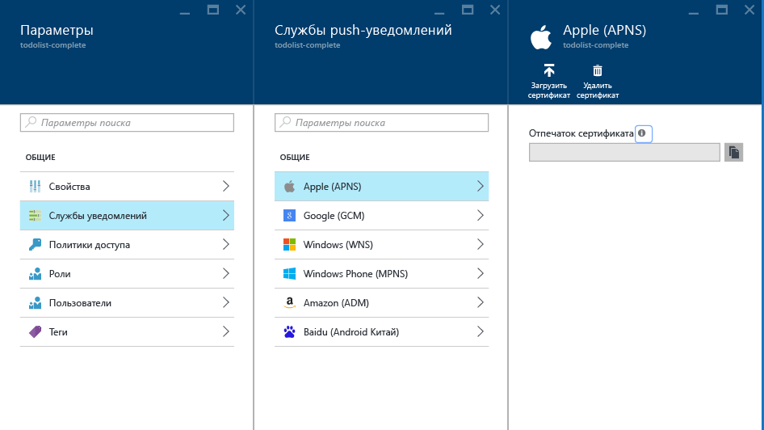
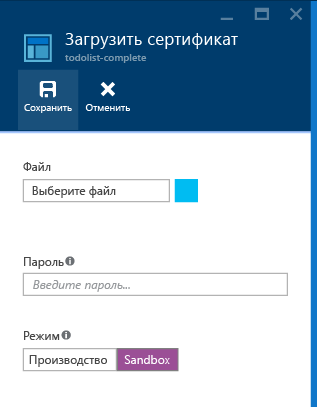

<properties
	pageTitle="Отправка push-уведомлений с помощью центров уведомлений Azure в iOS | Microsoft Azure"
	description="Из этого руководства вы узнаете, как отправлять push-уведомления в приложения iOS с помощью центров уведомлений Azure."
	services="notification-hubs"
	documentationCenter="ios"
    keywords="push-уведомление, push-уведомления, push-уведомления node.js, push-уведомления ios"
	authors="wesmc7777"
	manager="erikre"
	editor=""/>

<tags
	ms.service="notification-hubs"
	ms.workload="mobile"
	ms.tgt_pltfrm="mobile-ios"
	ms.devlang="objective-c"
	ms.topic="hero-article"
	ms.date="06/29/2016"
	ms.author="wesmc"/>

# Отправка push-уведомлений с помощью центров уведомлений Azure в iOS

[AZURE.INCLUDE [notification-hubs-selector-get-started](../../includes/notification-hubs-selector-get-started.md)]

##Обзор

> [AZURE.NOTE] Для работы с этим учебником необходима активная учетная запись Azure. Если ее нет, можно создать бесплатную пробную учетную запись всего за несколько минут. Дополнительные сведения см. в разделе [Бесплатная пробная версия Azure](https://azure.microsoft.com/pricing/free-trial/?WT.mc_id=A0E0E5C02&amp;returnurl=http%3A%2F%2Fazure.microsoft.com%2Fru-RU%2Fdocumentation%2Farticles%2Fnotification-hubs-ios-get-started).

В этом учебнике показано, как использовать Центры уведомлений Azure для отправки push-уведомлений в приложение на платформе iOS. Вы создадите пустое приложение iOS, получающее push-уведомления с помощью [службы push-уведомлений Apple (APNs)](https://developer.apple.com/library/ios/documentation/NetworkingInternet/Conceptual/RemoteNotificationsPG/Chapters/ApplePushService.html).

По завершении вы сможете рассылать push-уведомления на все устройства, где запущено ваше приложение, с помощью центра уведомлений.

## Перед началом работы

[AZURE.INCLUDE [notification-hubs-hero-slug](../../includes/notification-hubs-hero-slug.md)]

Полный код для этого учебника можно найти на портале [GitHub](https://github.com/Azure/azure-notificationhubs-samples/tree/master/iOS/GetStartedNH/GetStarted).

##Предварительные требования

Для работы с данным учебником требуется следующее:

+ [Пакет SDK для мобильных служб для iOS версии 1.2.4]
+ последняя версия [Xcode];
+ устройство с iOS 8 (или более поздней версии);
+ участие в [программе для разработчиков на платформе Apple](https://developer.apple.com/programs/).

   > [AZURE.NOTE] В соответствии с требованиями к настройкам push-уведомлений необходимо развернуть push-уведомления и протестировать их на физическом устройстве под управлением iOS (iPhone или iPad), а не в эмуляторе iOS.

Изучение этого руководства является необходимым условием для работы со всеми другими руководствами, посвященными Центрам уведомлений для приложений iOS.

[AZURE.INCLUDE [Включение push-уведомлений Apple через центры уведомлений](../../includes/notification-hubs-enable-apple-push-notifications.md)]

##Настройка push-уведомлений iOS в центре уведомлений

В этом разделе приведены пошаговые инструкции по созданию нового центра уведомлений и настройке проверки подлинности с помощью службы APNS, использующей раннее созданный вами сертификат push-уведомлений (файл с расширением **P12**). Если вы хотите использовать уже созданный центр уведомлений, перейдите к шагу 5.

[AZURE.INCLUDE [notification-hubs-portal-create-new-hub](../../includes/notification-hubs-portal-create-new-hub.md)]

<ol start="6">
<li>

Нажмите кнопку <b>Службы Notification Services</b> в колонке <b>Параметры</b>, а затем выберите <b>Apple (APNS)</b>. Щелкните <b>Отправка сертификата</b> и выберите файл <b>.p12</b>, который вы экспортировали ранее. Кроме того, необходимо указать правильный пароль.

Убедитесь, что вы работаете в режиме <b>песочницы</b>, так как это необходимо для разработки. Используйте <b>рабочую среду</b>, только если вы хотите отправлять push-уведомления пользователям, которые приобрели ваше приложение в магазине.

</li>
</ol>
&emsp;&emsp;

&emsp;&emsp;

Центр уведомлений теперь подключен к службе APNS, и у вас есть строки подключения, с помощью которых вы сможете зарегистрировать свое приложение и отправлять push-уведомления.

##Подключение приложения iOS к центрам уведомлений

1. В XCode создайте новый проект iOS и выберите шаблон **Single View Application** (Приложение с одним представлением).

   	![Xcode — приложение с одним представлением][8]

2. Во время настройки параметров нового проекта убедитесь, что вы используете те же **имя продукта** и **идентификатор организации**, которые использовались при указании идентификатора пакета на портале разработчиков Apple.

	![Xcode — параметры проекта][11]

3. В разделе **Targets** (Цели) щелкните имя проекта, выберите вкладку **Build Settings** (Параметры сборки) и разверните элемент **Code Signing Identity** (Идентификатор подписи кода), а затем в разделе **Debug** (Отладка) укажите идентификатор подписи кода. Переключите параметр **Levels** (Уровни) со значения **Basic** (Базовые) на значение **All** (Все), а для параметра **Provisioning Profile** (Профиль подготовки) укажите ранее созданный профиль подготовки.

	Если новый профиль подготовки, созданный в Xcode, не отображается, обновите профили для идентификатора подписи. В строке меню щелкните **Xcode**, выберите **Preferences** (Настройки), откройте вкладку **Account** (Учетная запись), нажмите кнопку **View Details** (Просмотреть сведения), щелкните свой идентификатор подписи и нажмите кнопку обновления в нижнем правом углу.

   	![Xcode — профиль подготовки][9]

4. Загрузите [пакет SDK для мобильных служб для iOS версии 1.2.4] и распакуйте архив. В XCode щелкните проект правой кнопкой мыши и выберите параметр **Add Files to** (Добавить файлы в), чтобы добавить папку **WindowsAzureMessaging.framework** в проект XCode. Выберите **Copy items if needed** (Копировать элементы при необходимости), а затем щелкните **Add** (Добавить).

	>[AZURE.NOTE] Пакет SDK для концентраторов уведомлений в настоящее время не поддерживает Bitcode в Xcode 7. В разделе **Параметры построения** вашего проекта необходимо задать для параметра **Включить Bitcode** значение **Нет**.

   	![Распаковка пакета SDK Azure][10]

5. Добавьте новый файл заголовка в проект с именем `HubInfo.h`. Этот файл будет содержать константы для центра уведомлений. Добавьте указанные ниже определения и замените буквенные заполнители строк *именем концентратора* и значением *DefaultListenSharedAccessSignature*, которые вы записали ранее.

		#ifndef HubInfo_h
		#define HubInfo_h
		
			#define HUBNAME @"<Enter the name of your hub>"
			#define HUBLISTENACCESS @"<Enter your DefaultListenSharedAccess connection string"
		
		#endif /* HubInfo_h */

6. Откройте файл `AppDelegate.h` и добавьте следующие директивы импорта:

         #import <WindowsAzureMessaging/WindowsAzureMessaging.h> 
		 #import "HubInfo.h"
		
7. В файле `AppDelegate.m file` добавьте приведенный ниже код в метод `didFinishLaunchingWithOptions` в зависимости от используемой версии iOS. Этот код регистрирует маркер вашего устройства в APNs.

	Для iOS 8:

	 	UIUserNotificationSettings *settings = [UIUserNotificationSettings settingsForTypes:UIUserNotificationTypeSound |
												UIUserNotificationTypeAlert | UIUserNotificationTypeBadge categories:nil];

    	[[UIApplication sharedApplication] registerUserNotificationSettings:settings];
    	[[UIApplication sharedApplication] registerForRemoteNotifications];

	Для более ранних версий:

         [[UIApplication sharedApplication] registerForRemoteNotificationTypes: UIRemoteNotificationTypeAlert | UIRemoteNotificationTypeBadge | UIRemoteNotificationTypeSound];

8. В том же файле добавьте следующие методы. Этот код подключается к центру уведомлений, используя сведения о соединении, указанные в проекте HubInfo.h. Затем он передает маркер устройства в центр уведомлений, чтобы центр мог отправлять уведомления:

	    - (void)application:(UIApplication *)application didRegisterForRemoteNotificationsWithDeviceToken:(NSData *) deviceToken {
		    SBNotificationHub* hub = [[SBNotificationHub alloc] initWithConnectionString:HUBLISTENACCESS
										notificationHubPath:HUBNAME];

		    [hub registerNativeWithDeviceToken:deviceToken tags:nil completion:^(NSError* error) {
		        if (error != nil) {
		            NSLog(@"Error registering for notifications: %@", error);
		        }
				else {
				    [self MessageBox:@"Registration Status" message:@"Registered"];
				}
	    	}];
		}

		-(void)MessageBox:(NSString *)title message:(NSString *)messageText
		{
			UIAlertView *alert = [[UIAlertView alloc] initWithTitle:title message:messageText delegate:self
				cancelButtonTitle:@"OK" otherButtonTitles: nil];
			[alert show];
		}

9. В том же файле добавьте следующий метод для отображения **UIAlert**, если уведомление получено, когда приложение активно:

        - (void)application:(UIApplication *)application didReceiveRemoteNotification: (NSDictionary *)userInfo {
		    NSLog(@"%@", userInfo);
		    [self MessageBox:@"Notification" message:[[userInfo objectForKey:@"aps"] valueForKey:@"alert"]];
		}

10. Выполните сборку приложения и запустите его на устройстве, чтобы убедиться в отсутствии сбоев.

## Отправка тестовых push-уведомлений

Чтобы проверить получение push-уведомлений в приложении, отправьте push-уведомление на [портале Azure] с помощью раздела **Устранение неполадок** в колонке центра (используйте параметр *Тестовая отправка*).

![Портал Azure — тестовая отправка][30]

[AZURE.INCLUDE [notification-hubs-sending-notifications-from-the-portal](../../includes/notification-hubs-sending-notifications-from-the-portal.md)]

## (Необязательно) Отправка push-уведомлений из приложения

>[AZURE.IMPORTANT] Этот пример с отправкой уведомлений из клиентского приложения приводится только в целях обучения. Так как в клиентском приложении требуется наличие `DefaultFullSharedAccessSignature`, пользователь может получить доступ к концентратору уведомлений для отправки несанкционированных уведомлений вашим клиентам.

Если вы хотите отправлять push-уведомления из приложения, в этом разделе приведен пример того, как это сделать с помощью интерфейса REST.

1. В XCode откройте файл `Main.storyboard` и добавьте следующие компоненты пользовательского интерфейса из библиотеки объектов, чтобы разрешить пользователю отправлять push-уведомления в приложении.

	- Метка без текста. Она будет использоваться для сообщения об ошибках во время отправки уведомлений. Свойству **Lines** (Строки) присвойте значение **0** для автоматического ограничения размера правого и левого полей и верхней части представления.
	- Введите в текстовое поле с текстом **Placeholder** (Заполнитель) значение **Enter Notification Message** (Ввести сообщение уведомления). Ограничьте поле сразу под меткой, как показано ниже. Установите контроллер представлений в качестве выходного делегата.
	- Кнопка **Send Notification** (Отправить уведомление) закреплена сразу под текстовым полем, горизонтально по центру.

	Представление будет выглядеть следующим образом:

	![Конструктор Xcode][32]

2. [Добавьте выходы](https://developer.apple.com/library/ios/recipes/xcode_help-IB_connections/chapters/CreatingOutlet.html) для метки и текстового поля, которые связаны с представлением, и обновите определение `interface`, добавив в него поддержку `UITextFieldDelegate` и `NSXMLParserDelegate`. Добавьте три нижеуказанных объявления свойств для обеспечения вызова API REST и синтаксического анализа ответа.

	Ваш файл ViewController.h должен выглядеть следующим образом:

		#import <UIKit/UIKit.h>

		@interface ViewController : UIViewController <UITextFieldDelegate, NSXMLParserDelegate>
		{
			NSXMLParser *xmlParser;
		}

		// Make sure these outlets are connected to your UI by ctrl+dragging
		@property (weak, nonatomic) IBOutlet UITextField *notificationMessage;
		@property (weak, nonatomic) IBOutlet UILabel *sendResults;

		@property (copy, nonatomic) NSString *statusResult;
		@property (copy, nonatomic) NSString *currentElement;

		@end

3. Откройте файл `HubInfo.h` и добавьте следующие константы, которые будут использоваться для отправки уведомлений в центр. Замените буквенную строку заполнителя фактической строкой подключения *DefaultFullSharedAccessSignature*.

		#define API_VERSION @"?api-version=2015-01"
		#define HUBFULLACCESS @"<Enter Your DefaultFullSharedAccess Connection string>"

4. Добавьте следующие инструкции `#import` в файл `ViewController.h`.

		#import <CommonCrypto/CommonHMAC.h>
		#import "HubInfo.h"

5. В файле `ViewController.m` добавьте следующий код в раздел реализации интерфейса. Этот код будет анализировать строку подключения *DefaultFullSharedAccessSignature* Как уже говорилось в [справочнике по REST API](http://msdn.microsoft.com/library/azure/dn495627.aspx), проанализированная информация будет использоваться при создании маркера SAS для заголовка запроса **авторизации**.

		NSString *HubEndpoint;
		NSString *HubSasKeyName;
		NSString *HubSasKeyValue;

		-(void)ParseConnectionString
		{
			NSArray *parts = [HUBFULLACCESS componentsSeparatedByString:@";"];
			NSString *part;

			if ([parts count] != 3)
			{
				NSException* parseException = [NSException exceptionWithName:@"ConnectionStringParseException"
					reason:@"Invalid full shared access connection string" userInfo:nil];

				@throw parseException;
			}

			for (part in parts)
			{
				if ([part hasPrefix:@"Endpoint"])
				{
					HubEndpoint = [NSString stringWithFormat:@"https%@",[part substringFromIndex:11]];
				}
				else if ([part hasPrefix:@"SharedAccessKeyName"])
				{
					HubSasKeyName = [part substringFromIndex:20];
				}
				else if ([part hasPrefix:@"SharedAccessKey"])
				{
					HubSasKeyValue = [part substringFromIndex:16];
				}
			}
		}

6. В файле `ViewController.m` обновите метод `viewDidLoad`, чтобы проанализировать строку подключения при загрузке представления. Кроме того, добавьте в раздел реализации интерфейса служебные методы, показанные ниже.

		- (void)viewDidLoad
		{
			[super viewDidLoad];
			[self ParseConnectionString];
			[_notificationMessage setDelegate:self];
		}

		-(NSString *)CF_URLEncodedString:(NSString *)inputString
		{
		   return (__bridge NSString *)CFURLCreateStringByAddingPercentEscapes(NULL, (CFStringRef)inputString,
				NULL, (CFStringRef)@"!*'();:@&=+$,/?%#[]", kCFStringEncodingUTF8);
		}

		-(void)MessageBox:(NSString *)title message:(NSString *)messageText
		{
			UIAlertView *alert = [[UIAlertView alloc] initWithTitle:title message:messageText delegate:self
				cancelButtonTitle:@"OK" otherButtonTitles: nil];
			[alert show];
		}

7. В файле `ViewController.m` добавьте в раздел реализации интерфейса следующий код, чтобы создать маркер авторизации SAS, который будет указан в заголовке **запроса авторизации**, как оговорено в [справочнике по REST API](http://msdn.microsoft.com/library/azure/dn495627.aspx).

		-(NSString*) generateSasToken:(NSString*)uri
		{
			NSString *targetUri;
			NSString* utf8LowercasedUri = NULL;
			NSString *signature = NULL;
			NSString *token = NULL;

			@try
			{
				// Add expiration
				uri = [uri lowercaseString];
				utf8LowercasedUri = [self CF_URLEncodedString:uri];
				targetUri = [utf8LowercasedUri lowercaseString];
				NSTimeInterval expiresOnDate = [[NSDate date] timeIntervalSince1970];
				int expiresInMins = 60; // 1 hour
				expiresOnDate += expiresInMins * 60;
				UInt64 expires = trunc(expiresOnDate);
				NSString* toSign = [NSString stringWithFormat:@"%@\n%qu", targetUri, expires];

				// Get an hmac_sha1 Mac instance and initialize with the signing key
				const char *cKey  = [HubSasKeyValue cStringUsingEncoding:NSUTF8StringEncoding];
				const char *cData = [toSign cStringUsingEncoding:NSUTF8StringEncoding];
				unsigned char cHMAC[CC_SHA256_DIGEST_LENGTH];
				CCHmac(kCCHmacAlgSHA256, cKey, strlen(cKey), cData, strlen(cData), cHMAC);
				NSData *rawHmac = [[NSData alloc] initWithBytes:cHMAC length:sizeof(cHMAC)];
				signature = [self CF_URLEncodedString:[rawHmac base64EncodedStringWithOptions:0]];

				// Construct authorization token string
				token = [NSString stringWithFormat:@"SharedAccessSignature sig=%@&se=%qu&skn=%@&sr=%@",
					signature, expires, HubSasKeyName, targetUri];
			}
			@catch (NSException *exception)
			{
				[self MessageBox:@"Exception Generating SaS Token" message:[exception reason]];
			}
			@finally
			{
				if (utf8LowercasedUri != NULL)
					CFRelease((CFStringRef)utf8LowercasedUri);
				if (signature != NULL)
				CFRelease((CFStringRef)signature);
			}

			return token;
		}

8. Удерживая нажатой клавишу CTRL, проведите от кнопки **Отправить уведомление** к файлу `ViewController.m`, чтобы добавить действие **SendNotificationMessage** для события **Touch Down**. Обновите метод с помощью следующего кода, чтобы отправить уведомление с помощью интерфейса REST API.

		- (IBAction)SendNotificationMessage:(id)sender
		{
			self.sendResults.text = @"";
			[self SendNotificationRESTAPI];
		}

		- (void)SendNotificationRESTAPI
		{
		    NSURLSession* session = [NSURLSession
                             sessionWithConfiguration:[NSURLSessionConfiguration defaultSessionConfiguration]
                             delegate:nil delegateQueue:nil];

			// Apple Notification format of the notification message
		    NSString *json = [NSString stringWithFormat:@"{"aps":{"alert":"%@"}}",
								self.notificationMessage.text];

			// Construct the message's REST endpoint
			NSURL* url = [NSURL URLWithString:[NSString stringWithFormat:@"%@%@/messages/%@", HubEndpoint,
												HUBNAME, API_VERSION]];

			// Generate the token to be used in the authorization header
			NSString* authorizationToken = [self generateSasToken:[url absoluteString]];

			//Create the request to add the APNs notification message to the hub
			NSMutableURLRequest *request = [NSMutableURLRequest requestWithURL:url];
			[request setHTTPMethod:@"POST"];
			[request setValue:@"application/json;charset=utf-8" forHTTPHeaderField:@"Content-Type"];

			// Signify Apple notification format
			[request setValue:@"apple" forHTTPHeaderField:@"ServiceBusNotification-Format"];

			//Authenticate the notification message POST request with the SaS token
			[request setValue:authorizationToken forHTTPHeaderField:@"Authorization"];

			//Add the notification message body
			[request setHTTPBody:[json dataUsingEncoding:NSUTF8StringEncoding]];

			// Send the REST request
		    NSURLSessionDataTask* dataTask = [session dataTaskWithRequest:request
				completionHandler:^(NSData *data, NSURLResponse *response, NSError *error)
			{
		        NSHTTPURLResponse* httpResponse = (NSHTTPURLResponse*) response;
		        if (error || (httpResponse.statusCode != 200 && httpResponse.statusCode != 201))
		        {
		            NSLog(@"\nError status: %d\nError: %@", httpResponse.statusCode, error);
		        }
				if (data != NULL)
				{
		        	xmlParser = [[NSXMLParser alloc] initWithData:data];
		        	[xmlParser setDelegate:self];
		       		[xmlParser parse];
		    	}
		    }];
		    [dataTask resume];
		}

9. В файле `ViewController.m` добавьте следующий метод делегата, чтобы закрыть клавиатуру для текстового поля. Удерживая клавишу CONTROL, проведите от текстового поля к значку контроллера представления в конструкторе интерфейса, чтобы задать контроллер представления в качестве делегата выхода.

		//===[ Implement UITextFieldDelegate methods ]===

		-(BOOL)textFieldShouldReturn:(UITextField *)textField
		{
			[textField resignFirstResponder];
			return YES;
		}

10. В файле `ViewController.m` добавьте следующие методы делегата для поддержки анализа ответа с помощью `NSXMLParser`.

		//===[ Implement NSXMLParserDelegate methods ]===

		-(void)parserDidStartDocument:(NSXMLParser *)parser
		{
		    self.statusResult = @"";
		}

		-(void)parser:(NSXMLParser *)parser didStartElement:(NSString *)elementName
			namespaceURI:(NSString *)namespaceURI qualifiedName:(NSString *)qName
			attributes:(NSDictionary *)attributeDict
		{
		    NSString * element = [elementName lowercaseString];
		    NSLog(@"*** New element parsed : %@ ***",element);

		    if ([element isEqualToString:@"code"] | [element isEqualToString:@"detail"])
		    {
		        self.currentElement = element;
		    }
		}

		-(void) parser:(NSXMLParser *)parser foundCharacters:(NSString *)parsedString
		{
		    self.statusResult = [self.statusResult stringByAppendingString:
		        [NSString stringWithFormat:@"%@ : %@\n", self.currentElement, parsedString]];
		}

		-(void)parserDidEndDocument:(NSXMLParser *)parser
		{
			// Set the status label text on the UI thread
			dispatch_async(dispatch_get_main_queue(),
			^{
				[self.sendResults setText:self.statusResult];
			});
		}

11. Выполните сборку проекта и убедитесь в отсутствии ошибок.

> [AZURE.NOTE] Если в XCode7 возникла ошибка сборки, связанная с поддержкой bitcode, откройте в XCode элементы **Параметры построения** -> **Включить Bitcode (ENABLE\_BITCODE)** и установите значение **Нет**. Пакет SDK для центров уведомлений в настоящее время не поддерживает bitcode.

Все возможные виды полезных данных уведомлений можно найти в [руководстве по программированию локальных уведомлений и push-уведомлений] Apple.

##Проверка того, может ли ваше приложение получать push-уведомления

Для тестирования push-уведомлений в iOS необходимо развернуть приложение на физическом устройстве под управлением iOS. Отправка push-уведомлений Apple через эмулятор iOS невозможна.

1. Запустите приложение и убедитесь, что оно успешно зарегистрировано, а затем нажмите кнопку **ОК**.

	![Проверка регистрации push-уведомления приложения iOS][33]

2. Тестовое push-уведомление можно отправить с [портала Azure], как описано выше. Если вы добавили код для отправки push-уведомления в приложение, коснитесь текстового поля и введите сообщение уведомления. Затем нажмите клавишу **Send** (Отправить) на клавиатуре или кнопку **Send Notification** (Отправить уведомление) в представлении, чтобы отправить уведомление.

	![Проверка отправки push-уведомления приложения iOS][34]

3. Push-уведомление будет отправлено на все устройства, зарегистрированные для получения уведомлений от того или иного центра уведомлений.

	![Проверка получения push-уведомления приложения iOS][35]

##Дальнейшие действия

В этом простом примере мы отправили push-уведомления на все зарегистрированные устройства iOS. В качестве следующего шага вашего обучения мы рекомендуем изучить руководство [Уведомление пользователей iOS через центры уведомлений с помощью серверной части .NET]. Из этого руководства вы узнаете, как создать серверную часть, чтобы отправлять push-уведомления с помощью тегов.

Если вам нужно разделить пользователей по группам интересов, см. также руководство [Использование концентраторов уведомлений для передачи экстренных новостей].

Дополнительную информацию о центрах уведомлений см. в статье [Общие сведения о концентраторах уведомлений].

<!-- Images. -->

[6]: ./media/notification-hubs-ios-get-started/notification-hubs-configure-ios.png
[8]: ./media/notification-hubs-ios-get-started/notification-hubs-create-ios-app.png
[9]: ./media/notification-hubs-ios-get-started/notification-hubs-create-ios-app2.png
[10]: ./media/notification-hubs-ios-get-started/notification-hubs-create-ios-app3.png
[11]: ./media/notification-hubs-ios-get-started/notification-hubs-xcode-product-name.png

[30]: ./media/notification-hubs-ios-get-started/notification-hubs-test-send.png

[31]: ./media/notification-hubs-ios-get-started/notification-hubs-ios-ui.png
[32]: ./media/notification-hubs-ios-get-started/notification-hubs-storyboard-view.png
[33]: ./media/notification-hubs-ios-get-started/notification-hubs-test1.png
[34]: ./media/notification-hubs-ios-get-started/notification-hubs-test2.png
[35]: ./media/notification-hubs-ios-get-started/notification-hubs-test3.png

<!-- URLs. -->
[Пакет SDK для мобильных служб для iOS версии 1.2.4]: http://aka.ms/kymw2g
[пакет SDK для мобильных служб для iOS версии 1.2.4]: http://aka.ms/kymw2g
[Mobile Services iOS SDK]: http://go.microsoft.com/fwLink/?LinkID=266533
[Submit an app page]: http://go.microsoft.com/fwlink/p/?LinkID=266582
[My Applications]: http://go.microsoft.com/fwlink/p/?LinkId=262039
[Live SDK for Windows]: http://go.microsoft.com/fwlink/p/?LinkId=262253

[Get started with Mobile Services]: /develop/mobile/tutorials/get-started-ios
[Azure Classic Portal]: https://manage.windowsazure.com/
[Общие сведения о концентраторах уведомлений]: http://msdn.microsoft.com/library/jj927170.aspx
[Xcode]: https://go.microsoft.com/fwLink/p/?LinkID=266532
[iOS Provisioning Portal]: http://go.microsoft.com/fwlink/p/?LinkId=272456

[Get started with push notifications in Mobile Services]: ../mobile-services-javascript-backend-ios-get-started-push.md
[Уведомление пользователей iOS через центры уведомлений с помощью серверной части .NET]: notification-hubs-aspnet-backend-ios-notify-users.md
[Использование концентраторов уведомлений для передачи экстренных новостей]: notification-hubs-ios-send-breaking-news.md

[руководстве по программированию локальных уведомлений и push-уведомлений]: http://developer.apple.com/library/mac/#documentation/NetworkingInternet/Conceptual/RemoteNotificationsPG/Chapters/ApplePushService.html#//apple_ref/doc/uid/TP40008194-CH100-SW1
[портала Azure]: https://portal.azure.com
[портале Azure]: https://portal.azure.com

<!---HONumber=AcomDC_0720_2016-->