# <a name="tutorial-push-location-based-notifications-with-azure-notification-hubs-and-bing-spatial-data"></a>Руководство. Отправка уведомлений с учетом географического расположения с помощью Центров уведомлений Azure и Bing Spatial Data
В этом руководстве вы узнаете, как отправлять push-уведомления с учетом географического расположения с помощью Центров уведомлений Azure и Bing Spatial Data. 

При работе с этим руководством вы выполните следующие задачи:

> [!div class="checklist"]
> * Настройка источника данных.
> * Настройка приложения UWP.
> * Настройка внутренней службы.
> * Тестирование push-уведомлений в приложении универсальной платформы Windows (UWP).


## <a name="prerequisites"></a>предварительным требованиям

- **Подписка Azure**. Если у вас еще нет подписки Azure, создайте [бесплатную](https://azure.microsoft.com/free/) учетную запись Azure, прежде чем начинать работу.
- [Visual Studio 2015 с обновлением 1](https://www.visualstudio.com/downloads/download-visual-studio-vs.aspx) или более поздней версии ([Community Edition](https://go.microsoft.com/fwlink/?LinkId=691978&clcid=0x409)). 
- последняя версия [пакета SDK для Azure](https://azure.microsoft.com/downloads/); 
- [учетная запись Центра разработки Карт Bing](https://www.bingmapsportal.com/) (ее можно создать бесплатно и связать с учетной записью Майкрософт). 

## <a name="set-up-the-data-source"></a>Настройка источника данных

1. Войдите в [Центр разработки Карт Bing](https://www.bingmapsportal.com/). 
2. Выберите **Data sources** (Источники данных) в верхней панели навигации и щелкните **Manage Data Sources** (Управление источниками данных). 

    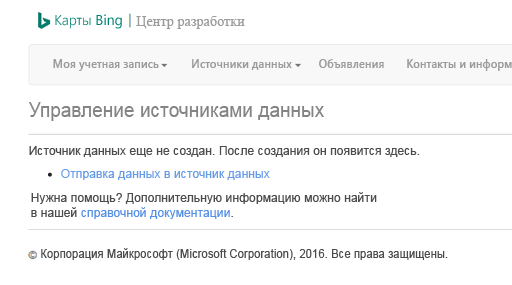
3. Если у вас нет источника данных, воспользуйтесь ссылкой, чтобы создать его. Выберите **Upload data as a data source** (Отправка данных в качестве источника данных). Вы также можете воспользоваться меню **Data sources** (Источники данных)  > **Upload data** (Отправка данных). 

    

4. Создайте файл **NotificationHubsGeofence.pipe** на жестком диске со следующим содержимым. В этом руководстве используется пример файла на основе канала, который охватывает прибрежную часть Сан-Франциско:

    ```
    Bing Spatial Data Services, 1.0, TestBoundaries
    EntityID(Edm.String,primaryKey)|Name(Edm.String)|Longitude(Edm.Double)|Latitude(Edm.Double)|Boundary(Edm.Geography)
    1|SanFranciscoPier|||POLYGON ((-122.389825 37.776598,-122.389438 37.773087,-122.381885 37.771849,-122.382186 37.777022,-122.389825 37.776598))
    ```

    Файл канала представляет этот объект:
    
    
5. На странице **Upload a data source** (Отправка источника данных) сделайте следующее:
    1. Выберите значение **pipe** (канал) для параметра **Data format** (Формат данных).
    2. Найдите и выберите файл **NotificationHubGeofence.pipe**, созданный на предыдущем шаге. 
    3. Нажмите кнопку **Upload** (Отправить). 
    
    > [!NOTE]
    > При этом может появиться запрос на ввод **главного ключа**, отличного от **ключа запроса**. Просто создайте ключ на панели мониторинга и обновите страницу отправки источника данных.
6. После отправки файла данных необходимо опубликовать источник данных. Выберите **Data sources** (Источники данных)  -> **Manage Data Sources** (Управление источниками данных), как это делалось ранее. 
7. Выберите источник данных из списка и щелкните **Publish** (Опубликовать) в столбце **Actions** (Действия). 

    
8. Перейдите на вкладку **Published Data Sources** (Опубликованные источники данных) и убедитесь, что в списке отображается ваш источник данных.

    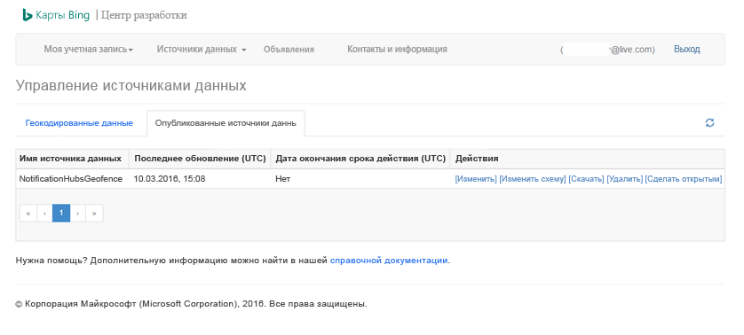

9. Выберите **Изменить** Вы увидите, какие расположения представлены в данных.

    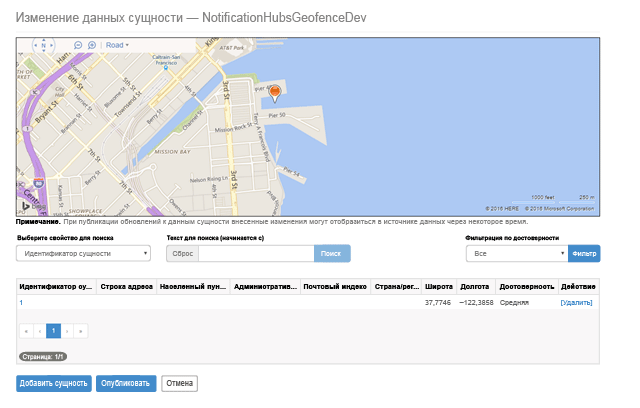

    На этом этапе на портале не отображаются границы созданной геозоны. Нужно просто подтвердить, что область указанного расположения выбрана правильно.
8. Теперь выполнены все требования для источника данных. Чтобы получить дополнительные сведения об URL-адресе запроса для вызова API, в Центре разработки для Карт Bing щелкните **Data sources** (Источники данных) и выберите **Data Source Information** (Сведения об источнике данных).

    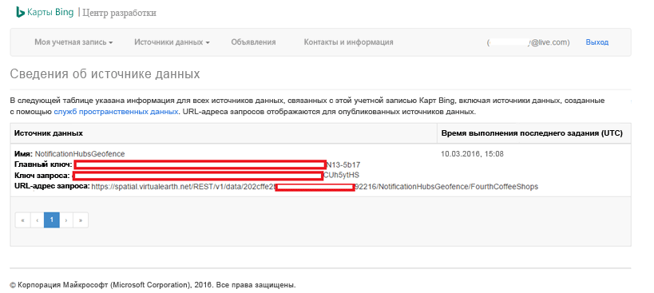

    **Query URL** (URL-адрес запроса) — это конечная точка, для которой можно выполнять запросы, чтобы проверить, находится ли устройство в пределах местоположения. Для этого просто выполните вызов GET для URL-адреса запроса и добавьте следующие параметры:

    ```
    ?spatialFilter=intersects(%27POINT%20LONGITUDE%20LATITUDE)%27)&$format=json&key=QUERY_KEY
    ```

    Карты Bing автоматически выполнят вычисления, чтобы убедиться, что устройство находится в пределах геозоны. После выполнения запроса с помощью браузера (или cURL) отобразится стандартный ответ JSON:

    

    Такой ответ получается, только если точка находится в установленных пределах. Если она находится за пределами, контейнер **results** будет пустым:

    

## <a name="set-up-the-uwp-application"></a>Настройка приложения UWP

1. В Visual Studio создайте новый проект типа **Пустое приложение (универсальное приложение Windows)**.

    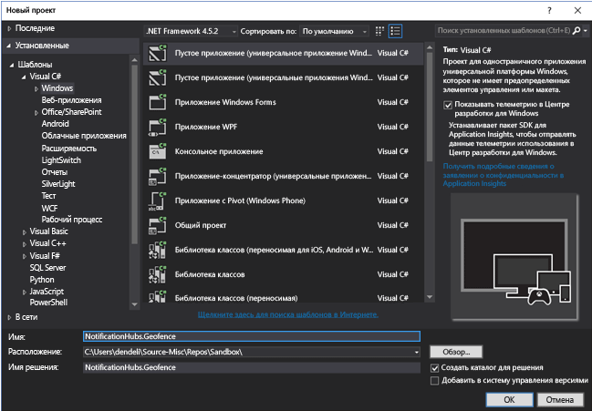

    После создания проекта вы получите окружение для приложения. Теперь давайте все настроим для инфраструктуры определения геозон. Так как для этого решения будут использоваться службы Bing, нам понадобится общедоступная конечная точка REST API, позволяющая запросить определенные области расположения:

    http://spatial.virtualearth.net/REST/v1/data/

    Для этого необходимо указать следующие параметры:

    - **Идентификатор источника данных** и **Имя источника данных.** В API Карт Bing источники данных содержат различные сегментированные метаданные, например о местоположении и часах работы.  
    - **Имя сущности** — сущность, которую нужно использовать в качестве опорной точки для уведомления. 
    - **Ключ интерфейса API карт Bing** — ключ, полученный ранее при создании учетной записи Центра разработки Bing.

    Теперь после подготовки источника данных можно начать работу над приложением UWP.
2. Включите службы определения расположения для вашего приложения. В **обозревателе решений** откройте файл `Package.appxmanifest`.

    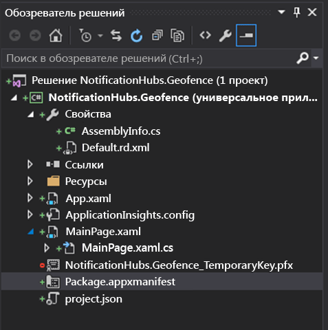
3. На открывшейся вкладке свойств пакета перейдите на вкладку **Возможности** и установите флажок **Расположение**.

    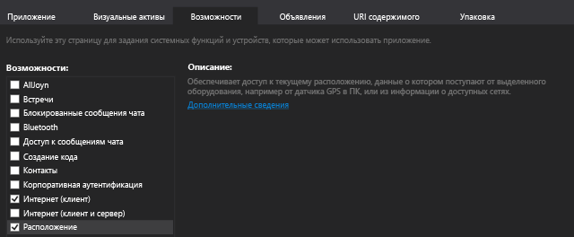

4. В решении создайте папку `Core` и добавьте в нее новый файл `LocationHelper.cs`:

    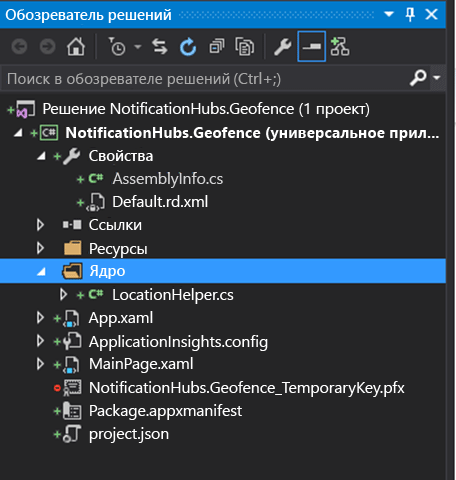

    В классе `LocationHelper` есть код, используемый для получения сведений о расположении пользователя через API-интерфейс системы:

    ```csharp
    using System;
    using System.Threading.Tasks;
    using Windows.Devices.Geolocation;

    namespace NotificationHubs.Geofence.Core
    {
        public class LocationHelper
        {
            private static readonly uint AppDesiredAccuracyInMeters = 10;

            public async static Task<Geoposition> GetCurrentLocation()
            {
                var accessStatus = await Geolocator.RequestAccessAsync();
                switch (accessStatus)
                {
                    case GeolocationAccessStatus.Allowed:
                        {
                            Geolocator geolocator = new Geolocator { DesiredAccuracyInMeters = AppDesiredAccuracyInMeters };

                            return await geolocator.GetGeopositionAsync();
                        }
                    default:
                        {
                            return null;
                        }
                }
            }

        }
    }
    ```

    Дополнительные сведения о получении сведений о расположении пользователя в приложениях UWP см. в [этой статье](https://msdn.microsoft.com/library/windows/apps/mt219698.aspx).

5. Чтобы проверить, работает ли получение сведений о местоположении, откройте код главной страницы (`MainPage.xaml.cs`). В конструкторе `MainPage` создайте обработчик событий для события `Loaded`.

    ```csharp
    public MainPage()
    {
        this.InitializeComponent();
        this.Loaded += MainPage_Loaded;
    }
    ```

    Реализация обработчика событий выглядит следующим образом:

    ```csharp
    private async void MainPage_Loaded(object sender, RoutedEventArgs e)
    {
        var location = await LocationHelper.GetCurrentLocation();

        if (location != null)
        {
            Debug.WriteLine(string.Concat(location.Coordinate.Longitude,
                " ", location.Coordinate.Latitude));
        }
    }
    ```
6. Запустите приложение и разрешите ему доступ к сведениям о своем расположении.

    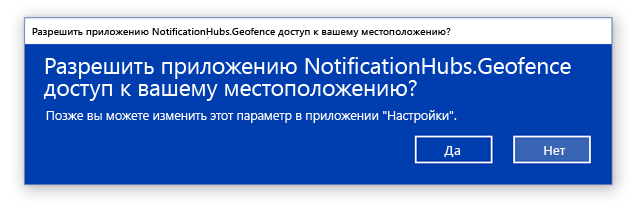
7. После запуска приложения координаты будут отображаться в окне **Вывод** :

    

    Проверив команду получения сведений о расположении, можно удалить загруженный обработчик событий, так как он нам больше не пригодится.
8. Дальше мы зафиксируем изменения местоположения. В классе `LocationHelper` добавьте обработчик событий для `PositionChanged`:

    ```csharp
    geolocator.PositionChanged += Geolocator_PositionChanged;
    ```

    После выполнения координаты расположения отобразятся в окне **Вывод**:

    ```csharp
    private static async void Geolocator_PositionChanged(Geolocator sender, PositionChangedEventArgs args)
    {
        await CoreApplication.MainView.CoreWindow.Dispatcher.RunAsync(CoreDispatcherPriority.Normal, () =>
        {
            Debug.WriteLine(string.Concat(args.Position.Coordinate.Longitude, " ", args.Position.Coordinate.Latitude));
        });
    }
    ```

## <a name="set-up-the-backend"></a>Настройка внутренней службы
1. Скачайте [пример сервера .NET](https://github.com/Azure/azure-notificationhubs-samples/tree/master/dotnet/NotifyUsers)с сайта GitHub. 
2. После завершения загрузки откройте папку `NotifyUsers`, а затем файл `NotifyUsers.sln` в Visual Studio. 
3. Настройте проект `AppBackend` в качестве **запускаемого проекта** и запустите его.

    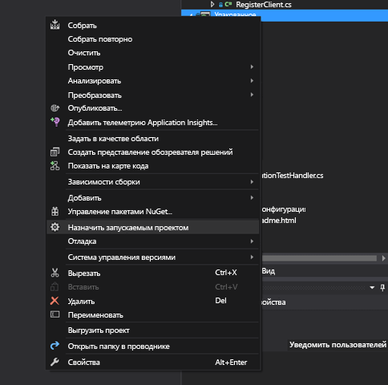

    Проект уже настроен для отправки push-уведомлений на целевое устройство. Поэтому нужно выполнить всего два действия — указать соответствующую строку подключения для центра уведомлений и добавить определение границ, чтобы уведомление отправлялось, только если пользователь находится в пределах геозоны.
4. Чтобы настроить строку подключения, в папке `Models` откройте файл `Notifications.cs`. Функция `NotificationHubClient.CreateClientFromConnectionString` должна содержать сведения о Центре уведомлений. Эти сведения можно получить на [портале Azure](https://portal.azure.com) (в разделе **Параметры** на странице **Политики доступа**). Сохраните обновленный файл конфигурации.
5. Создайте модель для результатов API Карт Bing. Самый простой способ — открыть папку `Models` и выбрать **Добавить** > **Класс**. Назовите его `GeofenceBoundary.cs`. После этого скопируйте JSON из ответа API, полученный в первом разделе. В Visual Studio выберите **Изменить** > **Специальная вставка** > **Вставить JSON как классы**. 

    Таким образом мы обеспечим десериализацию объекта, как и предполагалось. Итоговый набор классов должен выглядеть следующим образом:

    ```csharp
    namespace AppBackend.Models
    {
        public class Rootobject
        {
            public D d { get; set; }
        }

        public class D
        {
            public string __copyright { get; set; }
            public Result[] results { get; set; }
        }

        public class Result
        {
            public __Metadata __metadata { get; set; }
            public string EntityID { get; set; }
            public string Name { get; set; }
            public float Longitude { get; set; }
            public float Latitude { get; set; }
            public string Boundary { get; set; }
            public string Confidence { get; set; }
            public string Locality { get; set; }
            public string AddressLine { get; set; }
            public string AdminDistrict { get; set; }
            public string CountryRegion { get; set; }
            public string PostalCode { get; set; }
        }

        public class __Metadata
        {
            public string uri { get; set; }
        }
    }
    ```
6. Затем откройте `Controllers` > `NotificationsController.cs`. Обновите вызов Post, чтобы учитывалась широта и долгота целевой точки. Для этого добавьте в сигнатуру функции две строки — `latitude` и `longitude`.

    ```csharp
    public async Task<HttpResponseMessage> Post(string pns, [FromBody]string message, string to_tag, string latitude, string longitude)
    ```
7. Создайте в проекте класс `ApiHelper.cs`. Он будет использоваться для подключения к Bing, чтобы проверить пересечения границ с точкой. Реализуйте функцию `IsPointWithinBounds`, как показано в следующем коде:

    ```csharp
    public class ApiHelper
    {
        public static readonly string ApiEndpoint = "{YOUR_QUERY_ENDPOINT}?spatialFilter=intersects(%27POINT%20({0}%20{1})%27)&$format=json&key={2}";
        public static readonly string ApiKey = "{YOUR_API_KEY}";

        public static bool IsPointWithinBounds(string longitude,string latitude)
        {
            var json = new WebClient().DownloadString(string.Format(ApiEndpoint, longitude, latitude, ApiKey));
            var result = JsonConvert.DeserializeObject<Rootobject>(json);
            if (result.d.results != null && result.d.results.Count() > 0)
            {
                return true;
            }
            else
            {
                return false;
            }
        }
    }
    ```

    > [!IMPORTANT]
    > Обязательно замените конечную точку API на URL-адрес запроса, полученный ранее из Центра разработки Bing (то же необходимо сделать и для ключа API). 

    Если получены результаты по запросу, это значит, что указанная точка находится в пределах геозоны, поэтому функция возвращает значение `true`. Если результатов нет, Bing сообщает, что точка находится за пределами области поиска, поэтому функция возвращает значение `false`.
8. В файле `NotificationsController.cs` создайте параметр проверки перед оператором switch:

    ```csharp
    if (ApiHelper.IsPointWithinBounds(longitude, latitude))
    {
        switch (pns.ToLower())
        {
            case "wns":
                //// Windows 8.1 / Windows Phone 8.1
                var toast = @"<toast><visual><binding template=""ToastText01""><text id=""1"">" +
                            "From " + user + ": " + message + "</text></binding></visual></toast>";
                outcome = await Notifications.Instance.Hub.SendWindowsNativeNotificationAsync(toast, userTag);

                // Windows 10 specific Action Center support
                toast = @"<toast><visual><binding template=""ToastGeneric""><text id=""1"">" +
                            "From " + user + ": " + message + "</text></binding></visual></toast>";
                outcome = await Notifications.Instance.Hub.SendWindowsNativeNotificationAsync(toast, userTag);

                break;
        }
    }
    ```

## <a name="test-push-notifications-in-the-uwp-app"></a>Тестирование push-уведомлений в приложении UWP

1. Теперь вы сможете протестировать уведомления в приложении UWP. В классе `LocationHelper` создайте функцию `SendLocationToBackend`.

    ```csharp
    public static async Task SendLocationToBackend(string pns, string userTag, string message, string latitude, string longitude)
    {
        var POST_URL = "http://localhost:8741/api/notifications?pns=" +
            pns + "&to_tag=" + userTag + "&latitude=" + latitude + "&longitude=" + longitude;

        using (var httpClient = new HttpClient())
        {
            try
            {
                await httpClient.PostAsync(POST_URL, new StringContent("\"" + message + "\"",
                    System.Text.Encoding.UTF8, "application/json"));
            }
            catch (Exception ex)
            {
                Debug.WriteLine(ex.Message);
            }
        }
    }
    ```

    > [!NOTE]
    > Для параметра `POST_URL` задайте расположение развернутого веб-приложения. Сейчас его можно запустить локально. Но если планируется развернуть общедоступную версию, его необходимо разместить у внешнего поставщика.
1. Зарегистрируйте приложение UWP для работы с push-уведомлениями. В Visual Studio выберите **Проект** > **Магазин** > **Связать приложение с Магазином**.

    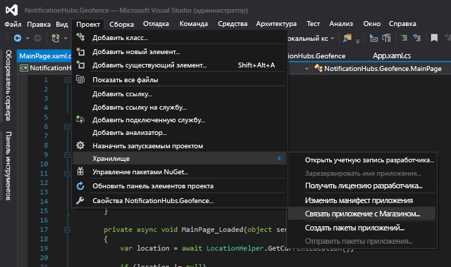
3. После входа в учетную запись разработчика выберите имеющееся приложение или создайте его и свяжите с ним пакет. 
4. Перейдите в Центр разработки и откройте созданное приложение. Выберите **Службы** > **Push-уведомления** > **Live Services site** (Сайт служб Live).

    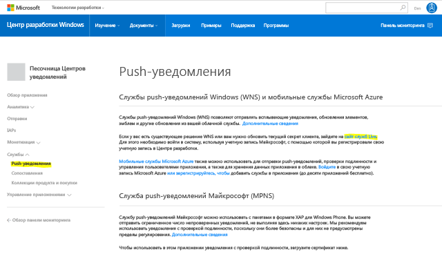
5. Запишите значения параметров **Секрет приложения** и **ИД безопасности пакета**, отображающиеся на сайте. Они потребуются вам на портале Azure. Откройте свой центр уведомлений, выберите **Параметры** > **Службы уведомлений** > **Windows (WNS)** и введите сведения в обязательные поля.

    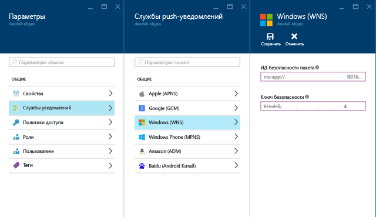
6. Нажмите **Сохранить**.
7. В **обозревателе решений** откройте **Ссылки** и выберите **Управление пакетами NuGet**. Добавьте ссылку в **управляемую библиотеку служебной шины Microsoft Azure**. Для этого просто найдите `WindowsAzure.Messaging.Managed` и добавьте ее в проект.

    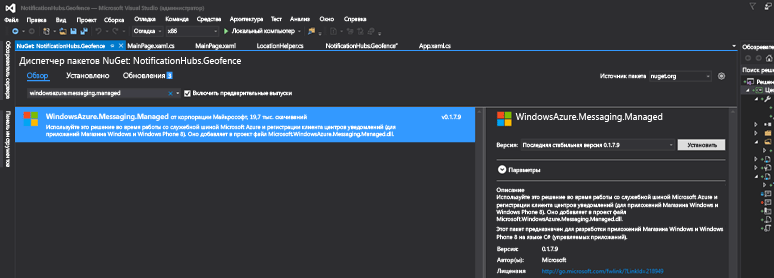

7. В рамках тестирования можно еще раз создать обработчик событий `MainPage_Loaded` и добавить в него следующий фрагмент кода:

    ```csharp
    var channel = await PushNotificationChannelManager.CreatePushNotificationChannelForApplicationAsync();

    var hub = new NotificationHub("HUB_NAME", "HUB_LISTEN_CONNECTION_STRING");
    var result = await hub.RegisterNativeAsync(channel.Uri);

    // Displays the registration ID so you know it was successful
    if (result.RegistrationId != null)
    {
        Debug.WriteLine("Reg successful.");
    }
    ```

    Он регистрирует приложение в центре уведомлений. Теперь все готово к работе. 
8. В `LocationHelper` внутри обработчика `Geolocator_PositionChanged` можно добавить фрагмент тестового кода, который принудительно разместит расположение в пределах геозоны.

    ```csharp
    await LocationHelper.SendLocationToBackend("wns", "TEST_USER", "TEST", "37.7746", "-122.3858");
    ```

9. Так как мы не передаем настоящие координаты (которые в данный момент могут выходить за пределы геозоны) и используем предопределенные тестовые значения, появится уведомление об обновлении:

    

## <a name="next-steps"></a>Дополнительная информация
Чтобы решение было готово для работы, нужно выполнить несколько действий.

1. Во-первых, необходимо убедиться в динамичности геозон. Для этого потребуется выполнить дополнительные операции с API Bing, чтобы передавать новые границы в существующий источник данных. Дополнительные сведения см. в [документации по интерфейсам API служб Bing Spatial Data Services](https://msdn.microsoft.com/library/ff701734.aspx).
2. Во-вторых, чтобы обеспечить доставку данных соответствующим участникам, можно отслеживать их путем [добавления тегов](notification-hubs-tags-segment-push-message.md).

В решении, представленном в этом руководстве, описывается сценарий, предполагающий использование множества целевых платформ, поэтому определение геозон не ограничено возможностями конкретной системы. Тем не менее универсальная платформа Windows предоставляет [готовые возможности для определения геозон](https://msdn.microsoft.com/windows/uwp/maps-and-location/set-up-a-geofence).


