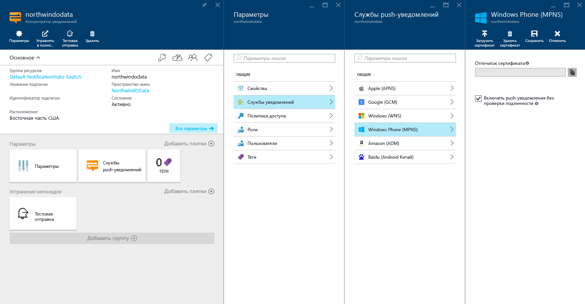

# Руководство по отправке push-уведомлений в конкретные приложения Windows Phone с помощью Центров уведомлений Azure
[!INCLUDE [notification-hubs-selector-get-started](../../includes/notification-hubs-selector-get-started.md)]

В этом руководстве показано, как использовать Центры уведомлений Azure для отправки push-уведомлений в приложения Silverlight на Windows Phone 8 или Windows Phone 8.1. Если вы намерены использовать платформу Windows Phone 8.1 (без Silverlight), перейдите к версии этого руководства для [Windows Universal](notification-hubs-windows-store-dotnet-get-started-wns-push-notification.md).

В этом учебнике вам предстоит создать пустое приложение Windows Phone 8, получающее push-уведомления с помощью службы push-уведомлений Майкрософт (MPNS). Создав это приложение, вы сможете рассылать через Центр уведомлений push-уведомления на все устройства, где запущено ваше приложение.

> [!NOTE]
> Центры уведомлений Windows Phone SDK не поддерживают использование службы push-уведомлений Windows (WNS) с приложениями Windows Phone 8.1 Silverlight. Использование WNS (вместо MPNS) с приложениями Windows Phone 8.1 Silverlight описано в статье [Центр уведомлений: учебник для Windows Phone Silverlight], в котором используются API REST.

Из этого руководства вы узнаете, как выполнять такие задачи: 

> [!div class="checklist"]
> * создание центра уведомлений;
> * создание приложения для Windows Phone;
> * тестовая отправка уведомления. 

## Предварительные требования

- **Подписка Azure**. Если у вас еще нет подписки Azure, создайте [бесплатную](https://azure.microsoft.com/free/) учетную запись Azure, прежде чем начинать работу.
- [Visual Studio 2015 Express с компонентами для разработки мобильных приложений](https://www.visualstudio.com/vs/older-downloads/).

Завершение изучения этого учебника является необходимым условием для работы со всеми другими учебниками, посвященными Центрам уведомлений для приложений Windows Phone 8.

## Создание центра уведомлений
[!INCLUDE [notification-hubs-portal-create-new-hub](../../includes/notification-hubs-portal-create-new-hub.md)]

### Настройка параметров Windows Phone (MPNS)
1. Выберите **Windows Phone (MPNS)** в разделе **Параметры уведомлений**.
2. Выберите **Enable authentication push** (Включить push-уведомления для аутентификации).
3. На панели инструментов щелкните **Сохранить**.

    

    Концентратор будет создан и настроен для отправки уведомлений без проверки подлинности для Windows Phone.

    > [!NOTE]
    > В этом учебнике используется MPNS в режиме без проверки подлинности. Режим MPNS без проверки подлинности налагает ограничения на использование уведомлений, отправляемых для каждого канала. Центры уведомлений поддерживают [Режим работы MPNS с проверкой подлинности](http://msdn.microsoft.com/library/windowsphone/develop/ff941099.aspx) , позволяя отправить ваш сертификат.

## Создание приложения для Windows Phone
В этом разделе объясняется, как создать приложение Windows Phone, которое регистрирует себя в Центре уведомлений. 

1. В Visual Studio создайте новое консольное приложение Windows Phone 8. 
   
    ![Visual Studio — новый проект — приложение для Windows Phone][13]
   
    В Visual Studio 2013 с обновлением 2 вместо этого вы создаете приложение Windows Phone Silverlight.
   
    ![Visual Studio — новый проект — пустое приложение — Windows Phone Silverlight][11]
2. В Visual Studio щелкните решение правой кнопкой мыши, а затем выберите пункт **Управление пакетами NuGet**.
3. Выполните поиск по запросу `WindowsAzure.Messaging.Managed` , щелкните **Установить**, а затем примите условия использования.
   
    ![Visual Studio — диспетчер пакетов NuGet][20]
4. Откройте файл App.xaml.cs и добавьте следующие инструкции `using` :
   
        using Microsoft.Phone.Notification;
        using Microsoft.WindowsAzure.Messaging;
5. Добавьте следующий код в верхнюю часть метода **Application_Launching** в файле App.xaml.cs:
   
        private void Application_Launching(object sender, LaunchingEventArgs e)
        {

            var channel = HttpNotificationChannel.Find("MyPushChannel");
            if (channel == null)
            {
                channel = new HttpNotificationChannel("MyPushChannel");
                channel.Open();
                channel.BindToShellToast();
            }
       
            channel.ChannelUriUpdated += new EventHandler<NotificationChannelUriEventArgs>(async (o, args) =>
            {
                var hub = new NotificationHub("<hub name>", "<connection string>");
                var result = await hub.RegisterNativeAsync(args.ChannelUri.ToString());
       
                System.Windows.Deployment.Current.Dispatcher.BeginInvoke(() =>
                {
                    MessageBox.Show("Registration :" + result.RegistrationId, "Registered", MessageBoxButton.OK);
                });
            });
        }
   
   > [!NOTE]
   > Значение **MyPushChannel** — это индекс, который используется для поиска существующего канала в коллекции [HttpNotificationChannel](https://msdn.microsoft.com/library/windows/apps/microsoft.phone.notification.httpnotificationchannel.aspx) . Если канал отсутствует, создайте новую запись с таким именем.
   > 
   > 
   
    Вставьте имя центра и строку подключения с именем **DefaultListenSharedAccessSignature**, которые вы сохранили в предыдущем разделе.
    Этот код получает универсальный код ресурса (URI) канала (ChannelURI) для приложения из MPNS, а затем регистрирует ChannelURI в вашем центре уведомлений. Он также гарантирует регистрацию ChannelURI в центре уведомлений при каждом запуске приложения.
   
   > [!NOTE]
   > В этом учебнике на устройство отправляется всплывающее уведомление. Когда вы отправляете всплывающее уведомление, необходимо вместо этого вызвать метод **BindToShellTile** в канале. Чтобы поддерживать одновременно и всплывающие уведомления, и уведомления на плитке, следует вызвать оба метода: **BindToShellTile** и **BindToShellToast**.
   > 
   > 
6. В обозревателе решений разверните меню **Свойства**, откройте файл `WMAppManifest.xml`, перейдите на вкладку **Capabilities** (Возможности) и убедитесь, что установлен флажок **ID_CAP_PUSH_NOTIFICATION**. Теперь ваше приложение может получать push-уведомления. 
   
    ![Visual Studio — возможности приложений Windows Phone][14]    
7. Нажмите клавишу `F5` , чтобы запустить приложение.
   
    В приложении отобразится сообщение о регистрации.
8. Закройте приложение или перейдите на домашнюю страницу. 
   
   > [!NOTE]
   > Для получения всплывающего push-уведомления приложение не должно выполняться в фоновом режиме.

## Тестовая отправка уведомления 

1. На портале Azure перейдите на вкладку "Обзор".
2. Выберите **Тестовая отправка**.

    
3. В окне **Тестовая отправка** выполните следующие действия.

    1. В поле **Платформы** выберите значение **Windows Phone**. 
    2. В поле **Тип уведомления** выберите значение **Всплывающее уведомление**. 
    3. Выберите **Отправить**.
    4. Проверьте **результат** в списке в нижней части окна. 

            
4. В эмуляторе Windows Phone или на телефоне под управлением Windows проверьте, что уведомление получено. 

    

## Дополнительная информация
В этом простом примере осуществляется широковещательная рассылка push-уведомлений на все устройства Windows Phone 8. Чтобы узнать, как отправлять push-уведомления на конкретные устройства, перейдите к следующему руководству:

> [!div class="nextstepaction"]
>[Отправка push-уведомлений на конкретные устройства](notification-hubs-windows-phone-push-xplat-segmented-mpns-notification.md)

<!-- Images. -->
[6]: ./media/notification-hubs-windows-phone-get-started/notification-hub-create-console-app.png
[7]: ./media/notification-hubs-windows-phone-get-started/notification-hub-create-from-portal.png
[8]: ./media/notification-hubs-windows-phone-get-started/notification-hub-create-from-portal2.png
[9]: ./media/notification-hubs-windows-phone-get-started/notification-hub-select-from-portal.png
[10]: ./media/notification-hubs-windows-phone-get-started/notification-hub-select-from-portal2.png
[11]: ./media/notification-hubs-windows-phone-get-started/notification-hub-create-wp-silverlight-app.png
[12]: ./media/notification-hubs-windows-phone-get-started/notification-hub-connection-strings.png

[13]: ./media/notification-hubs-windows-phone-get-started/notification-hub-create-wp-app.png
[14]: ./media/notification-hubs-windows-phone-get-started/mobile-app-enable-push-wp8.png
[15]: ./media/notification-hubs-windows-phone-get-started/notification-hub-pushauth.png
[20]: ./media/notification-hubs-windows-phone-get-started/notification-hub-windows-universal-app-install-package.png
[213]: ./media/notification-hubs-windows-phone-get-started/notification-hub-create-console-app.png

<!-- URLs. -->
[Notification Hubs Guidance]: http://msdn.microsoft.com/library/jj927170.aspx
[MPNS authenticated mode]: http://msdn.microsoft.com/library/windowsphone/develop/ff941099(v=vs.105).aspx
[Use Notification Hubs to push notifications to users]: notification-hubs-aspnet-backend-windows-dotnet-wns-notification.md
[Use Notification Hubs to send breaking news]: notification-hubs-windows-phone-push-xplat-segmented-mpns-notification.md
[toast catalog]: http://msdn.microsoft.com/library/windowsphone/develop/jj662938(v=vs.105).aspx
[tile catalog]: http://msdn.microsoft.com/library/windowsphone/develop/hh202948(v=vs.105).aspx
[Центр уведомлений: учебник для Windows Phone Silverlight]: https://github.com/Azure/azure-notificationhubs-samples/tree/master/PushToSLPhoneApp

