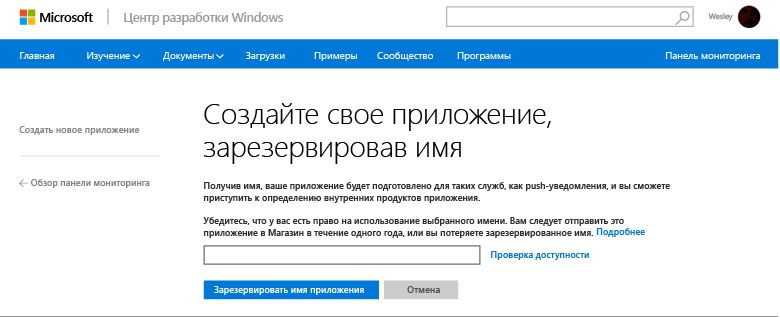
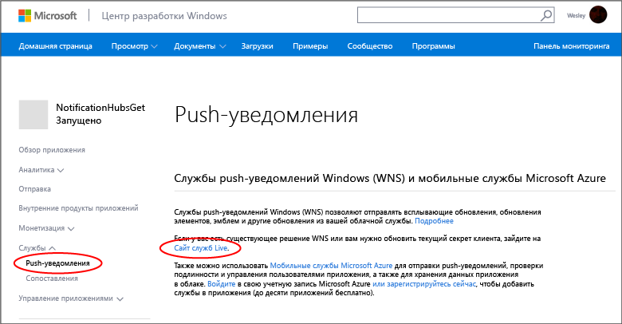
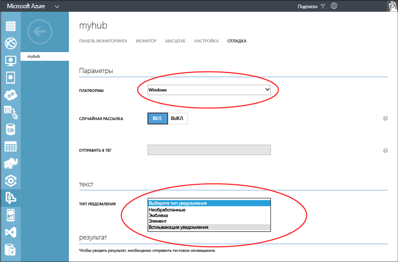

<properties
	pageTitle="Приступая к работе с Центрами уведомлений Azure для приложений Магазина Windows | Microsoft Azure"
	description="Из этого учебника вы узнаете, как использовать центры уведомлений Azure для отправки push-уведомлений в приложение для Магазина Windows или Windows Phone 8.1 (без Silverlight)."
	services="notification-hubs"
	documentationCenter="windows"
	authors="wesmc7777"
	manager="erikre"
	editor="erikre"/>

<tags
	ms.service="notification-hubs"
	ms.workload="mobile"
	ms.tgt_pltfrm="mobile-windows"
	ms.devlang="dotnet"
	ms.topic="hero-article"
	ms.date="06/29/2016"
	ms.author="wesmc"/>

# Приступая к работе с Центрами уведомлений для приложений Магазина Windows

[AZURE.INCLUDE [notification-hubs-selector-get-started](../../includes/notification-hubs-selector-get-started.md)]

##Обзор

В этом руководстве показано, как использовать центры уведомлений Azure для отправки push-уведомлений в приложение для Магазина Windows или Windows Phone 8.1 (без Silverlight). Если вы намерены использовать Windows Phone 8.1 Silverlight, см. версию статьи для [Windows Phone](notification-hubs-windows-mobile-push-notifications-mpns.md). В этом учебнике вам предстоит создать пустое приложение Магазина Windows, получающее push-уведомления с помощью службы push-уведомлений Windows (WNS). По завершении вы сможете рассылать push-уведомления на все устройства, где запущено ваше приложение, с помощью центра уведомлений.

## Перед началом работы

[AZURE.INCLUDE [notification-hubs-hero-slug](../../includes/notification-hubs-hero-slug.md)]

Полный код для этого учебника можно найти на портале [GitHub](https://github.com/Azure/azure-notificationhubs-samples/tree/master/dotnet/GetStartedWindowsUniversal).

##Предварительные требования

Для работы с данным учебником требуется следующее:

+ Microsoft Visual Studio Express 2013 для Windows с обновлением 2 или более поздней версии. Эта версия Visual Studio необходима для создания проекта универсального приложения. Для создания приложения для Магазина Windows требуется Visual Studio 2012 Express для Windows 8.

+ Активная учетная запись Магазина Windows.

+ Активная учетная запись Azure  Если у вас нет учетной записи Azure, вы можете создать бесплатную пробную учетную запись всего за несколько минут. Дополнительные сведения см. в разделе [Бесплатная пробная версия Azure](https://azure.microsoft.com/pricing/free-trial/?WT.mc_id=A0E0E5C02&amp;returnurl=http%3A%2F%2Fazure.microsoft.com%2Fru-RU%2Fdocumentation%2Farticles%2Fnotification-hubs-windows-store-dotnet-get-started%2F).

Завершение изучения этого учебника является необходимым условием для работы со всеми другими учебниками, посвященными концентраторам уведомлений для приложений Магазина Windows.

##Регистрация приложения для Магазина Windows

Чтобы отправлять push-уведомления в приложения Магазина Windows, необходимо связать приложение с Магазином Windows. После этого необходимо настроить концентратор уведомлений на интеграцию с WNS.

1. Если вы еще не зарегистрировали свое приложение, перейдите в [Центр разработки для Windows](http://go.microsoft.com/fwlink/p/?LinkID=266582), войдите с помощью учетной записи Майкрософт, а затем щелкните **Создать приложение**.

2. Введите имя приложения и нажмите кнопку **Зарезервировать имя приложения**.

   	

   	При этом создается новая регистрация в Магазине Windows для вашего приложения.

3. В Visual Studio создайте проект приложения Visual C# для Магазина с помощью шаблона **Пустое приложение**.

   	![][2]

4. В обозревателе решений щелкните правой кнопкой мыши проект приложения для Магазина Windows, щелкните **Магазин** и затем щелкните **Связать приложение с Магазином...**.

   	![][3]

   	Откроется мастер **Свяжите свое приложение с Магазином Windows**.

5. В окне мастера щелкните **Вход** и затем войдите в систему, используя свою учетную запись Майкрософт.

6. Выберите приложение, зарегистрированное на шаге 2, щелкните **Далее** и затем щелкните **Связать**.

   	![][4]

   	Это добавляет необходимые регистрационные данные Магазина Windows в манифест приложения.

7. (Необязательно.) Для проекта приложения для Windows Phone повторите шаги с 4 по 6.

8. Вернитесь на страницу нового приложения в [Центре разработки для Windows](http://go.microsoft.com/fwlink/p/?LinkID=266582), щелкните **Службы**, **Push-уведомления**, а затем в разделе **Службы push-уведомлений Windows (WNS) и мобильные службы Microsoft Azure** щелкните **Сайт служб Live**.

   	

9. Откройте вкладку **Параметры приложений** и запишите значения полей **Секрет клиента** и **Идентификатор безопасности пакета (SID)**.

   	![][6]

 	> [AZURE.WARNING]
	Секрет клиента и ИД безопасности пакета — это важные учетные данные для безопасного доступа. Не сообщайте никому эти значения и не распространяйте их вместе со своим приложением.

##Настройка концентратора уведомлений

[AZURE.INCLUDE [notification-hubs-portal-create-new-hub](../../includes/notification-hubs-portal-create-new-hub.md)]

<ol start="7">
<li>
Перейдите на расположенную сверху вкладку <b>Настройка</b>, введите значения в поля <b>Секрет клиента</b> и <b>ИД безопасности пакета</b>, полученные из WNS в предыдущем разделе, а затем нажмите кнопку <b>Сохранить</b>.

</li>
</ol>

&emsp;&emsp;

Концентратор уведомлений теперь настроен для работы с WNS, и у вас есть строки подключения, чтобы зарегистрировать приложение и отправлять уведомления.

##Подключение приложения к центру уведомлений

1. В Visual Studio щелкните решение правой кнопкой мыши, а затем выберите пункт **Управление пакетами NuGet**.

	Откроется диалоговое окно **Управление пакетами NuGet**.

2. Выполните поиск по запросу `WindowsAzure.Messaging.Managed` и щелкните **Установить**, выберите все проекты решения и примите условия использования.

	![][20]

	После этого будет выполнено скачивание и установка всех проектов, а также добавление во все проекты ссылок на библиотеку обмена сообщениями Azure для Windows с помощью <a href="http://nuget.org/packages/WindowsAzure.Messaging.Managed/">пакета WindowsAzure.Messaging.Managed NuGet</a>.

3. Откройте файл проекта App.xaml.cs и добавьте следующие операторы `using`. В проекте универсального приложения этот файл находится в папке `<project_name>.Shared`.

        using Windows.Networking.PushNotifications;
        using Microsoft.WindowsAzure.Messaging;
		using Windows.UI.Popups;

4. Кроме того, в файле App.xaml.cs добавьте определение метода **InitNotificationsAsync** в класс **App**:

	    private async void InitNotificationsAsync()
        {
            var channel = await PushNotificationChannelManager.CreatePushNotificationChannelForApplicationAsync();

            var hub = new NotificationHub("<hub name>", "<connection string with listen access>");
			var result = await hub.RegisterNativeAsync(channel.Uri);

            // Displays the registration ID so you know it was successful
            if (result.RegistrationId != null)
            {
                var dialog = new MessageDialog("Registration successful: " + result.RegistrationId);
                dialog.Commands.Add(new UICommand("OK"));
                await dialog.ShowAsync();
            }

        }

    Этот код получает универсальный идентификатор ресурса (URI) канала для приложения из WNS, а затем регистрирует этот идентификатор в вашем центре уведомлений.

    >[AZURE.NOTE]Обязательно замените заполнитель hub name именем концентратора уведомлений, отображаемым на вкладке **Концентраторы уведомлений** на [классическом портале Azure] (например, в предыдущем примере это **mynotificationhub2**). Кроме того, замените заполнитель строки подключения на строку подключения **DefaultListenSharedAccessSignature**, полученную в предыдущем разделе.

5. В верхней части обработчика событий **OnLaunched** в файле App.xaml.cs добавьте в новый метод **InitNotificationsAsync** следующий вызов:

        InitNotificationsAsync();

    Это обеспечит регистрацию URI канала в центре уведомлений при каждом запуске приложения.

6. В обозревателе решений дважды щелкните файл **Package.appxmanifest** приложения Магазина Windows и в разделе **Уведомления** установите для параметра **Всплывающие уведомления** значение **Да**.

   	![][18]

   	В меню **Файл** выберите **Сохранить все**.

7. (Необязательно.) Для проекта приложения для Windows Phone повторите предыдущий шаг.

8. Нажмите клавишу **F5**, чтобы запустить приложение. Отображается всплывающее диалоговое окно с ключом регистрации.

   	![][19]

9. (Необязательно) Повторите предыдущий шаг, чтобы запустить проект Windows Phone для регистрации приложения на устройстве Windows Phone.

Теперь приложение готово к получению всплывающих уведомлений.

##Отправка уведомлений 

Получение уведомлений в приложении можно проверить, отправив уведомления на [классическом портале Azure] на вкладке отладки центра уведомлений, как показано на следующем снимке экрана.

Push-уведомления обычно отправляются в серверной службе, например мобильными службами или ASP.NET, с помощью совместимой библиотеки. Также можно напрямую использовать REST API для отправки уведомлений, если для серверной части библиотека недоступна.

В этом учебнике мы пойдем по простому пути и продемонстрируем тестирование клиентского приложения, отправляя уведомления с помощью пакета SDK для .NET для центров уведомлений не в серверную службу, а в консольное приложение. В качестве следующего шага по отправке уведомлений с сервера ASP.NET рекомендуем ознакомиться с руководством [Уведомление пользователей посредством концентраторов уведомлений с помощью серверной части .NET]. Можно использовать следующие способы отправки уведомлений.

* **Интерфейс REST**. [Интерфейс REST](http://msdn.microsoft.com/library/windowsazure/dn223264.aspx) поддерживает уведомления на любой серверной платформе.

* **Пакет SDK .NET для концентраторов уведомлений Microsoft Azure**. В диспетчере пакетов NuGet для Visual Studio выполните команду [Install-Package Microsoft.Azure.NotificationHubs](https://www.nuget.org/packages/Microsoft.Azure.NotificationHubs/).

* **Node.js**. [Использование Центров уведомлений из Node.js](notification-hubs-nodejs-push-notification-tutorial.md).

* **Мобильные приложения Azure**. Пример отправки уведомлений из мобильного приложения Azure, интегрированного с центрами уведомлений, см. в статье [Добавление push-уведомлений в универсальное приложение среды выполнения Windows 8.1](../app-service-mobile/app-service-mobile-windows-store-dotnet-get-started-push.md).

* **Java или PHP**. Примеры отправки уведомлений с использованием REST API см. в статье «Использование концентраторов уведомлений из Java/PHP» ([Java](notification-hubs-java-push-notification-tutorial.md) | [PHP](notification-hubs-php-push-notification-tutorial.md)).

## (Необязательно) Отправке уведомлений из консольного приложения в C#

Для отправки уведомлений с помощью консольного приложения .NET выполните указанные ниже действия.

1. Щелкните решение правой кнопкой мыши, выберите пункты **Добавить** и **Новый проект**. После этого в разделе **Visual C#** последовательно выберите элементы **Windows** и **Консольное приложение**, а затем нажмите кнопку **ОК**.

   	![][13]

	При этом в решение добавляется новое консольное приложение Visual C#. Это можно сделать также и в отдельном решении.

2. В Visual Studio последовательно выберите элементы **Сервис**, **Диспетчер пакетов NuGet** и **Консоль диспетчера пакетов**.

	В результате в Visual Studio откроется консоль диспетчера пакетов.

3. В окне консоли диспетчера пакетов задайте свойство **Проект по умолчанию** для нового проекта консольного приложения, а затем в окне консоли выполните следующую команду:

        Install-Package Microsoft.Azure.NotificationHubs

	После этого будет добавлена ссылка на пакет SDK для Центров уведомлений Azure с помощью <a href="http://www.nuget.org/packages/Microsoft.Azure.NotificationHubs/">пакета NuGet Microsoft.Azure.Notification Hubs</a>.

	

4. Откройте файл Program.cs и добавьте следующее выражение `using`:

        using Microsoft.Azure.NotificationHubs;

5. Добавьте в класс **Program** следующий метод:

        private static async void SendNotificationAsync()
        {
            NotificationHubClient hub = NotificationHubClient
				.CreateClientFromConnectionString("<connection string with full access>", "<hub name>");
            var toast = @"<toast><visual><binding template=""ToastText01""><text id=""1"">Hello from a .NET App!</text></binding></visual></toast>";
            await hub.SendWindowsNativeNotificationAsync(toast);
        }

   	Обязательно замените заполнитель hub name именем концентратора уведомлений, отображаемым на вкладке **Концентраторы уведомлений** [классического портала Azure]. Кроме того, замените заполнитель строки подключения строкой подключения с именем **DefaultFullSharedAccessSignature**, полученной в разделе «Настройка концентратора уведомлений».

	>[AZURE.NOTE]Обязательно используйте строку подключения с **полным** доступом, а не c доступом к **прослушиванию**. У строки с доступом к прослушиванию отсутствуют разрешения для отправки уведомлений.

6. Добавьте следующие строки в метод **Main**:

         SendNotificationAsync();
		 Console.ReadLine();

7. В Visual Studio щелкните проект консольного приложения правой кнопкой мыши и выберите пункт **Назначить запускаемым проектом**. Нажмите клавишу **F5**, чтобы запустить консольное приложение.

   	![][14]

	На всех зарегистрированных устройствах будет получено всплывающее уведомление. Если щелкнуть заголовок уведомления или коснуться его, приложение будет загружено.

В таких разделах MSDN, как [каталог всплывающих уведомлений], [каталог плиток] и [обзор эмблем], можно найти всю полезную информацию по данной теме.

##Дальнейшие действия

В этом простом примере осуществляется рассылка уведомлений на все устройства Windows через портал или консольное приложение. На следующем этапе мы рекомендуем ознакомиться с руководством [Уведомление пользователей посредством концентраторов уведомлений с помощью серверной части .NET]. В нем описана процедура отправки уведомлений с сервера ASP.NET определенным пользователям с использованием тегов.

Если необходимо разделить пользователей по группам интересов, см. раздел [Использование концентраторов уведомлений для передачи экстренных новостей].

Дополнительные сведения о Центрах уведомлений см. в статье [Общие сведения о Центрах уведомлений].

<!-- Images. -->
[2]: ./media/notification-hubs-windows-store-dotnet-get-started/notification-hub-create-windows-universal-app.png
[3]: ./media/notification-hubs-windows-store-dotnet-get-started/notification-hub-associate-win8-app.png
[4]: ./media/notification-hubs-windows-store-dotnet-get-started/mobile-services-select-app-name.png
[6]: ./media/notification-hubs-windows-store-dotnet-get-started/mobile-services-win8-app-push-auth.png
[11]: ./media/notification-hubs-windows-store-dotnet-get-started/notification-hub-configure-wns.png
[13]: ./media/notification-hubs-windows-store-dotnet-get-started/notification-hub-create-console-app.png
[14]: ./media/notification-hubs-windows-store-dotnet-get-started/notification-hub-windows-toast.png
[15]: ./media/notification-hubs-windows-store-dotnet-get-started/notification-hub-scheduler1.png
[16]: ./media/notification-hubs-windows-store-dotnet-get-started/notification-hub-scheduler2.png
[18]: ./media/notification-hubs-windows-store-dotnet-get-started/notification-hub-win8-app-toast.png
[19]: ./media/notification-hubs-windows-store-dotnet-get-started/notification-hub-windows-reg.png
[20]: ./media/notification-hubs-windows-store-dotnet-get-started/notification-hub-windows-universal-app-install-package.png

<!-- URLs. -->
[классического портала Azure]: https://manage.windowsazure.com/
[классическом портале Azure]: https://manage.windowsazure.com/
[Общие сведения о Центрах уведомлений]: http://msdn.microsoft.com/library/jj927170.aspx

[Уведомление пользователей посредством концентраторов уведомлений с помощью серверной части .NET]: notification-hubs-aspnet-backend-windows-dotnet-notify-users.md
[Использование концентраторов уведомлений для передачи экстренных новостей]: notification-hubs-windows-store-dotnet-send-breaking-news.md

[каталог всплывающих уведомлений]: http://msdn.microsoft.com/library/windows/apps/hh761494.aspx
[каталог плиток]: http://msdn.microsoft.com/library/windows/apps/hh761491.aspx
[обзор эмблем]: http://msdn.microsoft.com/library/windows/apps/hh779719.aspx

<!---HONumber=AcomDC_0706_2016-->