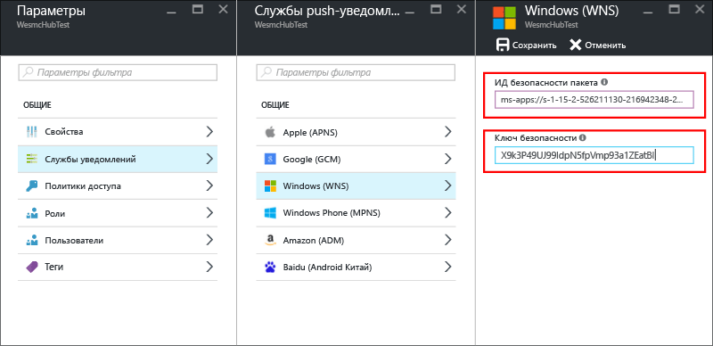

# Начало работы с Центрами уведомлений для приложений универсальной платформы Windows

[!INCLUDE [notification-hubs-selector-get-started](../../includes/notification-hubs-selector-get-started.md)]

## Обзор
В этой статье объясняется, как использовать Центры уведомлений Azure для отправки push-уведомлений в приложение универсальной платформы Windows (UWP).

Следуя инструкциям этой статьи, вы создадите пустое приложение Магазина Windows, получающее push-уведомления с помощью службы push-уведомлений Windows (WNS). По завершении вы сможете рассылать push-уведомления на все устройства, на которых запущено ваше приложение, с помощью концентратора уведомлений.

## Перед началом работы
[!INCLUDE [notification-hubs-hero-slug](../../includes/notification-hubs-hero-slug.md)]

Полный код для работы с этим руководством можно найти на портале [GitHub](https://github.com/Azure/azure-notificationhubs-samples/tree/master/dotnet/GetStartedWindowsUniversal).

## предварительным требованиям
Для работы с данным учебником требуется следующее:

* [Microsoft Visual Studio Community 2015](https://www.visualstudio.com/products/visual-studio-community-vs) или более поздняя версия.
* [Установленные средства разработки приложений универсальной платформы Windows](https://msdn.microsoft.com/windows/uwp/get-started/get-set-up)
* Активная учетная запись Azure.  
    Если ее нет, можно создать бесплатную пробную учетную запись всего за несколько минут. Дополнительные сведения см. на странице [Создайте бесплатную учетную запись Azure уже сегодня](https://azure.microsoft.com/pricing/free-trial/?WT.mc_id=A0E0E5C02&amp;returnurl=http%3A%2F%2Fazure.microsoft.com%2Fen-us%2Fdocumentation%2Farticles%2Fnotification-hubs-windows-store-dotnet-get-started%2F).
* Активная учетная запись Магазина Windows.

Изучение этого руководства является необходимым условием для работы со всеми остальными руководствами, посвященными Центрам уведомлений для приложений универсальной платформы Windows.

## Регистрация приложения для Магазина Windows
Чтобы отправлять push-уведомления в приложения UWP, необходимо связать приложение с Магазином Windows. Затем необходимо настроить интеграцию концентратора уведомлений с WNS.

1. Если вы еще не зарегистрировали свое приложение, перейдите в [Центр разработки для Windows](https://dev.windows.com/overview), войдите с помощью учетной записи Майкрософт, а затем выберите **Создать приложение**.

2. Введите имя приложения и выберите **Зарезервировать имя приложения**. Будет создана регистрация в Магазине Windows для вашего приложения.

3. В Visual Studio создайте проект приложений Visual C# для Магазина с помощью шаблона UWP **Пустое приложение** и нажмите кнопку **ОК**.

4. Примите значения по умолчанию для целевой и минимальной версий платформы.

5. В обозревателе решений щелкните правой кнопкой мыши проект приложения для Магазина Windows, выберите **Магазин**, а затем — **Связать приложение с Магазином**.  
    Откроется мастер **Свяжите свое приложение с Магазином Windows** .

6. В мастере войдите с помощью учетной записи Майкрософт.

7. Выберите приложение, зарегистрированное на шаге 2, нажмите кнопку **Далее**, а затем выберите **Связать**. После этого необходимые регистрационные данные Магазина Windows будут добавлены в манифест приложения.

8. На странице [Центр разработки для Windows](http://dev.windows.com/overview) своего нового приложения щелкните **Службы**, а затем — **Push-уведомления** и **WNS/MPNS**.

9. Выберите **Новое уведомление**.

10. Выберите шаблон **Blank (Toast)** (Пустое всплывающее уведомление) и нажмите кнопку **ОК**.

11. Введите **имя** уведомления и **контекстное** сообщение Visual. Затем нажмите кнопку **Сохранить как черновик**.

12. Откройте [портал регистрации приложений](http://apps.dev.microsoft.com) и войдите в систему.

13. Выберите имя приложения. Запишите значение пароля в разделе **секретов приложения** и значение **идентификатора безопасности пакета (SID)**, указанное в параметрах платформы **Магазина Windows**.

    >[!WARNING]
    >Секрет приложения и ИД безопасности пакета — это важные учетные данные для безопасного доступа. Не сообщайте никому эти значения и не распространяйте их вместе со своим приложением.

## Настройка концентратора уведомлений
[!INCLUDE [notification-hubs-portal-create-new-hub](../../includes/notification-hubs-portal-create-new-hub.md)]

<ol start="6">
<li>
В разделе <b>Службы уведомлений</b> щелкните <b>Windows (WNS)</b>, а затем введите секретный пароль приложения в поле <b>Ключ безопасности</b>. В поле <b>Идентификатор безопасности пакета</b> введите значение, полученное из WNS при работе с предыдущим разделом, и нажмите кнопку <b>Сохранить</b>.

</li>
</ol>

Теперь концентратор уведомлений настроен для работы с WNS. А у вас есть строки подключения для регистрации приложения и отправки уведомлений.

## Подключение приложения к центру уведомлений
1. В Visual Studio щелкните решение правой кнопкой мыши, а затем выберите пункт **Управление пакетами NuGet**.  
    Откроется окно **Управление пакетами NuGet**.

2. В поле поиска введите **Microsoft.Azure.NotificationHubs**, выберите **Установить** и примите условия использования.
   
    ![Окно "Управление пакетами NuGet"][20]
   
    Это действие предназначено для скачивания и установки библиотеки Центров уведомлений Azure для Windows, а также добавления ссылки на нее с помощью [пакета NuGet Microsoft.Azure.Notification Hubs](https://www.nuget.org/packages/Microsoft.Azure.NotificationHubs).

3. Откройте файл проекта App.xaml.cs и добавьте следующие операторы `using`: 
   
        using Windows.Networking.PushNotifications;
        using Microsoft.WindowsAzure.Messaging;
        using Windows.UI.Popups;

4. В файле App.xaml.cs добавьте определение метода **InitNotificationsAsync** в класс **App**:
   
        private async void InitNotificationsAsync()
        {
            var channel = await PushNotificationChannelManager.CreatePushNotificationChannelForApplicationAsync();
   
            var hub = new NotificationHub("<your hub name>", "<Your DefaultListenSharedAccessSignature connection string>");
            var result = await hub.RegisterNativeAsync(channel.Uri);
   
            // Displays the registration ID so you know it was successful
            if (result.RegistrationId != null)
            {
                var dialog = new MessageDialog("Registration successful: " + result.RegistrationId);
                dialog.Commands.Add(new UICommand("OK"));
                await dialog.ShowAsync();
            }
   
        }
   
    Этот код получает универсальный идентификатор ресурса (URI) канала для приложения из WNS, а затем регистрирует этот идентификатор в вашем центре уведомлений.
   
    >[!NOTE]
    >* Замените заполнитель **hub name** именем концентратора уведомлений, которое отображается на портале Azure. 
    >* Кроме того, замените заполнитель строки подключения строкой подключения **DefaultListenSharedAccessSignature**, полученной на странице **Политики доступа** концентратора уведомлений при работе с предыдущим разделом.
   > 
   > 
5. В верхней части обработчика событий **OnLaunched** в файле App.xaml.cs добавьте в новый метод **InitNotificationsAsync** следующий вызов:
   
        InitNotificationsAsync();
   
    Это обеспечит регистрацию URI канала в центре уведомлений при каждом запуске приложения.

6. Нажмите клавишу **F5**, чтобы запустить приложение. Откроется всплывающее диалоговое окно с ключом регистрации.

Теперь приложение готово к получению всплывающих уведомлений.

## Отправка уведомлений
Чтобы проверить получение уведомлений в приложении, отправьте уведомления на [портале Azure](https://portal.azure.com/). Нажмите кнопку **Тестовая отправка** в центре уведомлений, как показано на следующем рисунке:

Push-уведомления обычно отправляются в серверных службах, например мобильных службах или ASP.NET, с помощью совместимой библиотеки. Если для серверной части библиотека недоступна, также можно отправлять уведомления напрямую с помощью REST API. 

В этом руководстве показан простой пример тестирования клиентского приложения, в котором уведомление отправляется с помощью пакета SDK для .NET для центров уведомлений не в серверную службу, а в консольное приложение. Дальнейшие инструкции по отправке уведомлений с серверной части ASP.NET см. в руководстве по [отправке уведомлений с помощью Центров уведомлений]. Вы также можете отправлять уведомления с помощью следующих средств:

* **Интерфейс REST**. [Интерфейс REST](http://msdn.microsoft.com/library/windowsazure/dn223264.aspx) поддерживает уведомления на любой серверной платформе.

* **Пакет SDK .NET для Центров уведомлений Microsoft Azure**. В диспетчере пакетов NuGet для Visual Studio выполните команду [Install-Package Microsoft.Azure.NotificationHubs](https://www.nuget.org/packages/Microsoft.Azure.NotificationHubs/).

* **Node.js**. [Отправка push-уведомлений с помощью Центров уведомлений Azure и Node.js](notification-hubs-nodejs-push-notification-tutorial.md).
* **Мобильные приложения Azure**. Пример отправки уведомлений из мобильного приложения Azure, интегрированного с Центрами уведомлений, см. в статье [Добавление push-уведомлений в приложение Windows](../app-service-mobile/app-service-mobile-windows-store-dotnet-get-started-push.md).

* **Java и PHP**. Примеры отправки уведомлений с помощью API REST см. по ссылкам ниже:
    * [Java](notification-hubs-java-push-notification-tutorial.md)
    * [PHP](notification-hubs-php-push-notification-tutorial.md)

## Дополнительная информация
В этом простом примере настраивается рассылка уведомлений на все устройства Windows через портал или консольное приложение. На следующем этапе мы рекомендуем ознакомиться с руководством [отправке уведомлений с помощью Центров уведомлений]. В нем описана процедура отправки уведомлений с сервера ASP.NET конкретным пользователям с использованием тегов.

Если необходимо разделить пользователей по группам интересов, см. раздел [Использование концентраторов уведомлений для передачи экстренных новостей]. 

См. дополнительные сведения о [Центрах уведомлений](notification-hubs-push-notification-overview.md).

<!-- Images. -->
[13]: ./media/notification-hubs-windows-store-dotnet-get-started/notification-hub-create-console-app.png
[14]: ./media/notification-hubs-windows-store-dotnet-get-started/notification-hub-windows-toast.png
[19]: ./media/notification-hubs-windows-store-dotnet-get-started/notification-hub-windows-reg.png
[20]: ./media/notification-hubs-windows-store-dotnet-get-started/notification-hub-windows-universal-app-install-package.png

<!-- URLs. -->

[отправке уведомлений с помощью Центров уведомлений]: notification-hubs-aspnet-backend-windows-dotnet-wns-notification.md
[Использование концентраторов уведомлений для передачи экстренных новостей]: notification-hubs-windows-notification-dotnet-push-xplat-segmented-wns.md

[toast catalog]: http://msdn.microsoft.com/library/windows/apps/hh761494.aspx
[tile catalog]: http://msdn.microsoft.com/library/windows/apps/hh761491.aspx
[badge overview]: http://msdn.microsoft.com/library/windows/apps/hh779719.aspx
 
