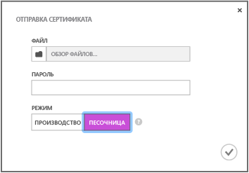
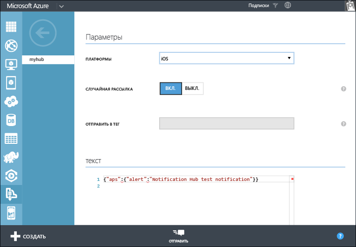

<properties
	pageTitle="Приступая к работе с Центрами уведомлений для приложений Xamarin.iOS | Microsoft Azure"
	description="Из этого учебника вы узнаете, как использовать Центры уведомлений Azure для отправки push-уведомлений в приложение Xamarin.iOS."
	services="notification-hubs"
	documentationCenter="xamarin"
	authors="ysxu"
	manager="dwrede"
	editor=""/>

<tags
	ms.service="notification-hubs"
	ms.workload="mobile"
	ms.tgt_pltfrm="mobile-xamarin-ios"
	ms.devlang="dotnet"
	ms.topic="hero-article"
	ms.date="11/03/2015"
	ms.author="yuaxu"/>

# Приступая к работе с центрами уведомлений

[AZURE.INCLUDE [notification-hubs-selector-get-started](../../includes/notification-hubs-selector-get-started.md)]

##Обзор

В этом учебнике показано, как использовать Центры уведомлений Azure для отправки push-уведомлений в приложение на платформе iOS. Вам предстоит создать пустое приложение Xamarin.iOS, получающее push-уведомления с помощью службы push-уведомлений Apple (APNS). По завершении вы сможете рассылать push-уведомления на все устройства, где запущено ваше приложение, с помощью центра уведомлений. Готовый код доступен в примере [приложения NotificationHubs][GitHub].

В этом учебнике описывается простой сценарий вещания с использованием Центров уведомлений.

##Предварительные требования

Для работы с данным учебником требуется следующее:

+ [XCode 6.0][Install Xcode]
+ Устройство с iOS 7.0 (или более поздней версии)
+ Участие в программе для разработчиков на платформе iOS
+ [Xamarin.iOS]
+ [Компонент мобильных служб Azure]

   >[AZURE.NOTE]В соответствии с требованиями к конфигурации push-уведомлений необходимо выполнить развертывание push-уведомлений и протестировать их на устройстве с iOS (iPhone или iPad), а не в эмуляторе.

Изучение этого учебника в полном объеме является необходимым условием для работы со всеми другими учебниками, посвященными Центрам уведомлений для приложений Xamarin.iOS.

> [AZURE.IMPORTANT]Для работы с этим учебником необходима активная учетная запись Azure. Если ее нет, можно создать бесплатную пробную учетную запись всего за несколько минут. Дополнительные сведения см. в разделе [Бесплатная пробная версия Azure](http://azure.microsoft.com/pricing/free-trial/?WT.mc_id=A643EE910&amp;returnurl=http%3A%2F%2Fazure.microsoft.com%2Fru-RU%2Fdocumentation%2Farticles%2Fpartner-xamarin-notification-hubs-ios-get-started).

[AZURE.INCLUDE [Включение push-уведомлений Apple через центры уведомлений](../../includes/notification-hubs-enable-apple-push-notifications.md)]

##Настройка концентратора уведомлений

В этом разделе приведены пошаговые инструкции по созданию нового центра уведомлений и настройке проверки подлинности с помощью службы APNS, использующей раннее созданный вами сертификат push-уведомлений (файл с расширением **P12**). Если вы хотите использовать уже созданный центр уведомлений, перейдите к шагу 5.

[AZURE.INCLUDE [notification-hubs-portal-create-new-hub](../../includes/notification-hubs-portal-create-new-hub.md)]

<ol start="7">
<li>

Перейдите на вкладку <b>Настройка</b> вверху, а затем в параметрах службы уведомлений Apple нажмите кнопку <b>Отправить</b>, чтобы отправить отпечаток сертификата. Выберите ранее экспортированный сертификат (файл с расширением <b>P12</b>) и пароль для него.

Убедитесь, что вы работаете в режиме <b>песочницы</b>, так как это необходимо для разработки. Используйте <b>рабочую среду</b>, только если вы хотите отправлять push-уведомления пользователям, которые приобрели ваше приложение в магазине.

</li>
</ol>
&emsp;&emsp;

&emsp;&emsp;

Центр уведомлений теперь настроен для работы с APNS, и у вас есть строки подключения, чтобы зарегистрировать приложение и отправлять уведомления.

##Подключение приложения к центру уведомлений

#### Создание нового проекта

1. В Xamarin Studio создайте новый проект iOS и выберите шаблон **Unified API** (Единый API) > **Single View Application** (Приложение с одним представлением).

   	![][31]

2. Добавьте ссылку на компонент обмена сообщениями Azure. В представлении Solution (Решение) щелкните правой кнопкой мыши папку **Components** (Компоненты) для вашего проекта и выберите элемент **Get More Components** (Получить дополнительные компоненты). Найдите компонент **Мобильные службы Azure** и добавьте его в проект.

3. В файле **AppDelegate.cs** добавьте следующий оператор using:

    	using WindowsAzure.Messaging;

4. Объявите экземпляр **SBNotificationHub**:

		private SBNotificationHub Hub { get; set; }

5. Создайте класс **Constants.cs** со следующими переменными:

        // Azure app-specific connection string and hub path
        public const string ConnectionString = "<Azure connection string>";
        public const string NotificationHubPath = "<Azure hub path>";

6. В файле **AppDelegate.cs** обновите метод **FinishedLaunching()**, как указано ниже.

        public override bool FinishedLaunching(UIApplication application, NSDictionary launchOptions)
        {
            if (UIDevice.CurrentDevice.CheckSystemVersion (8, 0)) {
    			var pushSettings = UIUserNotificationSettings.GetSettingsForTypes (
                       UIUserNotificationType.Alert | UIUserNotificationType.Badge | UIUserNotificationType.Sound,
                       new NSSet ());

			    UIApplication.SharedApplication.RegisterUserNotificationSettings (pushSettings);
			    UIApplication.SharedApplication.RegisterForRemoteNotifications ();
			} else {
			    UIRemoteNotificationType notificationTypes = UIRemoteNotificationType.Alert | UIRemoteNotificationType.Badge | UIRemoteNotificationType.Sound;
			    UIApplication.SharedApplication.RegisterForRemoteNotificationTypes (notificationTypes);
			}

            return true;
        }

7. Переопределите метод **RegisteredForRemoteNotifications()** в **AppDelegate.cs**.

        public override void RegisteredForRemoteNotifications(UIApplication application, NSData deviceToken)
        {
            Hub = new SBNotificationHub(Constants.ConnectionString, Constants.NotificationHubPath);

            Hub.UnregisterAllAsync (deviceToken, (error) => {
                if (error != null)
                {
                    Console.WriteLine("Error calling Unregister: {0}", error.ToString());
                    return;
                }

                NSSet tags = null; // create tags if you want
                Hub.RegisterNativeAsync(deviceToken, tags, (errorCallback) => {
                    if (errorCallback != null)
                        Console.WriteLine("RegisterNativeAsync error: " + errorCallback.ToString());
                });
            });
        }

8. Переопределите метод **ReceivedRemoteNotification()** в **AppDelegate.cs**.

        public override void ReceivedRemoteNotification(UIApplication application, NSDictionary userInfo)
        {
            ProcessNotification(userInfo, false);
        }

9. Создайте следующий метод **ProcessNotification()** в **AppDelegate.cs**:

        void ProcessNotification(NSDictionary options, bool fromFinishedLaunching)
        {
            // Check to see if the dictionary has the aps key.  This is the notification payload you would have sent
            if (null != options && options.ContainsKey(new NSString("aps")))
            {
                //Get the aps dictionary
                NSDictionary aps = options.ObjectForKey(new NSString("aps")) as NSDictionary;

                string alert = string.Empty;

                //Extract the alert text
                // NOTE: If you're using the simple alert by just specifying
                // "  aps:{alert:"alert msg here"}  ", this will work fine.
                // But if you're using a complex alert with Localization keys, etc.,
                // your "alert" object from the aps dictionary will be another NSDictionary.
                // Basically the JSON gets dumped right into a NSDictionary,
                // so keep that in mind.
                if (aps.ContainsKey(new NSString("alert")))
                    alert = (aps [new NSString("alert")] as NSString).ToString();

                //If this came from the ReceivedRemoteNotification while the app was running,
                // we of course need to manually process things like the sound, badge, and alert.
                if (!fromFinishedLaunching)
                {
                    //Manually show an alert
                    if (!string.IsNullOrEmpty(alert))
                    {
                        UIAlertView avAlert = new UIAlertView("Notification", alert, null, "OK", null);
                        avAlert.Show();
                    }
                }
            }
        }

    > [AZURE.NOTE]Вы можете переопределить метод **FailedToRegisterForRemoteNotifications()** для обработки различных ситуаций, таких как отсутствие сетевого подключения.

10. Запустите приложение на устройстве.

## Отправка уведомлений

Можно проверить получение уведомлений в приложении, отправив уведомления на портале Azure с помощью вкладки отладки центра уведомлений, как показано на следующем экране.

Push-уведомления обычно отправляются в серверной службе, например мобильными службами или ASP.NET, с помощью совместимой библиотеки. Также можно напрямую использовать REST API для отправки уведомлений, если для серверной части библиотека недоступна.

В этом учебнике мы пойдем по простому пути и продемонстрируем тестирование клиентского приложения, отправляя уведомления с помощью пакета SDK для .NET для центров уведомлений не в серверную службу, а в консольное приложение. В качестве следующего шага по отправке уведомлений с сервера ASP.NET рекомендуем ознакомиться с учебником [Уведомление пользователей посредством Центров уведомлений](notification-hubs-aspnet-backend-ios-notify-users.md). Можно использовать следующие способы отправки уведомлений.

* **Интерфейс REST**. [Интерфейс REST](http://msdn.microsoft.com/library/windowsazure/dn223264.aspx) поддерживает уведомления на любой серверной платформе.

* **Пакет SDK .NET для Центров уведомлений Microsoft Azure**. В диспетчере пакетов NuGet для Visual Studio выполните команду [Install-Package Microsoft.Azure.NotificationHubs](https://www.nuget.org/packages/Microsoft.Azure.NotificationHubs/).

* **Node.js**. [Использование Центров уведомлений с Node.js](notification-hubs-nodejs-how-to-use-notification-hubs.md).

* **Мобильные службы Azure**. Примеры отправки уведомлений из интерфейса мобильных служб Azure, интегрированного с Центрами уведомлений, см. в статье «Приступая к работе с push-уведомлениями в мобильных службах» ([Серверная часть .NET](../mobile-services/mobile-services-javascript-backend-windows-store-dotnet-get-started-push.md) | [Серверная часть JavaScript](../mobile-services/mobile-services-javascript-backend-windows-store-dotnet-get-started-push.md)).

* **Java или PHP**. Примеры отправки уведомлений с использованием REST API см. в статье «Использование Центров уведомлений в Java/PHP» ([Java](notification-hubs-java-backend-how-to.md) | [PHP](notification-hubs-php-backend-how-to.md)).

####(Необязательно) Отправка уведомлений из консольного приложения .NET

В этом разделе мы будем отправлять уведомления с помощью консольного приложения .NET.

1. Создайте новое консольное приложение Visual C#.

   	![][213]

2. В Visual Studio последовательно выберите элементы **Сервис**, **Диспетчер пакетов NuGet** и **Консоль диспетчера пакетов**.

	В результате в Visual Studio откроется консоль диспетчера пакетов.

3. В окне консоли диспетчера пакетов задайте свойство **Проект по умолчанию** для нового проекта консольного приложения, а затем в окне консоли выполните следующую команду:

        Install-Package Microsoft.Azure.NotificationHubs

	После этого будет добавлена ссылка на пакет SDK для Центров уведомлений Azure с помощью <a href="http://www.nuget.org/packages/Microsoft.Azure.NotificationHubs/">пакета NuGet Microsoft.Azure.NotificationHubs</a>.

	

4. Откройте файл Program.cs и добавьте следующий оператор `using`:

        using Microsoft.Azure.NotificationHubs;

3. Добавьте в класс `Program` следующий метод:

        private static async void SendNotificationAsync()
        {
            NotificationHubClient hub = NotificationHubClient.CreateClientFromConnectionString("<connection string with full access>", "<hub name>");
            var alert = "{"aps":{"alert":"Hello from .NET!"}}";
            await hub.SendAppleNativeNotificationAsync(alert);
        }

4. Затем добавьте в метод `Main` следующие строки:

         SendNotificationAsync();
		 Console.ReadLine();

5. Нажмите клавишу F5, чтобы запустить приложение. На устройстве должно отобразиться оповещение. Если вы используете Wi-Fi, убедитесь, что подключение работает.

Все возможные виды полезных нагрузок можно найти в [руководстве по программированию локальных и push-уведомлений] Apple.

####(Необязательно) Отправка уведомлений с помощью мобильной службы

В этом разделе мы будем отправлять уведомления с помощью мобильной службы, используя скрипт узла.

Чтобы отправить уведомление с помощью мобильной службы, следуйте инструкциям из статьи [Приступая к работе с мобильными службами], а затем выполните указанные ниже действия.

1. Войдите на [портал Azure] и выберите мобильную службу.

2. Откройте расположенную сверху вкладку **Планировщик**.

   	![][215]

3. Создайте новое запланированное задание, вставьте имя и выберите **По запросу**.

   	![][216]

4. Создав задание, щелкните его имя. Откройте вкладку **Скрипт** в верхней панели.

5. Вставьте следующий скрипт внутрь функции планировщика. Обязательно замените заполнители именем концентратора уведомлений и строкой подключения для элемента *DefaultFullSharedAccessSignature*, полученными ранее. Щелкните **Сохранить**.

		var azure = require('azure');
		var notificationHubService = azure.createNotificationHubService('<Hubname>', '<SAS Full access >');
		notificationHubService.apns.send(
	    	null,
    		{"aps":
        		{
          		"alert": "Hello from Mobile Services!"
        		}
    		},
    		function (error)
    		{
	        	if (!error) {
    	        	console.warn("Notification successful");
        		}
    		}
		);

6. Нажмите кнопку **Запустить один раз** на нижней панели. На устройстве должно отобразиться оповещение.

##Дальнейшие действия

В этом простом примере осуществляется широковещательная рассылка уведомлений на все устройства iOS. Чтобы сориентироваться на определенных пользователей, см. учебник [Использование концентраторов уведомлений для отправки push-уведомлений пользователям]. Если необходимо разделить пользователей по группам интересов, см. раздел [Использование концентраторов уведомлений для передачи экстренных новостей]. Дополнительные сведения об использовании Центров уведомлений см. в статьях [Общие сведения о Центрах уведомлений] и [Инструкции по использованию Центров уведомлений для iOS].

<!-- Images. -->

[213]: ./media/partner-xamarin-notification-hubs-ios-get-started/notification-hub-create-console-app.png

[215]: ./media/partner-xamarin-notification-hubs-ios-get-started/notification-hub-scheduler1.png
[216]: ./media/partner-xamarin-notification-hubs-ios-get-started/notification-hub-scheduler2.png

[31]: ./media/partner-xamarin-notification-hubs-ios-get-started/notification-hub-create-ios-app.png

<!-- URLs. -->
[Mobile Services iOS SDK]: http://go.microsoft.com/fwLink/?LinkID=266533
[Submit an app page]: http://go.microsoft.com/fwlink/p/?LinkID=266582
[My Applications]: http://go.microsoft.com/fwlink/p/?LinkId=262039
[Live SDK for Windows]: http://go.microsoft.com/fwlink/p/?LinkId=262253

[Приступая к работе с мобильными службами]: /develop/mobile/tutorials/get-started-xamarin-ios
[портал Azure]: https://manage.windowsazure.com/
[Общие сведения о Центрах уведомлений]: http://msdn.microsoft.com/library/jj927170.aspx
[Инструкции по использованию Центров уведомлений для iOS]: http://msdn.microsoft.com/library/jj927168.aspx
[Install Xcode]: https://go.microsoft.com/fwLink/p/?LinkID=266532
[iOS Provisioning Portal]: http://go.microsoft.com/fwlink/p/?LinkId=272456

[Использование концентраторов уведомлений для отправки push-уведомлений пользователям]: /manage/services/notification-hubs/notify-users-aspnet
[Использование концентраторов уведомлений для передачи экстренных новостей]: /manage/services/notification-hubs/breaking-news-dotnet

[руководстве по программированию локальных и push-уведомлений]: http://developer.apple.com/library/mac/#documentation/NetworkingInternet/Conceptual/RemoteNotificationsPG/Chapters/ApplePushService.html#//apple_ref/doc/uid/TP40008194-CH100-SW1
[Apple Push Notification Service]: http://go.microsoft.com/fwlink/p/?LinkId=272584

[Компонент мобильных служб Azure]: http://components.xamarin.com/view/azure-mobile-services/
[GitHub]: http://go.microsoft.com/fwlink/p/?LinkId=331329
[Xamarin.iOS]: http://xamarin.com/download
[WindowsAzure.Messaging]: https://github.com/infosupport/WindowsAzure.Messaging.iOS

<!---HONumber=Nov15_HO3-->