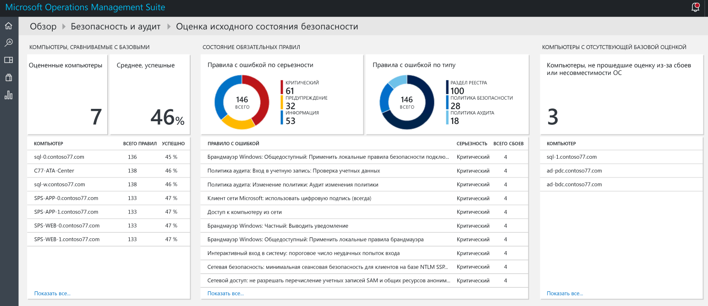
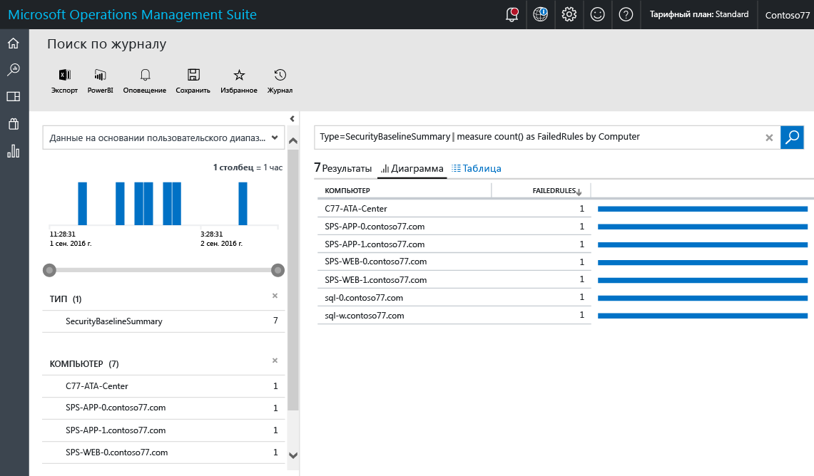
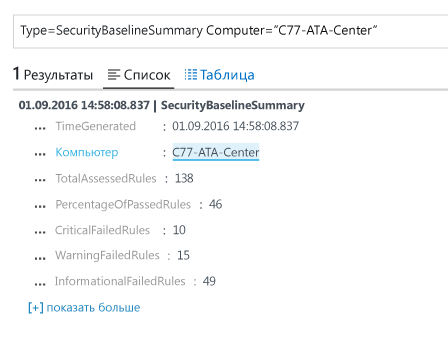
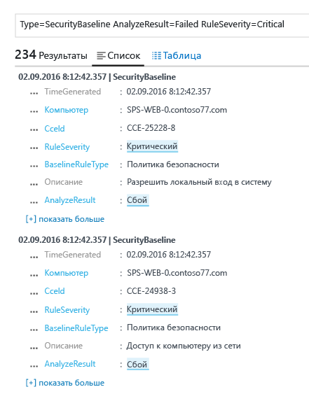

<properties
   pageTitle="Оценка базовых показателей с помощью решения "Безопасность и аудит" Operations Management Suite | Microsoft Azure"
   description="В этом документе объясняется, как выполнить оценку базовых показателей всех отслеживаемых компьютеров с помощью решения "Безопасность и аудит" Operations Management Suite в целях обеспечения безопасности и соответствия требованиям."
   services="operations-management-suite"
   documentationCenter="na"
   authors="YuriDio"
   manager="swadhwa"
   editor=""/>

<tags
   ms.service="operations-management-suite"
   ms.devlang="na"
   ms.topic="hero-article"
   ms.tgt_pltfrm="na"
   ms.workload="na"
   ms.date="09/08/2016"
   ms.author="yurid"/>

# Оценка базовых показателей в решении "Безопасность и аудит" Operations Management Suite

В этом документе показано, как использовать возможности оценки базовых показателей [решения "Безопасность и аудит" Operations Management Suite (OMS)](operations-management-suite-overview.md), чтобы оценить безопасное состояние отслеживаемых ресурсов.

## Что такое оценка базовых показателей?

Корпорация Майкрософт совместно с другими отраслевыми и государственными организациями по всему миру определяет конфигурацию Windows, обеспечивающую развертывание серверов с высоким уровнем безопасности. Эта конфигурация включает в себя набор разделов реестра, параметры политики аудита и безопасности, а также рекомендуемые корпорацией Майкрософт значения для этих параметров. Этот набор правил называется базовыми показателями безопасности. Функция оценки базовых показателей в решении OMS "Безопасность и аудит" позволяет быстро и эффективно проверить все компьютеры на соответствие требованиям. 

Есть такие три типа правил:

- **Правила реестра** — проверяют правильность задания разделов реестра.
- **Правила политики аудита**.
- **Правила политики безопасности** — правила, связанные с разрешениями пользователя на компьютере.

> [AZURE.NOTE] Краткий обзор этой возможности см. в записи блога [Use OMS Security to assess the Security Configuration Baseline](https://blogs.technet.microsoft.com/msoms/2016/08/12/use-oms-security-to-assess-the-security-configuration-baseline/) (Оценка базовых показателей конфигурации безопасности с помощью решения OMS "Безопасность и аудит").

## Оценка базовых показателей безопасности

Результаты оценки текущих базовых показателей безопасности всех компьютеров, которые отслеживаются с помощью решения OMS "Безопасность и аудит", можно просмотреть на панели мониторинга.  Чтобы перейти к панели мониторинга оценки базовых показателей безопасности, сделайте следующее:

1. На главной панели мониторинга **Microsoft Operations Management Suite** щелкните плитку **Безопасность и аудит**.
2. На панели мониторинга **Безопасность и аудит** щелкните **Базовая оценка** в разделе **Домены безопасности**. Откроется панель мониторинга **оценки базовых показателей безопасности**, как на следующем рисунке.
    
    

Эта панель мониторинга состоит из трех основных областей:

- **Компьютеры, сравниваемые с базовыми**: в этом разделе приводятся сведения о количестве оцененных компьютеров и проценте компьютеров, которые прошли оценку. Здесь также перечислены первые 10 компьютеров и результат их оценки в процентах.
- **Обязательное состояние правил**: этот раздел предоставляет сведения о правилах со сбоями по уровню серьезности и типу. Просмотрев первую диаграмму, вы сможете быстро определить, является ли большинство правил со сбоями критическими. В этом разделе также приведен список из первых 10 правил со сбоями и уровень их серьезности. На второй диаграмме представлены типы правил, в которых произошел сбой в ходе выполнения оценки. 
- **Компьютеры с отсутствующей базовой оценкой**: в этом разделе содержится список компьютеров, которые не были оценены из-за несовместимости операционной системы или сбоев. 

### Просмотр сведений о компьютерах, сравниваемых на совместимость с оценкой

В идеале все компьютеры должны быть совместимыми с оценкой базовых показателей безопасности. Однако в некоторых случаях это не так. В рамках процесса управления безопасностью следует проверять компьютеры, которые не прошли все тесты оценки безопасности. Простой способ увидеть список этих компьютеров — выбрать параметр **Оцененные компьютеры** в разделе **Компьютеры, сравниваемые с базовыми**. После этого откроется область результатов поиска в журнале со списком компьютеров, как показано на следующем экране.

Результаты поиска представлены в виде таблицы, где в первом столбце указано имя компьютера, а во втором — число правил, которые завершились сбоем. Чтобы получить сведения о типе правила со сбоем, щелкните число правил, завершившихся сбоем, возле имени компьютера. После этого появится результат, подобный следующему:

В результатах поиска содержится общее количество оцененных правил, количество завершившихся сбоем правил с критическим уровнем серьезности и правил уровня предупреждения, а также сведения о правилах со сбоями.

### Просмотр сведений об обязательном состоянии правил

После того как вы просмотрите информацию о проценте компьютеров, прошедших оценку, вам может потребоваться получить сведения о завершившихся сбоем правилах с критическим уровнем серьезности. Эта визуализация помогает определить, какие компьютеры следует рассмотреть первыми, чтобы обеспечить их соответствие при последующей оценке. Наведите указатель мыши на часть диаграммы с правилами критического уровня на плитке **Правила со сбоями по степени серьезности** в разделе **Обязательное состояние правил** и щелкните ее. Отобразится результат, как на следующем экране:

 

В этих результатах журнала содержатся тип и описание правила оценки базовых показателей со сбоем, а также идентификатор перечисления общей конфигурации (CCE) этого правила безопасности. Этих атрибутов достаточно, чтобы выполнить корректирующие действия для устранения этой проблемы на целевом компьютере.

> [AZURE.NOTE] Дополнительные сведения о CCE см. в [национальной базе данных уязвимостей](https://nvd.nist.gov/cce/index.cfm).

### Просмотр сведений о компьютерах с отсутствующей базовой оценкой

OMS поддерживает профиль базовых показателей участника домена в Windows Server от версии 2008 R2 до 2012 R2. Эта возможность для Windows Server 2016 находится на этапе разработки и будет добавлена после публикации. Все другие операционные системы, проверенные в ходе оценки базовых показателей решением OMS "Безопасность и аудит", приведены в разделе **Компьютеры с отсутствующей базовой оценкой**.

## См. также

В этом документе вы узнали о процедуре оценки базовых показателей в решении OMS "Безопасность и аудит". Дополнительные сведения о функциях безопасности OMS см. в следующих статьях.

- [Общие сведения об Operations Management Suite (OMS)](operations-management-suite-overview.md)
- [Мониторинг и реагирование на оповещения безопасности в решении "Безопасность и аудит" Operations Management Suite](oms-security-responding-alerts.md)
- [Мониторинг ресурсов в решении "Безопасность и аудит" Operations Management Suite](oms-security-monitoring-resources.md)

<!--HONumber=Oct16_HO2-->

