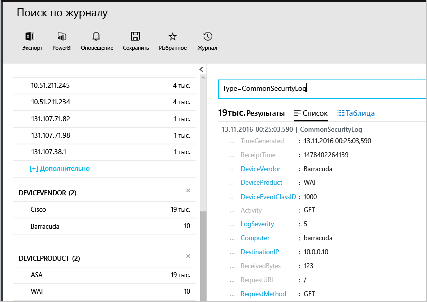

# <a name="connecting-your-security-products-to-the-operations-management-suite-oms-security-and-audit-solution"></a>Подключение средств обеспечения безопасности к решению для защиты и аудита Operations Management Suite (OMS) 
Этот документ поможет вам подключить свои средства обеспечения безопасности к решению для защиты и аудита OMS. Поддерживаются следующие источники:

- события CEF;
- события Cisco ASA.


## <a name="what-is-cef"></a>Что такое CEF?
CEF — это отраслевой стандартный формат на основе сообщений системного журнала, который используют многие поставщики средств безопасности, чтобы обеспечить взаимодействие событий на разных платформах. Решение для защиты и аудита OMS поддерживает принятие данных с использованием CEF, что позволяет подключить собственные решения для обеспечения безопасности к решению для защиты OMS. 

Подключив свой источник данных к OMS, вы можете воспользоваться следующими преимуществами, предлагаемыми этой платформой:

- поиск и корреляция;
- Аудит
- Предупреждение
- Аналитика угроз
- Важные проблемы

## <a name="collection-of-security-solution-logs"></a>сбор журналов решения для защиты.

Решение для защиты OMS поддерживает сбор журналов с использованием CEF в системных журналах и журналах [Cisco ASA](https://blogs.technet.microsoft.com/msoms/2016/08/25/add-your-cisco-asa-logs-to-oms-security/). В этом примере источник (компьютер, создающий журналы) — компьютер Linux, на котором выполняется управляющая программа syslog-ng, а целевой объект — решение для защиты OMS. Чтобы подготовить компьютер Linux, необходимо сделать следующее:

- Скачайте агент OMS для Linux версии 1.2.0-25 или более.
- Выполните инструкции раздела **Краткое руководство по установке** [в этой статье](https://github.com/Microsoft/OMS-Agent-for-Linux/blob/master/docs/OMS-Agent-for-Linux.md#steps-to-install-the-oms-agent-for-linux), чтобы установить и внедрить агент в рабочей области.

Как правило агент устанавливается на компьютере, отличном от того, на котором создаются журналы. Как правило, для перенаправления журналов на компьютер агента необходимо сделать следующее:

- Настроить решение или компьютер, на котором выполняется ведение журналов, для перенаправления требуемых событий управляющей программы системного журнала (rsyslog или syslog-ng) на компьютере агента.
- Включить управляющую программу системного журнала на компьютере агента для получения сообщений из удаленной системы.

На компьютере агента события должны отправляться из управляющей программы системного журнала на локальный порт UDP 25226. Агент прослушивает входящие события на этом порте. Ниже приведен пример конфигурации для отправки всех событий из локальной системы в агент (конфигурацию можно изменить в соответствии с локальными параметрами):

1. Откройте окно терминала и перейдите в каталог */etc/syslog-ng/*. 
2. Создайте файл *security-config-omsagent.conf* и добавьте следующее содержимое: OMS_facility = local4
    
    filter f_local4_oms { facility(local4); };

    destination security_oms { tcp("127.0.0.1" port(25226)); };

    log { source(src); filter(f_local4_oms); destination(security_oms); };
    
3. Скачайте файл *security_events.conf* и поместить его в каталог */etc/opt/microsoft/omsagent/conf/omsagent.d/* на компьютере агента OMS.
4. Введите следующую команду, чтобы перезапустить управляющую программу системного журнала: *Для syslog-ng выполните следующую команду:*
    
    ```
    sudo service rsyslog restart
    ```

    *Для rsyslog выполните следующую команду:*
    
    ```
    /etc/init.d/syslog-ng restart
    ```
5. Введите следующую команду, чтобы перезапустить агент OMS:

    *Для syslog-ng выполните следующую команду:*
    
    ```
    sudo service omsagent restart
    ```

    *Для rsyslog выполните следующую команду:*
    
    ```
    systemctl restart omsagent
    ```
6. Введите следующую команду и проверьте результат, чтобы убедиться, что в журнале агента OMS нет ошибок:

    ``` 
    tail /var/opt/microsoft/omsagent/log/omsagent.log
    ```

## <a name="reviewing-collected-security-events"></a>Просмотр собранных событий безопасности

[!include[log-analytics-log-search-nextgeneration](../../includes/log-analytics-log-search-nextgeneration.md)]

После завершения конфигурации решение для защиты OMS начнет принимать события безопасности. Чтобы визуализировать эти события, откройте поиск по журналам, введите в поле поиска команду *Type=CommonSecurityLog* и нажмите клавишу ВВОД. В следующем примере показан результат выполнения этой команды. Обратите внимание, что в этом случае решение для защиты OMS уже приняло журналы безопасности от нескольких поставщиков:
   


Вы можете уточнить условия поиска для одного поставщика, например, для визуализации веб-журналов Cisco. Для этого введите *Type=CommonSecurityLog DeviceVendor=Cisco*. В CommonSecurityLog предусмотрены стандартные поля для любых заголовков CEF, включая базовые расширения. Другие же расширения, независимо от того, являются ли они настраиваемыми или нет, будут вставлены в поле AdditionalExtensions. Чтобы получить выделенные поля, можно воспользоваться функцией настраиваемых полей. 

### <a name="accessing-computers-missing-baseline-assessment"></a>Просмотр сведений о компьютерах с отсутствующей базовой оценкой
OMS поддерживает профиль базовых показателей участника домена в Windows Server от версии 2008 R2 до 2012 R2. Эта возможность для Windows Server 2016 находится на этапе разработки и будет добавлена после публикации. Остальные операционные системы, проверенные в ходе оценки базовых показателей решением для защиты и аудита OMS, приведены в разделе **Компьютеры с отсутствующей базовой оценкой**.

## <a name="see-also"></a>Дополнительные материалы
В этом документе вы узнали, как подключить решение CEF к OMS. Дополнительные сведения о функциях безопасности OMS см. в следующих статьях.

* [Общие сведения об Operations Management Suite (OMS)](operations-management-suite-overview.md)
* [Мониторинг и реагирование на оповещения безопасности в решении "Безопасность и аудит" Operations Management Suite](oms-security-responding-alerts.md)
* [Мониторинг ресурсов в решении "Безопасность и аудит" Operations Management Suite](oms-security-monitoring-resources.md)

