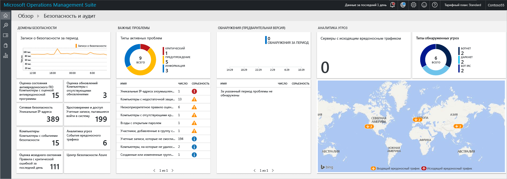
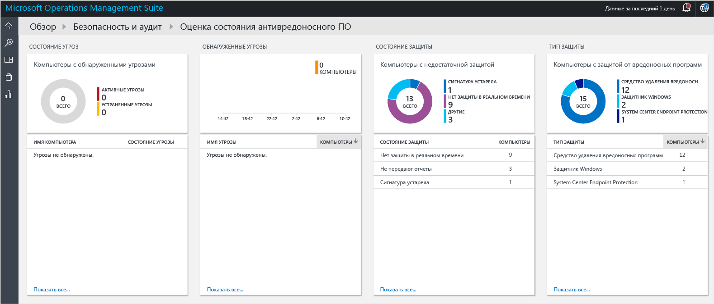
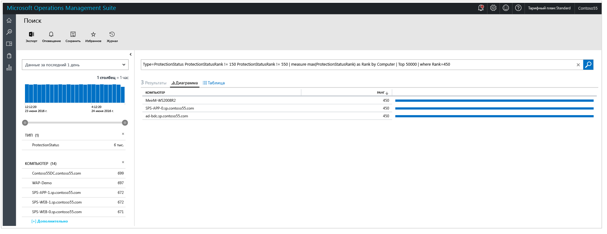
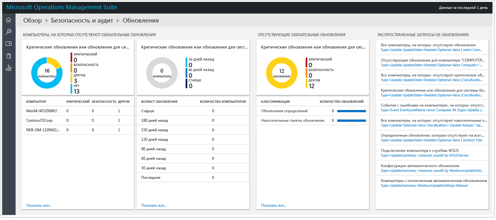
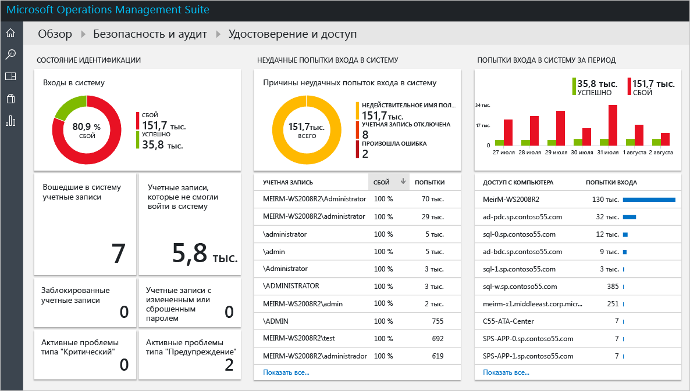
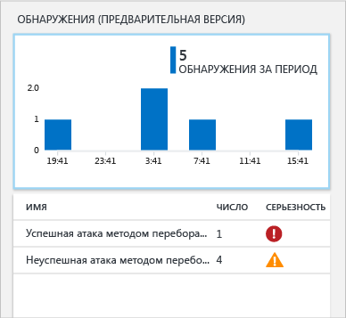
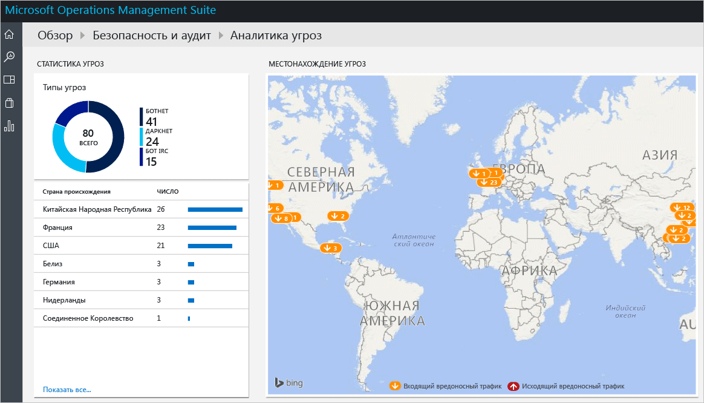

# Приступая к работе с решением "Безопасность и аудит" Operations Management Suite
В этой статье приводится описание всех возможностей, которые помогут вам быстро приступить к работе с функциями решения "Безопасность и аудит" Operations Management Suite (OMS).

## Что такое OMS?
Microsoft Operations Management Suite (OMS) — это облачное решение Майкрософт для управления ИТ-средой, которое помогает управлять локальной и облачной инфраструктурой и защищать ее. Дополнительные сведения об OMS см. в статье [Общие сведения об Operations Management Suite (OMS)](https://technet.microsoft.com/library/mt484091.aspx).

## Панель мониторинга OMS "Безопасность и аудит"
Решение OMS "Безопасность и аудит" позволяет всесторонне изучать данные об информационной безопасности в вашей организации. Для этого применяются встроенные поисковые запросы, которые позволяют определять важные моменты, требующие вашего внимания. Панель мониторинга **Безопасность и аудит** — это начальный экран для доступа ко всем функциям, связанным с безопасностью в OMS. Она содержит обобщенное представление состояния безопасности компьютеров организации. Кроме того, она включает возможность просмотра всех событий за последние 24 часа, 7 дней или другие настраиваемые промежутки времени. Чтобы получить доступ к панели мониторинга **Безопасность и аудит**, сделайте следующее:

1. На главной панели мониторинга **Microsoft Operations Management Suite** щелкните плитку **Параметры** слева.
2. В колонке **Параметры** в разделе **Решения** щелкните пункт **Безопасность и аудит**.
3. Откроется панель мониторинга **Безопасность и аудит**.
   
    

Если вы переходите к этой панели мониторинга в первый раз, и у вас нет устройств, отслеживаемых OMS, разделы панели не будут заполнены данными, полученными от агента. После установки агента заполнение панели мониторинга данными может занять некоторое время, поэтому изначально некоторые данные могут отсутствовать, так как они еще не поступили в облако.  В этом случае отсутствие данных в некоторых разделах может считаться нормальным. В статье [Подключение компьютеров Windows к Log Analytics](https://technet.microsoft.com/library/mt484108.aspx) содержатся дополнительные сведения об установке агента OMS в системе Windows, а в статье [Подключение компьютеров Linux к Log Analytics](https://technet.microsoft.com/library/mt622052.aspx) — дополнительные сведения о том, как выполнить эту задачу в системе Linux.

> [!NOTE]
> Агент собирает данные на основе текущих включенных событий, например имя компьютера, IP-адрес и имя пользователя. Однако сбор документов, файлов, имен баз данных или личных данных не осуществляется.   
> 
> 

Решения представляют собой совокупность логики, визуализаций и правил получения данных, призванную решить основные проблемы клиентов. Безопасность и аудит — это одно из решений набора; другие решения можно добавить отдельно. Дополнительные сведения о добавлении нового решения см. в статье [Добавление решений Log Analytics из коллекции решений](https://technet.microsoft.com/library/mt674635.aspx).

Данные на панели мониторинга OMS "Безопасность и аудит" подразделяются на четыре основные категории.

* **Домены безопасности.** В этой области можно более детально просматривать записи безопасности в динамике по времени, получать доступ к оценке защиты от вредоносных программ, оценке обновлений, сведениям о сетевой безопасности, идентификации, доступе и компьютерах с событиями безопасности, а также быстро переходить к панели мониторинга центра безопасности Azure.
* **Важные проблемы.** В этом разделе можно быстро определить количество активных проблем и степень их серьезности.
* **Обнаружения (ознакомительная версия).** Эта область позволяет определять схемы атак путем визуализации оповещений системы безопасности, связанных с ресурсами.
* **Аналитика угроз.** Эта область позволяет определять схемы атак путем визуализации общего числа серверов с исходящим вредоносным IP-трафиком, типов вредоносных угроз и карты, на которой показано физическое расположение соответствующих IP-адресов. 
* **Общие запросы безопасности.** В этом разделе содержится список самых распространенных запросов безопасности, которые можно использовать для мониторинга вашей среды. При щелчке любого из этих запросов он откроется в колонке **Поиск** с результатами для этого запроса.

> [!NOTE]
> Дополнительные сведения о том, как OMS обеспечивает защиту данных, см. в статье "Защита данных с помощью OMS".
> 
> 

## Домены безопасности
При наблюдении за ресурсам важно иметь возможность быстрого доступа к сведениям о текущем состоянии среды. Однако не менее важно иметь возможность отслеживать события, произошедшие в прошлом: это помогает лучше понять, что происходило в среде в определенный момент времени. 

> [!NOTE]
> Хранение данных осуществляется в соответствии с тарифным планом OMS. Для получения дополнительных сведений посетите страницу с ценами на [Microsoft Operations Management Suite](https://www.microsoft.com/server-cloud/operations-management-suite/pricing.aspx) .
> 
> 

В сценариях реагирования на инцидент или проведения экспертизы результаты, отображаемые в элементе **Записи безопасности в динамке по времени** , могут сыграть очень важную роль.

Если щелкнуть эту плитку, откроется колонка **Поиск** с результатом запроса для **событий безопасности** (Type=SecurityEvents) и данными за последние семь дней, как показано ниже.

Результаты поиска делятся на две области: в левой области приводится разбивка по количеству обнаруженных событий безопасности, компьютерам, на которых были обнаружены эти события, числу учетных записей на этих компьютерах и типам действий. В правой области отображается общее число результатов и хронологическое представление событий безопасности с именем компьютера и действием события. Кроме того, можно щелкнуть ссылку **Дополнительно** для просмотра дополнительных сведений об этом событии, таких как данные, код и источник события.

> [!NOTE]
> Дополнительные сведения о поисковых запросах OMS см. в статье [Справочник по поиску в Log Analytics](https://technet.microsoft.com/library/mt450427.aspx).
> 
> 

### Оценка защиты от вредоносных программ
Этот раздел позволяет быстро выявить компьютеры с недостаточной защитой и компьютеры, безопасность которых нарушена вредоносным кодом. На наблюдаемых серверах выполняется считывание информации об обнаруженных угрозах и состоянии оценки вредоносных программ, после чего данные отправляются в службу OMS в облаке для обработки. Серверы, на которых обнаружены угрозы, и серверы с недостаточной защитой отображаются на панели мониторинга оценки защиты от вредоносных программ, доступной по щелчку плитки **Система оценки вредоносных программ**. 

Как и для любой другой динамической плитки панели мониторинга OMS, при щелчке этой плитки на экран выводится колонка **Поиск** с результатом запроса. Что касается этой функции, если в разделе **Состояние защиты** выбран вариант **Нет отчетов**, вы увидите результат запроса, в котором будет отображаться следующая единственная запись, содержащая имя компьютера и его ранг, как показано ниже.

> [!NOTE]
> *Ранг* — это оценка, отражающая состояние защиты (включено, выключено, обновляется и т. д.) и обнаруженные угрозы. Представление этого показателя в виде числа упрощает статистическую обработку.
> 
> 

Если щелкнуть имя компьютера, будет выведено хронологическое представление состояния защиты для этого компьютера. Это очень удобно для сценариев, когда требуется понять, была ли антивредоносная программа установлена, а затем в некоторый момент удалена.   

### Оценка обновлений
Этот раздел позволяет быстро определить общую подверженность среды потенциальным проблемам безопасности, необходимость установки обновлений, а также то, насколько они важны для вашей среды. Решение OMS "Безопасность и аудит" предоставляет только визуализацию этих обновлений, реальные данные поступают из [решений "Обновления системы"](https://technet.microsoft.com/library/mt484096.aspx), отдельного модуля в OMS. Пример обновлений приведен ниже.

> [!NOTE]
> Дополнительные сведения о решении "Обновления" см. в статье [Решение "Оценка системных обновлений" в Log Analytics](https://technet.microsoft.com/library/mt484096.aspx).
> 
> 

### Удостоверение и доступ
Для предприятия идентификация должна быть плоскостью управления, а защита удостоверений — основным приоритетом. Если в прошлом в организациях были реализованы периметры и они были одними из основных защитных границ, в наше время при перемещении все большего числа данных и приложений в облако таким "периметром" становится идентификация. 

> [!NOTE]
> В настоящее время данные основаны исключительно на учетных данных событий безопасности (код события 4624) в будущем также будут использоваться имена входа Office 365 и данные Azure AD.
> 
> 

Отслеживая действия по идентификации, можно принимать упреждающие меры до возникновения инцидента или ответные меры для предотвращения попыток атак. Панель мониторинга **Удостоверения и доступ** предоставляет обзор состояния идентификации, включая количество неудачных попыток входа в систему, сведения об учетной записи пользователя, которая использовалась во время таких попыток, сведения о заблокированных учетных записях, учетных записях с измененными или сброшенными паролями, а также о текущем количестве учетных записей, которые выполнили вход в систему. 

При щелчке плитки **Удостоверения и доступ** открывается следующая панель мониторинга.

Сведения, доступные на этой панели мониторинга, могут помочь вам мгновенно определить потенциально подозрительную активность. Например, обнаружено 338 попыток входа в качестве **администратора**, и 100 % этих попыток неудачны. Такая ситуация может возникать при атаке этой учетной записи методом перебора. Щелкнув эту учетную запись, вы получите дополнительные сведения, которые помогут определить целевой ресурс для этой вероятной атаки:

Подробный отчет содержит важные сведения об этом событии, включая целевой компьютер, тип входа в систему (в этом случае вход в сеть), действие (в этом случае событие с кодом 4625) и полную временную шкалу каждой попытки. 

### Компьютеры
Этот элемент можно использовать для доступа ко всем компьютерам, для которых есть активные события безопасности. При щелчке этой плитки на экран будет выведен список компьютеров с событиями безопасности и количество событий на каждом компьютере.

Анализ можно продолжить, щелкнув каждый компьютер и просмотрев отмеченные события безопасности.

### Центр безопасности Azure
Этот элемент по сути является ярлыком для доступа к панели мониторинга центра безопасности Azure. Дополнительные сведения об этом решении см. в статье [Краткое руководство по центру безопасности Azure](../security-center/security-center-get-started.md).

## Важные проблемы
Основная цель этой группы параметров — предоставить краткий обзор проблем, которые имеются в вашей среде, с разбиением на категории: критические, предупреждения и информационные. Элемент "Тип активной проблемы" служит для визуализации возникших проблем, однако с его помощью нельзя получить дополнительные сведения об этих проблемах: для этого служит нижний раздел элемента, в котором указано имя проблемы (NAME), число объектов с этой проблемой (COUNT) и то, насколько серьезна проблема (SEVERITY).

Вы можете заметить, что эти проблемы уже были описаны в различных разделах группы **Домены безопасности** , которая дополняет задачу этого представления: централизованную визуализацию наиболее важных проблем в вашей среде.

## Обнаружения (ознакомительная версия)
Основное предназначение этого параметра — предоставить ИТ-отделу возможности быстрого обнаружения угроз в среде и определения уровня их серьезности.

Этот параметр можно также использовать в [сценариях реагирования на инциденты](https://blogs.msdn.microsoft.com/azuresecurity/2016/11/30/investigating-suspicious-activity-in-a-hybrid-cloud-with-oms-security/) для оценки и получения дополнительных сведений об атаке.

> [!NOTE]
> Для получения дополнительных сведений об использовании OMS в рамках реагирования на инцидент см. видеоролик [How to Leverage the Azure Security Center & Microsoft Operations Management Suite for an Incident Response](https://channel9.msdn.com/Blogs/Taste-of-Premier/ToP1703) (Использование центра безопасности Azure и Microsoft Operations Management Suite для реагирования на инциденты).
> 
> 

## Аналитика угроз
Новый раздел решения "Безопасность и аудит", "Аналитика угроз" служит для визуального представления вероятных схем атак разными способами: общее число серверов с исходящим вредоносным IP-трафиком, типы вредоносных угроз и карта, на которой показано физическое расположение соответствующих IP-адресов. Карта интерактива, и с ней можно работать, а щелкнув IP-адрес, вы получите дополнительные сведения.

Желтые кнопки на карте обозначают входящий трафик от вредоносных IP-адресов. Ситуации, когда входящий вредоносный трафик поступает на серверы с доступом к Интернету, нередки, однако мы рекомендуем отслеживать такие попытки, чтобы убедиться, что ни одна из них не была успешной. Эти индикаторы основаны на журналах служб IIS, WireData и брандмауэра Windows.  

## Стандартные запросы безопасности
Список доступных стандартных запросов безопасности можно использовать для быстрого перехода к сведениям о ресурсах и настройки в соответствии с потребностями среды. К типичным запросам относятся следующие:

* все действия безопасности;
* действия безопасности на компьютере computer01.contoso.com (замените нужным именем компьютера);
* действия безопасности на компьютере computer01.contoso.com для учетной записи "администратор" (замените нужными именами компьютера и учетной записи);
* действия входа по компьютерам;
* учетные записи, которые отключили защиту от вредоносных программ Майкрософт на любом компьютере;
* компьютеры, на которых завершен процесс защиты от вредоносных программ Майкрософт;
* компьютеры, на которых был выполнен процесс hash.exe (замените именем другого процесса);
* имена всех выполнявшихся процессов;
* действия входа по учетным записям;
* учетные записи, выполнившие удаленный вход на компьютер computer01.contoso.com (замените нужным именем компьютера).

## См. также
В этом документе были представлены начальные сведения о решении OMS "Безопасность и аудит". Дополнительные сведения о функциях безопасности OMS см. в следующих статьях.

* [Общие сведения об Operations Management Suite (OMS)](operations-management-suite-overview.md)
* [Мониторинг и реагирование на оповещения безопасности в решении "Безопасность и аудит" Operations Management Suite](oms-security-responding-alerts.md)
* [Мониторинг ресурсов в решении "Безопасность и аудит" Operations Management Suite](oms-security-monitoring-resources.md)

