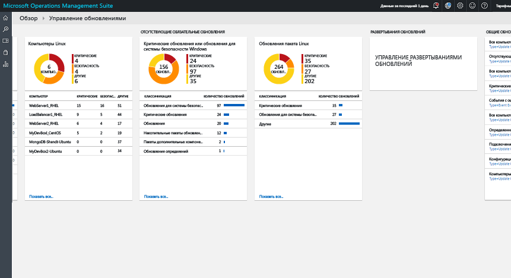
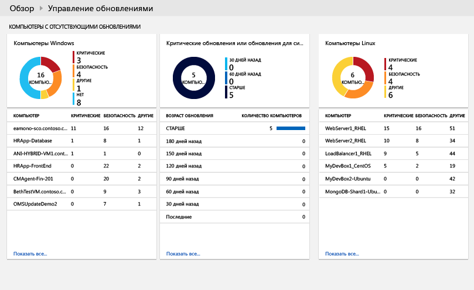
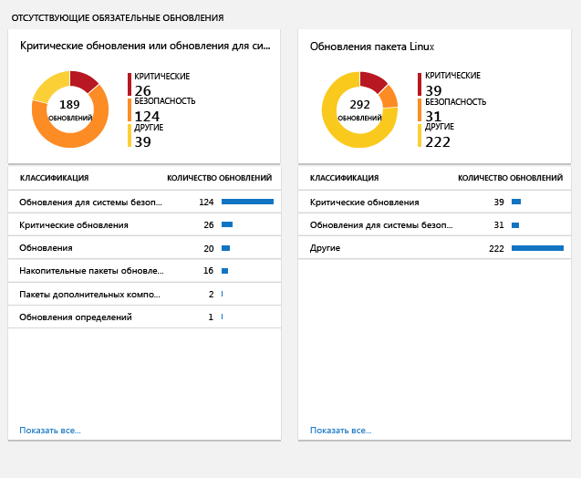
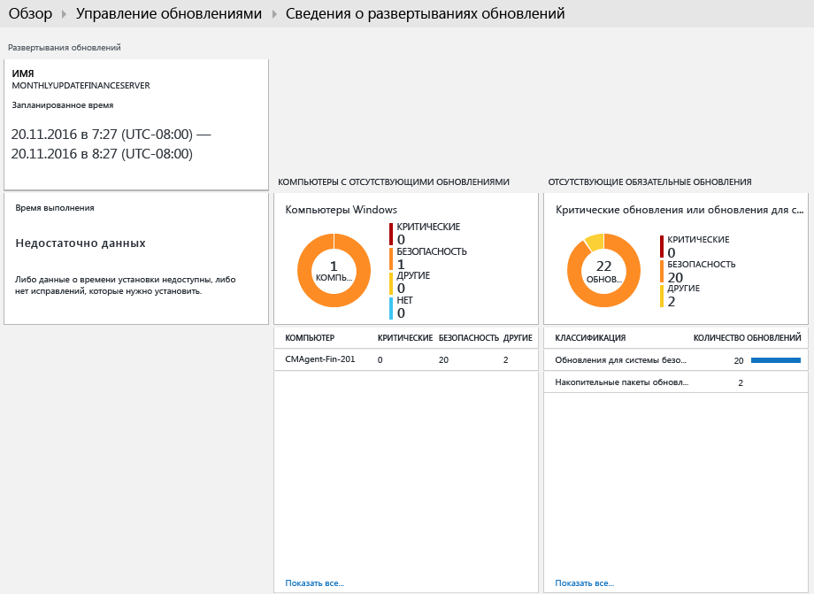

#  Решение для управления обновлениями в OMS
Решение для управления обновлениями в OMS позволяет управлять обновлениями для компьютеров Windows и Linux.  Благодаря ему вы сможете быстро оценить состояние доступных обновлений на всех компьютерах агентов и запустить установку необходимых обновлений на серверах. 

## Предварительные требования
* На агентах Windows необходимо настроить связь с сервером служб Windows Server Update Services (WSUS) или доступ к Центру обновления Майкрософт.  
  
  > [!NOTE]
  > Агентом Windows нельзя управлять параллельно с помощью System Center Configuration Manager.  
  > 
  > 
* У агентов Linux должен быть доступ к репозиторию обновлений.  Агент OMS для Linux можно скачать с сайта [GitHub](https://github.com/microsoft/oms-agent-for-linux). 

## Конфигурация
Выполните следующие шаги, чтобы добавить решение для управления обновлениями в свою рабочую область OMS, а также добавить агенты Linux.  Агенты Windows добавляются автоматически. Для этого не нужны дополнительные настройки.

1. Добавьте решение для управления обновлениями в рабочую область OMS, как описано в статье о [добавлении решений OMS](../log-analytics/log-analytics-add-solutions.md) в коллекции решений.  
2. На портале OMS щелкните **Параметры**, а затем **Подключенные источники**.  Запишите значение, указанное в поле **Идентификатор рабочей области** и **Первичный ключ** или **Вторичный ключ**.
3. Для каждого компьютера Linux выполните следующие шаги.
   
   а.  Установите последнюю версию агента OMS для Linux, выполнив следующие команды.  Замените <Workspace ID> на идентификатор рабочей области, а <Key> — на первичный или вторичный ключ.
   
       cd ~
       wget https://github.com/Microsoft/OMS-Agent-for-Linux/releases/download/v1.2.0-75/omsagent-1.2.0-75.universal.x64.sh
       sudo bash omsagent-1.2.0-75.universal.x64.sh --upgrade -w <Workspace ID> -s <Key>
   
    b. Чтобы удалить агент, выполните следующую команду.
   
       sudo bash omsagent-1.2.0-75.universal.x64.sh --purge

## Пакеты управления
Если группа управления System Center Operations Manager подключена к рабочей области OMS, при добавлении этого решения в Operations Manager будут установлены следующие пакеты. Никакая настройка или обслуживание для этих пакетов управления не требуются. 

* Пакет аналитики оценки обновления Microsoft System Center Advisor (Microsoft.IntelligencePacks.UpdateAssessment);
* Microsoft.IntelligencePack.UpdateAssessment.Configuration (Microsoft.IntelligencePack.UpdateAssessment.Configuration);
* пакет управления развертыванием обновлений.

Дополнительные сведения об обновлении пакетов управления для решений см. в статье [Подключение Operations Manager к Log Analytics](../log-analytics/log-analytics-om-agents.md).

## Сбор данных
### Поддерживаемые агенты
В следующей таблице описаны подключенные источники, которые поддерживаются этим решением.

| Подключенный источник | Поддерживаются | Описание |
| --- | --- | --- |
| Агенты Windows |Да |Решение собирает сведения об обновлениях системы с агентов Windows и запускает установку требуемых обновлений. |
| Агенты Linux |Да |Решение собирает сведения о системных обновлениях с агентов Linux. |
| Группа управления Operations Manager |Да |Решение собирает сведения о системных обновлениях с агентов, состоящих в подключенной группе обновления. Прямое подключение агента Operations Manager к Log Analytics не требуется. Данные пересылаются из группы управления в репозиторий OMS. |
| Учетная запись хранения Azure. |Нет |В хранилище Azure не хранятся сведения о системных обновлениях. |

### Частота сбора
Дважды в день выполняется проверка каждого управляемого компьютера Windows.  Его сведения обновляются в течение 15 минут после установки обновления.  

Каждые три часа выполняется проверка всех управляемых компьютеров Linux.  

## Использование решения
При добавлении решения по управлению оповещениями в рабочую область OMS на панель мониторинга OMS добавляется плитка **Управление обновлениями**. На этой плитке отображается количество и графическое представление количества компьютеров в вашей среде, обновление системы которых сейчас необходимо.  
  

## Просмотр оценки обновлений
Щелкните плитку **Управление обновлениями**, чтобы открыть панель мониторинга **Управление обновлениями**. Панель мониторинга содержит столбцы, перечисленные в приведенной ниже таблице. В каждом столбце содержится максимум десять элементов, соответствующих таким указанным критериям, как область действия и диапазон времени. Можно выполнить поиск по журналам, в результате которого возвращаются все записи, если щелкнуть заголовок этого столбца или **Показать все** внизу столбца.

| столбец | Описание |
| --- | --- |
| **Компьютеры, на которых нет обновлений** | |
| Критические обновления или обновления для системы безопасности |Список первых десяти компьютеров, на которых нет обновлений, отсортированный по количеству отсутствующих обновлений. Щелкните имя компьютера, чтобы выполнить поиск по журналам, возвращающий все записи обновлений для него. |
| Critical or Security Updates older than 30 days (Критические обновления или обновления системы безопасности, опубликованные более 30 дней назад) |Указывает количество компьютеров, на которых отсутствуют критические обновления или обновления системы безопасности, с группировкой по количеству времени с момента публикации. Щелкните одну из записей, чтобы запустить поиск по журналам, в результате которого возвращаются все отсутствующие и критические обновления. |
| **Отсутствующие обязательные обновления** | |
| Критические обновления или обновления для системы безопасности |Список классов обновлений, которых нет на компьютерах, с сортировкой по числу компьютеров с отсутствующими обновлениями определенной категории. Щелкните класс, чтобы выполнить поиск по журналам, возвращающий все записи обновлений для него. |
| **Update Deployments** (Развертывания обновлений) | |
| Update Deployments (Развертывания обновлений) |Количество текущих запланированных развертываний обновлений и период времени до следующего запланированного выполнения.  Щелкните плитку, чтобы просмотреть расписания обновлений, которые сейчас выполняются или завершены, или чтобы запланировать новое обновление. |

   
   
 
   
 
   

## Установка обновлений
После оценки обновлений для всех компьютеров в среде можно установить обязательные обновления, создав *развертывание обновлений*.  Развертывание обновлений — это запланированная установка требуемых обновлений для одного или нескольких компьютеров Windows.  Вы можете указать дату и время развертывания, а также компьютер или группу компьютеров, которые следует включить в развертывание.  

Обновления устанавливаются с помощью Runbook в службе автоматизации Azure.  Сейчас эти Runbook нельзя просмотреть, и они не требуют настройки.  При создании развертывания обновлений в нем создается расписание, по которому в указанное время для компьютеров, включенных в развертывание, запускается главный Runbook обновлений.  Этот Runbook запускает для каждого агента Windows дочерний Runbook, который выполняет установку необходимых обновлений.  

### Просмотр развертываний обновлений
Щелкните плитку **Update Deployment** (Развертывание обновлений), чтобы просмотреть список существующих развертываний.  Они группируются по состоянию — **Запланировано**, **Выполняется** и **Завершено**.      

В следующей таблице описаны свойства, которые отображаются для каждого развертывания обновлений.

| Свойство | Описание |
| --- | --- |
| Имя |Имя развертывания. |
| Расписание |Тип расписания.  *OneTime* — сейчас единственное возможное значение. |
| Время начала |Запланированные дата и время запуска развертывания обновлений. |
| Длительность |Разрешенное количество минут, на протяжении которых должно выполняться развертывание обновлений.  Если в течение этого периода не установятся все обновления, оставшиеся обновления необходимо отложить до следующего развертывания. |
| Серверы |Количество компьютеров, затронутых развертыванием обновлений. |
| Состояние |Текущее состояние развертывания обновлений.  Возможные значения: — "Не запущено"; - Выполнение — "Готово". |

Щелкните развертывание обновлений, чтобы просмотреть экран сведений, в том числе столбцы, указанные в таблице ниже.  Если развертывание обновления еще не запущено, эти столбцы не будут заполнены. 

| столбец | Description (Описание) |
| --- | --- |
| **Результаты** | |
| Успешно завершено |Список количества компьютеров в развертывании обновлений по состоянию.  Щелкните состояние, чтобы выполнить поиск по журналам, в результате которого возвращаются все записи об обновлениях с соответствующим состоянием для развертывания обновлений. |
| Состояние установки компьютера |Список компьютеров, затронутых развертыванием обновлений, и процент успешно установленных обновлений. Щелкните одну из записей, чтобы запустить поиск по журналам, в результате которого возвращаются все отсутствующие и критические обновления. |
| **Результаты обновления экземпляра** | |
| Состояние установки экземпляра |Список классов обновлений, которых нет на компьютерах, с сортировкой по числу компьютеров с отсутствующими обновлениями определенной категории. Щелкните имя компьютера, чтобы выполнить поиск по журналам, возвращающий все записи обновлений для него. |

   

### Создание развертывания обновлений
Создайте развертывание обновлений, нажав кнопку **Добавить** в верхней части экрана, чтобы открыть страницу **New Update Deployment** (Новое развертывание обновлений).  Вам необходимо указать значения для свойств, приведенных в таблице ниже.

| Свойство | Описание |
| --- | --- |
| Имя |Уникальное имя для идентификации развертывания обновлений. |
| Часовой пояс |Часовой пояс для времени запуска. |
| Время начала |Дата и время запуска развертывания обновлений. |
| Длительность |Разрешенное количество минут, на протяжении которых должно выполняться развертывание обновлений.  Если в течение этого периода не установятся все обновления, оставшиеся обновления необходимо отложить до следующего развертывания. |
| Компьютеры |Имена компьютеров или групп компьютеров, которые следует включить в развертывание обновлений.  Выберите одну или несколько записей в раскрывающемся списке. |

   

### Диапазон времени
По умолчанию область данных, анализируемых в решении по управлению оповещениями, охватывает все подключенные группы управления, созданные в течение последнего дня. 

Чтобы изменить диапазон времени для данных, щелкните **Data based on** (Включаемые данные) в верхней части панели мониторинга. Можно выбрать записи, созданные или обновленные за последние 7 дней, 6 часов или 1 день. Или можно выбрать **Custom** (Пользовательский) и указать диапазон дат.     

## Записи Log Analytics
Решение управления обновлениями создает в репозитории OMS записи двух типов.

### Записи обновлений
Запись типа **Обновление** создается для каждого обновления, которое установлено или необходимо установить на каждом компьютере. Для записей обновлений характерны свойства, приведенные в таблице ниже.

| Свойство | Описание |
| --- | --- |
| Тип |*Обновление*. |
| SourceSystem |Источник, утвердивший установку обновления. Возможные значения: — Microsoft Update; — Windows Update; — SCCM; — Linux Servers (серверы с Linux, данные которых получены из диспетчеров пакетов). |
| Approved |Указывает, что установка обновления утверждена.  Для серверов с Linux сейчас это необязательное свойство, так как OMS не осуществляет управление исправлениями. |
| Классификация для Windows |Класс обновления. Возможные значения: — "Приложения"; — Critical Updates (Критические обновления); — "Обновления определений"; — Feature Packs (Пакеты дополнительных компонентов); — Security Updates (Обновления для системы безопасности); — Service Packs (Пакеты обновления); — Update Rollups (Накопительные пакеты обновления); — "Обновления". |
| Классификация для Linux |Класс обновления. Возможные значения: — Critical Updates (Критические обновления); — Security Updates (Обновления для системы безопасности); — Other Updates (Другие обновления). |
| Компьютер |Имя компьютера. |
| InstallTimeAvailable |Указывает, что доступно время установки других агентов, установивших такое же обновление. |
| InstallTimePredictionSeconds |Предполагаемое время установки в секундах, зависящее от других агентов, установивших такое же обновление. |
| KBID |Идентификатор статьи базы знаний, в которой описано обновление. |
| ManagementGroupName |Имя группы управления для агентов SCOM.  Для других агентов это AOI-<workspace ID>. |
| MSRCBulletinID |Идентификатор бюллетеня по безопасности (Майкрософт), описывающего обновление. |
| MSRCSeverity |Уровень серьезности бюллетеня по безопасности (Майкрософт). Возможные значения: — Critical; — Important; — Moderate. |
| Необязательно |Указывает, что обновление является дополнительным. |
| Продукт |Имя продукта, для которого предназначено обновление.  Щелкните **Просмотр**, чтобы открыть статью в браузере. |
| PackageSeverity |Уровень серьезности уязвимости, исправленной в этом обновлении, согласно данным, предоставленным поставщиками дистрибутивов Linux. |
| PublishDate |Дата и время установки обновления. |
| RebootBehavior |Указывает, предусматривает ли обновление принудительную перезагрузку. Возможные значения: — canrequestreboot; — neverreboots. |
| RevisionNumber |Номер редакции обновления. |
| SourceComputerId |Уникальный GUID, позволяющий идентифицировать компьютер. |
| TimeGenerated |Дата и время последнего обновления записи. |
| Название |Название обновления. |
| UpdateID |Уникальный GUID, позволяющий идентифицировать обновление. |
| UpdateState |Указывает, установлено ли обновление на этом компьютере. Возможные значения: — Installed — указывает, что обновление установлено на этом компьютере. — Needed — указывает, что на этом компьютере обновление не установлено и его необходимо установить. |

 
При поиске по журналу, в результате которого возвращаются записи типа **Обновление**, можно выбрать представление **Обновления**. Здесь отображается набор плиток с перечнем обновлений, возвращенных в результатах поиска. Вы можете щелкать записи на плитках **Недостающие и примененные обновления** и **Обязательные и необязательные обновления**, чтобы сфокусировать представление на соответствующем наборе обновлений. Выберите представление **Список** или **Таблица**, чтобы восстановить отображение отдельных записей.  

  

В представлении **Таблица** можно щелкнуть **KBID** любой записи, чтобы открыть соответствующую статью базы знаний в браузере. Это позволяет быстро прочитать подробные сведения о конкретном обновлении.  

В представлении **Список** выберите ссылку **Просмотр** рядом с KBID, чтобы открыть соответствующую статью базы знаний. 

### Записи UpdateSummary
Запись типа **UpdateSummary** создается для каждого компьютера агента Windows. Эта запись обновляется при каждой проверке компьютера на наличие обновлений. У записей **UpdateSummary** есть свойства, приведенные в таблице ниже.

| Свойство | Описание |
| --- | --- |
| Тип |UpdateSummary |
| SourceSystem |OpsManager |
| Компьютер |Имя компьютера. |
| CriticalUpdatesMissing |Количество критических обновлений, отсутствующих на компьютере. |
| ManagementGroupName |Имя группы управления для агентов SCOM. Для других агентов это AOI-<workspace ID>. |
| NETRuntimeVersion |Версия среды выполнения .NET, установленной на компьютере. |
| OldestMissingSecurityUpdateBucket |Контейнер для категоризации времени, прошедшего с момента публикации самого раннего обновления, отсутствующего на этом компьютере. Возможные значения: — Older; — 180 days ago; — 150 days ago; — 120 days ago; — 90 days ago; — 60 days ago; — 30 days go; — Recent. |
| OldestMissingSecurityUpdateInDays |Количество дней, прошедших с момента публикации самого раннего обновления, отсутствующего на этом компьютере. |
| OsVersion |Версия операционной системы, установленной на компьютере. |
| OtherUpdatesMissing |Количество других обновлений, отсутствующих на компьютере. |
| SecurityUpdatesMissing |Количество обновлений для системы безопасности, отсутствующих на компьютере. |
| SourceComputerId |Уникальный GUID, позволяющий идентифицировать компьютер. |
| TimeGenerated |Дата и время последнего обновления записи. |
| TotalUpdatesMissing |Общее количество обновлений, отсутствующих на компьютере. |
| WindowsUpdateAgentVersion |Номер версии агента Центра обновления Windows на компьютере. |
| WindowsUpdateSetting |Параметр установки важных обновлений на компьютере. Возможные значения: — Disabled; — Notify before installation; — Scheduled installation. |
| WSUSServer |URL-адрес сервера WSUS, если на компьютере настроено его использование. |

## Пример поисков журналов
Следующая таблица содержит примеры запросов поиска по журналу для получения записей обновлений, собранных этим решением. 

| Запрос | Description (Описание) |
| --- | --- |
| Все компьютеры с недостающими обновлениями |Type=Update UpdateState=Needed Optional=false &#124; select Computer,Title,KBID,Classification,UpdateSeverity,PublishedDate |
| Missing updates for computer "COMPUTER01.contoso.com" (Недостающие обновления для компьютера COMPUTER01.contoso.com (замените именем нужного компьютера)) |Type=Update UpdateState=Needed Optional=false Computer="COMPUTER01.contoso.com" &#124; select Computer,Title,KBID,Product,UpdateSeverity,PublishedDate |
| Все компьютеры с недостающими критическими обновлениями или обновлениями для системы безопасности |Type=Update UpdateState=Needed Optional=false (Classification="Security Updates" OR Classification="Critical Updates") |
| Критические обновления или обновления для системы безопасности, необходимые компьютерам, на которых обновления применяются вручную |Type=Update UpdateState=Needed Optional=false (Classification="Security Updates" OR Classification="Critical Updates") Computer IN {Type=UpdateSummary WindowsUpdateSetting=Manual &#124; Distinct Computer} &#124; Distinct KBID |
| События ошибок для компьютеров, на которых отсутствовали обязательные критические обновления или обновления для системы безопасности |Type=Event EventLevelName=error Computer IN {Type=Update (Classification="Security Updates" OR Classification="Critical Updates") UpdateState=Needed Optional=false &#124; Distinct Computer} |
| Все компьютеры с недостающими накопительными пакетами обновления |Type=Update Optional=false Classification="Update Rollups" UpdateState=Needed &#124; select Computer,Title,KBID,Classification,UpdateSeverity,PublishedDate |
| Отдельные недостающие обновления на всех компьютерах |Type=Update UpdateState=Needed Optional=false &#124; Distinct Title |
| Членство компьютеров WSUS |Type=UpdateSummary &#124; measure count() by WSUSServer |
| Настройка автоматического обновления |Type=UpdateSummary &#124; measure count() by WindowsUpdateSetting |
| Компьютеры, на которых отключено автоматическое обновление |Type=UpdateSummary WindowsUpdateSetting=Manual |
| List of all the Linux machines which have a package update available (Список всех компьютеров Linux, для которых доступно обновление пакетов) |Type=Update and OSType=Linux and UpdateState!="Not needed" &#124; measure count() by Computer |
| List of all the Linux machines which have a package update available which addresses Critical or Security vulnerability (Список всех компьютеров Linux, для которых доступно обновление пакетов, позволяющее устранить критическую уязвимость или уязвимость системы безопасности) |Type=Update and OSType=Linux and UpdateState!="Not needed" and (Classification="Critical Updates" OR Classification="Security Updates") &#124; measure count() by Computer |
| List of all packages that have an update available (Список всех пакетов, для которых доступно обновление) |Type=Update and OSType=Linux and UpdateState!="Not needed" |
| List of all packages that have an update available which addresses Critical or Security vulnerability (Список всех пакетов с доступными обновлениями, позволяющими устранить критическую уязвимость или уязвимость системы безопасности) |Type=Update and OSType=Linux and UpdateState!="Not needed" and (Classification="Critical Updates" OR Classification="Security Updates") |
| List of all the “Ubuntu” machines with any update available (Список всех компьютеров Ubuntu со всеми доступными обновлениями) |Type=Update and OSType=Linux and OSName = Ubuntu &#124; measure count() by Computer |

## Дальнейшие действия
* Используйте поиск по журналам в [Log Analytics](../log-analytics/log-analytics-log-searches.md), чтобы просматривать подробные данные об обновлениях.
* [Создавайте свои панели мониторинга](../log-analytics/log-analytics-dashboards.md), где будут отображаться данные о соответствии обновлений для управляемых компьютеров.
* [Создавайте оповещения](../log-analytics/log-analytics-alerts.md) об обнаружении важных критических обновлений, отсутствующих на компьютерах, или отключении автоматических обновлений на компьютере.  

<!--HONumber=Oct16_HO2-->

