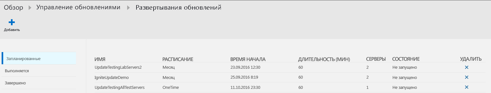
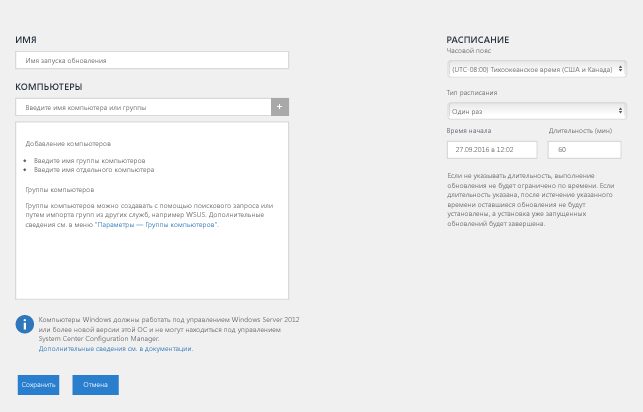
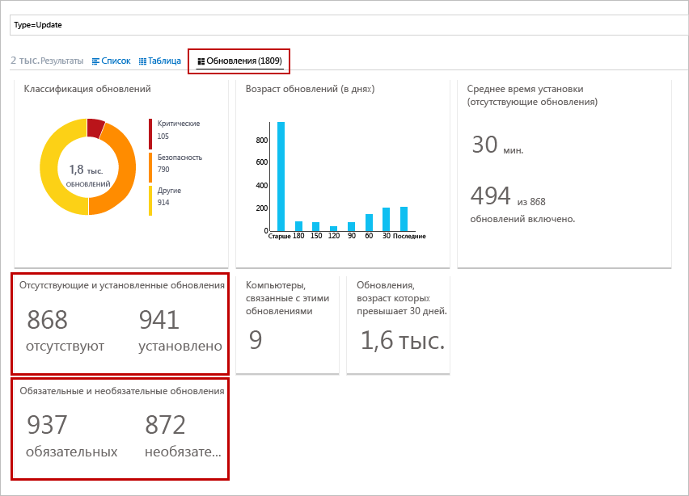
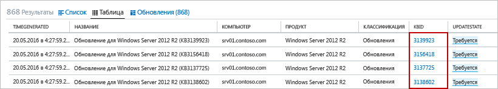
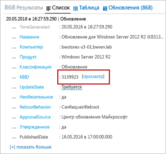

# Решение для управления обновлениями в OMS

Решение по управлению обновлениями в OMS позволяет управлять обновлениями безопасности операционной системы для компьютеров Windows и Linux, развернутых в Azure, локальных средах или других поставщиках облачных услуг.  Благодаря ему вы сможете быстро оценить состояние доступных обновлений на всех компьютерах агентов и управлять установкой необходимых обновлений на серверах.

## Обзор решения
Ниже перечислены компоненты, которые используются компьютерами, управляемыми OMS, для выполнения развертываний оценок и обновлений:

* агент OMS для Windows или Linux;
* служба настройки требуемого состояния PowerShell;
* гибридные рабочие роли Runbook службы автоматизации;
* службы центра обновления Майкрософт или Windows Server Update Services для компьютеров с Windows.

На схеме ниже показано концептуальное представление потока данных и его поведения, а также как решение анализирует и применяет обновления безопасности ко всем подключенным компьютерам Windows Server и Linux в рабочей области.    

#### Windows Server

#### Linux

После того как компьютер проверит соответствие обновлениям, агент OMS переадресовывает сведения в OMS в пакетном режиме. На компьютере с Windows проверка на соответствия по умолчанию выполняется через каждые 12 часов.  Помимо расписания проверки при перезапуске Microsoft Monitoring Agent (MMA) в течение 15 минут запускается проверка на соответствие обновлений. Это происходит перед установкой обновления и после нее.  На компьютерах с Linux проверка на соответствия по умолчанию выполняется через каждые 3 часа, а в случае перезапуска агента MMA — через каждые 15 минут.  

Затем сведения о соответствии обрабатываются и объединяются на панелях мониторинга, включенных в решение. Если сведения доступны для поиска, вы можете найти их с помощью пользовательских или предопределенных запросов.  Решение формирует отчет по актуальности состояния компьютера в зависимости от настроенного для синхронизации источника.  Если компьютер с Windows настроен на отправку отчетов в службы WSUS в зависимости от последней синхронизации WSUS с центром обновления Майкрософт, результаты центра обновления Майкрософт могут быть недостоверными.  То же самое касается компьютеров с Linux, настроенных на отправку отчета в локальный или общедоступный репозиторий.   

Вы можете развернуть и установить обновления программного обеспечения на компьютерах, требующих обновлений с помощью запланированного развертывания.  *Необязательные* обновления не включены в область развертывания для компьютеров с Windows.  Запланированное развертывание определяет, какие целевые компьютеры будут получать применимые обновления. Для этого можно явным образом указать компьютеры или же выбрать [группу компьютеров](../log-analytics/log-analytics-computer-groups.md) на основе поиска по журналам определенного набора компьютеров.  Вы также можете указать расписание для назначения и подтверждения периода времени, в течение которого могут быть установлены обновления.  Обновления устанавливаются с помощью Runbook в службе автоматизации Azure.  Эти модули Runbook нельзя просмотреть, и они не требуют настройки.  При создании развертывания обновлений в нем создается расписание, по которому в указанное время для компьютеров, включенных в развертывание, запускается главный Runbook обновлений.  Этот Runbook запускает для каждого агента дочерний Runbook, который выполняет установку необходимых обновлений.       

Целевой компьютер будет параллельно выполнять развертывания согласно дате и времени, указанным в развертывании обновлений.  Сначала проверяется, нужны ли еще обновления, и только после этого выполняется установка.  Обратите внимание, что если обновления для клиентских компьютеров WSUS не утверждены службой WSUS, развертывание обновлений завершится сбоем.  Результаты примененных обновлений переадресовываются в OMS для обработки и объединения на панелях мониторинга. Эти результаты вы можете найти, выполнив поиск по событиям.     

## Предварительные требования
* Решение поддерживает оценку обновлений для Windows Server 2008 и более поздних версий и развертывание обновлений для Windows Server 2008 R2 с пакетом обновления 1 (SP1) и более поздних версий.  Параметры установки Server Core и Nano Server не поддерживаются.

    > [!NOTE]
    > Для поддержки развертывания обновлений для Windows Server 2008 R2 с пакетом обновления 1 (SP1) требуется .NET Framework 4.5 и WMF 5.0 или более поздней версии.
    >  
* Операционные системы клиента Windows не поддерживаются.  
* На агентах Windows необходимо настроить связь с сервером служб Windows Server Update Services (WSUS) или доступ к Центру обновления Майкрософт.  

    > [!NOTE]
    > Агентом Windows нельзя управлять параллельно с помощью System Center Configuration Manager.  
    >
* CentOS 6 (x86 или x64) и 7 (x64)  
* Red Hat Enterprise 6 (x86 или x64) и 7 (x64)  
* SUSE Linux Enterprise Server 11 (x86 или x64) и 12 (x64)  
* Ubuntu 12.04 LTS и более поздняя версия x86 или x64   
    > [!NOTE]  
    > Чтобы обновления применялись только в период обслуживания в Ubuntu, повторно настройте пакет unattended-upgrades и отключите автоматическое обновление. Дополнительные сведения о настройке см. в разделе [Автоматические обновления](https://help.ubuntu.com/lts/serverguide/automatic-updates.html) руководства по Ubuntu Server.

* У агентов Linux должен быть доступ к репозиторию обновлений.  

    > [!NOTE]
    > Это решение не поддерживает агент OMS для Linux, настроенный для отправки отчетов в несколько рабочих областей OMS.  
    >

Дополнительные сведения по установке агента OMS для Linux и скачиванию последней версии см. [здесь](https://github.com/microsoft/oms-agent-for-linux).  Дополнительные сведения по установке агента OMS для Windows см. в статье [Подключение компьютеров Windows к службе Log Analytics в Azure](../log-analytics/log-analytics-windows-agents.md).  

### Разрешения
Для создания развертываний обновления вам должна быть назначена роль участника в учетной записи службы автоматизации и рабочей области Log Analytics.  

## Компоненты решения
Это решение состоит из приведенных ниже ресурсов, добавленных в учетную запись службы автоматизации, и подключенных напрямую агентов или подключенной группы управления Operations Manager.

### Пакеты управления
Если группа управления System Center Operations Manager подключена к рабочей области OMS, в Operations Manager будут установлены следующие пакеты.  После добавления этого решения пакеты управления также будут установлены на компьютерах с Windows, подключенных напрямую. Управление и настройка здесь не требуются.

* Пакет аналитики оценки обновления Microsoft System Center Advisor (Microsoft.IntelligencePacks.UpdateAssessment);
* Microsoft.IntelligencePack.UpdateAssessment.Configuration (Microsoft.IntelligencePack.UpdateAssessment.Configuration);
* пакет управления развертыванием обновлений.

Дополнительные сведения об обновлении пакетов управления для решений см. в статье [Подключение Operations Manager к Log Analytics](../log-analytics/log-analytics-om-agents.md).

### Группы гибридных рабочих ролей
После включения этого решения любой подключенный к рабочей области OMS компьютер с Windows будет автоматически настроен в качестве гибридной рабочей роли Runbook для поддержки модулей Runbook, которые входят в это решение.  Для каждого компьютера с Windows, управляемого этим решением, эти роли будут перечислены в колонке групп гибридных рабочих ролей Runbook учетной записи службы автоматизации после соглашения об именовании *Hostname FQDN_GUID*.  Вы не можете выбрать эти группы с помощью модулей Runbook в своей учетной записи, так как произойдет сбой. Эти группы предназначены только для поддержки решения для управления.   

Но вы можете добавить компьютеры с Windows в группу гибридных рабочих ролей Runbook в учетной записи службы автоматизации, чтобы обеспечить поддержку модулей Runbook службы автоматизации при условии, что вы используете одну и ту же учетную запись для решения и для участия в группе гибридных рабочих ролей Runbook.  Эта функция добавлена в версии 7.2.12024.0 гибридной рабочей роли Runbook.  

## Конфигурация
Чтобы добавить решение для управления обновлениями в свою рабочую область OMS, а также подтвердить передачу отчетов агентами, сделайте следующее. Агенты Windows, уже подключенные к рабочей области, добавляются автоматически. Для этого не нужны дополнительные настройки.

Вы можете развернуть решение одним из следующих способов:

* из Azure Marketplace на портале Azure, выбрав предложение "Автоматизация и управление" или решение для управления обновлениями;
* из коллекции решений OMS в рабочей области OMS.

Если же учетная запись в службе автоматизации и рабочая область OMS связаны в одной группе ресурсов и в одном регионе, выберите предложение "Автоматизация и управление" для проверки конфигурации, а также установки и настройки решения для двух служб.  С тем же успехом вы можете выбрать решение для управления обновлениями в Azure Marketplace.  Если ни одна из служб не развернута в подписке, выполните действия, приведенные в колонке **создания решения**, и подтвердите установку других предварительно выбранных рекомендуемых решений.  При необходимости вы можете добавить решение для управления обновлениями в свою рабочую область OMS в каталоге решений, выполнив действия, описанные в [этой статье](../log-analytics/log-analytics-add-solutions.md).  

### Подтверждение подключения агентов OMS и группы управления Operations Manager к OMS

Чтобы подтвердить, что подключенные напрямую агенты OMS для Linux и Windows взаимодействуют с OMS, вы можете выполнить следующий поиск по журналу:

* Для Linux — `Type=Heartbeat OSType=Linux | top 500000 | dedup SourceComputerId | Sort Computer | display Table`.  

* Для Windows — `Type=Heartbeat OSType=Windows | top 500000 | dedup SourceComputerId | Sort Computer | display Table`.

Чтобы установить подключение агента к OMS на компьютере с Windows, сделайте следующее:

1.  Откройте Microsoft Monitoring Agent на панели управления. На вкладке **Azure Log Analytics (OMS)** агент отобразит сообщение **Microsoft Monitoring Agent успешно подключен к службе Microsoft Operations Management Suite**.   
2.  Откройте журнал событий Windows, перейдите к **журналам приложения и служб или Operations Manager** и выполните поиск идентификатора события 3000 или 5002 в исходном соединителе службы.  Эти события указывают, что компьютер был зарегистрирован для рабочей области OMS и получает конфигурации.  

Если агент не взаимодействует со службой OMS и настроен на взаимодействие с Интернетом через брандмауэр или прокси-сервер, вам необходимо проверить, правильно ли настроен брандмауэр или прокси-сервер. Для этого ознакомьтесь с разделом о [настройке сети для агента Windows](../log-analytics/log-analytics-windows-agents.md#network) или [агента Linux](../log-analytics/log-analytics-agent-linux.md#network).

> [!NOTE]
> Если при подключении этого решения системы Linux настроены для взаимодействия с прокси-сервером или шлюзом OMS, обновите разрешения *proxy.conf*, чтобы предоставить группе omiuser разрешение на чтение файла. Для этого выполните следующие команды:  
> `sudo chown omsagent:omiusers /etc/opt/microsoft/omsagent/proxy.conf`  
> `sudo chmod 644 /etc/opt/microsoft/omsagent/proxy.conf`

Добавленные агенты Linux отобразят статус **обновления** после оценки.  Этот процесс может занять до 6 часов.

Чтобы подтвердить, что группа управления Operations Manager взаимодействует с OMS, ознакомьтесь с разделом о [проверке интеграции Operations Manager с OMS](../log-analytics/log-analytics-om-agents.md#validate-operations-manager-integration-with-oms).

## Сбор данных
### Поддерживаемые агенты
В следующей таблице описаны подключенные источники, которые поддерживаются этим решением.

| Подключенный источник | Поддерживаются | Описание |
| --- | --- | --- |
| Агенты Windows |Да |Решение собирает сведения об обновлениях системы с агентов Windows и запускает установку требуемых обновлений. |
| Агенты Linux |Да |Решение собирает сведения об обновлениях системы с агентов Linux и запускает установку требуемых обновлений для поддерживаемых дистрибутивов. |
| Группа управления Operations Manager |Да |Решение собирает сведения о системных обновлениях с агентов, состоящих в подключенной группе обновления. Прямое подключение агента Operations Manager к Log Analytics не требуется. Данные пересылаются из группы управления в репозиторий OMS. |
| Учетная запись хранения Azure. |Нет |В хранилище Azure не хранятся сведения о системных обновлениях. |

### Частота сбора
Дважды в день выполняется проверка каждого управляемого компьютера Windows. Каждые 15 минут вызывается API Windows, чтобы выполнить запрос последнего времени обновления для определения изменения статуса. В случае его изменения запускается проверка на соответствие.  Каждые три часа выполняется проверка всех управляемых компьютеров Linux.

Отображение обновленных данных на управляемых компьютерах на панели мониторинга может занять от 30 минут до 6 часов.   

## Использование решения
При добавлении решения по управлению оповещениями в рабочую область OMS на панель мониторинга OMS добавляется плитка **Управление обновлениями**. На этой плитке отображается количество и графическое представление количества компьютеров в вашей среде и соответствие обновлений.  
  

## Просмотр оценки обновлений
Щелкните плитку **Управление обновлениями**, чтобы открыть панель мониторинга **Управление обновлениями**.    

На этой панели мониторинга представлена подробная разбивка по состоянию обновлений, которая разделяется по типам операционной системы и классификации обновлений — важные, обновления безопасности и другие (например, обновления определения). Результаты на каждой плитке на этой панели мониторинга отражают только обновления, утвержденные для развертывания на основе источника синхронизации компьютеров.   Если вы выберите плитку **развертывания обновлений**, вы будете перенаправлены на страницу развертываний обновлений, где можно просмотреть различные расписания, сведения о выполнении текущих развертываний и о завершившихся развертываниях, а также запланировать новое развертывание.  

Вы можете выполнить поиск по журналу, который возвращает все записи. Для этого надо щелкнуть определенную плитку. Чтобы выполнить запрос для определенной категории и предопределенного критерия, выберите необходимую плитку из доступного списка в столбце **запросов общих обновлений**.    

## Установка обновлений
После оценки обновлений для всех компьютеров с Windows и Linux в рабочей области можно установить обязательные обновления, создав *развертывание обновлений*.  Развертывание обновлений — это запланированная установка требуемых обновлений для одного или нескольких компьютеров.  Вы можете указать дату и время развертывания, а также компьютер или группу компьютеров, которые следует включить в развертывание.  Дополнительные сведения о группах компьютеров см. в статье [Использование групп компьютеров при поиске по журналам Log Analytics](../log-analytics/log-analytics-computer-groups.md).  При включении групп компьютеров в развертывание обновлений они будут проанализированы один раз после создания расписания.  Последующие изменения группы отображаться не будут.  Чтобы обойти эту проблему, удалите запланированное развертывание обновлений, а затем повторно создайте его.

> [!NOTE]
> Виртуальные машины с Windows, развернутые по умолчанию из Azure Marketplace, настроены для получения автоматических обновлений из службы обновлений Windows.  Это не меняется после добавления этого решения или виртуальных машин с Windows в рабочую область.  Если вы не управляете обновлениями с помощью этого решения, будет применено поведение по умолчанию (автоматическое применение обновлений).  

Виртуальным машинам, которые созданы на основе доступных в Azure Marketplace предоставляемых по запросу образов Red Hat Enterprise Linux (RHEL), обеспечивается доступ к развернутой в Azure инфраструктуре [Red Hat Update Infrastructure (RHUI)](../virtual-machines/virtual-machines-linux-update-infrastructure-redhat.md).  Любой другой дистрибутив Linux должен быть обновлен с помощью интернет-репозитория дистрибутивов посредством поддерживаемых методов.  

### Просмотр развертываний обновлений
Щелкните плитку **Update Deployment** (Развертывание обновлений), чтобы просмотреть список существующих развертываний.  Они группируются по состоянию — **Запланировано**, **Выполняется** и **Завершено**.      

В следующей таблице описаны свойства, которые отображаются для каждого развертывания обновлений.

| Свойство | Описание |
| --- | --- |
| Имя |Имя развертывания. |
| Расписание |Тип расписания.  Доступные параметры: *Один раз*, *Повторяется еженедельно*, *Повторяется ежемесячно*. |
| Время начала |Запланированные дата и время запуска развертывания обновлений. |
| Длительность |Разрешенное количество минут, на протяжении которых должно выполняться развертывание обновлений.  Если в течение этого периода не установятся все обновления, оставшиеся обновления необходимо отложить до следующего развертывания. |
| Серверы |Количество компьютеров, затронутых развертыванием обновлений.  |
| Состояние |Текущее состояние развертывания обновлений.  Возможные значения: — "Не запущено"; - Выполнение — "Готово". |

Выберите завершенное развертывание обновлений, чтобы просмотреть экран сведений, в том числе столбцы, указанные в таблице ниже.  Если развертывание обновления еще не запущено, эти столбцы не будут заполнены.   

| столбец | Описание |
| --- | --- |
| **Компьютеры** | |
| Компьютеры с Windows |Количество компьютеров с Windows в развертывании обновлений по состоянию.  Щелкните состояние, чтобы выполнить поиск по журналам, в результате которого возвращаются все записи об обновлениях с соответствующим состоянием для развертывания обновлений. |
| Компьютеры с Linux |Количество компьютеров с Linux в развертывании обновлений по состоянию.  Щелкните состояние, чтобы выполнить поиск по журналам, в результате которого возвращаются все записи об обновлениях с соответствующим состоянием для развертывания обновлений. |
| Состояние установки компьютера |Список компьютеров, затронутых развертыванием обновлений, и процент успешно установленных обновлений. Щелкните одну из записей, чтобы запустить поиск по журналам, в результате которого возвращаются все отсутствующие и критические обновления. |
| **Обновления** | |
| Установка обновлений Windows |Количество обновлений Windows, включенных в развертывание обновлений, и состояние установки для каждого обновления.  Выберите обновление, чтобы запустить поиск по журналу, в результате которого возвращаются все записи для определенного обновления. Вы также можете щелкнуть состояние, чтобы выполнить поиск по журналу, в результате которого возвращаются все записи обновлений для развертывания. |
| Обновления Linux |Количество обновлений Linux, включенных в развертывание обновлений, и состояние установки для каждого обновления.  Выберите обновление, чтобы запустить поиск по журналу, в результате которого возвращаются все записи для определенного обновления. Вы также можете щелкнуть состояние, чтобы выполнить поиск по журналу, в результате которого возвращаются все записи обновлений для развертывания. |

### Создание развертывания обновлений
Создайте развертывание обновлений, нажав кнопку **Добавить** в верхней части экрана, чтобы открыть страницу **New Update Deployment** (Новое развертывание обновлений).  Вам необходимо указать значения для свойств, приведенных в таблице ниже.

| Свойство | Описание |
| --- | --- |
| Имя |Уникальное имя для идентификации развертывания обновлений. |
| Часовой пояс |Часовой пояс для времени запуска. |
| Тип расписания | Тип расписания.  Доступные параметры: *Один раз*, *Повторяется еженедельно*, *Повторяется ежемесячно*.  
| Время начала |Дата и время запуска развертывания обновлений. **Примечание.** Если вам требуется немедленное развертывание, имейте в виду, что оно займет не менее 30 минут. |
| Длительность |Разрешенное количество минут, на протяжении которых должно выполняться развертывание обновлений.  Если в течение этого периода не установятся все обновления, оставшиеся обновления необходимо отложить до следующего развертывания. |
| Компьютеры |Имена компьютеров или групп компьютеров, которые следует включить в развертывание обновлений.  Выберите одну или несколько записей в раскрывающемся списке. |

   

### Диапазон времени
По умолчанию область данных, анализируемых в решении по управлению оповещениями, охватывает все подключенные группы управления, созданные в течение последнего дня.

Чтобы изменить диапазон времени для данных, щелкните **Data based on** (Включаемые данные) в верхней части панели мониторинга. Можно выбрать записи, созданные или обновленные за последние 7 дней, 6 часов или 1 день. Или можно выбрать **Custom** (Пользовательский) и указать диапазон дат.

## Записи Log Analytics
Решение управления обновлениями создает в репозитории OMS записи двух типов.

### Записи обновлений
Запись типа **Обновление** создается для каждого обновления, которое установлено или необходимо установить на каждом компьютере. Для записей обновлений характерны свойства, приведенные в таблице ниже.

| Свойство | Описание |
| --- | --- |
| Тип |*Обновление*. |
| SourceSystem |Источник, утвердивший установку обновления. Возможные значения: — Microsoft Update; — Центр обновления Windows; — SCCM; — Linux Servers (серверы с Linux, данные которых получены из диспетчеров пакетов). |
| Approved |Указывает, что установка обновления утверждена.  Для серверов с Linux сейчас это необязательное свойство, так как OMS не осуществляет управление исправлениями. |
| Классификация для Windows |Класс обновления. Возможные значения: — приложения; — Critical Updates (Критические обновления); — "Обновления определений"; — Feature Packs (Пакеты дополнительных компонентов); — Security Updates (Обновления для системы безопасности); — Service Packs (Пакеты обновления); — Update Rollups (Накопительные пакеты обновления); — "Обновления". |
| Классификация для Linux |Класс обновления. Возможные значения: — Critical Updates (Критические обновления); — Security Updates (Обновления для системы безопасности); — Other Updates (Другие обновления). |
| Компьютер |Имя компьютера. |
| InstallTimeAvailable |Указывает, что доступно время установки других агентов, установивших такое же обновление. |
| InstallTimePredictionSeconds |Предполагаемое время установки в секундах, зависящее от других агентов, установивших такое же обновление. |
| KBID |Идентификатор статьи базы знаний, в которой описано обновление. |
| ManagementGroupName |Имя группы управления для агентов SCOM.  Для других агентов это AOI-<workspace ID>. |
| MSRCBulletinID |Идентификатор бюллетеня по безопасности (Майкрософт), описывающего обновление. |
| MSRCSeverity |Уровень серьезности бюллетеня по безопасности (Майкрософт). Возможные значения: — Critical; — Important; — Moderate. |
| Необязательно |Указывает, что обновление является дополнительным. |
| Продукт |Имя продукта, для которого предназначено обновление.  Щелкните **Просмотр**, чтобы открыть статью в браузере. |
| PackageSeverity |Уровень серьезности уязвимости, исправленной в этом обновлении, согласно данным, предоставленным поставщиками дистрибутивов Linux. |
| PublishDate |Дата и время установки обновления. |
| RebootBehavior |Указывает, предусматривает ли обновление принудительную перезагрузку. Возможные значения: — canrequestreboot; — neverreboots. |
| RevisionNumber |Номер редакции обновления. |
| SourceComputerId |Уникальный GUID, позволяющий идентифицировать компьютер. |
| TimeGenerated |Дата и время последнего обновления записи. |
| Название |Название обновления. |
| UpdateID |Уникальный GUID, позволяющий идентифицировать обновление. |
| UpdateState |Указывает, установлено ли обновление на этом компьютере. Возможные значения: — Installed — указывает, что обновление установлено на этом компьютере. — Needed — указывает, что на этом компьютере обновление не установлено и его необходимо установить. |

При поиске по журналу, в результате которого возвращаются записи типа **Обновление**, можно выбрать представление **Обновления**. Здесь отображается набор плиток с перечнем обновлений, возвращенных в результатах поиска. Вы можете щелкать записи на плитках **Недостающие и примененные обновления** и **Обязательные и необязательные обновления**, чтобы сфокусировать представление на соответствующем наборе обновлений. Выберите представление **Список** или **Таблица**, чтобы восстановить отображение отдельных записей. 

  

В представлении **Таблица** можно щелкнуть **KBID** любой записи, чтобы открыть соответствующую статью базы знаний в браузере. Это позволяет быстро прочитать подробные сведения о конкретном обновлении. 

В представлении **Список** выберите ссылку **Просмотр** рядом с KBID, чтобы открыть соответствующую статью базы знаний. 

### Записи UpdateSummary
Запись типа **UpdateSummary** создается для каждого компьютера агента Windows. Эта запись обновляется при каждой проверке компьютера на наличие обновлений. У записей **UpdateSummary** есть свойства, приведенные в таблице ниже.

| Свойство | Описание |
| --- | --- |
| Тип |UpdateSummary |
| SourceSystem |OpsManager |
| Компьютер |Имя компьютера. |
| CriticalUpdatesMissing |Количество критических обновлений, отсутствующих на компьютере. |
| ManagementGroupName |Имя группы управления для агентов SCOM. Для других агентов это AOI-<workspace ID>. |
| NETRuntimeVersion |Версия среды выполнения .NET, установленной на компьютере. |
| OldestMissingSecurityUpdateBucket |Контейнер для категоризации времени, прошедшего с момента публикации самого раннего обновления, отсутствующего на этом компьютере. Возможные значения: — Older; — 180 дней назад; — 150 days ago; — 120 дней назад; — 90 days ago; — 60 days ago; — 30 дней назад; — недавно. |
| OldestMissingSecurityUpdateInDays |Количество дней, прошедших с момента публикации самого раннего обновления, отсутствующего на этом компьютере. |
| OsVersion |Версия операционной системы, установленной на компьютере. |
| OtherUpdatesMissing |Количество других обновлений, отсутствующих на компьютере. |
| SecurityUpdatesMissing |Количество обновлений для системы безопасности, отсутствующих на компьютере. |
| SourceComputerId |Уникальный GUID, позволяющий идентифицировать компьютер. |
| TimeGenerated |Дата и время последнего обновления записи. |
| TotalUpdatesMissing |Общее количество обновлений, отсутствующих на компьютере. |
| WindowsUpdateAgentVersion |Номер версии агента Центра обновления Windows на компьютере. |
| WindowsUpdateSetting |Параметр установки важных обновлений на компьютере. Возможные значения: — Disabled; — Notify before installation; — Scheduled installation. |
| WSUSServer |URL-адрес сервера WSUS, если на компьютере настроено его использование. |

## Пример поисков журналов
Следующая таблица содержит примеры запросов поиска по журналу для получения записей обновлений, собранных этим решением.

| Запрос | Описание |
| --- | --- |
| Type:Update OSType!=Linux UpdateState=Needed Optional=false Approved!=false &#124; measure count() by Computer |Компьютеры с сервером на основе Windows, которые необходимо обновить |
| Type:Update OSType=Linux UpdateState!="Not needed" &#124; measure count() by Computer |Серверы Linux, которые необходимо обновить | 
| Type=Update UpdateState=Needed Optional=false &#124; select Computer,Title,KBID,Classification,UpdateSeverity,PublishedDate |Все компьютеры с недостающими обновлениями |
| Type=Update UpdateState=Needed Optional=false Computer="COMPUTER01.contoso.com" &#124; select Computer,Title,KBID,Product,UpdateSeverity,PublishedDate |Отсутствующие обновления для определенного компьютера (замените значение именем своего компьютера)|
| Type=Update UpdateState=Needed Optional=false (Classification="Security Updates" OR Classification="Critical Updates") |Все компьютеры с недостающими критическими обновлениями или обновлениями для системы безопасности | 
| Type=Update UpdateState=Needed Optional=false (Classification="Security Updates" OR Classification="Critical Updates") Computer IN {Type=UpdateSummary WindowsUpdateSetting=Manual &#124; Distinct Computer} &#124; Distinct KBID |Критические обновления или обновления для системы безопасности, необходимые компьютерам, на которых обновления применяются вручную |
| Type=Event EventLevelName=error Computer IN {Type=Update (Classification="Security Updates" OR Classification="Critical Updates") UpdateState=Needed Optional=false &#124; Distinct Computer} |События ошибок для компьютеров, на которых отсутствовали обязательные критические обновления или обновления для системы безопасности |
| Type=Update Optional=false Classification="Update Rollups" UpdateState=Needed &#124; select Computer,Title,KBID,Classification,UpdateSeverity,PublishedDate |Все компьютеры с недостающими накопительными пакетами обновления | 
| Type=Update UpdateState=Needed Optional=false &#124; Distinct Title |Отдельные недостающие обновления на всех компьютерах | 
| Type:UpdateRunProgress InstallationStatus=failed &#124; measure count() by Computer, Title, UpdateRunName |Компьютер с сервером на основе Windows с обновлениями, завершившимися сбоем при выполнении | 
| Type:UpdateRunProgress InstallationStatus=failed &#124; measure count() by Computer, Product, UpdateRunName |Сервер Linux с обновлениями, завершившимися сбоем при выполнении | 
| Type=UpdateSummary &#124; measure count() by WSUSServer |Членство компьютеров WSUS | 
| Type=UpdateSummary &#124; measure count() by WindowsUpdateSetting |Настройка автоматического обновления | 
| Type=UpdateSummary WindowsUpdateSetting=Manual |Компьютеры, на которых отключено автоматическое обновление | 
| Type=Update and OSType=Linux and UpdateState!="Not needed" &#124; measure count() by Computer |List of all the Linux machines which have a package update available (Список всех компьютеров Linux, для которых доступно обновление пакетов) | 
| Type=Update and OSType=Linux and UpdateState!="Not needed" and (Classification="Critical Updates" OR Classification="Security Updates") &#124; measure count() by Computer |List of all the Linux machines which have a package update available which addresses Critical or Security vulnerability (Список всех компьютеров Linux, для которых доступно обновление пакетов, позволяющее устранить критическую уязвимость или уязвимость системы безопасности) | 
| Type=Update and OSType=Linux and UpdateState!="Not needed" |List of all packages that have an update available (Список всех пакетов, для которых доступно обновление) | 
| Type=Update and OSType=Linux and UpdateState!="Not needed" and (Classification="Critical Updates" OR Classification="Security Updates") |List of all packages that have an update available which addresses Critical or Security vulnerability (Список всех пакетов с доступными обновлениями, позволяющими устранить критическую уязвимость или уязвимость системы безопасности) | 
| Type:UpdateRunProgress &#124; measure Count() by UpdateRunName |Список измененных развертываний обновлений | 
| Type:UpdateRunProgress UpdateRunName="DeploymentName" &#124; measure Count() by Computer |Компьютеры, обновленные при этом запуске обновления (замените значение именем развертывания обновлений) | 
| Type=Update and OSType=Linux and OSName = Ubuntu &#124; measure count() by Computer |List of all the “Ubuntu” machines with any update available (Список всех компьютеров Ubuntu со всеми доступными обновлениями) | 

## Устранение неполадок

В этом разделе представлены сведения об устранении неполадок с помощью решения для управления обновлениями.  

### Как устранить проблемы подключения?
Если при попытке подключить решение или виртуальную машину возникли проблемы, проверьте журнал событий **журналов приложения и служб Operations Manager** для событий с идентификатором 4502, а также сообщение события, содержащее **Microsoft.EnterpriseManagement.HealthService.AzureAutomation.HybridAgent**.  В таблице ниже выделены отдельные сообщения об ошибках и возможные решения этих ошибок.  

| Сообщение | Причина | Решение |   
|----------|----------|----------|  
| Не удалось зарегистрировать компьютер для управления обновлениями. Сбой регистрации с исключением System.InvalidOperationException: {"Message":"Machine is already registered to a different account. "} ("Message": "Компьютер уже зарегистрирован для другой учетной записи") | Компьютер уже подключен к другой рабочей области для управления обновлениями | Выполните очистку старых артефактов путем [удаления группы гибридных модулей](../automation/automation-hybrid-runbook-worker.md#remove-hybrid-worker-groups)|  
| Не удалось зарегистрировать компьютер для управления обновлениями. Сбой регистрации с исключением System.Net.Http.HttpRequestException: произошла ошибка при отправке запроса. ---> System.Net.WebException: базовое соединение закрыто. Непредвиденная ошибка при приеме. ---> System.ComponentModel.Win32Exception: взаимодействие клиента и сервера невозможно, т. к. у них разный алгоритм работы. | Связь блокируется прокси-сервером, шлюзом или брандмауэром | [Ознакомьтесь с требованиями к сети](../automation/automation-offering-get-started.md#network-planning)|  
| Не удалось зарегистрировать компьютер для управления обновлениями. Сбой регистрации с исключением Newtonsoft.Json.JsonReaderException: ошибка при анализе положительного значения бесконечности. | Связь блокируется прокси-сервером, шлюзом или брандмауэром | [Ознакомьтесь с требованиями к сети](../automation/automation-offering-get-started.md#network-planning)| 
| Сертификат, представленный службой <wsid>.oms.opinsights.azure.com, не был выдан центром сертификации для служб Майкрософт. Чтобы узнать, работает ли прокси, перехватывающий взаимодействие по протоколам TLS и SSL, обратитесь к администратору сети. |Связь блокируется прокси-сервером, шлюзом или брандмауэром | [Ознакомьтесь с требованиями к сети](../automation/automation-offering-get-started.md#network-planning)|  
| Не удалось зарегистрировать компьютер для управления обновлениями. Сбой регистрации с исключением AgentService.HybridRegistration. PowerShell.Certificates.CertificateCreationException: не удалось создать самозаверяющий сертификат. ---> System.UnauthorizedAccessException: в доступе отказано. | Сбой создания самозаверяющего сертификата | У системной учетной записи должен быть доступ на чтение к папке: **C:\ProgramData\Microsoft\** **Crypto\RSA**|  

### Как устранить неполадки, связанные с развертыванием обновлений?
Вы можете просмотреть результаты модуля Runbook, отвечающего за развертывание обновлений, включенных в запланированное развертывание обновлений. Для этого используйте колонку заданий в учетной записи службы автоматизации, связанной с рабочей областью OMS, поддерживающей это решение.  Модуль Runbook **Patch-MicrosoftOMSComputer**, являющийся дочерним модулем, который указывает определенный управляемый компьютер, а также анализирует подробный поток, предоставит подробные сведения для этого развертывания.  В выходных данных будут представлены сведения о том, какие обновления необходимо применить, сведения о состоянии загрузки и установки, а также дополнительные сведения.    

Дополнительные сведения см. в статье [Выходные данные и сообщения Runbook в службе автоматизации Azure](../automation/automation-runbook-output-and-messages.md).   

## Дальнейшие действия
* Используйте поиск по журналам в [Log Analytics](../log-analytics/log-analytics-log-searches.md), чтобы просматривать подробные данные об обновлениях.
* [Создавайте свои панели мониторинга](../log-analytics/log-analytics-dashboards.md), где будут отображаться данные о соответствии обновлений для управляемых компьютеров.
* [Создавайте оповещения](../log-analytics/log-analytics-alerts.md) об обнаружении важных критических обновлений, отсутствующих на компьютерах, или отключении автоматических обновлений на компьютере.  

