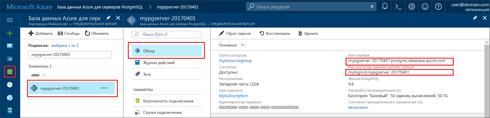

# <a name="azure-database-for-postgresql-use-net-c-to-connect-and-query-data"></a>База данных Azure для PostgreSQL: подключение и запрос данных с помощью C# (.NET)
В этом кратком руководстве объясняется, как подключиться к базе данных Azure для PostgreSQL с помощью приложения C#. Здесь также показано, как использовать инструкции SQL для запроса, вставки, обновления и удаления данных в базе данных. В этой статье предполагается, что у вас уже есть опыт разработки на C# и вы только начали работу с базой данных Azure для PostgreSQL.

## <a name="prerequisites"></a>предварительным требованиям
В качестве отправной точки в этом кратком руководстве используются ресурсы, созданные в соответствии со следующими материалами:
- [Создание базы данных с помощью портала](quickstart-create-server-database-portal.md)
- [Создание базы данных SQL Azure и отправка к ней запросов с помощью Azure CLI](quickstart-create-server-database-azure-cli.md)

Также вам потребуется:
- Установите платформу [.NET Framework](https://www.microsoft.com/net/download). Выполните действия в статье по ссылке, чтобы установить .NET конкретно для вашей платформы (Windows, Ubuntu Linux или macOS). 
- Установите [Visual Studio](https://www.visualstudio.com/downloads/) или Visual Studio Code для ввода и редактирования кода.
- Добавьте ссылку на пакет Nuget [Npgsql](https://www.nuget.org/packages/Npgsql/).

## <a name="get-connection-information"></a>Получение сведений о подключении
Получите сведения, необходимые для подключения к базе данных Azure.для PostgreSQL. Вам потребуется полное имя сервера и учетные данные для входа.

1. Войдите на [портал Azure](https://portal.azure.com/).
2. В меню слева на портале Azure щелкните **Все ресурсы** и выполните поиск по имени созданного сервера (например, **mydemoserver**).
3. Щелкните имя сервера.
4. Запишите **имя сервера** и **имя для входа администратора сервера** с панели сервера **Обзор**. Если вы забыли свой пароль, можно также сбросить пароль с помощью этой панели.
 

## <a name="connect-create-table-and-insert-data"></a>Подключение, создание таблицы и вставка данных
Используйте приведенный ниже код для подключения и загрузки данных с помощью инструкций SQL **CREATE TABLE** и **INSERT INTO**. В коде используется класс NpgsqlCommand с методом [Open()](http://www.npgsql.org/api/Npgsql.NpgsqlConnection.html#Npgsql_NpgsqlConnection_Open), чтобы установить подключение к базе данных PostgreSQL. Затем код использует метод [CreateCommand()](http://www.npgsql.org/api/Npgsql.NpgsqlConnection.html#Npgsql_NpgsqlConnection_CreateCommand), устанавливает свойство CommandText и вызывает метод [ExecuteNonQuery()](http://www.npgsql.org/api/Npgsql.NpgsqlCommand.html#Npgsql_NpgsqlCommand_ExecuteNonQuery), чтобы выполнить команды базы данных. 

Замените значения параметров Host, DBName, User и Password значениями, указанными при создании сервера и базы данных. 

```csharp
using System;
using System.Collections.Generic;
using System.Linq;
using System.Text;
using System.Threading.Tasks;
using Npgsql;

namespace Driver
{
    public class AzurePostgresCreate
    {
        // Obtain connection string information from the portal
        //
        private static string Host = "mydemoserver.postgres.database.azure.com";
        private static string User = "mylogin@mydemoserver";
        private static string DBname = "mypgsqldb";
        private static string Password = "<server_admin_password>";
        private static string Port = "5432";

        static void Main(string[] args)
        {
            // Build connection string using parameters from portal
            //
            string connString =
                String.Format(
                    "Server={0}; User Id={1}; Database={2}; Port={3}; Password={4}; SSL Mode=Prefer; Trust Server Certificate=true",
                    Host,
                    User,
                    DBname,
                    Port,
                    Password);

            var conn = new NpgsqlConnection(connString);

            Console.Out.WriteLine("Opening connection");
            conn.Open();

            var command = conn.CreateCommand();
            command.CommandText = "DROP TABLE IF EXISTS inventory;";
            command.ExecuteNonQuery();
            Console.Out.WriteLine("Finished dropping table (if existed)");

            command.CommandText = "CREATE TABLE inventory (id serial PRIMARY KEY, name VARCHAR(50), quantity INTEGER);";
            command.ExecuteNonQuery();
            Console.Out.WriteLine("Finished creating table");

            command.CommandText =
                String.Format(
                    @"
                                INSERT INTO inventory (name, quantity) VALUES ({0}, {1});
                                INSERT INTO inventory (name, quantity) VALUES ({2}, {3});
                                INSERT INTO inventory (name, quantity) VALUES ({4}, {5});
                            ",
                    "\'banana\'", 150,
                    "\'orange\'", 154,
                    "\'apple\'", 100
                    );

            int nRows = command.ExecuteNonQuery();
            Console.Out.WriteLine(String.Format("Number of rows inserted={0}", nRows));

            Console.Out.WriteLine("Closing connection");
            conn.Close();

            Console.WriteLine("Press RETURN to exit");
            Console.ReadLine();
        }
    }
}
```

## <a name="read-data"></a>Считывание данных
Используйте указанный ниже код с инструкцией SQL **SELECT** для подключения и чтения данных. В коде используется класс NpgsqlCommand с методом [Open()](http://www.npgsql.org/api/Npgsql.NpgsqlConnection.html#Npgsql_NpgsqlConnection_Open), чтобы установить подключение к PostgreSQL. Затем код использует методы [CreateCommand()](http://www.npgsql.org/api/Npgsql.NpgsqlConnection.html#Npgsql_NpgsqlConnection_CreateCommand) и [ExecuteReader()](http://www.npgsql.org/api/Npgsql.NpgsqlCommand.html#Npgsql_NpgsqlCommand_ExecuteReader) для выполнения команд базы данных. После чего используется метод [Read()](http://www.npgsql.org/api/Npgsql.NpgsqlDataReader.html#Npgsql_NpgsqlDataReader_Read) для перехода к записи в результирующем наборе. Наконец, код использует методы [GetInt32](http://www.npgsql.org/api/Npgsql.NpgsqlDataReader.html#Npgsql_NpgsqlDataReader_GetInt32_System_Int32_) и [GetString](http://www.npgsql.org/api/Npgsql.NpgsqlDataReader.html#Npgsql_NpgsqlDataReader_GetString_System_Int32_) для анализа значений в записи.

Замените значения параметров Host, DBName, User и Password значениями, указанными при создании сервера и базы данных. 

```csharp
using System;
using System.Collections.Generic;
using System.Linq;
using System.Text;
using System.Threading.Tasks;
using Npgsql;

namespace Driver
{
    public class AzurePostgresRead
    {
        // Obtain connection string information from the portal
        //
        private static string Host = "mydemoserver.postgres.database.azure.com";
        private static string User = "mylogin@mydemoserver";
        private static string DBname = "mypgsqldb";
        private static string Password = "<server_admin_password>";
        private static string Port = "5432";

        static void Main(string[] args)
        {
            // Build connection string using parameters from portal
            //
            string connString =
                String.Format(
                    "Server={0}; User Id={1}; Database={2}; Port={3}; Password={4};",
                    Host,
                    User,
                    DBname,
                    Port,
                    Password);

            var conn = new NpgsqlConnection(connString);

            Console.Out.WriteLine("Opening connection");
            conn.Open();

            var command = conn.CreateCommand();
            command.CommandText = "SELECT * FROM inventory;";

            var reader = command.ExecuteReader();
            while (reader.Read())
            {
                Console.WriteLine(
                    string.Format(
                        "Reading from table=({0}, {1}, {2})",
                        reader.GetInt32(0).ToString(),
                        reader.GetString(1),
                        reader.GetInt32(2).ToString()
                        )
                    );
            }

            Console.Out.WriteLine("Closing connection");
            conn.Close();

            Console.WriteLine("Press RETURN to exit");
            Console.ReadLine();
        }
    }
}
```


## <a name="update-data"></a>Обновление данных
Используйте указанный ниже код с инструкцией SQL **UPDATE** для подключения и обновления данных. В коде используется класс NpgsqlCommand с методом [Open()](http://www.npgsql.org/api/Npgsql.NpgsqlConnection.html#Npgsql_NpgsqlConnection_Open), чтобы установить подключение к PostgreSQL. Затем код использует метод [CreateCommand()](http://www.npgsql.org/api/Npgsql.NpgsqlConnection.html#Npgsql_NpgsqlConnection_CreateCommand), устанавливает свойство CommandText и вызывает метод [ExecuteNonQuery()](http://www.npgsql.org/api/Npgsql.NpgsqlCommand.html#Npgsql_NpgsqlCommand_ExecuteNonQuery), чтобы выполнить команды базы данных.

Замените значения параметров Host, DBName, User и Password значениями, указанными при создании сервера и базы данных. 

```csharp
using System;
using System.Collections.Generic;
using System.Linq;
using System.Text;
using System.Threading.Tasks;
using Npgsql;

namespace Driver
{
    public class AzurePostgresUpdate
    {
        // Obtain connection string information from the portal
        //
        private static string Host = "mydemoserver.postgres.database.azure.com";
        private static string User = "mylogin@mydemoserver";
        private static string DBname = "mypgsqldb";
        private static string Password = "<server_admin_password>";
        private static string Port = "5432";

        static void Main(string[] args)
        {
            // Build connection string using parameters from portal
            //
            string connString =
                String.Format(
                    "Server={0}; User Id={1}; Database={2}; Port={3}; Password={4};",
                    Host,
                    User,
                    DBname,
                    Port,
                    Password);

            var conn = new NpgsqlConnection(connString);

            Console.Out.WriteLine("Opening connection");
            conn.Open();

            var command = conn.CreateCommand();
            command.CommandText =
            String.Format("UPDATE inventory SET quantity = {0} WHERE name = {1};",
                200,
                "\'banana\'"
                );

            int nRows = command.ExecuteNonQuery();
            Console.Out.WriteLine(String.Format("Number of rows updated={0}", nRows));

            Console.Out.WriteLine("Closing connection");
            conn.Close();

            Console.WriteLine("Press RETURN to exit");
            Console.ReadLine();
        }
    }
}
```


## <a name="delete-data"></a>Удаление данных
Используйте указанный ниже код с инструкцией SQL **DELETE** для подключения и удаления данных. 

В коде используется класс NpgsqlCommand с методом [Open()](http://www.npgsql.org/api/Npgsql.NpgsqlConnection.html#Npgsql_NpgsqlConnection_Open), чтобы установить подключение к базе данных PostgreSQL. Затем код использует метод [CreateCommand()](http://www.npgsql.org/api/Npgsql.NpgsqlConnection.html#Npgsql_NpgsqlConnection_CreateCommand), устанавливает свойство CommandText и вызывает метод [ExecuteNonQuery()](http://www.npgsql.org/api/Npgsql.NpgsqlCommand.html#Npgsql_NpgsqlCommand_ExecuteNonQuery), чтобы выполнить команды базы данных.

Замените значения параметров Host, DBName, User и Password значениями, указанными при создании сервера и базы данных. 

```csharp
using System;
using System.Collections.Generic;
using System.Linq;
using System.Text;
using System.Threading.Tasks;
using Npgsql;

namespace Driver
{
    public class AzurePostgresDelete
    {
        // Obtain connection string information from the portal
        //
        private static string Host = "mydemoserver.postgres.database.azure.com";
        private static string User = "mylogin@mydemoserver";
        private static string DBname = "mypgsqldb";
        private static string Password = "<server_admin_password>";
        private static string Port = "5432";

        static void Main(string[] args)
        {
            // Build connection string using parameters from portal
            //
            string connString =
                String.Format(
                    "Server={0}; User Id={1}; Database={2}; Port={3}; Password={4};",
                    Host,
                    User,
                    DBname,
                    Port,
                    Password);

            var conn = new NpgsqlConnection(connString);

            Console.Out.WriteLine("Opening connection");
            conn.Open();

            var command = conn.CreateCommand();
            command.CommandText =
            String.Format("DELETE FROM inventory WHERE name = {0};",
                "\'orange\'");
            int nRows = command.ExecuteNonQuery();
            Console.Out.WriteLine(String.Format("Number of rows deleted={0}", nRows));

            Console.Out.WriteLine("Closing connection");
            conn.Close();

            Console.WriteLine("Press RETURN to exit");
            Console.ReadLine();
        }
    }
}
```

## <a name="next-steps"></a>Дополнительная информация
> [!div class="nextstepaction"]
> [Перенос базы данных с помощью экспорта и импорта](./howto-migrate-using-export-and-import.md)
