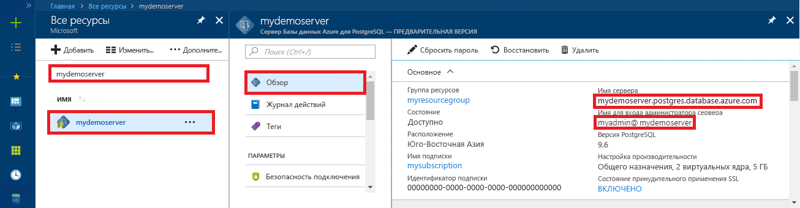

# <a name="azure-database-for-postgresql-use-ruby-to-connect-and-query-data"></a>База данных Azure для PostgreSQL: подключение и запрос данных с помощью Ruby
В этом кратком руководстве описывается, как подключиться к базе данных Azure для PostgreSQL с помощью приложения [Ruby](https://www.ruby-lang.org). Здесь также показано, как использовать инструкции SQL для запроса, вставки, обновления и удаления данных в базе данных. В этой статье предполагается, что у вас уже есть опыт разработки на Ruby и вы только начали работу с базой данных Azure для PostgreSQL.

## <a name="prerequisites"></a>предварительным требованиям
В качестве отправной точки в этом кратком руководстве используются ресурсы, созданные в соответствии со следующими материалами:
- [Создание базы данных с помощью портала](quickstart-create-server-database-portal.md)
- [Создание базы данных с помощью Azure CLI](quickstart-create-server-database-azure-cli.md)

## <a name="install-ruby"></a>Установка Ruby
Установите Ruby на своем компьютере. 

### <a name="windows"></a>Windows
- Скачайте и установите последнюю версию [Ruby](http://rubyinstaller.org/downloads/).
- На последнем экране установщика MSI установите флажок с рядом надписью "Run 'ridk install' to install MSYS2 and development toolchain" (Выполнить ridk install, чтобы установить MSYS2 и цепочку средств разработки). Нажмите кнопку **Готово** для запуска следующего установщика.
- Запустится установщик RubyInstaller2 для Windows. Введите 2, чтобы установить обновление репозитория MSYS2. После завершения и возврата к строке установки закройте командное окно.
- Запустите новую командную строку (cmd) из меню "Пуск".
- Выполните `ruby -v`, чтобы узнать установленную версию Ruby.
- Выполните `gem -v`, чтобы узнать установленную версию Gem.
- Создайте модуль PostgreSQL для Ruby с помощью Gem, выполнив команду `gem install pg`.

### <a name="macos"></a>MacOS
- Установите Ruby с помощью Homebrew, выполнив команду `brew install ruby`. Дополнительные параметры установки см. в [документации по установке](https://www.ruby-lang.org/en/documentation/installation/#homebrew) Ruby.
- Выполните `ruby -v`, чтобы узнать установленную версию Ruby.
- Выполните `gem -v`, чтобы узнать установленную версию Gem.
- Создайте модуль PostgreSQL для Ruby с помощью Gem, выполнив команду `gem install pg`.

### <a name="linux-ubuntu"></a>Linux (Ubuntu)
- Установите Ruby, выполнив команду `sudo apt-get install ruby-full`. Дополнительные параметры установки см. в [документации по установке](https://www.ruby-lang.org/en/documentation/installation/) Ruby.
- Выполните `ruby -v`, чтобы узнать установленную версию Ruby.
- Установите последние обновления для Gem, выполнив команду `sudo gem update --system`.
- Выполните `gem -v`, чтобы узнать установленную версию Gem.
- Установите gcc, make и другие инструменты сборки, выполнив команду `sudo apt-get install build-essential`.
- Установите библиотеки PostgreSQL, выполнив команду `sudo apt-get install libpq-dev`.
- Создайте pg-модуль Ruby с помощью Gem, выполнив команду `sudo gem install pg`.

## <a name="run-ruby-code"></a>Выполнение кода Ruby 
- Сохраните код в текстовый файл с расширением RB, а затем сохраните файл в папку проекта, например `C:\rubypostgres\read.rb` или `/home/username/rubypostgres/read.rb`.
- Чтобы выполнить код, запустите командную строку или оболочку Bash. Перейдите в папку проекта с помощью `cd rubypostgres` и введите команду `ruby read.rb` для запуска приложения.

## <a name="get-connection-information"></a>Получение сведений о подключении
Получите сведения, необходимые для подключения к базе данных Azure.для PostgreSQL. Вам потребуется полное имя сервера и учетные данные для входа.

1. Войдите на [портал Azure](https://portal.azure.com/).
2. В меню слева на портале Azure щелкните **Все ресурсы** и выполните поиск по имени созданного сервера (например, **mydemoserver**).
3. Щелкните имя сервера.
4. Запишите **имя сервера** и **имя для входа администратора сервера** с панели сервера **Обзор**. Если вы забыли свой пароль, можно также сбросить пароль с помощью этой панели.
 

## <a name="connect-and-create-a-table"></a>Подключение и создание таблицы
Используйте приведенный ниже код для подключения и создайте таблицу с помощью инструкции SQL **CREATE TABLE**. Добавьте строки в таблицу, применив инструкцию SQL **INSERT INTO**.

Код использует объект [PG::Connection](http://www.rubydoc.info/gems/pg/PG/Connection) с конструктором [new()](http://www.rubydoc.info/gems/pg/PG%2FConnection:initialize) для подключения к базе данных Azure для PostgreSQL. Затем он вызывает метод [exec()](http://www.rubydoc.info/gems/pg/PG/Connection#exec-instance_method) для выполнения команд DROP, CREATE TABLE и INSERT INTO. Этот код проверяет наличие ошибок с помощью класса [PG::Error](http://www.rubydoc.info/gems/pg/PG/Error). После этого вызывается метод [close()](http://www.rubydoc.info/gems/pg/PG/Connection#lo_close-instance_method), чтобы разорвать подключение перед завершением работы.

Замените строки `host`, `database`, `user` и `password` собственными значениями. 
```ruby
require 'pg'

begin
    # Initialize connection variables.
    host = String('mydemoserver.postgres.database.azure.com')
    database = String('postgres')
    user = String('mylogin@mydemoserver')
    password = String('<server_admin_password>')

    # Initialize connection object.
    connection = PG::Connection.new(:host => host, :user => user, :dbname => database, :port => '5432', :password => password)
    puts 'Successfully created connection to database'

    # Drop previous table of same name if one exists
    connection.exec('DROP TABLE IF EXISTS inventory;')
    puts 'Finished dropping table (if existed).'

    # Drop previous table of same name if one exists.
    connection.exec('CREATE TABLE inventory (id serial PRIMARY KEY, name VARCHAR(50), quantity INTEGER);')
    puts 'Finished creating table.'

    # Insert some data into table.
    connection.exec("INSERT INTO inventory VALUES(1, 'banana', 150)")
    connection.exec("INSERT INTO inventory VALUES(2, 'orange', 154)")
    connection.exec("INSERT INTO inventory VALUES(3, 'apple', 100)")
    puts 'Inserted 3 rows of data.'

rescue PG::Error => e
    puts e.message 
    
ensure
    connection.close if connection
end
```

## <a name="read-data"></a>Считывание данных
Используйте указанный ниже код с инструкцией SQL **SELECT** для подключения и чтения данных. 

Код использует объект [PG::Connection](http://www.rubydoc.info/gems/pg/PG/Connection) с конструктором [new()](http://www.rubydoc.info/gems/pg/PG%2FConnection:initialize) для подключения к базе данных Azure для PostgreSQL. Затем он вызывает метод [exec()](http://www.rubydoc.info/gems/pg/PG/Connection#exec-instance_method) для выполнения команды SELECT, сохраняя результаты в итоговом наборе. Для коллекции набора результатов выполняется итерация с применением цикла `resultSet.each do`. При этом данные строки текущего значения сохраняются в переменной `row`. Этот код проверяет наличие ошибок с помощью класса [PG::Error](http://www.rubydoc.info/gems/pg/PG/Error). После этого вызывается метод [close()](http://www.rubydoc.info/gems/pg/PG/Connection#lo_close-instance_method), чтобы разорвать подключение перед завершением работы.

Замените строки `host`, `database`, `user` и `password` собственными значениями. 

```ruby
require 'pg'

begin
    # Initialize connection variables.
    host = String('mydemoserver.postgres.database.azure.com')
    database = String('postgres')
    user = String('mylogin@mydemoserver')
    password = String('<server_admin_password>')

    # Initialize connection object.
    connection = PG::Connection.new(:host => host, :user => user, :database => dbname, :port => '5432', :password => password)
    puts 'Successfully created connection to database.'

    resultSet = connection.exec('SELECT * from inventory;')
    resultSet.each do |row|
        puts 'Data row = (%s, %s, %s)' % [row['id'], row['name'], row['quantity']]
    end

rescue PG::Error => e
    puts e.message 
    
ensure
    connection.close if connection
end
```

## <a name="update-data"></a>Обновление данных
Используйте указанный ниже код с инструкцией SQL **UPDATE** для подключения и обновления данных.

Код использует объект [PG::Connection](http://www.rubydoc.info/gems/pg/PG/Connection) с конструктором [new()](http://www.rubydoc.info/gems/pg/PG%2FConnection:initialize) для подключения к базе данных Azure для PostgreSQL. Затем он вызывает метод [exec()](http://www.rubydoc.info/gems/pg/PG/Connection#exec-instance_method) для выполнения команды UPDATE. Этот код проверяет наличие ошибок с помощью класса [PG::Error](http://www.rubydoc.info/gems/pg/PG/Error). После этого вызывается метод [close()](http://www.rubydoc.info/gems/pg/PG/Connection#lo_close-instance_method), чтобы разорвать подключение перед завершением работы.

Замените строки `host`, `database`, `user` и `password` собственными значениями. 

```ruby
require 'pg'

begin
    # Initialize connection variables.
    host = String('mydemoserver.postgres.database.azure.com')
    database = String('postgres')
    user = String('mylogin@mydemoserver')
    password = String('<server_admin_password>')

    # Initialize connection object.
    connection = PG::Connection.new(:host => host, :user => user, :dbname => database, :port => '5432', :password => password)
    puts 'Successfully created connection to database.'

    # Modify some data in table.
    connection.exec('UPDATE inventory SET quantity = %d WHERE name = %s;' % [200, '\'banana\''])
    puts 'Updated 1 row of data.'

rescue PG::Error => e
    puts e.message 
    
ensure
    connection.close if connection
end
```


## <a name="delete-data"></a>Удаление данных
Используйте указанный ниже код с инструкцией SQL **DELETE** для подключения и чтения данных. 

Код использует объект [PG::Connection](http://www.rubydoc.info/gems/pg/PG/Connection) с конструктором [new()](http://www.rubydoc.info/gems/pg/PG%2FConnection:initialize) для подключения к базе данных Azure для PostgreSQL. Затем он вызывает метод [exec()](http://www.rubydoc.info/gems/pg/PG/Connection#exec-instance_method) для выполнения команды UPDATE. Этот код проверяет наличие ошибок с помощью класса [PG::Error](http://www.rubydoc.info/gems/pg/PG/Error). После этого вызывается метод [close()](http://www.rubydoc.info/gems/pg/PG/Connection#lo_close-instance_method), чтобы разорвать подключение перед завершением работы.

Замените строки `host`, `database`, `user` и `password` собственными значениями. 

```ruby
require 'pg'

begin
    # Initialize connection variables.
    host = String('mydemoserver.postgres.database.azure.com')
    database = String('postgres')
    user = String('mylogin@mydemoserver')
    password = String('<server_admin_password>')

    # Initialize connection object.
    connection = PG::Connection.new(:host => host, :user => user, :dbname => database, :port => '5432', :password => password)
    puts 'Successfully created connection to database.'

    # Modify some data in table.
    connection.exec('DELETE FROM inventory WHERE name = %s;' % ['\'orange\''])
    puts 'Deleted 1 row of data.'

rescue PG::Error => e
    puts e.message 
    
ensure
    connection.close if connection
end
```

## <a name="next-steps"></a>Дополнительная информация
> [!div class="nextstepaction"]
> [Перенос базы данных с помощью экспорта и импорта](./howto-migrate-using-export-and-import.md)
