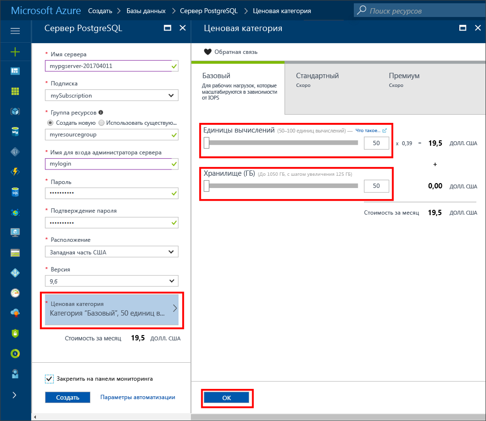
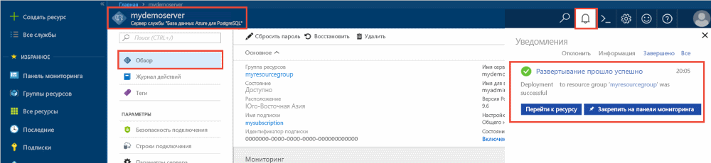
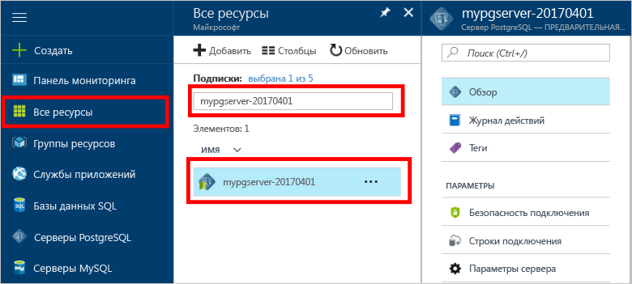
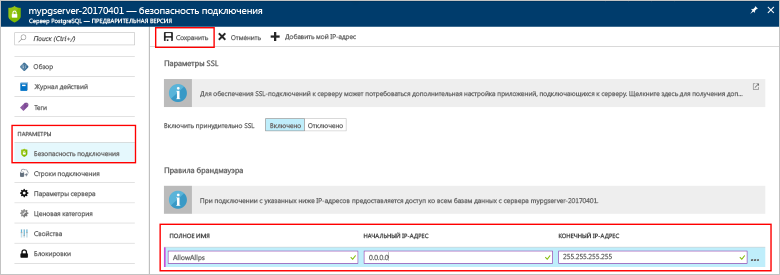
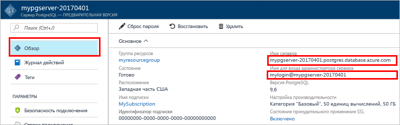
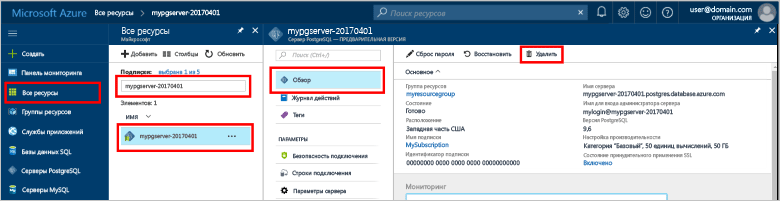

# <a name="create-an-azure-database-for-postgresql-server-in-the-azure-portal"></a>Создание базы данных Azure для сервера PostgreSQL на портале Azure

База данных Azure для PostgreSQL — это управляемая служба, с помощью которой можно запускать и масштабировать базы данных PostgreSQL высокой доступности, а также управлять ими в облаке. В этом кратком руководстве описывается, как быстро создать базу данных Azure для сервера PostgreSQL с помощью портала Azure в пределах 5 минут.

Если у вас еще нет подписки Azure, создайте [бесплатную учетную запись](https://azure.microsoft.com/free/) Azure, прежде чем начинать работу.

## <a name="sign-in-to-the-azure-portal"></a>Выполните вход на портал Azure.
Откройте веб-браузер и перейдите на [портал](https://portal.azure.com/). Введите свои учетные данные для входа на портал. Панель мониторинга службы является представлением по умолчанию.

## <a name="create-an-azure-database-for-postgresql-server"></a>Создание сервера базы данных Azure для PostgreSQL

Сервер базы данных Azure для PostgreSQL создается с определенным набором [вычислительных ресурсов и ресурсов хранения](./concepts-compute-unit-and-storage.md). Он создается в [группе ресурсов Azure](../azure-resource-manager/resource-group-overview.md).

Чтобы создать базу данных Azure для сервера PostgreSQL, выполните такие действия:
1. Щелкните **Создать** (+) в левом верхнем углу портала.

2. Выберите **Базы данных** > **База данных Azure для PostgreSQL**.

    

3. Заполните форму сведений о новом сервере, указав следующую информацию, как показано на предыдущем рисунке.

    Настройка|Рекомендуемое значение|Описание
    ---|---|---
    имя сервера; |*mypgserver-20170401*|Уникальное имя, идентифицирующее базу данных Azure для сервера PostgreSQL. Имя домена *postgres.database.azure.com* добавляется к указанному имени сервера. Сервер может содержать только строчные буквы, цифры и знак дефиса (-). Его длина должна составлять от 3 до 63 символов.
    Подписки|Ваша подписка|Подписка Azure, которую вы хотите использовать для сервера. Если у вас есть несколько подписок, выберите ту, в которой взимается плата за использование ресурса.
    Группа ресурсов|*myresourcegroup*| Новое имя группы ресурсов или уже имеющееся из подписки.
    учетные данные администратора сервера для входа; |*mylogin*| Собственная учетная запись входа, используемая при подключении к серверу. Не используйте для имени учетной записи администратора такие варианты: **azure_superuser**, **azure_pg_admin**, **admin**, **administrator**, **root**, **guest** или **public**. Оно не может начинаться с **pg_**.
    Пароль |По своему выбору | Новый пароль для учетной записи администратора сервера. Его длина должна составлять от 8 до 128 символов. Пароль должен содержать символы трех из следующих категорий: прописные латинские буквы, строчные латинские буквы, цифры (от 0 до 9) и другие символы (!, $, #, % и т. д.).
    Расположение|Ближайший к пользователям регион| Ближайшее к пользователям расположение.
    Версия PostgreSQL|Последняя версия| Последняя версия, если нет особых требований.
    Ценовая категория  | **Базовый**, **50 ед. вычислений**, **50 ГБ** | Уровень служб и уровень производительности новой базы данных. Выберите **ценовую категорию**. Затем перейдите на вкладку **Базовый**. Щелкните ползунок **Единицы вычислений** слева, чтобы для начала выбрать наименьшее доступное значение. Щелкните **ОК**, чтобы сохранить ценовую категорию. Дополнительные сведения см. на снимке экрана ниже. 
    Закрепить на панели мониторинга | Проверка | Возможность отслеживать работу сервера на странице передней панели мониторинга портала.

    > [!IMPORTANT]
    > Указанные здесь учетные данные и пароль администратора сервера понадобятся позже в этом руководстве, чтобы войти на сервер и в его базу данных. Запомните или запишите эту информацию для последующего использования.

    

4. Щелкните **Создать**, чтобы подготовить сервер. Этот процесс может занять до 20 минут.

5. На панели инструментов щелкните символ **Уведомления**, чтобы отслеживать процесс развертывания.

    
   
  По умолчанию на сервере создается база данных **postgres**. База данных [postgres](https://www.postgresql.org/docs/9.6/static/app-initdb.html) — это база данных по умолчанию, предназначенная для использования пользователями, служебными программами и сторонними приложениями. 

## <a name="configure-a-server-level-firewall-rule"></a>Настройка правила брандмауэра на уровне сервера

База данных Azure для PostgreSQL создает брандмауэр на уровне сервера. Он не позволяет внешним приложениям и инструментам подключаться к серверу и к любой базе данных на сервере, если не создано правило, открывающее брандмауэр для определенных IP-адресов. 

1. Найдите сервер после завершения развертывания. При необходимости можно выполнить поиск. Например, в меню слева выберите **Все ресурсы**. Введите имя сервера, например **mypgserver-20170401**, чтобы найти созданный сервер. Выберите имя сервера в списке результатов поиска. После этого откроется страница **обзора** сервера с параметрами для дальнейшей конфигурации.
 
    

2. На странице сервера выберите **Безопасность подключения**.

    

3. В разделе **Правила брандмауэра**, в столбце **Имя правила** щелкните пустое текстовое поле, чтобы создать правило брандмауэра. 

    В этом кратком руководстве мы разрешим трафик на сервер со всех IP-адресов. Заполните текстовое поле в каждом столбце такими значениями:

    Имя правила | Начальный IP-адрес | Конечный IP-адрес 
    ---|---|---
    AllowAllIps | 0.0.0.0 | 255.255.255.255

4. На верхней панели инструментов на странице **Безопасность подключения** щелкните **Сохранить**. Прежде чем продолжить, подождите, пока не появится уведомление о том, что обновление безопасного подключения успешно завершено.

    > [!NOTE]
    > Подключения к базе данных Azure для сервера PostgreSQL выполняются через порт 5432. При попытке подключиться из корпоративной сети, исходящий трафик через порт 5432 может блокироваться сетевым брандмауэром. В таком случае вы не сможете подключиться к серверу. Для этого ваш ИТ-отдел должен открыть порт 5432.
    >

## <a name="get-the-connection-information"></a>Получение сведений о подключении

При создании базы данных Azure для сервера PostgreSQL создается база данных по умолчанию с именем **postgres**. Чтобы подключиться к серверу базы данных, вам потребуются учетные данные администратора для входа и полное имя сервера. Скорее всего, вы уже записали эти значения раньше. Если вы не сделали этого, имя сервера и данные для входа можно легко найти на странице **Обзор** сервера на портале.

Откройте страницу сервера **Обзор**. Запишите значения **имени сервера** и **имени для входа администратора сервера**. Наведите указатель на каждое поле. Справа от текста отобразится символ копирования. Щелкните его, чтобы скопировать нужные значения.

 

## <a name="connect-to-the-postgresql-database-by-using-psql-in-cloud-shell"></a>Подключение к базе данных PostgreSQL с помощью psql в Cloud Shell

К базе данных Azure для сервера PostgreSQL можно подключиться с помощью нескольких приложений. Сначала воспользуемся служебной программой командной строки psql для подключения к серверу. Веб-браузер и Azure Cloud Shell можно использовать, как описано здесь, без установки дополнительного программного обеспечения. Если на вашем компьютере установлена служебная программа psql, вы можете подключиться с него.

1. В верхней части области навигации щелкните символ терминала, чтобы открыть Cloud Shell.

   

2. В браузере откроется служба Cloud Shell, где вы можете вводить команды оболочки Bash.

   

3. Чтобы подключиться к базе данных Azure для сервера PostgreSQL, введите команду в командной строке psql.

    Чтобы подключиться к серверу базы данных Azure для PostgreSQL с помощью служебной программы [psql](https://www.postgresql.org/docs/9.6/static/app-psql.html), используйте следующий формат:
    ```bash
    psql --host=<yourserver> --port=<port> --username=<server admin login> --dbname=<database name>
    ```

    Например, следующая команда позволяет подключиться к серверу, используемому для примера:

    ```bash
    psql --host=mypgserver-20170401.postgres.database.azure.com --port=5432 --username=mylogin@mypgserver-20170401 --dbname=postgres
    ```

    Параметр psql |Рекомендуемое значение|Описание
    ---|---|---
    --host | имя сервера; | Значение имени сервера, которое вы использовали раньше при создании базы данных Azure для сервера PostgreSQL. В нашем примере используется такое имя сервера: **mypgserver-20170401.postgres.database.azure.com**. Используйте полное доменное имя (**\*.postgres.database.azure.com**), как показано в примере. Если вы не помните имя своего сервера, выполните действия из предыдущего раздела, чтобы получить сведения о подключении. 
    --port | 5432 | Порт, используемый при подключении к базе данных Azure для сервера PostgreSQL. 
    --username | Имя для входа администратора сервера |Имя для входа администратора сервера, которое вы использовали раньше при создании базы данных Azure для сервера PostgreSQL. Если вы не помните имя пользователя, выполните действия из предыдущего раздела, чтобы получить сведения о подключении. Используйте формат *username@servername*.
    --dbname | *postgres* | Имя базы данных по умолчанию, созданное системой при первом подключении. Позже можно создать собственную базу данных.

    Когда вы запустите команду psql с собственными значениями параметров, появится запрос на ввод пароля администратора сервера. Это пароль, указанный при создании сервера. 

    Параметр psql |Рекомендуемое значение|Описание
    ---|---|---
    пароль | Ваш пароль администратора | Символы введенного пароля не отображаются в строке Bash. После ввода всех символов нажмите клавишу **ВВОД**, чтобы пройти аутентификацию и подключиться.

    После подключения служебная программа psql отображает запрос postgres в поле, где вы вводите команды sql. В первоначальных выходных данных подключения может отобразиться предупреждение, так как psql в Cloud Shell может иметь версию, отличную от базы данных Azure для версии сервера PostgreSQL. 
    
    Пример выходных данных psql:
    ```bash
    psql (9.5.7, server 9.6.2)
    WARNING: psql major version 9.5, server major version 9.6.
        Some psql features might not work.
    SSL connection (protocol: TLSv1.2, cipher: ECDHE-RSA-AES256-SHA384, bits: 256, compression: off)
    Type "help" for help.
   
    postgres=> 
    ```

    > [!TIP]
    > Если в брандмауэре не настроено разрешение IP-адресов Cloud Shell, возникнет следующая ошибка:
    > 
    > psql: FATAL: нет записи pg_hba.conf для узла 138.91.195.82, пользователь mylogin, база данных postgres, подключение SSL для FATAL: необходимо SSL-подключение. Укажите параметры SSL и повторите попытку.
    > 
    > Чтобы устранить эту ошибку, убедитесь, что конфигурация сервера соответствует инструкциям в разделе "Настройка правила брандмауэра на уровне сервера" этой статьи.

4. Создайте пустую базу данных. Для этого в командной строке введите следующую команду:
    ```bash
    CREATE DATABASE mypgsqldb;
    ```
    Выполнение команды может занять несколько минут. 

5. Чтобы подключиться к созданной базе данных **mypgsqldb**, выполните в командной строке следующую команду:
    ```bash
    \c mypgsqldb
    ```

6. Введите `\q`, а затем нажмите клавишу **ВВОД**, чтобы выйти из psql. После завершения можно закрыть Cloud Shell.

Итак, вы подключились к базе данных Azure для сервера PostgreSQL и создали пустую пользовательскую базу данных. Перейдите к следующему разделу, чтобы подключиться к базе данных с помощью другого популярного средства — pgAdmin.

## <a name="connect-to-the-postgresql-database-by-using-pgadmin"></a>Подключение к базе данных PostgreSQL с помощью pgAdmin

Чтобы подключиться к серверу PostgreSQL Azure с помощью инструмента графического интерфейса пользователя pgAdmin, сделайте следующее:
1. Откройте приложение pgAdmin на клиентском компьютере. Средство PgAdmin можно установить с [веб-сайта pgAdmin](http://www.pgadmin.org/).

2. На панели мониторинга в разделе **Быстрые ссылки** выберите символ **Добавить новый сервер**.

3. На вкладке **Общее** в диалоговом окне **Создать сервер** введите уникальное понятное имя для сервера, например **Azure PostgreSQL Server**.

    

4. На вкладке **Подключение** в диалоговом окне **Создать сервер** используйте указанные настройки, а затем выберите **Сохранить**.

   

    параметр pgAdmin |Рекомендуемое значение|Описание
    ---|---|---
    Имя узла и адрес | имя сервера; | Значение имени сервера, которое вы использовали раньше при создании базы данных Azure для сервера PostgreSQL. В нашем примере используется такое имя сервера: **mypgserver-20170401.postgres.database.azure.com**. Используйте полное доменное имя (**\*.postgres.database.azure.com**), как показано в примере. Если вы не помните имя своего сервера, выполните действия из предыдущего раздела, чтобы получить сведения о подключении. 
    Порт | 5432 | Порт, используемый при подключении к базе данных Azure для сервера PostgreSQL. 
    База данных обслуживания | *postgres* | Имя базы данных по умолчанию, созданное системой.
    Имя пользователя | Имя для входа администратора сервера | Имя для входа администратора сервера, которое вы использовали раньше при создании базы данных Azure для сервера PostgreSQL. Если вы не помните имя пользователя, выполните действия из предыдущего раздела, чтобы получить сведения о подключении. Используйте формат *username@servername*.
    Пароль | Ваш пароль администратора | Пароль, выбранный при создании сервера во время работы с этим руководством.
    Роль | Не указывайте | Указывать роль на этом шаге не нужно. Оставьте поле пустым.
    Режим SSL | Обязательно | По умолчанию все серверы PostgreSQL Azure создаются с включенным применением SSL. Чтобы отключить применение SSL, см. сведения в статье [Настройка SSL-соединения в базе данных Azure для PostgreSQL](./concepts-ssl-connection-security.md).
    
5. Щелкните **Сохранить**.

6. В области **Браузер** слева разверните узел **Серверы**. Выберите сервер, например **сервер Azure PostgreSQL**. Щелкните, чтобы подключиться к нему.

7. Разверните узел сервера, а затем разверните раздел **Базы данных** под ним. Список должен включать имеющиеся базы данных *postgres*, а также все созданные пользовательские базы данных, такие как **mypgsqldb**, созданные в предыдущем разделе. Обратите внимание, что можно создать несколько баз данных на сервере с помощью базы данных Azure для PostgreSQL.

8. Щелкните правой кнопкой мыши **Базы данных**, выберите меню **Создать**, а затем щелкните **База данных**.

9. Введите выбранное имя базы данных в поле **База данных** (в нашем примере это **mypgsqldb**).

10. Выберите **владельца** базы данных из списка. Выберите имя администратора сервера для входа (в нашем примере это **mylogin**).

11. выберите **Сохранить**, чтобы создать пустую базу данных.

12. В области **Обзор** найдите созданную базу данных в списке баз данных под именем сервера.

    


## <a name="clean-up-resources"></a>Очистка ресурсов
Удалить ресурсы, созданные в ходе работы с этим руководством, можно с помощью одного из двух способов. Вы можете удалить [группу ресурсов Azure](../azure-resource-manager/resource-group-overview.md), которая содержит все связанные ресурсы. Если же вы хотите сохранить другие ресурсы, удалите только один ресурс сервера.

> [!TIP]
> Другие краткие руководства в этой коллекции созданы на основе этого документа. Если вы планируете продолжать работу с этими краткими руководствами, не удаляйте созданные ресурсы, а если нет — удалите все созданные в ходе работы с ним ресурсы, выполнив приведенные ниже действия на портале.

Чтобы удалить группу ресурсов, в том числе только что созданный сервер, сделайте следующее:
1. Найдите группу ресурсов на портале. В меню слева выберите **Группы ресурсов**. Затем выберите имя группы ресурсов (в нашем примере это **myresourcegroup**).

2. На странице группы ресурсов щелкните **Удалить**. Затем введите имя своей группы ресурсов, например, из нашего примера — **myresourcegroup**, в текстовое поле, чтобы подтвердить удаление. Нажмите кнопку **Удалить**.

Чтобы удалить только что созданный сервер, сделайте следующее:
1. Найдите сервер на портале, если от еще не открыт. В меню слева выберите **Все ресурсы**. Затем найдите созданный сервер.

2. На странице **Обзор** выберите **Удалить**.

    

3. Подтвердите имя сервера, которое нужно удалить, чтобы появилась нужная база данных. Введите имя сервера в текстовое поле (в нашем примере это **mypgserver-20170401**). Нажмите кнопку **Удалить**.

## <a name="next-steps"></a>Дальнейшие действия
> [!div class="nextstepaction"]
> [Перенос базы данных с помощью экспорта и импорта](./howto-migrate-using-export-and-import.md)

