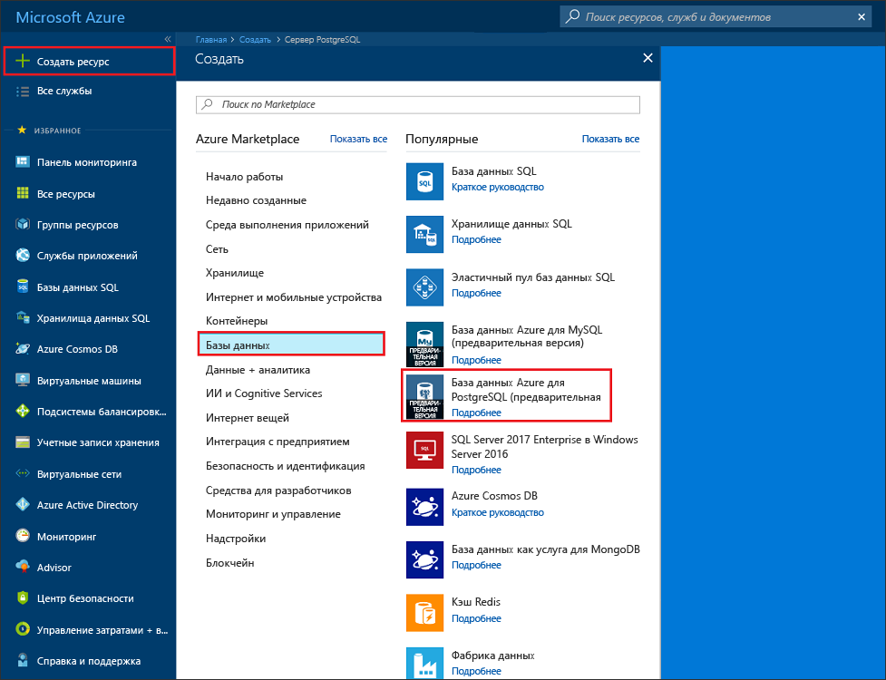
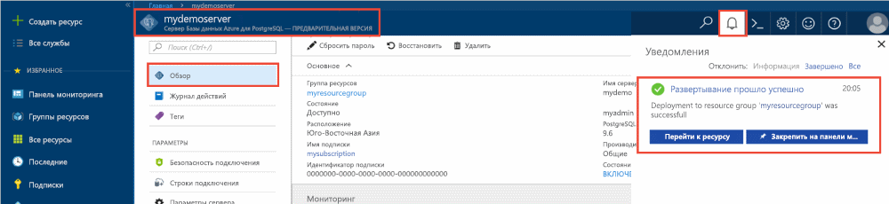
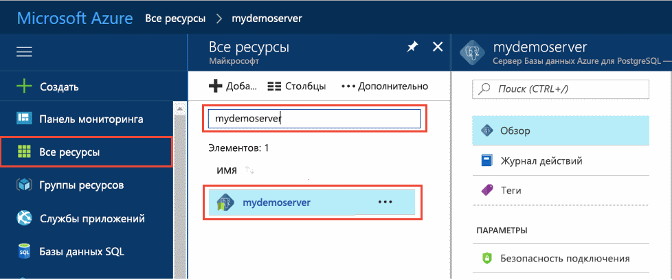
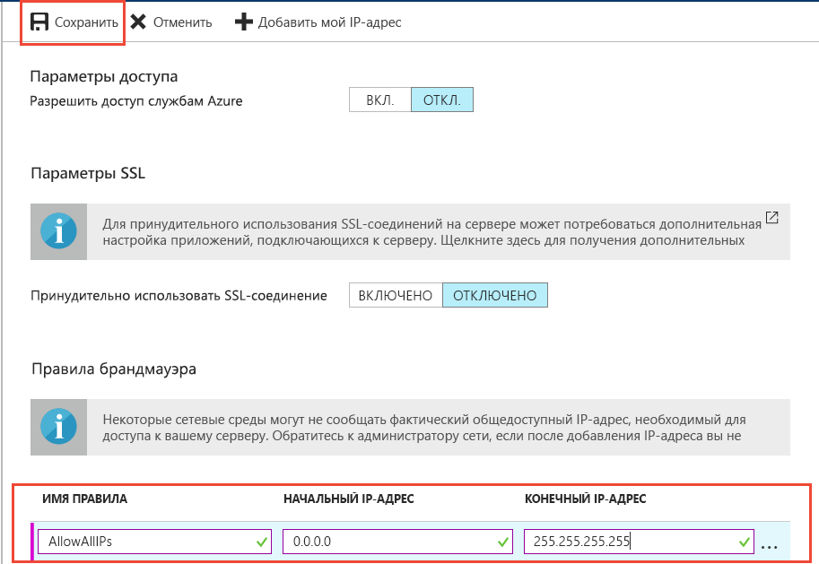
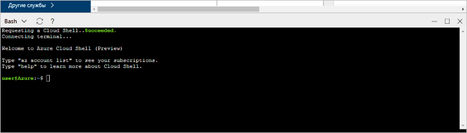

# <a name="design-your-first-azure-database-for-postgresql-using-the-azure-portal"></a>Проектирование первой базы данных Azure для PostgreSQL с помощью портала Azure

База данных Azure для PostgreSQL — это управляемая служба, которая позволяет вам запускать, администрировать и масштабировать высокодоступные базы данных PostgreSQL в облаке. С помощью портала Azure можно легко управлять сервером и проектировать базы данных.

Из этого руководства вы узнаете, как с помощью портала Azure выполнять следующие операции:
> [!div class="checklist"]
> * создание базы данных Azure для PostgreSQL;
> * настройка брандмауэра сервера;
> * использование служебной программы [**psql**](https://www.postgresql.org/docs/9.6/static/app-psql.html) для создания базы данных;
> * Загрузка примера данных
> * Запрос данных
> * Обновление данных
> * восстановление данных.

## <a name="prerequisites"></a>Предварительные требования
Если у вас еще нет подписки Azure, создайте [бесплатную](https://azure.microsoft.com/free/) учетную запись Azure, прежде чем начинать работу.

## <a name="log-in-to-the-azure-portal"></a>Войдите на портал Azure.
Войдите на [портал Azure](https://portal.azure.com).

## <a name="create-an-azure-database-for-postgresql"></a>Создание базы данных Azure для PostgreSQL

Сервер базы данных Azure для PostgreSQL создается с определенным набором [вычислительных ресурсов и ресурсов хранения](./concepts-compute-unit-and-storage.md). Он создается в [группе ресурсов Azure](../azure-resource-manager/resource-group-overview.md).

Чтобы создать сервер базы данных Azure для PostgreSQL, сделайте следующее:
1.  Щелкните **+ Создать** в верхнем левом углу портала Azure.
2.  Выберите **Базы данных** на странице **создания** и щелкните **Azure Database for PostgreSQL** (База данных Azure для PostgreSQL) на странице **Базы данных**.
 

3.  Заполните форму сведений о новом сервере, указав следующую информацию, как показано на предыдущем рисунке.
    - Имя сервера — **mypgserver-20170401** (имя сервера сопоставляется с DNS-именем, и поэтому оно должно быть глобально уникальным). 
    - Подписка. Если вы используете несколько подписок, выберите соответствующую подписку, в которой находится ресурс либо в которой за него взимается плата.
    - Группа ресурсов — **myresourcegroup**.
    - Имя для входа администратора сервера и пароль.
    - Расположение
    - Версия PostgreSQL.

  > [!IMPORTANT]
  > Указанные здесь учетные данные и пароль администратора сервера понадобятся позже в этом руководстве, чтобы войти на сервер и в его базу данных. Запомните или запишите эту информацию для последующего использования.

4.  Щелкните **Ценовая категория**, чтобы указать уровень производительности и уровень служб для новой базы данных. Для этого руководства выберите уровень **Базовый**, **50 единиц вычислений** и хранилище объемом **50 ГБ**.
 
5.  Нажмите кнопку **ОК**.
6.  Нажмите кнопку **Создать**, чтобы подготовить сервер. Подготовка занимает несколько минут.

  > [!TIP]
  > Установите флажок **Закрепить на панели мониторинга**, чтобы с легкостью отслеживать процесс развертывания.

7.  На панели инструментов щелкните **Уведомления**, чтобы отслеживать процесс развертывания.
 
   
  По умолчанию на сервере создается база данных **postgres**. База данных [postgres](https://www.postgresql.org/docs/9.6/static/app-initdb.html) — это база данных по умолчанию, предназначенная для использования пользователями, служебными программами и сторонними приложениями. 

## <a name="configure-a-server-level-firewall-rule"></a>Настройка правила брандмауэра на уровне сервера

База данных Azure для службы PostgreSQL создает брандмауэр на уровне сервера. Он не позволяет внешним приложениям и средствам подключаться к серверу и к любой базе данных на сервере, если не создано правило брандмауэра, открывающее брандмауэр для определенных IP-адресов. 

1.  По завершении развертывания щелкните **Все ресурсы** в меню слева и введите имя **mypgserver-20170401**, чтобы найти созданный сервер. Щелкните имя сервера в результатах поиска. После этого откроется страница **обзора** сервера с параметрами для дальнейшей конфигурации.
 
 

2.  В колонке сервера выберите **Безопасность подключения**. 
3.  Щелкните текстовое поле в разделе **Имя правила** и добавьте новое правило брандмауэра, чтобы добавить диапазон IP-адресов в список разрешений на подключение. В задачах этого руководства разрешите подключение для всех IP-адресов, указав для параметра **Имя правила** значение AllowAllIps, для параметра **Начальный IP-адрес** значение 0.0.0.0, а для параметра **Конечный IP-адрес** значение 255.255.255.255, после чего щелкните **Сохранить**. Вы можете задать правило брандмауэра, охватывающее диапазон IP-адресов, которые могут подключаться из сети.
 
 

4.  Щелкните **Сохранить**, а затем **X**, чтобы закрыть страницу **безопасности подключения**.

  > [!NOTE]
  > Сервер PostgreSQL Azure обменивается данными через порт 5432. Если вы пытаетесь подключиться из корпоративной сети, исходящий трафик через порт 5432 может быть запрещен сетевым брандмауэром. В таком случае вы не сможете подключиться к серверу базы данных SQL Azure. Для этого ваш ИТ-отдел должен открыть порт 5432.
  >


## <a name="get-the-connection-information"></a>Получение сведений о подключении

При создании базы данных Azure для сервера PostgreSQL создается база данных по умолчанию **postgres**. Чтобы подключиться к серверу базы данных, необходимо указать сведения об узле и учетные данные для доступа.

1. В меню слева на портале Azure щелкните **Все ресурсы** и выполните поиск созданного сервера **mypgserver-20170401**.

  

3. Щелкните имя сервера **mypgserver-20170401**.
4. Выберите страницу **обзора** сервера. Запишите значения **имени сервера** и **имени для входа администратора сервера**.

 


## <a name="connect-to-postgresql-database-using-psql-in-cloud-shell"></a>Подключение к базе данных PostgreSQL с помощью psql в Cloud Shell

Теперь подключимся к серверу базы данных Azure для PostgreSQL с помощью служебной программы командной строки psql. 
1. Запустите Azure Cloud Shell с помощью значка терминала в верхней области навигации.

   

2. В браузере откроется служба Azure Cloud Shell, которая позволяет выполнять команды Bash.

   

3. Подключитесь к базе данных Azure для сервера PostgreSQL, выполнив команду psql в командной строке Cloud Shell. Используйте следующий формат, чтобы подключиться к серверу базы данных Azure для PostgreSQL с помощью служебной программы [psql](https://www.postgresql.org/docs/9.6/static/app-psql.html):
   ```bash
   psql --host=<myserver> --port=<port> --username=<server admin login> --dbname=<database name>
   ```

   Например, следующая команда устанавливает подключение к базе данных по умолчанию **postgres** на сервере PostgreSQL **mypgserver-20170401.postgres.database.azure.com**, используя учетные данные для доступа. В ответ на запрос введите пароль администратора сервера.

   ```bash
   psql --host=mypgserver-20170401.postgres.database.azure.com --port=5432 --username=mylogin@mypgserver-20170401 --dbname=postgres
   ```

## <a name="create-a-new-database"></a>Создание базы данных
Подключившись к серверу, создайте пустую базу данных с помощью командной строки.
```bash
CREATE DATABASE mypgsqldb;
```

Выполните следующую команду в командной строке, чтобы подключиться к созданной базе данных **mypgsqldb**.
```bash
\c mypgsqldb
```
## <a name="create-tables-in-the-database"></a>Создание таблиц в базе данных
Теперь, когда вы знаете, как подключиться к базе данных Azure для PostgreSQL, рассмотрим, как выполнить некоторые основные задачи.

Сначала можно создать таблицу и заполнить ее некоторыми данными. Давайте создадим таблицу, с помощью которой можно отслеживать данные инвентаризации.
```sql
CREATE TABLE inventory (
    id serial PRIMARY KEY, 
    name VARCHAR(50), 
    quantity INTEGER
);
```

Вы можете просмотреть созданную таблицу в списке таблиц, введя:
```sql
\dt
```

## <a name="load-data-into-the-tables"></a>Загрузка данных в таблицу
Теперь, когда таблица создана, мы можем вставить в нее данные. Чтобы вставить некоторые строки данных, в открытом окне командной строки выполните следующий запрос:
```sql
INSERT INTO inventory (id, name, quantity) VALUES (1, 'banana', 150); 
INSERT INTO inventory (id, name, quantity) VALUES (2, 'orange', 154);
```

Итак, в созданной ранее таблице содержится две строки данных.

## <a name="query-and-update-the-data-in-the-tables"></a>Запрос и обновление данных в таблицах
Чтобы извлечь сведения из таблицы базы данных, выполните приведенный ниже запрос. 
```sql
SELECT * FROM inventory;
```

Вы можете также обновить данные в таблицах, выполнив следующую команду:
```sql
UPDATE inventory SET quantity = 200 WHERE name = 'banana';
```

При извлечении данных строка будет обновляться соответствующим образом.
```sql
SELECT * FROM inventory;
```

## <a name="restore-data-to-a-previous-point-in-time"></a>Восстановление данных до предшествующей точки во времени
Представьте, что вы случайно удалили таблицу. Восстановить ее будет непросто. База данных Azure для PostgreSQL позволяет вернуться в любой момент времени (в течение последних 7 дней (для уровня "Базовый") и 35 дней (для уровня "Стандартный")) и восстановить данные на определенный момент времени на новом сервере. Вы можете восстановить удаленные данные с помощью нового сервера. Указанные ниже шаги позволяют восстановить сервер до точки во времени, когда была создана таблица.

1.  На странице сервера базы данных Azure для PostgreSQL на панели инструментов щелкните **Восстановить**. Откроется страница **Восстановление**.
  
2.  Заполните форму **Восстановление**, указав следующие сведения.

  
  - **Точка восстановления.** Выберите время до того момента, когда был изменен сервер.
  - **Целевой сервер**: укажите новое имя сервера, который нужно восстановить.
  - **Расположение**: вы не сможете выбрать регион, по умолчанию он совпадает с регионом исходного сервера.
  - **Ценовая категория**: это значение нельзя изменить при восстановлении сервера. Она совпадает с ценовой категорией исходного сервера. 
3.  Чтобы [восстановить сервер до точки во времени](./howto-restore-server-portal.md) перед удалением таблиц, нажмите кнопку **OК**. Восстановление сервера до точки во времени создает копию сервера, где расположен исходный сервер, с состоянием на момент указанной точки во времени (в пределах срока хранения, установленного для вашего [уровня служб](./concepts-service-tiers.md)).

## <a name="next-steps"></a>Дальнейшие действия
Из этого руководства вы узнали, как с помощью портала Azure и других служебных программ выполнить следующие операции:
> [!div class="checklist"]
> * создание базы данных Azure для PostgreSQL;
> * настройка брандмауэра сервера;
> * использование служебной программы [**psql**](https://www.postgresql.org/docs/9.6/static/app-psql.html) для создания базы данных;
> * Загрузка примера данных
> * Запрос данных
> * Обновление данных
> * восстановление данных.

Чтобы узнать, как выполнять похожие задачи с помощью Azure CLI, см. сведения в руководстве [Проектирование первой базы данных Azure для PostgreSQL с помощью Azure CLI](tutorial-design-database-using-azure-cli.md).
