<properties
   pageTitle="Запуск любых приложений Windows на любом устройстве с помощью Azure RemoteApp | Microsoft Azure"
   description="Узнайте, как предоставить приложение Windows для общего доступа своим пользователям с помощью Azure RemoteApp."
   services="remoteapp"
   documentationCenter=""
   authors="lizap"
   manager="mbaldwin"
   editor=""/>

<tags
   ms.service="remoteapp"
   ms.devlang="na"
   ms.topic="hero-article"
   ms.tgt_pltfrm="na"
   ms.workload="compute"
   ms.date="09/02/2015"
   ms.author="elizapo"/>

# Запуск любых приложений Windows на любом устройстве с помощью Azure RemoteApp

С помощью Azure RemoteApp вы можете прямо сейчас запустить приложение Windows на любом устройстве. Вашим пользователям больше не придется использовать определенную операционную систему (такую как Windows XP) для запуска некоторых приложений, например Internet Explorer 6, пользовательского приложения, написанного 10 лет назад, или приложения Office.

С помощью Azure RemoteApp можно пользоваться приложениями так же, как в Windows (или на телефонах Windows Phone), используя устройства Android или Apple. Для этого необходимо разместить приложение Windows в коллекции виртуальных машин в Azure, к которой пользователи могут получить доступ из любой точки мира, где есть подключение к Интернету.

Пример того, как это сделать, читайте дальше.

В этой статье мы покажем, как предоставить доступ к Access всем пользователям. Однако вы можете использовать любое приложение. Если вы можете установить свое приложение на компьютере с Windows Server 2012 R2, вы можете использовать его совместно, выполнив следующие действия. Можно просмотреть [требования к приложениям](remoteapp-appreqs), чтобы убедиться, что приложение будет работать.

Так как мы хотим, чтобы база данных Access была полезной, мы выполним несколько дополнительных действий, чтобы разрешить пользователям получать доступ к общей папке Access. Если ваше приложение не является базой данных или вы не хотите, чтобы пользователи могли получить доступ к общей папке, можете пропустить эти шаги в данном учебнике

[AZURE.INCLUDE [free-trial-note](../../includes/free-trial-note.md)]

## Создание коллекции в RemoteApp

Начните с создания коллекции. Коллекция выступает в качестве контейнера для приложений и пользователей. Каждая коллекция основана на образе. Вы можете создать собственный образ или использовать тот, который предоставлялся с подпиской. В этом учебнике мы используем образ пробной версии Office 2013 — он содержит приложение, которым мы хотим поделиться.

1. На портале управления Azure прокрутите вниз дерево переходов слева, пока не увидите пункт RemoteApp. Откройте эту страницу.
2. Щелкните **Создать коллекцию RemoteApp**.
3. Щелкните **Быстро создать** и введите имя коллекции.
4. Выберите регион, который вы хотите использовать для создания коллекции. Для обеспечения лучших результатов выберите регион, который находится ближе всего к месту, откуда пользователи будут получать доступ к приложению. Например, в этом учебнике предполагается, что пользователи будут находиться в Редмонде, штат Вашингтон. Ближайший регион Azure — **Запад США**.
5. Выберите план выставления счетов, который вы хотите использовать. При использовании базового плана в крупную виртуальную машину Azure добавляются 16 пользователей, тогда как стандартный план поддерживает 10 пользователей на крупной виртуальной машине Azure. В качестве примера можно заметить, что базовой план хорошо подходит для рабочего процесса, связанного с вводом данных. Для приложений, повышающих эффективность работы (таких как Office), нужно использовать стандартный план.
6. Наконец выберите образ "Office профессиональный 2013". Он содержит приложения Office 2013. Обратите внимание, что этот образ подходит только для пробных коллекций и экспериментов. Он не подходит для производственных коллекций.
7. Затем щелкните **Создать коллекцию RemoteApp**.

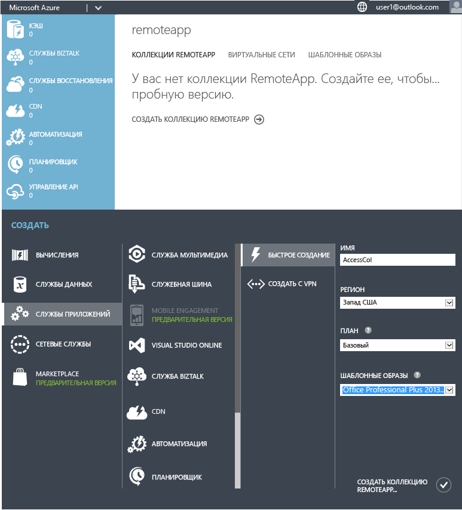

Начнется создание коллекции, которое может занять до часа.

Теперь можно приступать к добавлению пользователей.

## Предоставление пользователям доступа к приложению

После успешного создания коллекции можно опубликовать Access и добавить пользователей, которые должны иметь доступ к нему.

Если вы вышли из узла Azure RemoteApp во время создания коллекции, для начала вернитесь к нему с домашней страницы Azure.

2. Выберите коллекцию, которую вы создали ранее, чтобы открыть дополнительные параметры и настроить ее.
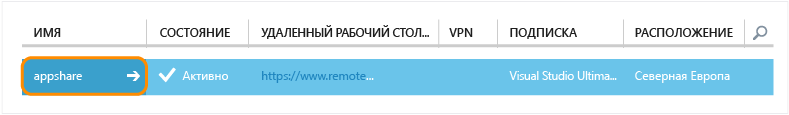
3. На вкладке **Публикация** щелкните **Опубликовать** в нижней части экрана, а затем выберите **Опубликовать программы меню "Пуск"**.
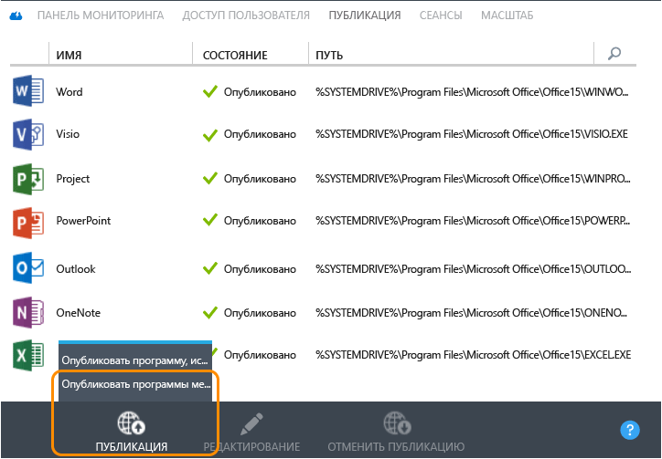
4. Выберите в списке приложения, которые вы хотите опубликовать. В нашем случае нужно выбрать Access. Нажмите **Завершено**. Дождитесь завершения публикации приложений.
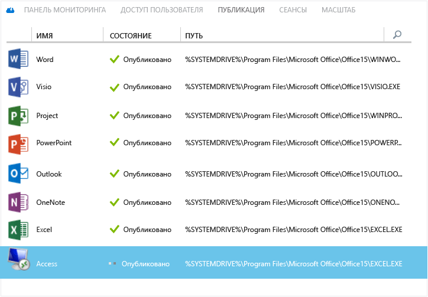

1. После этого откройте вкладку **Доступ пользователя**, чтобы добавить всех пользователей, которым требуется доступ к приложениям. Введите имена (адреса электронной почты) пользователей и нажмите кнопку **Сохранить**.

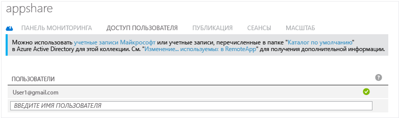

1. Теперь нужно сообщить пользователям о новых приложениях и о том, как получить к ним доступ. Для этого отправьте им по электронной почте сообщение с URL-адресом для скачивания клиента удаленного рабочего стола.
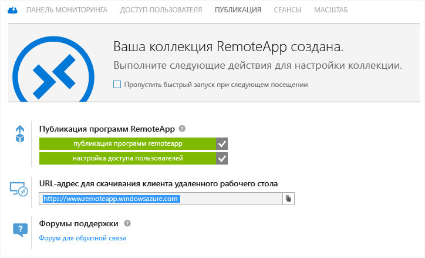

## Настройка доступа к Access

Для некоторых приложений требуется дополнительная настройка после развертывания через RemoteApp. В частности, для Access мы создадим общую папку в Azure, к которой может получить доступ любой пользователь. (Если вы не хотите этого делать, можно создать [гибридную коллекцию](remoteapp-create-hybrid-deployment.md) вместо облачной, чтобы пользователи могли получать доступ к файлам и данным в локальной сети.) Затем необходимо попросить пользователей подключить локальный диск на их компьютерах к файловой системе Azure.

Первую часть потребуется выполнить администратору, то есть вам. Затем существует несколько действий для пользователей.

1. Начните с публикации интерфейса командной строки (cmd.exe). На вкладке **Публикация** выберите **cmd** и щелкните **Опубликовать > Опубликовать программу, используя путь**.
2. Введите имя приложения и путь. Для наших целей мы используем имя "Проводник" и путь "%SYSTEMDRIVE%\windows\explorer.exe".
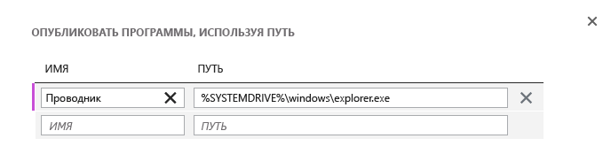
3. Теперь нужно создать [учетную запись хранения](../storage-create-storage-account.md) в Azure. Мы назвали свою учетную запись "accessstorage", поэтому выберите имя, понятное вам (может существовать только одна учетная запись "accessstorage").
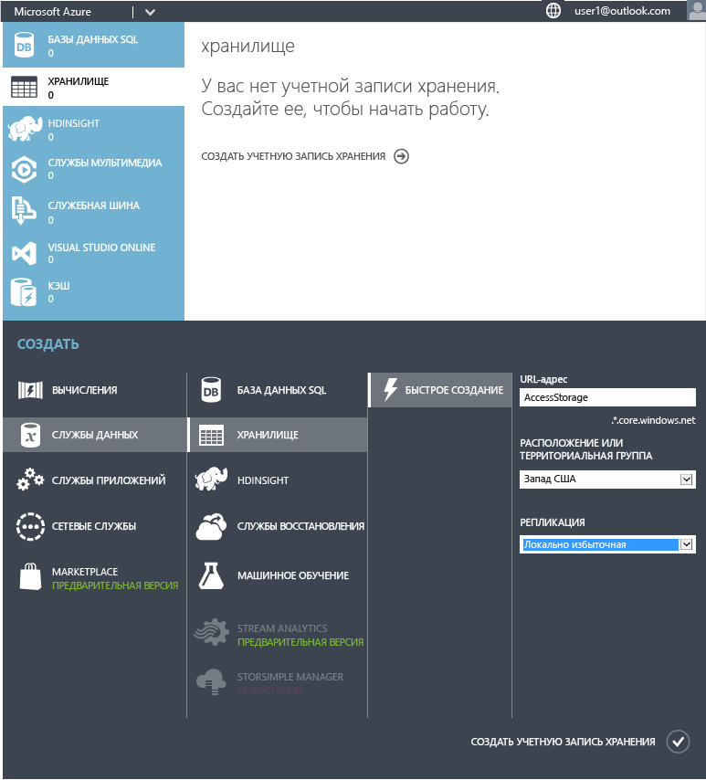
4. Теперь вернитесь на панель мониторинга, чтобы получить путь к хранилищу (расположение конечной точки). Он потребуется через несколько минут, поэтому скопируйте его куда-нибудь.
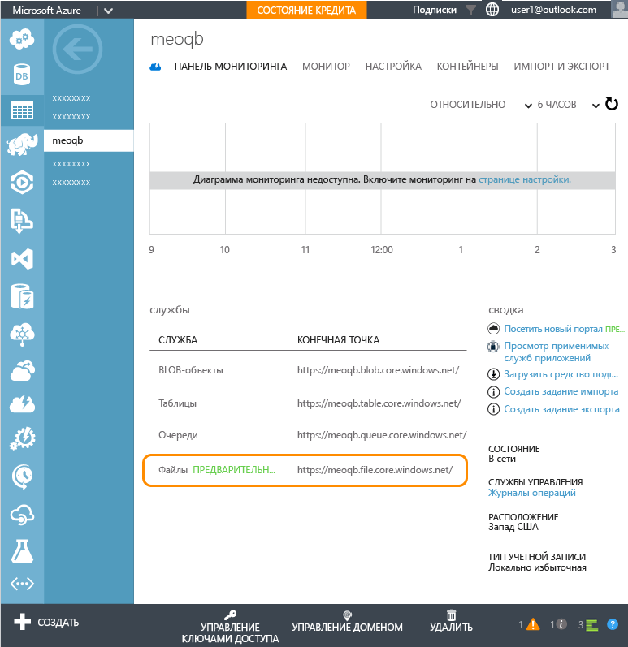
5. После создания учетной записи хранения потребуется первичный ключ доступа. Щелкните **Упр. ключами доступа**, а затем скопируйте первичный ключ доступа.
6. Теперь задайте контекст учетной записи хранения и создайте общую папку для Access. В окне Windows PowerShell с повышенными привилегиями выполните следующие командлеты:

        $ctx=New-AzureStorageContext <account name> <account key>
    	$s = New-AzureStorageShare <share name> -Context $ctx

	Для нашей общей папки нужно выполнить следующие командлеты:

	    $ctx=New-AzureStorageContext accessstorage <key>
    	$s = New-AzureStorageShare <share name> -Context $ctx

Настала очередь пользователей. Во-первых, попросите пользователей установить [клиент RemoteApp](remoteapp-clients.md). Далее им необходимо подключить диск из своей учетной записи к созданной вами общей папке Azure и добавить свои файлы Access. Вот как это сделать:

1. В клиенте RemoteApp получите доступ к опубликованным приложениям. Запустите программу cmd.exe.
2. Выполните следующую команду, чтобы подключить диск на компьютере к общей папке:

		net use z: \<accountname>.file.core.windows.net<share name> /u:<user name> <account key>

	Если установить для параметра **/persistent** значение «Да», подключенный диск будет сохраняться между сеансами.
1. Теперь запустите проводник из RemoteApp. Скопируйте все файлы Access, которые вы хотите использовать в общем приложении, в общую папку.
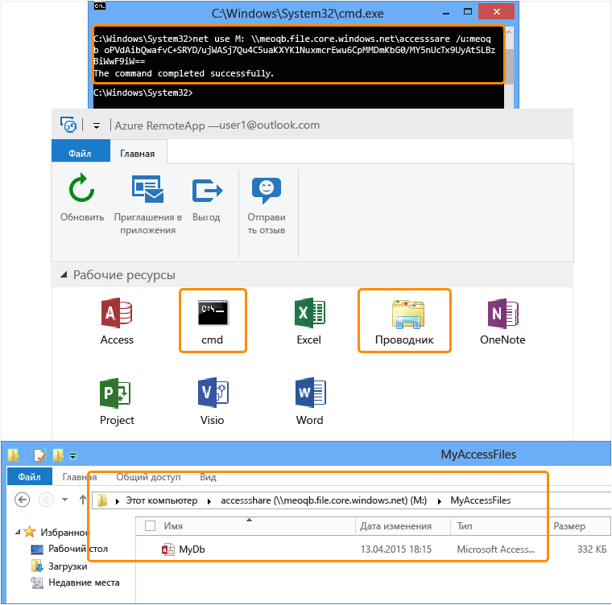
1. После этого откройте Access и базу данных, которой вы только что поделились. Ваши данные в Access будут доступны из облака.
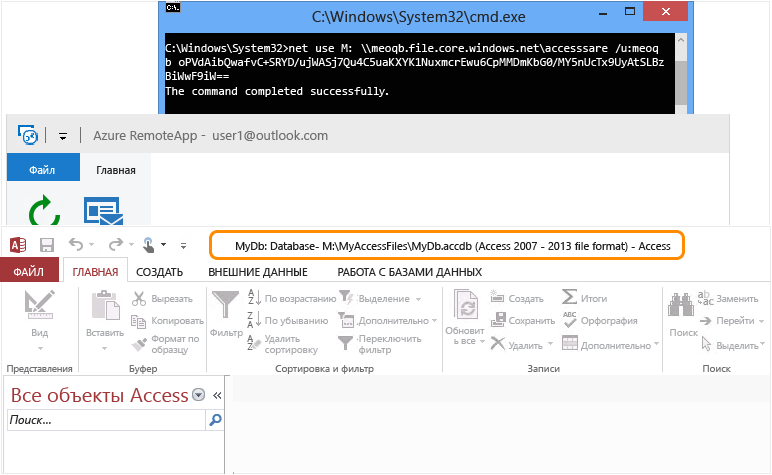

Теперь вы можете использовать Access на любом устройстве — для этого достаточно установить на нем клиент RemoteApp.

<!--Every topic should have next steps and links to the next logical set of content to keep the customer engaged-->
## Дальнейшие действия

Теперь, когда вы научились создавать коллекции, попробуйте создать [коллекцию, которая использует Office 365](remoteapp-tutorial-o365anywhere.md). Вы также можете создать [гибридную коллекцию](remoteapp-create-hybrid-deployment.md), получающую доступ к локальной сети.

<!--Image references-->

<!-----HONumber=Sept15_HO2-->