<properties
   pageTitle="Единый интерфейс Office 365 на всех устройствах c Azure RemoteApp | Microsoft Azure"
   description="Узнайте, как опубликовать приложение Office 365 для своих пользователей с помощью Azure RemoteApp."
   services="remoteapp"
   documentationCenter=""
   authors="guscatalano"
   manager="mbaldwin"
   editor=""/>

<tags
   ms.service="remoteapp"
   ms.devlang="na"
   ms.topic="hero-article"
   ms.tgt_pltfrm="na"
   ms.workload="compute"
   ms.date="06/27/2016"
   ms.author="guscatal;elizapo"/>

# Единый интерфейс Office 365 на всех устройствах c Azure RemoteApp

В этой статье рассматривается развертывание средств Office 365 на устройствах организации. У ваших пользователей будет единый интерфейс и набор функциональных возможностей на устройствах Android, Apple и Windows.

Это достигается с помощью платформы Azure RemoteApp — она позволяет размещать Office 365 на масштабируемых виртуальных машинах Azure, к которым подключаются пользователи. Такой набор виртуальных машин называется «облачной коллекцией».

## Создание облачной коллекции

Создав учетную запись Azure, перейдите в раздел **RemoteApp**, щелкнув ссылку слева. 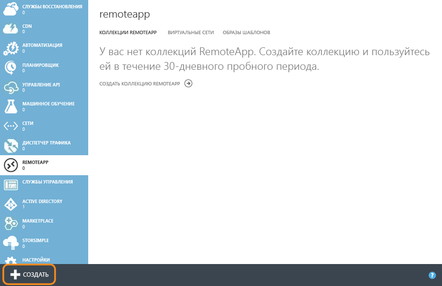

Затем нажмите внизу **Создать** и выберите режим быстрого создания коллекции. Укажите имя, регион, подписку, план и образ «Office профессиональный 2013», который мы вам предлагаем. 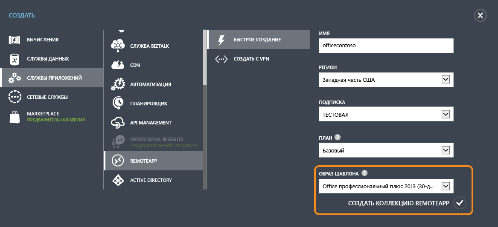

После заполнения формы начнется создание коллекции. Эта процедура может занять около часа.

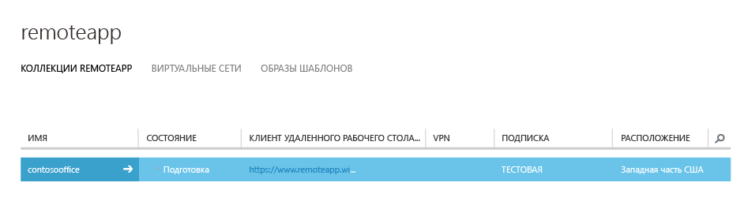

После ее завершения вы увидите примерно следующее: Если щелкнуть **Публикация**, вы увидите, что основная часть приложений Office уже опубликована. 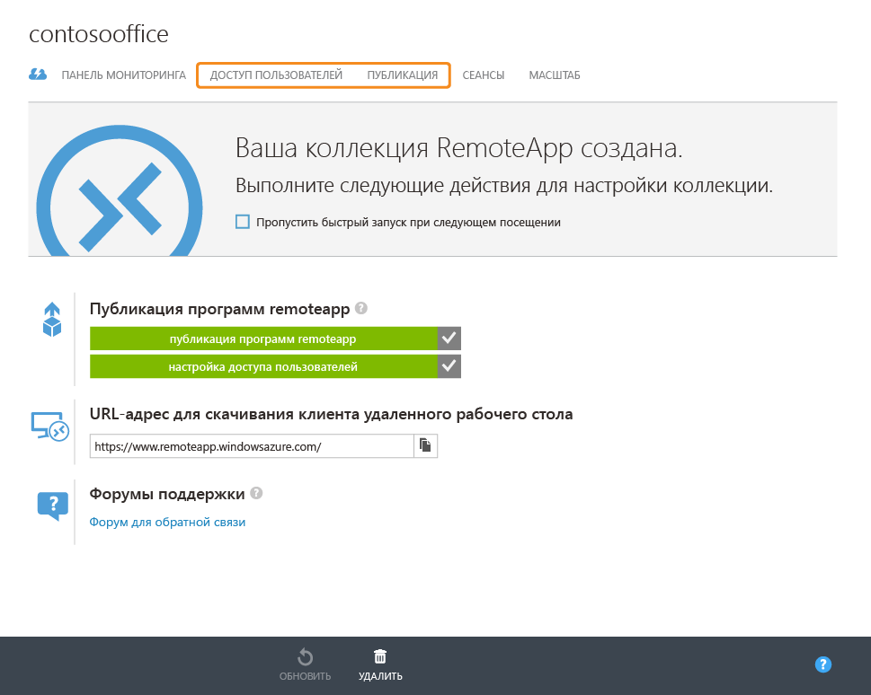

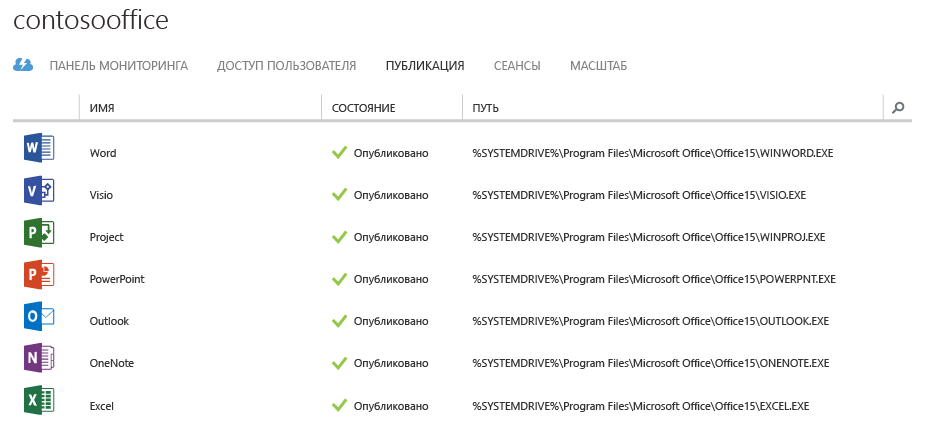

На этом этапе можно добавить пользователей, которым будет доступна эта коллекция. Для этого щелкните **Доступ пользователя**. 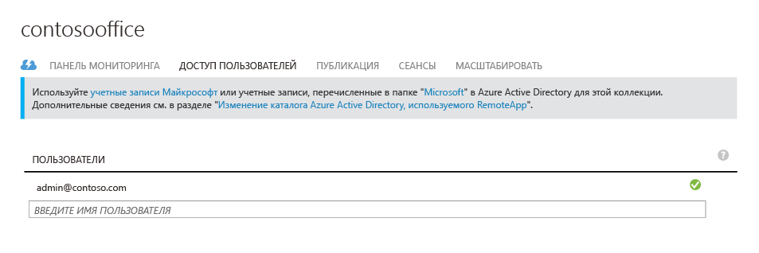

Теперь попытаемся подключиться к Office 365.

## Подключение к Office 365

Откройте страницу [https://www.remoteapp.windowsazure.com/](https://www.remoteapp.windowsazure.com/), прокрутите ее вниз и нажмите кнопку **Загрузить клиент**, чтобы установить клиент Azure RemoteApp на свое устройство. Снимки экрана ниже приведены для системы Windows.

После запуска приложения вам будет предложено выполнить вход по учетной записи Майкрософт (которая раньше называлась идентификатором Live ID). Она совпадает с вашей учетной записью Azure. Выполнив вход, вы увидите уведомление о новых приглашениях, щелкнув которое, вы откроете список представленного ниже вида. Примите приглашение, соответствующее вашему адресу электронной почты владельца учетной записи Azure.

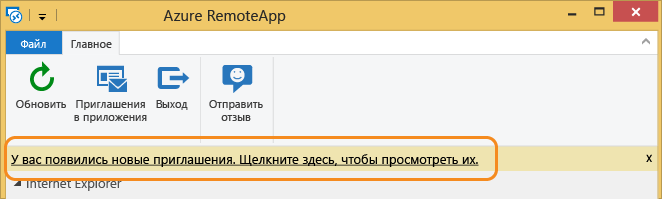

Экран с новыми приглашениями.

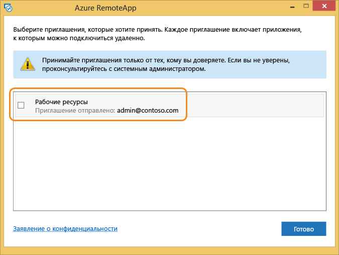

Приняв приглашение, вы увидите все приложения Office в клиенте Azure RemoteApp.

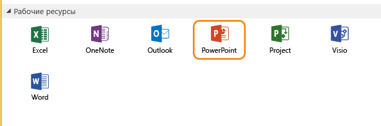

Если щелкнуть любое из них, оно запустится на виртуальной машине Azure, и все будет готово к работе. Вот и все!

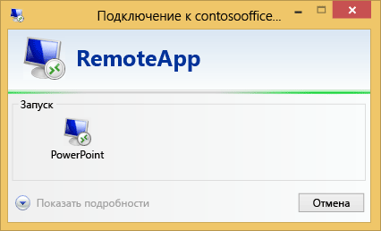

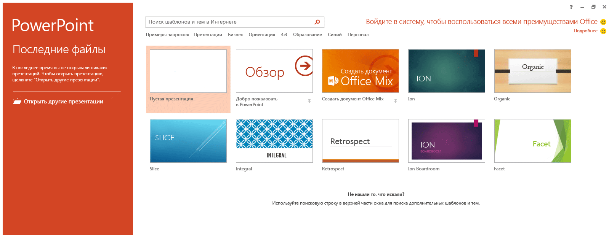

<!---HONumber=AcomDC_0629_2016-->