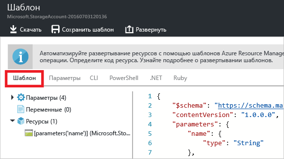

<properties
	pageTitle="Экспорт шаблона Azure Resource Manager | Microsoft Azure"
	description="Используйте Azure Resource Manager для экспорта шаблона из существующей группы ресурсов."
	services="azure-resource-manager"
	documentationCenter=""
	authors="tfitzmac"
	manager="timlt"
	editor="tysonn"/>

<tags
	ms.service="azure-resource-manager"
	ms.workload="multiple"
	ms.tgt_pltfrm="na"
	ms.devlang="na"
	ms.topic="get-started-article"
	ms.date="08/03/2016"
	ms.author="tomfitz"/>

# Экспорт шаблона Azure Resource Manager из существующих ресурсов

Resource Manager позволяет экспортировать шаблон из существующих ресурсов в подписке. Используя созданный шаблон, можно изучить синтаксис шаблонов или при необходимости автоматизировать повторное развертывание решения.

Важно отметить, что экспортировать шаблон можно двумя разными способами.

- Вы можете экспортировать шаблон, который использовался для развертывания. Он содержит все параметры и переменные, указанные в исходном шаблоне. Этот метод удобно использовать при развертывании ресурсов на портале. Теперь нужно узнать, как построить шаблон для создания этих ресурсов.
- Вы можете экспортировать шаблон, который представляет текущее состояние группы ресурсов. Он не основан на каком-либо шаблоне, который использовался для развертывания. Напротив, создается шаблон, который является моментальным снимком группы ресурсов. Экспортированный шаблон содержит много жестко заданных значений и, скорее всего, меньше параметров, чем вы обычно определяете. Этот метод подходит, если вы изменили группу ресурсов с помощью портала или скриптов и теперь на ее основе необходимо создать шаблон.

В этой статье показаны оба способа. В статье [Настройка экспортированного шаблона Azure Resource Manager](resource-manager-customize-template.md) содержатся сведения о том, как сделать шаблон, созданный на основе текущего состояния группы ресурсов, более пригодным для повторного развертывания решения.

При работе с этим руководством вы войдете на портал Azure, создадите учетную запись хранения, а затем экспортируете для нее шаблон. Вы также добавите виртуальную сеть, чтобы изменить группу ресурсов. Наконец, вы экспортируете новый шаблон, который представляет текущее состояние группы. Хотя в этой статье рассматривается упрощенная инфраструктура, с помощью описанных действий можно экспортировать шаблоны и для более сложных решений.

## Создайте учетную запись хранения.

1. На [портале Azure](https://portal.azure.com) последовательно выберите **Создать**, **Данные+хранилище** и **Учетная запись хранения**.

      

2. Создайте учетную запись хранения с именем **storage**, добавив свои инициалы и дату. Имя учетной записи хранения должно быть уникальным в среде Azure. Если указанное имя уже используется, введите другое. В качестве группы ресурсов используйте **ExportGroup**. Для других свойств можно использовать значения по умолчанию. Нажмите кнопку **Создать**.

      

После завершения развертывания в подписке появится учетная запись хранения.

## Экспорт шаблона из журнала развертываний

1. Перейдите в колонку новой группы ресурсов. Обратите внимание, что в этой колонке показан результат последнего развертывания. Щелкните эту ссылку.

      

2. Отобразится журнал развертываний для группы. В вашем случае в колонке, скорее всего, будет отображаться только одно развертывание. Выберите его.

     

3. В колонке отобразится сводка по развертыванию. В сводке содержатся сведения о состоянии развертывания и операциях, а также значения, указанные для параметров. Чтобы увидеть шаблон, который использовался для развертывания, щелкните **Просмотреть шаблон**.

     

4. Resource Manager извлекает следующие шесть файлов:

   1. **Шаблон**. Шаблон, определяющий инфраструктуру решения. При создании учетной записи хранения на портале Resource Manager использовал шаблон, чтобы развернуть ее, и сохранил его для дальнейшего использования.
   2. **Параметры**. Файл параметров, который можно использовать для передачи значений во время развертывания. Он содержит значения, указанные при первом развертывании. Но любое из них можно изменить при повторном развертывании шаблона.
   3. **Интерфейс командной строки**. Файл скрипта интерфейса командной строки Azure, который можно использовать для развертывания шаблона.
   4. **PowerShell**. Файл скрипта Azure PowerShell, который можно использовать для развертывания шаблона.
   5. **.NET**. Класс .NET, который можно использовать для развертывания шаблона.
   6. **Ruby**. Класс Ruby, который можно использовать для развертывания шаблона.

     К файлам можно получить доступ, используя ссылки в колонке. По умолчанию шаблон отображается в колонке.

       

     Обратим на него особое внимание. Шаблон должен иметь примерно такой вид:

        {
          "$schema": "https://schema.management.azure.com/schemas/2015-01-01/deploymentTemplate.json#",
          "contentVersion": "1.0.0.0",
          "parameters": {
            "name": {
              "type": "String"
            },
            "accountType": {
              "type": "String"
            },
            "location": {
              "type": "String"
            },
            "encryptionEnabled": {
              "defaultValue": false,
              "type": "Bool"
            }
          },
          "resources": [
            {
              "type": "Microsoft.Storage/storageAccounts",
              "sku": {
                "name": "[parameters('accountType')]"
              },
              "kind": "Storage",
              "name": "[parameters('name')]",
              "apiVersion": "2016-01-01",
              "location": "[parameters('location')]",
              "properties": {
                "encryption": {
                  "services": {
                    "blob": {
                      "enabled": "[parameters('encryptionEnabled')]"
                    }
                  },
                  "keySource": "Microsoft.Storage"
                }
              }
            }
          ]
        }
 
Это фактический шаблон, который используется для создания учетной записи хранения. Обратите внимание, что он содержит параметры, которые позволяют развертывать учетные записи хранения разных типов. Дополнительные сведения о структуре шаблона см. в статье [Создание шаблонов диспетчера ресурсов Azure](resource-group-authoring-templates.md). Полный список функций, которые можно использовать в шаблоне, см. в статье [Функции шаблонов диспетчера ресурсов Azure](resource-group-template-functions.md).


## Добавление виртуальной сети

Шаблон, скачанный в предыдущем разделе, представляет инфраструктуру для исходного развертывания. Но он не отражает изменения, внесенные после развертывания. Чтобы продемонстрировать это, давайте изменим группу ресурсов, добавив виртуальную сеть на портале.

1. В колонке группы ресурсов щелкните **Добавить**.

      

2. Выберите **Виртуальная сеть** в списке доступных ресурсов.

      

2. Присвойте виртуальной сети имя **VNET** и используйте значения по умолчанию для остальных свойств. Нажмите кнопку **Создать**.

      

3. После успешного развертывания виртуальной сети в группе ресурсов проверьте журнал развертывания еще раз. Теперь там два развертывания. Если второе развертывание не отображается, закройте колонку группы ресурсов и откройте ее снова. Выберите последнее развертывание.

      

4. Просмотрите шаблон для него. Обратите внимание, что он определяет только изменения, внесенные при добавлении виртуальной сети.

Обычно рекомендуется использовать шаблон, который развертывает всю инфраструктуру для решения в рамках одной операции. Этот надежнее, чем запоминать разные шаблоны для развертывания.


## Экспорт шаблона из группы ресурсов

Хотя в каждом развертывании отображаются только изменения, внесенные в группу ресурсов, вы можете в любой момент экспортировать шаблон для отображения атрибутов всей группы ресурсов.

> [AZURE.NOTE] Нельзя экспортировать шаблон для группы ресурсов, которая содержит более 200 ресурсов.

1. Чтобы просмотреть шаблон для группы ресурсов, щелкните **Сценарий автоматизации**.

      

     Функция экспорта шаблона поддерживается не для всех типов ресурсов. Если ваша группа ресурсов содержит только учетную запись хранения и виртуальную сеть, как описано в этой статье, при экспорте не возникнут проблемы. Однако если вы создали другие типы ресурсов, может отобразиться сообщение о том, что при экспорте произошла ошибка. Дополнительные сведения об устранении таких ошибок см. в разделе [Устранение проблем при экспорте](#устранение-проблем-при-экспорте).

      

2. Снова появятся шесть файлов, которые можно использовать для повторного развертывания решения. Но в этот раз шаблон выглядит немного иначе. Этот шаблон содержит только два параметра: по одному для имени учетной записи хранения и имени виртуальной сети.

        "parameters": {
          "virtualNetworks_VNET_name": {
            "defaultValue": "VNET",
            "type": "String"
          },
          "storageAccounts_storagetf05092016_name": {
            "defaultValue": "storagetf05092016",
            "type": "String"
          }
        },

     Использованные при развертывании шаблоны не извлекались с помощью Resource Manager. Вместо этого был создан новый шаблон на основе текущей конфигурации ресурсов. Например, шаблон задает для расположения и репликации учетной записи хранения следующие значения:

        "location": "northeurope",
        "tags": {},
        "properties": {
            "accountType": "Standard_RAGRS"
        },

3. Скачайте шаблон, чтобы с ним можно было работать локально.

      

4. Найдите загруженный ZIP-файл и извлеките его содержимое. Этот скачанный шаблон можно использовать для повторного развертывания инфраструктуры.

## Устранение проблем при экспорте

Функция экспорта шаблона поддерживается не для всех типов ресурсов. Resource Manager специально не экспортирует некоторые ресурсы, чтобы предотвратить доступ к конфиденциальным данным. Например, если в конфигурации сайта используется строка подключения, вы, вероятно, не захотите, чтобы она отображалась в экспортированном шаблоне. Эту проблему можно решить, добавив недостающие ресурсы в шаблон вручную.

> [AZURE.NOTE] Проблемы при экспорте могут возникать, только если шаблон экспортируется из группы ресурсов, а не из журнала развертываний. Если последнее развертывание представляет точное состояние группы ресурсов, шаблон необходимо экспортировать из журнала развертываний, а не из группы ресурсов. Шаблон следует экспортировать из группы ресурсов, если вы внесли в группу ресурсов изменения, которые не определены в одном шаблоне.

Например, если вы экспортируете шаблон для группы ресурсов, содержащий веб-приложение, базу данных SQL и строку подключения в конфигурации сайта, отобразится следующее сообщение:


Если выбрать это сообщение, вы увидите список типов ресурсов, которые не были экспортированы.
     


В этой статье показаны распространенные способы исправления ошибок. Чтобы реализовать их, необходимо добавить параметры в шаблон. Дополнительные сведения см. в статье [Настройка экспортированного шаблона Azure Resource Manager](resource-manager-customize-template.md).

### Строка подключения

В ресурсе веб-сайтов добавьте определение строки подключения к базе данных.

```
{
  "type": "Microsoft.Web/sites",
  ...
  "resources": [
    {
      "apiVersion": "2015-08-01",
      "type": "config",
      "name": "connectionstrings",
      "dependsOn": [
          "[concat('Microsoft.Web/Sites/', parameters('<site-name>'))]"
      ],
      "properties": {
          "DefaultConnection": {
            "value": "[concat('Data Source=tcp:', reference(concat('Microsoft.Sql/servers/', parameters('<database-server-name>'))).fullyQualifiedDomainName, ',1433;Initial Catalog=', parameters('<database-name>'), ';User Id=', parameters('<admin-login>'), '@', parameters('<database-server-name>'), ';Password=', parameters('<admin-password>'), ';')]",
              "type": "SQLServer"
          }
      }
    }
  ]
}
```    

### Расширение веб-сайта

В ресурсе веб-сайта добавьте определение кода для установки.

```
{
  "type": "Microsoft.Web/sites",
  ...
  "resources": [
    {
      "name": "MSDeploy",
      "type": "extensions",
      "location": "[resourceGroup().location]",
      "apiVersion": "2015-08-01",
      "dependsOn": [
        "[concat('Microsoft.Web/sites/', parameters('<site-name>'))]"
      ],
      "properties": {
        "packageUri": "[concat(parameters('<artifacts-location>'), '/', parameters('<package-folder>'), '/', parameters('<package-file-name>'), parameters('<sas-token>'))]",
        "dbType": "None",
        "connectionString": "",
        "setParameters": {
          "IIS Web Application Name": "[parameters('<site-name>')]"
        }
      }
    }
  ]
}
```

### Расширение виртуальной машины

Примеры расширений виртуальных машин см. в статье [Примеры конфигурации расширения виртуальной машины Microsoft Azure](./virtual-machines/virtual-machines-windows-extensions-configuration-samples.md).

### Шлюз виртуальной сети

Добавьте тип ресурса шлюза виртуальной сети.

```
{
  "type": "Microsoft.Network/virtualNetworkGateways",
  "name": "[parameters('<gateway-name>')]",
  "apiVersion": "2015-06-15",
  "location": "[resourceGroup().location]",
  "properties": {
    "gatewayType": "[parameters('<gateway-type>')]",
    "ipConfigurations": [
      {
        "name": "default",
        "properties": {
          "privateIPAllocationMethod": "Dynamic",
          "subnet": {
            "id": "[resourceId('Microsoft.Network/virtualNetworks/subnets', parameters('<vnet-name>'), parameters('<new-subnet-name>'))]"
          },
          "publicIpAddress": {
            "id": "[resourceId('Microsoft.Network/publicIPAddresses', parameters('<new-public-ip-address-Name>'))]"
          }
        }
      }
    ],
    "enableBgp": false,
    "vpnType": "[parameters('<vpn-type>')]"
  },
  "dependsOn": [
    "Microsoft.Network/virtualNetworks/codegroup4/subnets/GatewaySubnet",
    "[concat('Microsoft.Network/publicIPAddresses/', parameters('<new-public-ip-address-Name>'))]"
  ]
},
```

### Шлюз локальной сети

Добавьте тип ресурса шлюза локальной сети.

```
{
    "type": "Microsoft.Network/localNetworkGateways",
    "name": "[parameters('<local-network-gateway-name>')]",
    "apiVersion": "2015-06-15",
    "location": "[resourceGroup().location]",
    "properties": {
      "localNetworkAddressSpace": {
        "addressPrefixes": "[parameters('<address-prefixes>')]"
      }
    }
}
```

### Подключение

Добавьте тип ресурса подключения.

```
{
    "apiVersion": "2015-06-15",
    "name": "[parameters('<connection-name>')]",
    "type": "Microsoft.Network/connections",
    "location": "[resourceGroup().location]",
    "properties": {
        "virtualNetworkGateway1": {
        "id": "[resourceId('Microsoft.Network/virtualNetworkGateways', parameters('<gateway-name>'))]"
      },
      "localNetworkGateway2": {
        "id": "[resourceId('Microsoft.Network/localNetworkGateways', parameters('<local-gateway-name>'))]"
      },
      "connectionType": "IPsec",
      "routingWeight": 10,
      "sharedKey": "[parameters('<shared-key>')]"
    }
},
```


## Дальнейшие действия

Поздравляем! Вы узнали, как экспортировать шаблон из ресурсов, созданных на портале.

- Во второй части этого руководства вы настроите скачанный шаблон, добавив дополнительные параметры, и повторно развернете его с помощью скрипта. См. статью [Настройка экспортированного шаблона Azure Resource Manager](resource-manager-customize-template.md).
- Чтобы узнать, как экспортировать шаблон с помощью PowerShell, см. статью [Использование Azure PowerShell с диспетчером ресурсов Azure](powershell-azure-resource-manager.md).
- Чтобы узнать, как экспортировать шаблон с помощью интерфейса командной строки Azure, см. статью [Использование Azure CLI для Mac, Linux и Windows с диспетчером ресурсов Azure](xplat-cli-azure-resource-manager.md).

<!---HONumber=AcomDC_0928_2016-->