# Типы оповещений системы безопасности в центре безопасности Azure
В этом документе содержатся сведения о различных типах оповещений системы безопасности в центре безопасности Azure. Дополнительные сведения об управлении этими оповещениями см. в статье [Управление оповещениями безопасности в центре безопасности Azure и реагирование на них](security-center-managing-and-responding-alerts.md).

> [!NOTE]
> Чтобы включить расширенное обнаружение, выполните обновление до стандартного центра безопасности Azure. Бесплатный пробный период составляет 90 дней. Чтобы выполнить обновление, выберите ценовую категорию в [политике безопасности](security-center-policies.md). Дополнительные сведения см. на [странице с ценами](https://azure.microsoft.com/pricing/details/security-center/).
>
>

## Какие типы оповещений доступны?
В центре безопасности Azure предоставлено множество оповещений, соответствующих этапам нарушения безопасности путем кибератаки. На рисунке ниже приведены несколько примеров различных оповещений и их связь с некоторыми этапами.

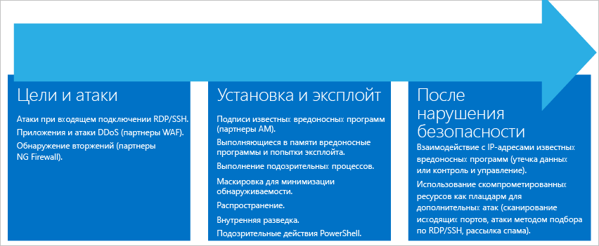

**Определение цели и атака**

* Входящие атаки с использованием RDP или SSH
* Атаки DDoS и атаки на приложения (партнеры WAF)
* Обнаружение вторжений (партнеры NG Firewall)

**Установка и эксплойт**

* Сигнатуры известных вредоносных программ (партнеры AM)
* Попытки внедрения вредоносных программ в память и попытки эксплойта
* Выполнение подозрительных процессов
* Уклонение во избежание обнаружения
* Путешествие по компьютерам
* Внутренняя разведка
* Подозрительные действия в PowerShell

**Действия после нарушения**  

* Обмен данными с использованием известного вредоносного IP-адреса (эксфильтрация данных или командование и управление)
* Использование скомпрометированных ресурсов для осуществления дополнительных атак (атака методом подбора со сканированием исходящих портов и использованием RDP или SSH, а также отправка нежелательной почты)

С каждым этапом связаны различные типы атак, направленные на разные подсистемы. Для устранения риска атак на этих этапах в центре безопасности предусмотрены три категории оповещений:

* анализ поведения виртуальных машин;
* анализ сети;
* анализ ресурсов.

## Анализ поведения виртуальных машин
Поведенческая аналитика позволяет центру безопасности Azure выявлять скомпрометированные ресурсы. Для этого центр безопасности анализирует журналы событий виртуальных машин, например события создания процессов, события входа и т. д. Кроме того, получаемые данные сверяются с другими сигналами. Это дает возможность получить подтверждающие доказательства масштабной кампании.

> [!NOTE]
> Дополнительные сведения о способах обнаружения угроз в центре безопасности см. в статье [Возможности обнаружения центра безопасности Azure](security-center-detection-capabilities.md).
>
>

### Анализ сбоев
Анализ памяти аварийного дампа — это метод определения сложных вредоносных программ, способных обойти традиционные решения по обеспечению безопасности. Различные виды вредоносных программ пытаются уменьшить вероятность обнаружения с помощью антивирусных программ. Для этого они никогда не осуществляют запись на диск или шифруют программные компоненты, записанные на диск. Поэтому вредоносные программы трудно обнаружить, применяя традиционные методы. Тем не менее такую программу можно обнаружить при помощи анализа памяти, так как она не может не оставлять следов своего воздействия в памяти.

Когда программа дает сбой, аварийный дамп записывает часть памяти в момент сбоя. Вредоносная программа, общее пользование или проблемы системы могут вызвать сбой. Анализируя память в аварийном дампе, центр безопасности может выявить методы, с помощью которых злоумышленник эксплуатирует уязвимости ПО, получает доступ к конфиденциальным данным и тайно пользуется скомпрометированным компьютером. При этом производительность узлов почти не страдает, так как анализ выполняется на сервере центра безопасности.

Следующие поля являются стандартными для оповещений анализа аварийных дампов:

* Dumpfile (файл дампа) — имя файла аварийного дампа.
* Processname (имя процесса) — имя процесса, аварийно завершившего работу.
* Processversion (версия процесса) — версия процесса, аварийно завершившего работу.

### Обнаружение кода оболочки
Код оболочки — это атакующий код, который выполняется, когда вредоносная программа воспользовалась уязвимостью программного обеспечения. Такое оповещение означает, что анализ с помощью аварийного дампа обнаружил исполняемый код, поведение которого типично для атакующих кодов вредоносных программ. Хотя невредоносная программа тоже может так себя вести, такое поведение нетипично для обычного программного обеспечения.

Это оповещение содержит дополнительное поле:

* Address (адрес) — расположение кода оболочки в памяти.

Ниже приведен пример такого оповещения.

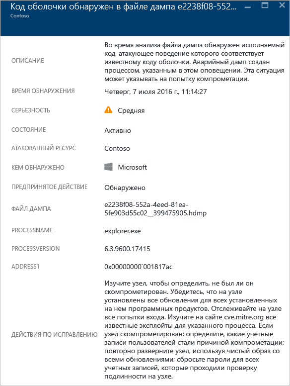

### Обнаружение перехватов модулей
Windows использует библиотеки динамической компоновки (DLL) для предоставления программному обеспечению разрешения использовать стандартные функции системы Windows. Перехват DLL происходит, когда вредоносная программа изменяет порядок загрузки библиотек DLL, чтобы загрузить вредоносный атакующий код в память, где может выполняться произвольный код. Такое оповещение означает, что анализ с помощью аварийного дампа обнаружил, что два модуля с похожими именами загружаются из двух разных расположений. При этом один модуль хранится в стандартном расположении двоичных файлов системы Windows.

Разработчики подлинного программного обеспечения иногда изменяют порядок загрузки библиотек DLL без злого умысла, например для инструментирования, расширения возможностей операционной системы или приложений Windows. Чтобы отличить вредоносные изменения от потенциально неопасных изменений в порядке загрузки библиотек DLL, центр безопасности Azure проверяет, соответствуют ли загруженные модули подозрительному профилю. В оповещении результат такой проверки отображается в поле Signature (подпись), а также отражается в уровне серьезности, описании оповещения и шагах по исправлению. Анализ хранящейся на диске копии перехватывающего модуля (например, проверка цифровой подписи файлов или проверка на наличие вирусов) даст больше информации, которая поможет определить истинный характер перехватывающего модуля.

Кроме стандартных полей, описанных в разделе "Обнаружение кода оболочки", это оповещение содержит следующие поля:

* Signature (подпись) — указывает, соответствует ли перехватывающий модуль профилю подозрительного поведения.
* Hijackedmodule (перехваченный модуль) — имя перехваченного модуля системы Windows.
* Hijackedmodulepath (путь к перехваченному модулю) — путь к перехваченному модулю системы Windows.
* Hijackingmodulepath (путь к перехватывающему модулю) — путь к перехватывающему модулю.

Ниже приведен пример такого оповещения.

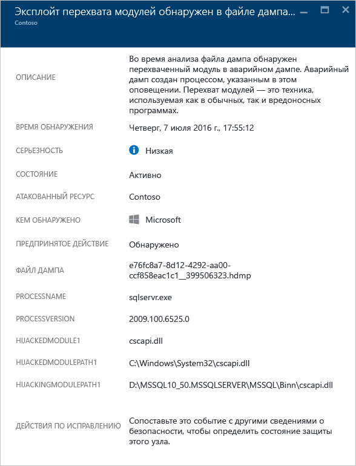

### Обнаружение маскирующихся модулей Windows
Вредоносные программы могут использовать стандартные имена двоичных файлов системы Windows (например, SVCHOST.EXE) или модули (например, NTDLL.DLLL), чтобы "смешаться в толпе" файлов и скрыть природу вредоносных программ от системных администраторов. Такое оповещение означает, что анализ с помощью аварийного дампа обнаружил, что файл дампа содержит модули, которые используют имена модулей системы Windows, но не отвечают другим критериям, характерным для модулей Windows. Анализ хранящейся на диске копии маскирующего модуля даст больше информации, которая поможет помочь определить истинный характер модуля. Анализ может состоять из таких этапов:

* Убедитесь, что рассматриваемый файл поставляется как часть пакета подлинного программного обеспечения.
* Проверьте цифровую подпись файла.
* Проверьте файл на наличие вирусов.

Кроме стандартных полей, описанных в разделе "Обнаружение кода оболочки", это оповещение содержит дополнительные поля.

* Details (подробные сведения) — указывает, допустимы ли метаданные модуля и был ли модуль загружен из системного расположения.
* Name (имя) — имя маскирующегося модуля Windows.
* Path (путь) — путь маскирующегося модуля Windows.

Оповещение также содержит некоторые поля из заголовка модуля PE, например Checksum (контрольная сумма) и Timestamp (метка времени). Эти поля отображаются, только если они присутствуют в модуле. Дополнительную информацию об этих полях см. в [спецификациях Microsoft PE и COFF](https://msdn.microsoft.com/windows/hardware/gg463119.aspx).

Ниже приведен пример такого оповещения.

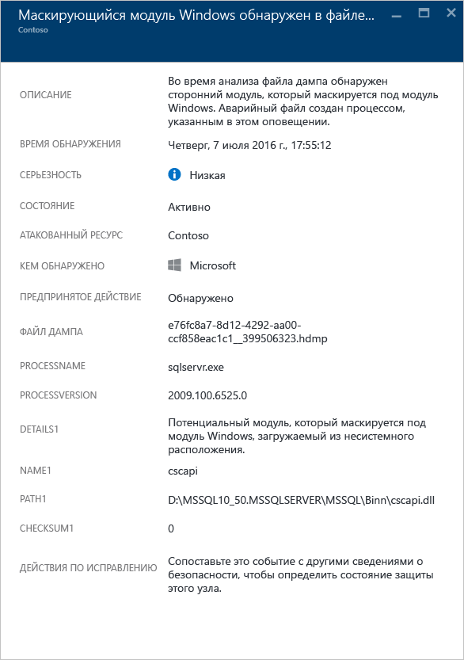

### Обнаружение измененных системных двоичных файлов
Вредоносные программы могут изменять основные системные двоичные файлы, чтобы получить скрытый доступ к данным или тайно храниться в поврежденной системе. Такое оповещение означает, что анализ с помощью аварийного дампа обнаружил, что базовые двоичные файлы ОС Windows изменены в памяти или на диске.
Разработчики подлинного программного обеспечения иногда изменяют системные модули в памяти без злого умысла, например для перенаправления или обеспечения совместимости приложений. Чтобы отличить вредоносные модули от потенциально неопасных, центр безопасности Azure проверяет, соответствуют ли измененные модули подозрительному профилю. Результат этой проверки отражается в уровне серьезности, описании оповещения и шагах по исправлению.

Кроме стандартных полей, описанных в разделе "Обнаружение кода оболочки", это оповещение содержит дополнительные поля.

* Modulename (имя модуля) — имя измененного системного двоичного файла.
* Moduleversion (версия модуля) — версия измененного системного двоичного файла.

Ниже приведен пример такого оповещения.

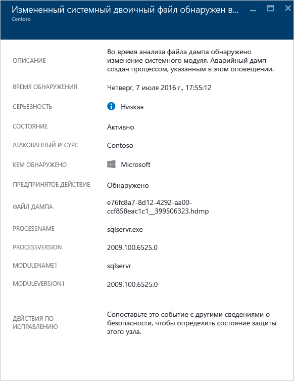

### Выполнение подозрительных процессов
Центр безопасности определяет выполнение подозрительных процессов на целевой виртуальной машине и активирует оповещение. В процессе обнаружения поиск ведется не по конкретному имени, а по его параметру. Поэтому даже если злоумышленник переименует исполняемый файл, центр безопасности по-прежнему сможет обнаружить его.

Ниже приведен пример такого оповещения.

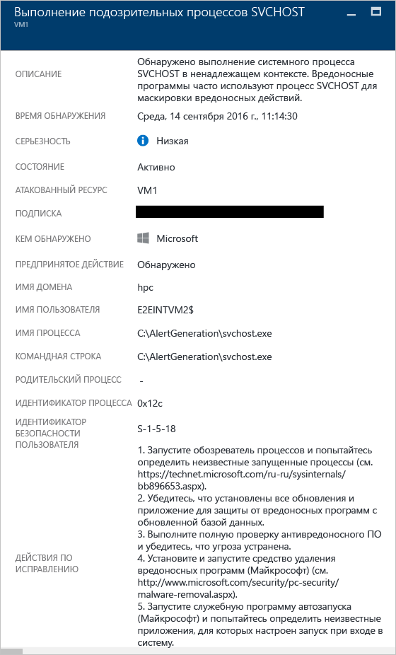

### Запрос к нескольким учетным записям домена
Центр безопасности может обнаружить несколько попыток запроса учетных записей домена. Обычно злоумышленники осуществляют такие попытки при разведке сети. Злоумышленники могут использовать этот метод для запроса домена, чтобы определить пользователей, учетные записи администраторов домена, компьютеры, выполняющие роль контроллеров домена, а также возможные доверительные отношения домена с другими доменами.

Ниже приведен пример такого оповещения.

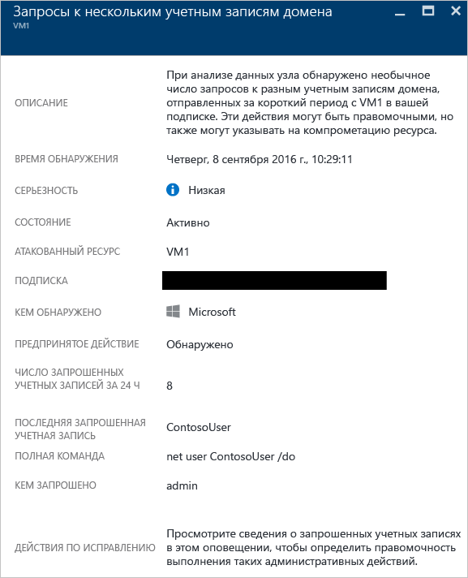

## анализ сети;
Функция обнаружения угроз сети в центре безопасности автоматически собирает информацию о безопасности из трафика IPFIX Azure. Она анализирует эту информацию, часто сравнивая сведения из разных источников и определяя угрозы.

### Обнаружение подозрительного исходящего трафика
Сетевые устройства можно обнаружить и профилировать так же, как и другие системы. Злоумышленники обычно начинают со сканирования или очистки портов. В следующем примере есть подозрительный трафик SSH с виртуальной машины, который может являться атакой методом подбора или очистки портов по протоколу SSH, направленной на внешний ресурс.

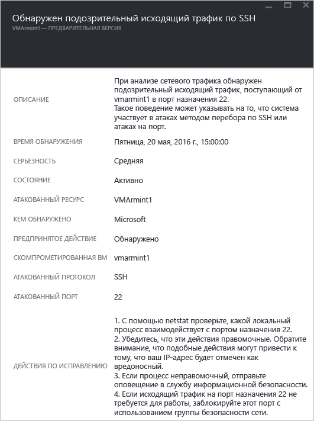

Это оповещение содержит информацию, которая позволяет определить ресурс, использованный для инициирования атаки, скомпрометированный компьютер, время обнаружения, а также использованные протокол и порт. Эта колонка также содержит список действий, которые помогут устранить проблему.

### Сетевое взаимодействие с вредоносным компьютером
Используя каналы Майкрософт для аналитики угроз, центр безопасности Azure может обнаружить скомпрометированные машины, которые взаимодействуют с вредоносными IP-адресами. В большинстве случаев этот компьютер является центром управления, отправляющим команды. В нашем примере центр безопасности Azure обнаружил, что обмен данными выполнялся с помощью вредоносной программы Pony Loader (также известной как [Fareit](https://www.microsoft.com/security/portal/threat/encyclopedia/entry.aspx?Name=PWS:Win32/Fareit.AF)).

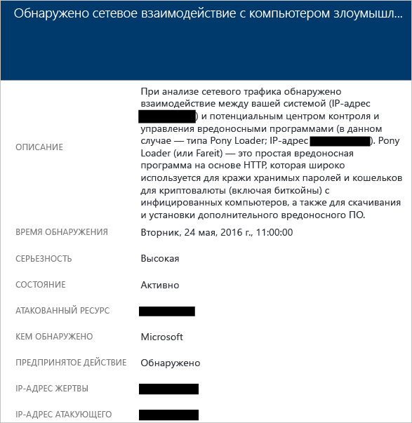

Это оповещение содержит информацию, которая позволяет определить ресурс, использованный для инициирования атаки, атакованный ресурс, атакованный IP-адрес, атакующий IP-адрес и время обнаружения.

> [!NOTE]
> Настоящие IP-адреса удалены с этого снимка экрана в целях конфиденциальности.
>
>

### Обнаружение возможной исходящей атаки типа "отказ в обслуживании"
Обнаружив аномальный сетевой трафик, исходящий из одной виртуальной машины, центр безопасности может активировать оповещение о возможной атаке типа "отказ в обслуживании".

Ниже приведен пример такого оповещения.

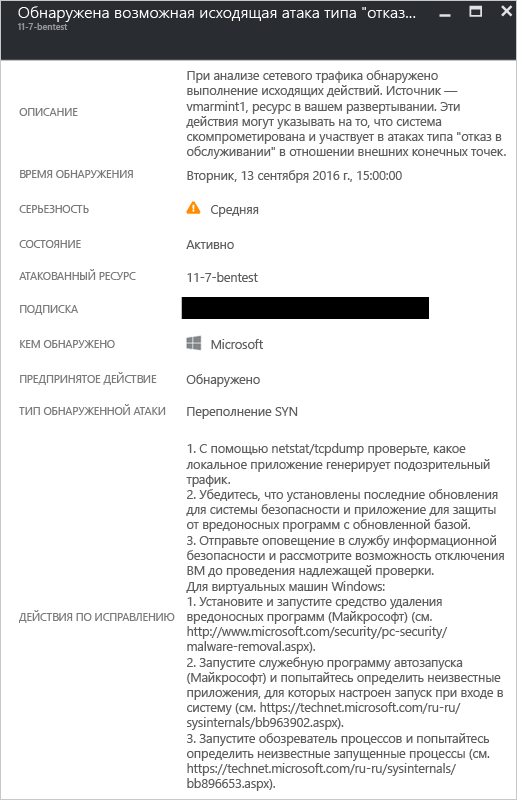

## анализ ресурсов.
При анализе ресурсов в центре безопасности основное внимание уделяется службам PaaS, например службам, интегрированным с [системой обнаружения угроз базы данных SQL Azure](../sql-database/sql-database-threat-detection-get-started.md) . На основе анализа результатов в этих областях центр безопасности выдает оповещение о ресурсах.

### Потенциальная атака путем внедрения кода SQL
Внедрение кода SQL — это атака, во время которой вредоносный код вставляется в строки, которые позже будут переданы на экземпляр SQL Server для анализа и выполнения. Все процедуры, создающие инструкции SQL, необходимо проверять на предмет уязвимости к внедрению, так как SQL Server выполняет все полученные запросы, являющиеся синтаксически правильными. Для определения подозрительных событий, которые могут происходить в базах данных SQL Azure, система обнаружения угроз SQL использует машинное обучение, анализ поведения и обнаружение аномалий. Например:

* попытка бывшего сотрудника получить доступ к базе данных;
* атака путем внедрения кода SQL;
* необычная попытка пользователя получить доступ к рабочей базе данных из домашней системы.

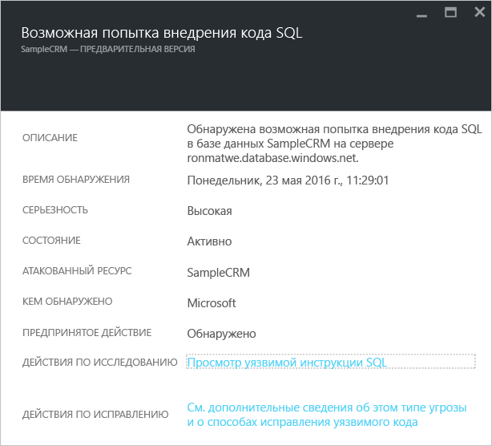

Это предупреждение содержит сведения, позволяющие идентифицировать атакуемый ресурс, время обнаружения и состояние атаки, а также ссылку на последующие этапы анализа инцидента.

### Уязвимость к атакам путем внедрения кода SQL
Это оповещение активируется при обнаружении ошибки приложения в базе данных, что может свидетельствовать о возможной уязвимости к атакам путем внедрения кода SQL.

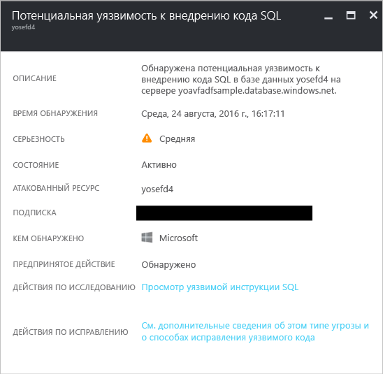

### Обычный вход из неизвестного расположения
Это оповещение активируется, когда на сервере обнаружена попытка доступа с помощью незнакомого IP-адреса, который не использовался за последний период.

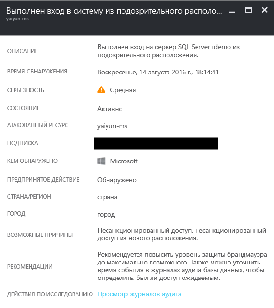

## Дополнительные материалы
В этом документе вы узнали о различных типах оповещений системы безопасности в центре безопасности. Дополнительные сведения о Центре безопасности см. в следующих статьях:

* [Обработка инцидентов в центре безопасности Azure](security-center-incident.md)
* [Возможности обнаружения центра безопасности Azure](security-center-detection-capabilities.md)
* [Руководство по планированию использования центра безопасности Azure и работе в нем](security-center-planning-and-operations-guide.md)
* [Центр безопасности Azure: часто задаваемые вопросы](security-center-faq.md) — часто задаваемые вопросы об использовании этой службы.
* [Блог по безопасности Azure](http://blogs.msdn.com/b/azuresecurity/) — публикации блога, посвященные безопасности и соответствию требованиям в Azure.

<!--HONumber=Dec16_HO2-->

