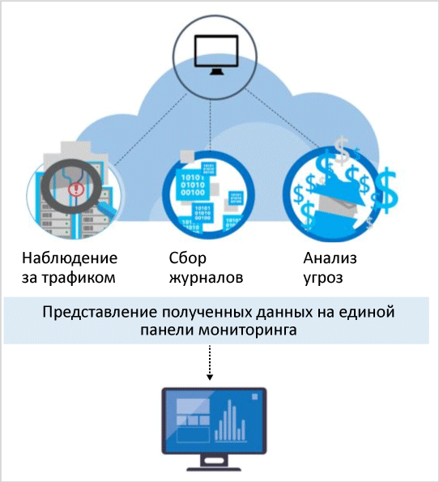

# Возможности обнаружения центра безопасности Azure
Этот документ содержит информацию о расширенных возможностях обнаружения в центре безопасности Azure. С их помощью вы сможете выявлять активные угрозы для ресурсов Microsoft Azure и оперативно на них реагировать.

Расширенное обнаружение угроз доступно в ценовой категории "Стандартный" центра безопасности Azure. Бесплатный пробный период составляет 60 дней. Сведения о том, как перейти на другую ценовую категорию, см. в статье [Настройка политик безопасности в центре безопасности Azure](security-center-policies.md). Дополнительные сведения о ценообразовании см. на странице [центра безопасности](https://azure.microsoft.com/pricing/details/security-center/). 

> [!NOTE]
> Центр безопасности выпустил ограниченную предварительную версию нового набора обнаружений, которые используют записи аудита (общую платформу аудита), для обнаружения вредоносного поведения на компьютерах Linux. Отправьте [нам](mailto:ASC_linuxdetections@microsoft.com) электронное письмо с идентификаторами подписок, чтобы получить предварительную версию.

## Реагирование на современные угрозы
В сфере деятельности злоумышленников, использующих вредоносное программное обеспечение, за последние 20 лет произошли существенные изменения. В прошлом компании обычно беспокоились только о том, чтобы внешний вид их веб-сайтов не исказили отдельные злоумышленники, большинство из которых просто испытывали свои силы. Сегодня злоумышленники стали гораздо более изощренными и организованными. Часто они преследуют определенные финансовые и стратегические цели. Кроме того, им доступно больше ресурсов, так как их могут финансировать государства или преступные организации.

Это привело к беспрецедентному профессионализму в рядах злоумышленников. Искажать внешний вид сайтов им больше неинтересно. Сегодня они похищают информацию, финансовые и личные данные, чтобы зарабатывать деньги на открытом рынке или оказывать давление на определенные коммерческие, политические и военные структуры. Еще больше настораживают злоумышленники, которые взламывают сети, чтобы нанести урон инфраструктуре и навредить людям.

В ответ организации часто развертывают точечные решения по всему корпоративному периметру или для отдельных конечных точек. Эти решения ищут известные сигнатуры атак и обычно генерируют много оповещений с низкой достоверностью, которые должен анализировать аналитик по вопросам безопасности. У большинства организаций не хватает ни времени, ни опыта, чтобы проанализировать эти оповещения, поэтому многие из них игнорируются.  Между тем методы злоумышленников усовершенствовались: теперь они обходят многие средства защиты, основанные на работе с сигнатурами, и [приспосабливаются к облачным средам](https://azure.microsoft.com/blog/detecting-threats-with-azure-security-center/). Поэтому, чтобы быстрее выявлять новые угрозы и своевременно реагировать на них, требуются новые подходы. 

## Как центр безопасности Azure обнаруживает угрозы и реагирует на них
Исследователи корпорации Майкрософт по вопросам безопасности постоянно отслеживают возникающие угрозы. У них есть доступ к обширной телеметрии, которую корпорация Майкрософт получает благодаря своему глобальному присутствию в облаке и на локальных устройствах. Эта обширная и разнообразная коллекция наборов данных позволяет Майкрософт выявлять новые схемы и тенденции атак в своих локальных потребительских и корпоративных продуктах, а также в онлайн-службах. Поэтому, когда злоумышленники создают новые, все более сложные эксплойты, центр безопасности обновляет свои алгоритмы обнаружения максимально оперативно. Этот подход позволяет эффективно противостоять стремительно развивающимся угрозам. 

Функция обнаружения угроз в центре безопасности автоматически собирает информацию о безопасности из ваших ресурсов Azure, сети и подключенных партнерских решений. Она анализирует эту информацию, часто сравнивая сведения из разных источников и определяя угрозы. Приоритет в центре безопасности получают оповещения безопасности и рекомендации по устранению угроз.

В центре безопасности используется расширенная аналитика безопасности, возможности которой значительно превышают возможности подходов, основанных на сигнатурах. В центре безопасности используются также революционные открытия в технологиях больших данных и [машинного обучения](https://azure.microsoft.com/blog/machine-learning-in-azure-security-center/). С их помощью оцениваются события во всей облачной структуре — выявляются угрозы, которые невозможно обнаружить вручную, и прогнозируются тенденции развития атак. Вот что входит в аналитику по вопросам безопасности: 

* **Интегрированная аналитика угроз**— поиск вредного кода с помощью глобальной аналитики угроз, которая поступает от продуктов и служб Майкрософт, подразделения Microsoft Digital Crimes Unit (DCU), центра Microsoft Security Response Center (MSRC) и внешних каналов.
* **Поведенческая аналитика**— вредоносное поведение обнаруживается путем сравнения с известными схемами поведения. 
* **Обнаружение аномалий**— исторически значимые базовые показатели фиксируются с помощью статистического профилирования. В рамках обнаружения аномалий приходят оповещения о таких отклонениях от базовых показателей, которые свидетельствуют о потенциальных атаках.

### Анализ угроз
В корпорации Майкрософт накоплен огромный объем информации, относящейся к глобальной аналитике угроз. Телеметрия поступает из таких источников, как Azure, Office 365, Microsoft CRM Online, Microsoft Dynamics AX, outlook.com, MSN.com, подразделение Microsoft Digital Crimes Unit (DCU) и центр Microsoft Security Response Center (MSRC). Исследователи получают также информацию, связанную с аналитикой угроз, от основных поставщиков облачных служб (которые получают ее от своих подписчиков), а также от третьих сторон. Эта информация позволяет центру безопасности Azure оповещать вас об угрозах, которые связаны с известными вредоносными программами. Некоторые примеры:

* **Трафик, исходящий к вредоносному IP-адресу.** Если трафик прослеживается к известному ботнету или даркнету, это, скорее всего, означает, что ваш ресурс скомпрометирован и злоумышленник пытается выполнить команды в этой системе или получить скрытый доступ к данным. Центр безопасности Azure сверяет сетевой трафик с глобальной базой данных угроз Майкрософт и оповещает вас, если обнаруживает взаимодействие с вредоносным IP-адресом.

## Поведенческая аналитика
Поведенческая аналитика — это метод, в рамках которого данные анализируются и сверяются с набором известных схем. Однако эти схемы — не просто сигнатуры. Они определяются с помощью сложных алгоритмов машинного обучения, которые применяются к объемным наборам данных. Их также определяют аналитики посредством тщательного анализа вредоносного поведения. Поведенческая аналитика позволяет центру безопасности Azure выявлять скомпрометированные ресурсы. Для этого центр безопасности анализирует журналы виртуальных машин, журналы устройств виртуальной сети, журналы структуры, аварийный дампы и другие источники. 

Кроме того, получаемые данные сверяются с другими сигналами. Это дает возможность получить подтверждающие доказательства масштабной кампании. Эта корреляция, в свою очередь, помогает выявить события, которые соответствуют установленным признакам компрометации. Некоторые примеры:

* **Выполнение подозрительных процессов.** Злоумышленники используют несколько методик, чтобы выполнять вредоносные программы и не допускать при этом их обнаружения. Злоумышленник, например, может дать вредоносной программе то же имя, что и у обычного системного файла, при этом разместив вредоносные файлы в альтернативных расположениях, использовать имя, очень похожее на имя безвредного файла, или замаскировать настоящее расширение файла. Чтобы обнаруживать подобные выбросы, центр безопасности моделирует поведение процессов и отслеживает их выполнение.  
* **Скрытые вредоносные программы и эксплойты.** Сложная вредоносная программа может избегать обнаружения традиционным антивирусным ПО. Для этого она либо никогда ничего не записывает на диск, либо шифрует находящиеся на диске программные компоненты.  Тем не менее такую программу может обнаружить анализ памяти, так как, функционируя, она не может не оставлять следов в памяти. Когда программа дает сбой, аварийный дамп записывает часть памяти в момент сбоя.  Анализируя память в аварийном дампе, центр безопасности Azure может выявить методы, с помощью которых злоумышленник эксплуатирует уязвимости ПО, получает доступ к конфиденциальным данным и тайно пользуется скомпрометированным компьютером, не снижая его производительность.
* **Путешествие по компьютерам и внутренняя разведка.** Чтобы находиться в скомпрометированной сети длительное время, занимаясь поиском и сбором ценных данных, злоумышленники часто пытаются переходить со скомпрометированного компьютера на другие компьютеры в той же сети. Чтобы обнаруживать попытки злоумышленника укрепиться в сети, центр безопасности отслеживает процессы обработки и входа, например зондирование сети через удаленное выполнение команд и перечисление учетных записей.
* **Вредоносные сценарии PowerShell.** Для выполнения вредоносного кода на целевых виртуальных машинах злоумышленники используют PowerShell для различных целей. Центр безопасности проверяет процессы PowerShell на предмет подозрительной активности. 
* **Исходящие атаки.** Злоумышленники часто атакуют облачные ресурсы, чтобы дополнительные атаки исходили уже от них. Скомпрометированные виртуальные машины, например, могут быть источником атак методом подбора против других виртуальных машин, могут рассылать спам или сканировать открытые порты и другие устройства в Интернете. Изучая сетевой трафик с помощью машинного обучения, центр безопасности может обнаруживать аномалии в исходящих сетевых подключениях. Что касается спама, центр безопасности сверяет трафик необычной электронной почты с аналитической информацией из Office 365, чтобы определить, является ли почта нежелательной или рассылается в рамках обычной рекламной кампании.  

### Обнаружение аномалий
Центр безопасности Azure выявляет угрозы также с помощью метода обнаружения аномалий. В отличие от поведенческой аналитики (в которой используются известные схемы поведения, созданные на основе объемных наборов данных), обнаружение аномалий является более персонализированной методикой. В ее рамках акцент делается на показатели, стандартные для вашего развертывания. Машинное обучение определяет, какие процессы являются нормальными для вашей среды. Затем вырабатываются правила, в которых обозначаются аномальные условия, свидетельствующие об угрозе безопасности. Ниже приведен пример.

* **Входящие атаки методом подбора по протоколу RDP/SSH.** Ваши развертывания могут включать виртуальные машины с большой нагрузкой, куда пользователи входят много раз в день, и другие машины, куда входят очень мало или не входят вообще. Центр безопасности Azure может определять стандартные показатели входов на этих виртуальных машинах и с помощью машинного обучения выявлять отклонения от этих показателей. Если количество входов, или время дня, в которое они выполняются, или расположение, из которого они запрашиваются, или какие-либо другие характеристики, связанные с входом, существенно отклоняются от стандартных показателей, система может об этом предупредить. Степень существенности отклонения также определяется с помощью машинного обучения.

## Непрерывный мониторинг аналитики угроз
В центре безопасности Azure работают команды по исследованиям в области безопасности и по обработке и анализу данных. Они постоянно наблюдают за изменениями в сфере угроз. В центре безопасности действуют описанные ниже инициативы.

* **Мониторинг аналитики угроз.** Аналитика угроз предусматривает механизмы, индикаторы, результаты и практические советы об имеющихся и возникающих угрозах. Эта информация размещается в сообществе специалистов по безопасности, и корпорация Майкрософт непрерывно отслеживает каналы аналитики угроз, принадлежащие внутренним и внешним источникам.
* **Общий доступ к информации.** Команды по обеспечению безопасности, задействованные в широком наборе облачных и локальных служб, серверов и клиентских устройств с конечными точками корпорации Майкрософт, обмениваются информацией и анализируют ее. 
* **Специалисты по безопасности Майкрософт.** Свою лепту неустанно вносят команды Майкрософт, которые работают в таких узких областях безопасности, как криминалистика и обнаружение веб-атак.
* **Настройка обнаружения.** Алгоритмы испытываются на наборах данных конкретных пользователей, и исследователи по вопросам безопасности проверяют результаты испытаний в тесном сотрудничестве с этими пользователями. Чтобы улучшать алгоритмы машинного обучения, специалисты анализируют ложные и истинные срабатывания.

Все эти инициативы совместно дают общий результат: обнаружение угроз происходит по-новому и более качественно, а пользоваться результатами вы можете прямо сейчас, не прилагая никаких усилий.

## См. также
Этот документ содержит сведения о возможностях обнаружения в центре безопасности Azure. Дополнительные сведения о Центре безопасности см. в следующих статьях:

* [Руководство по планированию использования центра безопасности Azure и работе в нем](security-center-planning-and-operations-guide.md)
* [Управление оповещениями безопасности в Центре безопасности Azure и реагирование на них](security-center-managing-and-responding-alerts.md)
* [Типы оповещений системы безопасности в центре безопасности Azure](security-center-alerts-type.md)
* [Наблюдение за работоспособностью системы безопасности в Центре безопасности Azure](security-center-monitoring.md) — узнайте, как отслеживать работоспособность ресурсов Azure.
* [Мониторинг решений партнеров с помощью центра безопасности Azure](security-center-partner-solutions.md) — узнайте, как отслеживать состояние работоспособности решений партнеров.
* [Центр безопасности Azure: часто задаваемые вопросы](security-center-faq.md) — часто задаваемые вопросы об использовании этой службы.
* [Блог по безопасности Azure](http://blogs.msdn.com/b/azuresecurity/) — публикации блога, посвященные безопасности и соответствию требованиям в Azure.

