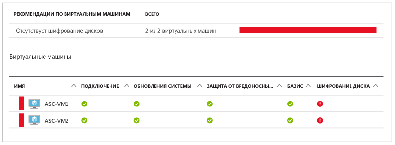
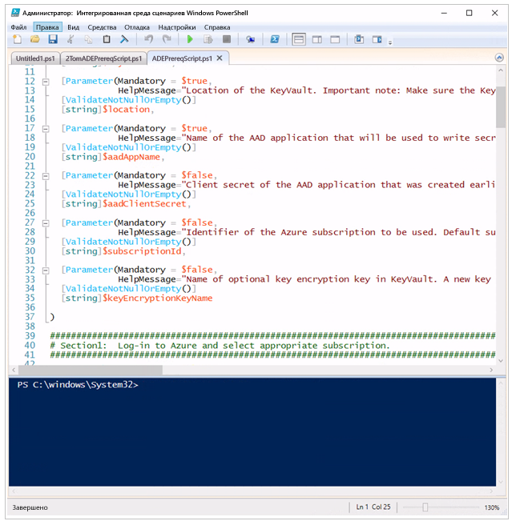
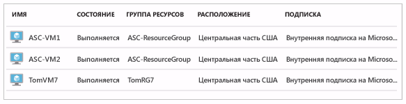
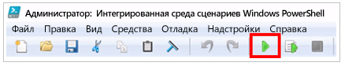
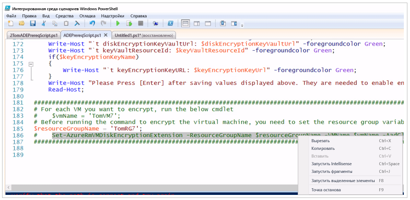
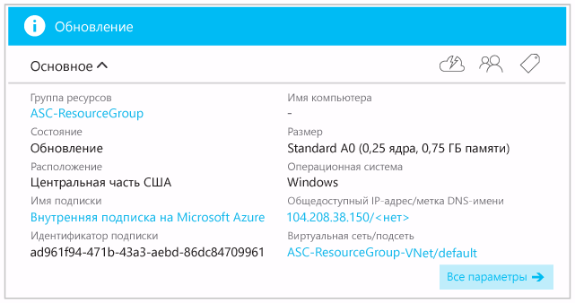
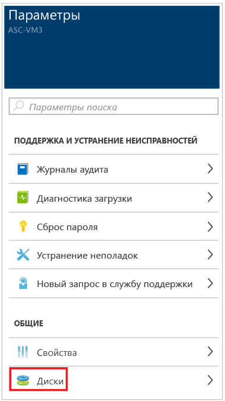

# Шифрование виртуальной машины Azure
Если у вас есть незашифрованные виртуальные машины, центр безопасности Azure оповестит вас. Вы получите оповещение высокого уровня серьезности вместе рекомендацией о шифровании таких виртуальных машин.

> [!NOTE]
> Сведения, содержащиеся в этой статье, относятся к шифрованию виртуальных машин без использования ключа шифрования ключей (необходимого для резервного копирования виртуальных машин с помощью службы архивации Azure). Дополнительные сведения об использовании ключа шифрования ключей для поддержки службы архивации Azure для зашифрованных виртуальных машин Azure см. в статье [Дисковое шифрование Azure для виртуальных машин IaaS под управлением Windows и Linux](https://docs.microsoft.com/azure/security/azure-security-disk-encryption).
>
>

Для шифрования виртуальных машин Azure, которые определены центром безопасности Azure как требующие шифрования, мы рекомендуем выполнить следующие действия:

* Установите и настройте Azure PowerShell. Это позволит вам выполнять команды PowerShell, чтобы установить необходимые компоненты для шифрования виртуальных машин Azure.
* Получите и выполните скрипт Azure PowerShell с необходимыми компонентами для шифрования дисков Azure. 
* Зашифруйте свои виртуальные машины.

Этот документ поможет вам зашифровать виртуальные машины, даже если у вас недостаточно или совсем нет опыта работы с Azure PowerShell.
В этом документе предполагается, что в качестве клиентского компьютера, на котором будет настраиваться шифрование дисков Azure, используется компьютер под управлением ОС Windows 10.

Существуют разные методы установки необходимых компонентов и настройки шифрования виртуальных машин Azure. Если у вас есть опыт работы с Azure PowerShell или интерфейсом командной строки Azure, вы можете использовать альтернативные подходы.

> [!NOTE]
> Дополнительные сведения об альтернативных подходах к настройке шифрования для виртуальных машин Azure см. в статье [Azure Disk Encryption for Windows and Linux Azure Virtual Machines](https://gallery.technet.microsoft.com/Azure-Disk-Encryption-for-a0018eb0) (Шифрование дисков Azure для виртуальных машин Azure под управлением Windows и Linux).
>
>

## Установка и настройка Azure PowerShell
На компьютере необходимо установить Azure PowerShell 1.2.1 или более поздней версии. В статье [Установка и настройка Azure PowerShell](/powershell/azure/overview) описаны все действия, необходимые для подготовки компьютера для работы с Azure PowerShell. Самый простой способ — использовать установщик веб-платформы, который упоминается в этой статье. Даже если у вас уже установлен модуль Azure PowerShell, с помощью установщика веб-платформы выполните повторную установку, чтобы получить последнюю версию Azure PowerShell.

## Получение и выполнение скрипта для установки компонентов, необходимых при шифровании дисков Azure
Скрипт для установки компонентов, необходимых при шифрования дисков Azure, устанавливает все соответствующие компоненты.

1. Перейдите на страницу GitHub, на которой размещен [скрипт для установки компонентов, необходимых при шифровании дисков Azure](https://github.com/Azure/azure-powershell/blob/master/src/ResourceManager/Compute/Commands.Compute/Extension/AzureDiskEncryption/Scripts/AzureDiskEncryptionPreRequisiteSetup.ps1).
2. На странице GitHub нажмите кнопку **Raw** (Без форматирования).
3. С помощью клавиш **CTRL+A** выделите весь текст на странице, а затем нажмите **CTRL+C**, чтобы скопировать в буфер обмена весь текст на странице.
4. Откройте **Блокнот** и вставьте скопированный текст.
5. Создайте на диске C: новую папку с именем **AzureADEScript**.
6. Сохраните файл Блокнота: щелкните **Файл**, а затем — **Сохранить как**. В текстовое поле "Имя файла" введите **ADEPrereqScript.ps1** и нажмите кнопку **Сохранить** (имя нужно заключить в кавычки, иначе файл будет сохранен с расширением TXT).

Содержимое скрипта сохранено. Теперь откройте скрипт в интегрированной среде сценариев Windows PowerShell (PowerShell ISE):

1. В меню "Пуск" выберите пункт **Кортана**. Чтобы с помощью **Кортаны** найти PowerShell, введите **PowerShell** в текстовом поле поиска.
2. Щелкните правой кнопкой мыши **Интегрированная среда сценариев Windows PowerShell** и выберите пункт **Запуск от имени администратора**.
3. В окне **Администратор: интегрированная среда сценариев Windows PowerShell** щелкните **Представление**, а затем — **Show Script Pane** (Показать область сценариев).
4. Если панель **Команды** отображается в правой части окна, щелкните значок **x** в правом верхнем углу панели, чтобы закрыть ее. Если текст слишком мелкий, используйте **CTRL+Add** (Add — это знак "+"). Если текст слишком крупный, используйте **CTRL+Subtract** (Subtract — это знак "-").
5. Щелкните **Файл** и выберите пункт **Открыть**. Перейдите в папку **C:\AzureADEScript** и дважды щелкните файл **ADEPrereqScript**.
6. Содержимое файла **ADEPrereqScript** должно отобразиться в среде PowerShell ISE; разные компоненты, включая команды, параметры и переменные, обозначены цветом для удобства.

Теперь вы должны увидеть что-то похожее:

Верхняя панель называется областью сценариев, а нижняя — консолью. Мы будем использовать эти термины далее в этой статье.

## Выполнение команды PowerShell для установки компонентов, необходимых при шифровании дисков Azure 
Когда вы запустите скрипт для установки компонентов, необходимых при шифровании диска Azure, появится запрос на ввод следующих сведений:

* **Имя группы ресурсов** — имя группы ресурсов, в которой вы планируете расположить хранилище ключей.  Будет создана группа ресурсов с указанным именем (если такая группа ресурсов еще не существует). Если у вас уже есть группа ресурсов, которую следует использовать в этой подписке, укажите ее имя.
* **Имя хранилища ключей** — имя хранилища ключей, в котором будут размещаться ключи шифрования. Будет создано хранилище ключей с таким именем (если оно еще не создано). Если у вас уже есть хранилище ключей, которое следует использовать, введите его имя.
* **Расположение** — расположение хранилища ключей. Убедитесь, что хранилище ключей и виртуальные машины, которые предстоит зашифровать, находятся в одном расположении. Если расположение неизвестно, далее в этой статье показано, как его узнать.
* **Имя приложения Azure Active Directory** — имя приложения Azure Active Directory, которое будет использоваться для записи секретов в хранилище ключей. Будет создано приложение с таким именем (если оно еще не создано). Если приложение Azure Active Directory, которое вы хотите использовать, уже существует, введите его имя.

> [!NOTE]
> Если вам интересно, почему нужно создать приложение Azure Active Directory, см. раздел *Регистрация приложения в Azure Active Directory* статьи [Приступая к работе с хранилищем ключей Azure](../key-vault/key-vault-get-started.md).
>
>

Зашифровать виртуальную машину Azure можно так.

1. Если вы закрыли PowerShell ISE, откройте экземпляр PowerShell ISE с повышенными правами. Если среда PowerShell ISE еще не открыта, следуйте инструкциям, приведенным выше в этой статье. Если вы закрыли скрипт, откройте файл **ADEPrereqScript.ps1**: щелкните **Файл** и **Открыть**, а затем выберите скрипт из папки **C:\AzureADEScript**. Если вы выполняли инструкции с самого начала, просто перейдите к следующему шагу.
2. В консоли PowerShell ISE (нижняя область PowerShell ISE) перейдите в каталог со скриптом, введя **cd c:\AzureADEScript**, и нажмите клавишу **ВВОД**.
3. Задайте политику выполнения на компьютере, чтобы можно было выполнить скрипт. Введите в консоли **Set-ExecutionPolicy Unrestricted** и нажмите клавишу ВВОД. Если отобразится диалоговое окно, в котором сообщается о последствиях изменения политики выполнения, щелкните **Да для всех** или **Да** (если команда **Да для всех** отображается, выберите ее; в **противном случае** нажмите кнопку **Да**).
4. Войдите в свою учетную запись Azure. В окне консоли введите **Connect-AzureRmAccount** и нажмите клавишу **ВВОД**. Появится диалоговое окно, в котором можно ввести учетные данные. (Убедитесь, что у вас есть права на изменение виртуальных машин, иначе вы не сможете зашифровать виртуальные машины. Вы должны увидеть сведения о **среде**, **учетной записи**, а также **TenantId**, **SubscriptionId** и **CurrentStorageAccount**. Скопируйте значение **SubscriptionId** в Блокнот. Оно понадобится вам на этапе 6.
5. Выясните, к какой подписке принадлежит ваша виртуальная машина и в каком расположении она находится. Перейдите на сайт [https://portal.azure.com](ttps://portal.azure.com) и войдите в систему.  В левой части страницы щелкните **Виртуальные машины**. Отобразится список виртуальных машин и подписок, к которым они принадлежат.

   
6. Вернитесь в среду PowerShell ISE. Задайте контекст подписки, в котором будет выполняться скрипт. В окне консоли введите **Select-AzureRmSubscription –SubscriptionId <your_subscription_Id>** (замените **< your_subscription_Id >** на фактический идентификатор подписки) и нажмите клавишу **ВВОД**. Вы должны увидеть сведения о среде, **учетной записи**, а также **TenantId**, **SubscriptionId** и **CurrentStorageAccount**.
7. Теперь все готово к запуску скрипта. Нажмите кнопку **Выполнить сценарий** или клавишу **F5** на клавиатуре.

   
8. Скрипт запросит значение **resourceGroupName**: введите имя *группы ресурсов*, которую вы хотите использовать, а затем нажмите клавишу **ВВОД**. Если у вас нет такой группы ресурсов, введите имя, которое будет использовано для создания новой группы. Если у вас уже есть *группа ресурсов* , которую вы хотите использовать (например, та, к которой относится ваша виртуальная машина), введите ее имя.
9. Скрипт запросит значение **keyVaultName:** введите имя *хранилища ключей* , которое вы хотите использовать, а затем нажмите клавишу ВВОД. Если у вас нет такой группы ресурсов, введите имя, которое будет использовано для создания новой группы. Если у вас уже есть *хранилище ключей*, которое следует использовать, введите его имя.
10. Скрипт запросит значение **location**: введите имя расположения виртуальной машины, которую требуется зашифровать, а затем нажмите клавишу **ВВОД**. Если вы не помните расположение, вернитесь к шагу 5.
11. Скрипт запросит значение **aadAppName**: введите имя приложения *Azure Active Directory*, которое вы хотите использовать, а затем нажмите клавишу **ВВОД**. Если у вас нет такой группы ресурсов, введите имя, которое будет использовано для создания новой группы. Если *приложение Azure Active Directory*, которое вы хотите использовать, уже *существует*, введите его имя.
12. Появится диалоговое окно входа. Укажите свои учетные данные (да, вы уже вошли в систему, но это необходимо сделать еще раз).
13. Скрипт будет выполнен. По завершении появится запрос на копирование значений **aadClientID**, **aadClientSecret**, **diskEncryptionKeyVaultUrl** и **keyVaultResourceId**. Скопируйте все эти значения в буфер обмена и вставьте их в Блокнот.
14. Вернитесь в интегрированную среду сценариев PowerShell, поместите курсор в конце последней строки и нажмите клавишу **ВВОД**.

Выходные данные скрипта должны выглядеть примерно как на снимке экрана ниже:

## Шифрование виртуальной машины Azure
Теперь все готово к шифрованию виртуальной машины. Если виртуальная машина расположена в той же группе ресурсов, что и хранилище ключей, можно перейти к разделу, в котором описаны действия шифрования. Если же виртуальная машина расположена в другой группе ресурсов, в консоли PowerShell ISE введите следующее:

**$resourceGroupName = <’Virtual_Machine_RG’>**

Замените **<’Virtual_Machine_RG’>** именем группы ресурсов, в которой находятся ваши виртуальные машины, взяв его в одинарные кавычки. Нажмите клавишу **ВВОД**.
Чтобы убедиться, что указано правильное имя группы ресурсов, введите следующую команду в консоли PowerShell ISE:

**$resourceGroupName**

Нажмите клавишу **ВВОД**. Должно отобразиться имя группы ресурсов, в которой расположены ваши виртуальные машины. Например: 

### Шаги шифрования
Во-первых, в PowerShell необходимо указать имя виртуальной машины, которую вы хотите зашифровать. В окне консоли введите:

**$vmName = <’your_vm_name’>**

Замените **<’your_vm_name’>** именем виртуальной машины, взяв его в одинарные кавычки, и нажмите клавишу **ВВОД**.

Чтобы убедиться, что указано правильное имя виртуальной машины, введите:

**$vmName**

Нажмите клавишу **ВВОД**. Должно отобразиться имя виртуальной машины, которую требуется зашифровать. Например: 

Существует два метода выполнить команду шифрования всех дисков виртуальной машины. Первый способ — введите в консоли PowerShell ISE следующую команду:

~~~
Set-AzureRmVMDiskEncryptionExtension -ResourceGroupName $resourceGroupName -VMName $vmName -AadClientID $aadClientID -AadClientSecret $aadClientSecret -DiskEncryptionKeyVaultUrl $diskEncryptionKeyVaultUrl -DiskEncryptionKeyVaultId $keyVaultResourceId -VolumeType All
~~~

Введя эту команду, нажмите клавишу **ВВОД**.

Второй способ — щелкните в области сценариев (в верхней области PowerShell ISE) и прокрутите вниз до конца скрипта. Выделите команду приведенную выше, а затем щелкните ее правой кнопкой мыши и выберите пункт **Выполнить выбранное** или нажмите клавишу **F8** на клавиатуре.

В любом случае должно появиться диалоговое окно с сообщением о том, что операция будет завершена через 10–15 минут. Щелкните **Да**.

В ходе шифрования можно вернуться на портал Azure и просмотреть состояние виртуальной машины. В левой части страницы щелкните **Виртуальные машины**, затем в колонке **Виртуальные машины** щелкните имя виртуальной машины, для которой выполняется шифрование. В появившейся колонке отобразится ее **состояние** — **Обновление**. которое свидетельствует о выполнении шифрования.

Вернитесь в среду PowerShell ISE. Когда скрипт буде выполнен, вы увидите результат, показанный на рисунке ниже.

Чтобы убедиться, что виртуальная машина зашифрована, вернитесь на портал Azure и щелкните **Виртуальные машины** в левой части страницы. Щелкните имя зашифрованной виртуальной машины. В колонке **Параметры** щелкните **Диски**.

В колонке **Диски** вы увидите состояние **шифрования** — **Включено**.

## Дополнительная информация
Из этого документа вы узнали, как зашифровать виртуальную машину Azure. Дополнительные сведения о Центре безопасности Azure см. в следующих статьях:

* [Наблюдение за работоспособностью системы безопасности в Центре безопасности Azure](security-center-monitoring.md) — узнайте, как наблюдать за работоспособностью ресурсов Azure.
* [Управление оповещениями безопасности в Центре безопасности Azure и реагирование на них](security-center-managing-and-responding-alerts.md) — сведения об управлении оповещениями системы безопасности и реагировании на них.
* [Часто задаваемые вопросы о Центре безопасности Azure](security-center-faq.md) — часто задаваемые вопросы об использовании этой службы.
* [Блог по безопасности Azure](http://blogs.msdn.com/b/azuresecurity/) — публикации блога, посвященные безопасности Azure и соответствию требованиям.
