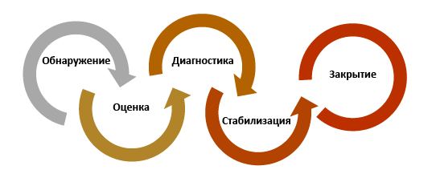
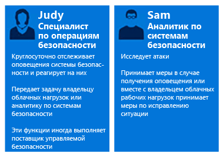
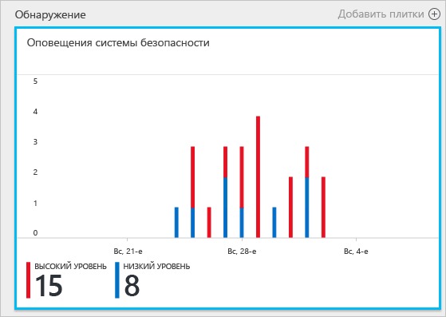
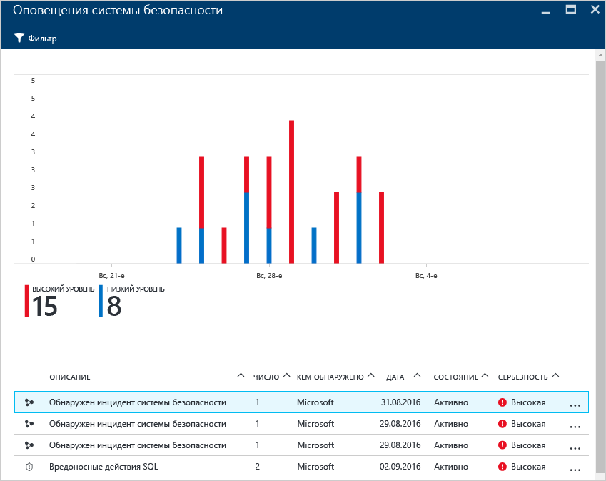
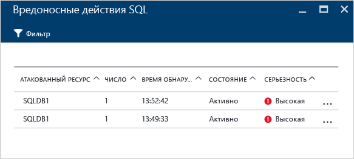
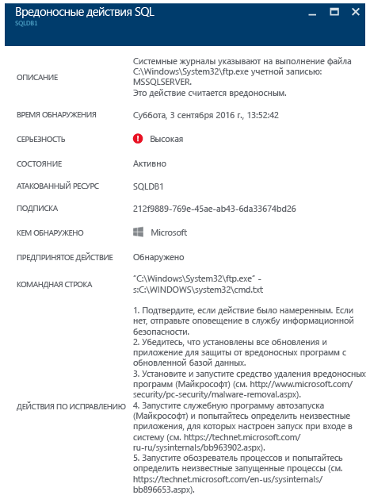

# Использование центра безопасности Azure для реагирования на инциденты
Во многих организациях учатся реагировать на угрозы безопасности только в ходе самой атаки. Чтобы минимизировать затраты и риски, важно составить план реагирования до обнаружения атаки. Центр безопасности Azure можно использовать на разных этапах реагирования на инциденты.

## Планирование реагирования на инциденты
Чтобы план был эффективным, он должен предусматривать возможность обеспечения защиты, обнаружения и реагирования на угрозы. Защита — это предотвращение инцидентов, обнаружение — раннее определение угроз, а реагирование — это нейтрализация действий злоумышленника и восстановление систем для устранения негативных последствий.

В этой статье описываются этапы реагирования на инциденты нарушения безопасности на основе материалов о [реагировании на нарушения безопасности в облаке Microsoft Azure](https://gallery.technet.microsoft.com/Azure-Security-Response-in-dd18c678). Эти этапы представлены на схеме.

Центр безопасности можно использовать на этапах обнаружения, оценки и диагностики. Ниже описано, как именно можно использовать центр безопасности.

* **Обнаружение** — просмотр первого уведомления об инциденте.
  * Пример: проверьте исходное оповещение системы безопасности с высоким приоритетом, появившееся на панели мониторинга центра безопасности.
* **Оценка**— выполните первоначальную оценку, чтобы получить дополнительные сведения о подозрительной активности.
  * Пример: просмотрите дополнительные сведения об оповещении системы безопасности.
* **Диагностика** — выполните технический анализ и определите стратегии сдерживания, устранения и решения проблемы.
  * Пример: выполните действия по исправлению, предложенные в конкретном оповещении системы безопасности центра безопасности.

В сценарии ниже показано, как можно использовать центр безопасности на этапе обнаружения, оценки, диагностики нарушения безопасности, а также реагирования на него. В центре безопасности [инцидентом безопасности](security-center-incident.md) считается совокупность всех оповещений для определенного ресурса, которые соответствуют [поэтапным схемам нарушения безопасности](https://blogs.technet.microsoft.com/office365security/addressing-your-cxos-top-five-cloud-security-concerns/). Инциденты отображаются на плитке [Оповещения системы безопасности](security-center-managing-and-responding-alerts.md) и в одноименной колонке. Инцидент содержит список соответствующих оповещений с дополнительными сведениями о каждом событии. Центр безопасности также представляет изолированные оповещения системы безопасности, с помощью которых можно отслеживать подозрительные действия.

## Сценарий
Недавно компания Contoso перенесла в среду Azure некоторые локальные ресурсы, включая рабочие нагрузки бизнес-приложений и базы данных SQL, размещенные на виртуальных машинах. Сейчас у главной группы реагирования на инциденты ИТ-безопасности есть проблема с анализом нарушений безопасности из-за того, что компоненты анализа информации о безопасности не интегрированы в имеющиеся средства реагирования на инциденты. Это существенно усложняет обнаружение инцидентов (слишком много ложноположительных предупреждений), их оценку и диагностику. В рамках этой миграции они решили воспользоваться услугами центра безопасности, чтобы решить эту проблему.

Первый этап переноса завершился после развертывания всех ресурсов и выполнения всех рекомендаций центра безопасности. Группа реагирования на инциденты, связанные с компьютерной безопасностью, компании Contoso — это главное звено, отвечающее за обработку инцидентов безопасности компьютера. В нее входят сотрудники, обрабатывающие нарушения системы безопасности. Каждый участник группы имеет четко определенные обязанности. Таким образом обеспечивается защита по всем направлениям.

В этом сценарии мы опишем следующие роли участников группы реагирования на инциденты ИТ-безопасности.

Марта — специалист по операциям безопасности. В ее обязанности входит:

* круглосуточный мониторинг угроз безопасности и реагирование на них;
* отправка сведений об инцидентах на рассмотрение владельцу облачных рабочих нагрузок или аналитику систем безопасности (по обстоятельствам).

Григорий — аналитик по системам безопасности. Его обязанности:

* изучение атак;
* исправление ситуаций, по которым получены оповещения;
* разработка мер по устранению последствий и их применение совместно с владельцами рабочих нагрузок.

Как видно, у Марты и Григория разные обязанности, но они должны сотрудничать и делиться информацией, полученной от центра безопасности.

## Рекомендуемое решение
Так как Марта и Григорий выполняют разные роли, они будут использовать разные компоненты центра безопасности для получения сведений, необходимых для работы. Марта будет использовать **оповещения системы безопасности**, которые она ежедневно отслеживает.

Она будет использовать их на этапах обнаружения и оценки. После завершения первоначальной оценки она может передать эстафету Григорию для дополнительного изучения проблемы. На этом этапе Григорий воспользуется сведениями, полученными из центра безопасности и других источников, чтобы перейти к этапу диагностики.

## Реализация решения
Чтобы увидеть пример использования центра безопасности Azure в сценарии реагирования на инцидент, мы рассмотрим действия Марты на этапах обнаружения и оценки, а затем действия Григория на этапе диагностики.

### Этапы реагирования на инцидент: обнаружение и оценка
Марта вошла на портал Azure и открыла консоль центра безопасности. Выполняя стандартный процесс ежедневного мониторинга, она начала просматривать оповещения системы безопасности с высоким приоритетом в следующем порядке:

1. Щелкнула плитку **Оповещения системы безопасности** и открыла колонку **Оповещения системы безопасности**.
    

   > [!NOTE]
   > В нашем примере Марте нужно проанализировать оповещения о вредоносных действиях SQL, как видно на рисунке выше.
   >
   >
2. Поэтому она щелкнула оповещение о **вредоносных действиях SQL**, чтобы просмотреть атакованные ресурсы в колонке **вредоносных действий SQL** со .

    В этой колонке Марта может получить сведения об атакованных ресурсах, в частности узнать число попыток атаки и время их обнаружения.
3. Щелкните **атакованный ресурс** , чтобы получить дополнительные сведения об этой атаке.

Прочитав описание, Марта убеждается, что атака не является ложно положительной, а значит, ей нужно передать этот инцидент Григорию.

### Этап реагирования на инциденты: диагностика
Григорий получил инцидент от Марты и приступил к изучению действий по исправлению, предложенных центром безопасности.

### Дополнительные ресурсы
Компании, которые используют собственное решение для сбора данных безопасности и управления событиями (SIEM) на этапе расследования инцидентов, также могут [интегрировать это решение с центром безопасности](security-center-integrating-alerts-with-log-integration.md). Кроме того, с помощью [средства интеграции журналов Azure](https://blogs.msdn.microsoft.com/azuresecurity/2016/07/21/microsoft-azure-log-integration-preview/) можно интегрировать журналы аудита Azure и события безопасности виртуальных машин. Эти сведения можно использовать вместе со сведениями центра безопасности для изучения атаки. Чтобы определить причину инцидента, также можно воспользоваться функцией [исследования](https://docs.microsoft.com/azure/security-center/security-center-investigation) в центре безопасности.

## Заключение
Для компании очень важно собрать группу специалистов до работы с инцидентами, так как это положительным образом скажется на их обработке. Наличие нужных инструментов для мониторинга ресурсов может помочь этой группе определять точные действия по устранению нарушения безопасности. Благодаря [возможностям обнаружения](security-center-detection-capabilities.md) центра безопасности ИТ-специалисты могут быстро реагировать на нарушения безопасности и устранять связанные с ними проблемы.
