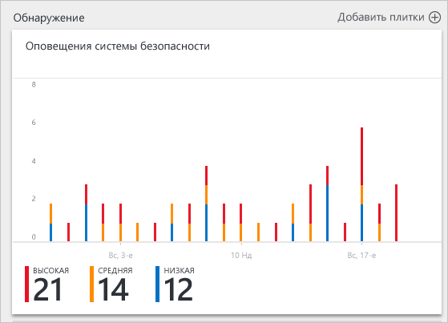
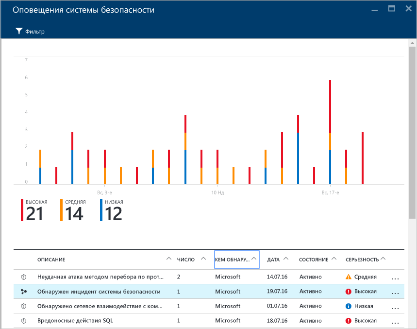
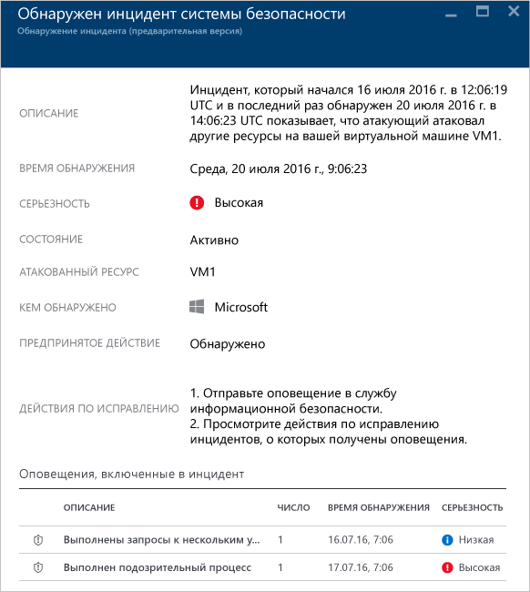
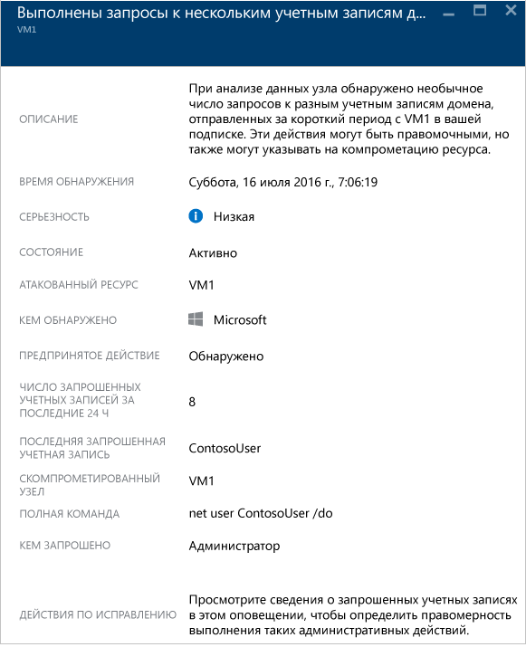

# Обработка инцидентов в центре безопасности Azure
Рассмотрение и исследование оповещений системы безопасности может занять много времени даже у самых опытных аналитиков в сфере безопасности, а многие пользователи даже не знают, с чего начать. Используя [аналитику](security-center-detection-capabilities.md) для связывания данных из различных [предупреждений безопасности](security-center-managing-and-responding-alerts.md), центр безопасности может предоставить общую картину кампании атак и все соответствующие оповещения. Это позволит вам быстро понять, какие действия выполнил злоумышленник и какие ресурсы были затронуты.

В этом документе объясняется, как использовать возможности оповещений системы безопасности в центре безопасности при возникновении инцидентов.

## Что такое инцидент?
В центре безопасности инцидентом считается совокупность всех оповещений для ресурса, которые соответствуют схемам [этапов нарушения безопасности](https://blogs.technet.microsoft.com/office365security/addressing-your-cxos-top-five-cloud-security-concerns/). Инциденты отображаются на плитке [Оповещения системы безопасности](security-center-managing-and-responding-alerts.md) и в одноименной колонке. Инцидент содержит список соответствующих оповещений, который позволяет получить дополнительные сведения о каждом происшествии.

## Управление инцидентами
Текущие инциденты можно просматривать на плитке "Оповещения системы безопасности". Войдите на портал Azure и выполните следующие действия, чтобы получить дополнительные сведения о каждом инциденте.

1. На панели мониторинга в центре безопасности вы увидите плитку **Оповещения системы безопасности**.
   
    .
2. Щелкните эту плитку, чтобы развернуть ее. Обнаруженный инцидент будет отображаться под диаграммой предупреждений безопасности, как показано ниже.
   
   
3. Обратите внимание, что в описании инцидентов используется не такой значок, как в других оповещениях. Щелкните его, чтобы просмотреть дополнительные сведения об инциденте.
   
   .
4. В колонке **инцидента** отобразятся подробные сведения об инциденте, включая его полное описание, уровень серьезности (здесь — высокий), текущее состояние (здесь — по-прежнему *активен*, то есть пользователь еще не принял никаких мер, чтобы *закрыть* инцидент; это можно сделать, щелкнув инцидент правой кнопкой мыши в колонке **Оповещения системы безопасности**), атакуемый ресурс *VM1*, действия по исправлению инцидента, а внизу — оповещения, которые были включены в этот инцидент. Если вы хотите получить дополнительные сведения о каждом оповещении, просто щелкните его, и откроется новая колонка, как показано ниже.
   
   .

Сведения в этой колонке будут разными в зависимости от оповещения. Дополнительные сведения об управлении этими оповещениями см. в статье [Управление оповещениями безопасности в центре безопасности Azure и реагирование на них](security-center-managing-and-responding-alerts.md). Некоторые важные замечания, касающиеся работы этой функции.

* С помощью нового фильтра можно настроить отображение только инцидента, только оповещений, а также и инцидента, и оповещений.
* Одно и то же оповещение может существовать как часть инцидента (если он существует), а также отображаться в виде автономного оповещения.
* При отклонении инцидента соответствующие оповещения не отклоняются.

## См. также
Этот документ содержит подробные сведения о функции инцидентов в центре безопасности Azure. Дополнительные сведения о Центре безопасности см. в следующих статьях:

* [Управление оповещениями безопасности в Центре безопасности Azure и реагирование на них](security-center-managing-and-responding-alerts.md).
* [Возможности обнаружения центра безопасности Azure](security-center-detection-capabilities.md).
* [Руководство по планированию использования центра безопасности Azure и работе в нем](security-center-planning-and-operations-guide.md).
* [Управление оповещениями безопасности в Центре безопасности Azure и реагирование на них](security-center-managing-and-responding-alerts.md).
* [Центр безопасности Azure: часто задаваемые вопросы](security-center-faq.md). Часто задаваемые вопросы об использовании этой службы.
* [Блог по безопасности Azure](http://blogs.msdn.com/b/azuresecurity/). Записи блога, посвященные безопасности Azure и соответствию требованиям.

<!---HONumber=AcomDC_0817_2016-->