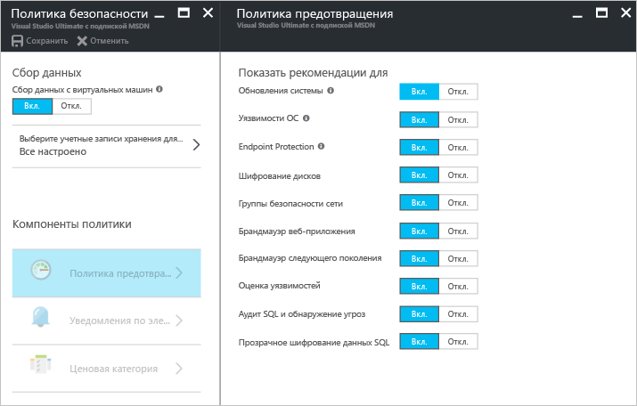
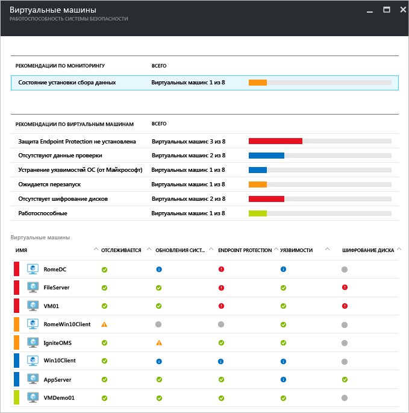
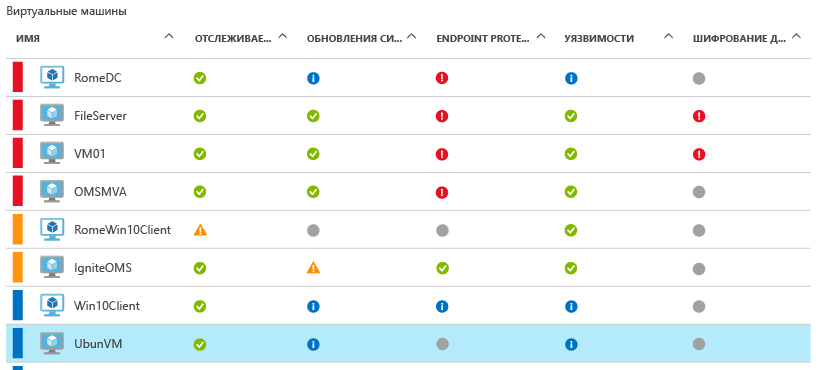
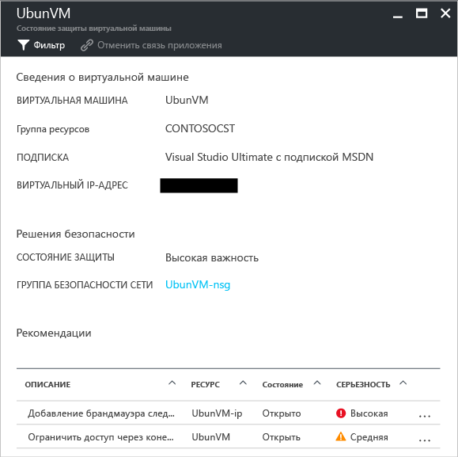

# Центр безопасности Azure и виртуальные машины Azure c ОС Linux
[Центр безопасности Azure](https://azure.microsoft.com/services/security-center/) позволяет предотвращать, обнаруживать угрозы и реагировать на них. Она включает встроенные функции мониторинга безопасности и управления политиками для подписок Azure, помогает выявлять угрозы, которые в противном случае могли бы оказаться незамеченными, и взаимодействует с широким комплексом решений по обеспечению безопасности.

В этой статье показано, как с помощью центра безопасности можно защитить виртуальные машины Azure, используя операционную систему Linux.

## Для чего используется центр безопасности?
Центр безопасности помогает защитить данные виртуальных машин в Azure, обеспечивая представление параметров безопасности и отслеживание угроз. Центр безопасности может отслеживать виртуальные машины для обеспечения следующего: 

* Соответствие параметров безопасности операционной системы (ОС) рекомендуемым правилам конфигурации.
* Своевременная установка отсутствующих обновлений системы безопасности и критических обновлений.
* Рекомендации по защите конечных точек.
* Проверка шифрования диска.
* Защита от атак через сеть (доступно только в [стандартной версии](https://azure.microsoft.com/pricing/details/security-center/)).

Помимо защиты виртуальных машин Azure центр безопасности предоставляет средства мониторинга и управления безопасностью облачных служб, служб приложений, виртуальных сетей, а также многие другие возможности. 

> [!NOTE]
> Дополнительные сведения о центре безопасности Azure см. в статье [Введение в центр безопасности Azure](security-center-intro.md).
> 
> 

## предварительным требованиям
Чтобы начать работу с центром безопасности Azure, необходимо принять во внимание следующее.

* Вам необходимо иметь подписку Microsoft Azure. Дополнительные сведения об уровнях "Бесплатный" и "Стандартный" центра безопасности на странице [цен на центр безопасности](https://azure.microsoft.com/pricing/details/security-center/).
* Дополнительные сведения и рекомендации по планированию использования центра безопасности Azure и работе в нем см. в [этом руководстве](security-center-planning-and-operations-guide.md).
* Сведения о поддержке операционных систем см. в статье [Центр безопасности Azure: часто задаваемые вопросы](security-center-faq.md). 

## Установка политики безопасности
Чтобы центр безопасности Azure мог собирать сведения, необходимые для предоставления рекомендаций и оповещений, которые создаются на основе настроек политики безопасности, нужно включить сбор данных. На рисунке ниже видно, что для параметра **Сбор данных** выбрано значение **Вкл**.

Политика безопасности определяет набор элементов управления, которые рекомендуются для ресурсов в указанной подписке или группе ресурсов. Сбор данных необходимо включить перед включением политики безопасности. Центр безопасности собирает с виртуальных машин данные, оценивает состояние их безопасности на основе этих данных, предоставляет рекомендации по обеспечению безопасности и предупреждает об угрозах. В центре безопасности можно настраивать политики для подписок Azure или групп ресурсов в соответствии с потребностями безопасности вашей компании, типом приложений или конфиденциальностью данных в каждой подписке. 

> [!NOTE]
> Дополнительные сведения о каждой доступной **политике предотвращения** см. в статье [Настройка политик безопасности в центре безопасности Azure](security-center-policies.md).
> 

## Управление рекомендациями по обеспечению безопасности
Центр безопасности анализирует состояние безопасности ваших ресурсов Azure. Когда Центр безопасности выявляет потенциальные уязвимости системы безопасности, он создает рекомендации. Рекомендации помогают настраивать необходимые элементы управления.

После настройки политики безопасности Центр безопасности анализирует состояние безопасности ресурсов, чтобы выявить потенциальные уязвимости. Рекомендации отображаются в табличном формате, где каждая строка представляет одну конкретную рекомендацию. В таблице ниже приведены некоторые рекомендации для виртуальных машин Azure под управлением операционной системы Linux и их описание. После выбора рекомендации отобразятся сведения о том, как реализовать эту рекомендацию в центре безопасности.

| Рекомендации | ОПИСАНИЕ |
| --- | --- |
| [Включение сбора данных для подписок](security-center-enable-data-collection.md) |Рекомендует включить в политике безопасности сбор данных для каждой вашей подписки и всех виртуальных машин (ВМ) в ваших подписках. |
| [Исправление уязвимостей ОС](security-center-remediate-os-vulnerabilities.md) |Рекомендует обеспечить соответствие конфигураций ОС рекомендуемым правилам конфигурации, например запретить сохранение паролей. |
| [Применение обновлений системы](security-center-apply-system-updates.md) |Рекомендует выполнить развертывание отсутствующих обновлений системы безопасности и критических обновлений на виртуальных машинах. |
| [Перезагрузка после завершения обновлений системы](security-center-apply-system-updates.md#reboot-after-system-updates) |Рекомендует перезагрузить виртуальную машину, чтобы завершить применение обновлений системы. |
| [Включение агента виртуальной машины](security-center-enable-vm-agent.md) |Позволяет узнать, на какие виртуальные машины необходимо установить агент ВМ. На виртуальные машины необходимо установить агент виртуальной машины, чтобы проверить наличие необходимых исправлений, базовые показатели и подготовить антивредоносные программы. Агент виртуальной машины устанавливается по умолчанию на виртуальных машинах, развернутых из Azure Marketplace. В статье [Агент виртуальной машины и расширения. Часть 2](http://azure.microsoft.com/blog/2014/04/15/vm-agent-and-extensions-part-2/) содержатся сведения об установке агента ВМ. |
| [Применение шифрования дисков](security-center-apply-disk-encryption.md) |Рекомендует выполнить шифрование дисков виртуальной машины с помощью шифрования дисков Azure (виртуальных машин Windows и Linux). Шифровать рекомендуется как том операционной системы, так и том данных на виртуальной машине. |

> [!NOTE]
> Дополнительные сведения о рекомендациях см. в статье [Управление рекомендациями по безопасности в центре безопасности Azure](security-center-recommendations.md).
> 

## Отслеживание состояния системы безопасности
Когда вы включаете [политики безопасности](security-center-policies.md) для ресурсов в рамках подписки, центр безопасности проверяет состояние защиты ресурсов, чтобы определить потенциальные уязвимости.  Сведения о состоянии безопасности ваших ресурсов, а также возникшие проблемы можно просмотреть в колонке **Работоспособность безопасности ресурсов**. Если щелкнуть **Виртуальные машины** на плитке **Работоспособность безопасности ресурсов**, откроется колонка **Виртуальные машины** с рекомендациями для ваших виртуальных машин. 

## Управление оповещениями системы безопасности и реагирование на них
Центр безопасности автоматически собирает, анализирует и объединяет данные журналов, поступающие от ресурсов Azure, сети и подключенных решений партнеров, таких как брандмауэры и решения для защиты конечных точек, для выявления реальных угроз и сокращения ложных срабатываний. Благодаря использованию различных сочетаний [возможностей обнаружения](security-center-detection-capabilities.md) центр безопасности может создавать приоритетные оповещения системы безопасности, позволяющие быстро проанализировать проблему, а также предоставлять рекомендации по устранению атаки.

Выберите оповещение системы безопасности, чтобы получить дополнительные сведения о событиях, вызвавших оповещение, и (при необходимости) действиях, которые следует предпринять для устранения атаки. Оповещения системы безопасности группируются по [типу](security-center-alerts-type.md) и дате.

## Мониторинг работоспособности системы безопасности
Когда вы включаете [политики безопасности](security-center-policies.md) для ресурсов в рамках подписки, центр безопасности проверяет состояние защиты ресурсов, чтобы определить потенциальные уязвимости.  Сведения о состоянии безопасности ваших ресурсов, а также возникшие проблемы можно просмотреть в колонке **Работоспособность безопасности ресурсов**. Если щелкнуть **Виртуальные машины** на плитке **Работоспособность безопасности ресурсов**, откроется колонка **Виртуальные машины** с рекомендациями для ваших виртуальных машин. 

Если щелкнуть эту рекомендацию, вы увидите дополнительные сведения об определенных действиях, которые следует предпринять для решения этих проблем. Сведения появятся в нижней части колонки в разделе **Рекомендации**. 

## См. также
Дополнительные сведения о Центре безопасности см. в следующих статьях:

* [Настройка политик безопасности в Центре безопасности Azure](security-center-policies.md) — узнайте, как настроить политики безопасности для подписок и групп ресурсов Azure.
* [Управление оповещениями безопасности в Центре безопасности Azure и реагирование на них](security-center-managing-and-responding-alerts.md) — узнайте, как управлять оповещениями системы безопасности и реагировать на них.
* [Центр безопасности Azure: часто задаваемые вопросы](security-center-faq.md) — часто задаваемые вопросы об использовании этой службы.

