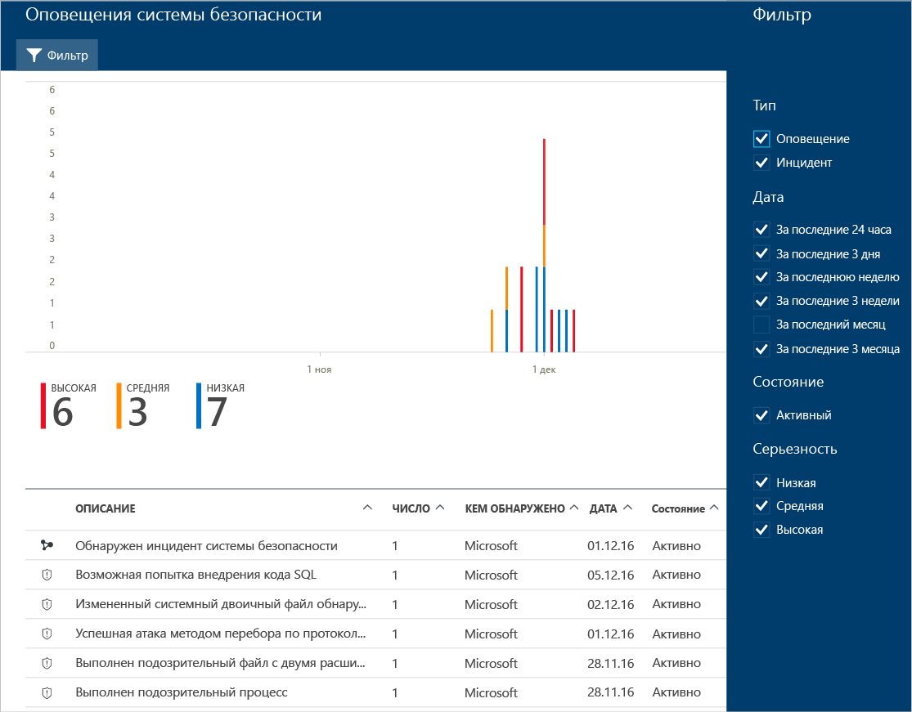

# Управление оповещениями безопасности в Центре безопасности Azure и реагирование на них
Этот документ помогает использовать возможности центра безопасности Azure для управления оповещениями безопасности и реагирования на них.

> [!NOTE]
> Чтобы включить расширенное обнаружение, выполните обновление до стандартного центра безопасности Azure. Бесплатный пробный период составляет 60 дней. Чтобы выполнить обновление, выберите ценовую категорию в [политике безопасности](security-center-policies.md). Дополнительные сведения см. на странице с [ценами центра безопасности Azure](security-center-pricing.md).
>
>

## Что такое оповещения системы безопасности?
Центр безопасности автоматически собирает, анализирует и объединяет данные журналов, поступающие от ресурсов Azure, сети и подключенных решений партнеров, таких как брандмауэры и решения для защиты конечных точек, для выявления реальных угроз и сокращения ложных срабатываний. Список приоритетных оповещений системы безопасности отображается в центре безопасности вместе с информацией, необходимой для быстрого анализа проблемы, и рекомендациями по устранению атаки.

> [!NOTE]
> Дополнительные сведения о способах обнаружения угроз в центре безопасности см. в статье [Возможности обнаружения центра безопасности Azure](security-center-detection-capabilities.md).
>
>

## Управление оповещениями системы безопасности
Текущие оповещения отображаются на плитке **Оповещения системы безопасности** . Выполните следующие действия, чтобы получить дополнительные сведения о каждом оповещении.

1. На панели мониторинга в центре безопасности вы увидите плитку **Оповещения безопасности**.

    

2. Щелкните эту плитку, чтобы открыть страницу **Оповещения безопасности** с дополнительными сведениями об оповещениях.

   

В нижней части этой страницы содержатся сведения для каждого оповещения. Чтобы отсортировать данные, щелкните соответствующий столбец. Ниже приводятся определения столбцов:

* **Описание** — краткое описание оповещения.
* **Число**— список всех оповещений определенного типа, обнаруженных в определенный день.
* **Обнаружено**— служба, отвечающая за активацию оповещения.
* **Дата**— дата возникновения события.
* **Состояние**— текущее состояние оповещения. Существует два типа состояний.
  * **Активно**— обнаружено оповещение системы безопасности.
* **Серьезность** — уровень серьезности. Может быть высоким, средним или низким.

> [!NOTE]
> Предупреждения системы безопасности, поступающие из центра безопасности, также отображаются в журнале действий Azure. Дополнительные сведения о доступе к журналу действий Azure см. в статье [Просмотр журналов действий для аудита действий с ресурсами](https://docs.microsoft.com/azure/azure-resource-manager/resource-group-audit).
>

### Фильтрация оповещений
Оповещения можно фильтровать по дате, состоянию и уровни серьезности. Фильтрация оповещений нужна в ситуациях, когда требуется сузить область просматриваемых оповещений системы безопасности. Например, вам может потребоваться проверить оповещения системы безопасности, возникшие за последние 24 часа, поскольку вы исследуете потенциальное нарушение безопасности в системе.

1. На странице **Оповещения безопасности** щелкните **Фильтр**. Откроется колонка **Фильтр**, в которой можно выбрать дату, состояние и уровень серьезности.

    

### Реагирование на оповещения системы безопасности
Выберите оповещение системы безопасности, чтобы получить дополнительные сведения о событиях, вызвавших оповещение, и (при необходимости) действиях, которые следует предпринять для устранения атаки. Оповещения системы безопасности группируются по типу и дате. Если щелкнуть оповещение системы безопасности, откроется страница, содержащая список сгруппированных оповещений.

В этом случае запущенные оповещения относятся к подозрительной активности протокола удаленного рабочего стола (RDP). В первом столбце показано, какие ресурсы подверглись атаке, во втором — количество атак на ресурс, в третьем — время атаки, в четвертом — состояние оповещения, а в пятом — уровень серьезности атаки. Ознакомьтесь с этими сведениями, а затем щелкните ресурс, подвергшийся атаке.

В поле **Описание** содержатся дополнительные сведения о событии. Эти дополнительные сведения содержат причину появления предупреждения системы безопасности, целевой ресурс, IP-адрес источника (если применимо) и рекомендации по устранению этой причины.  В некоторых случаях IP-адрес источника будет пустым (недоступным), так как не все журналы событий безопасности Windows включают IP-адрес.

Исправления, предлагаемые центром безопасности Azure, зависят от оповещения системы безопасности. В некоторых случаях для реализации рекомендуемого исправления могут потребоваться другие возможности Azure. Например, чтобы ликвидировать эту атаку, необходимо поместить в черный список IP-адрес, с которого исходит атака, с помощью [списка управления доступом в сети](../virtual-network/virtual-networks-acl.md) или правила [группы безопасности сети](../virtual-network/security-overview.md#security-rules). Дополнительные сведения о различных типах оповещений см. в статье [Типы оповещений системы безопасности в центре безопасности Azure](security-center-alerts-type.md).

> [!NOTE]
> Центр безопасности выпустил ограниченную предварительную версию нового набора обнаружений, которые используют записи аудита (общую платформу аудита), для обнаружения вредоносного поведения на компьютерах Linux. Отправьте [нам](mailto:ASC_linuxdetections@microsoft.com) электронное письмо с идентификаторами подписок, чтобы получить предварительную версию.

## См. также
В этом документе вы ознакомились с подробными сведениями о настройке политик безопасности в Центре безопасности. Дополнительные сведения о Центре безопасности см. в следующих статьях:

* [Обработка инцидентов в центре безопасности Azure](security-center-incident.md)
* [Возможности обнаружения центра безопасности Azure](security-center-detection-capabilities.md)
* [Руководство по планированию использования центра безопасности Azure и работе в нем](security-center-planning-and-operations-guide.md)
* [Центр безопасности Azure: часто задаваемые вопросы](security-center-faq.md) — часто задаваемые вопросы об использовании этой службы.
* [Блог по безопасности Azure](http://blogs.msdn.com/b/azuresecurity/) — публикации блога, посвященные безопасности и соответствию требованиям в Azure.
