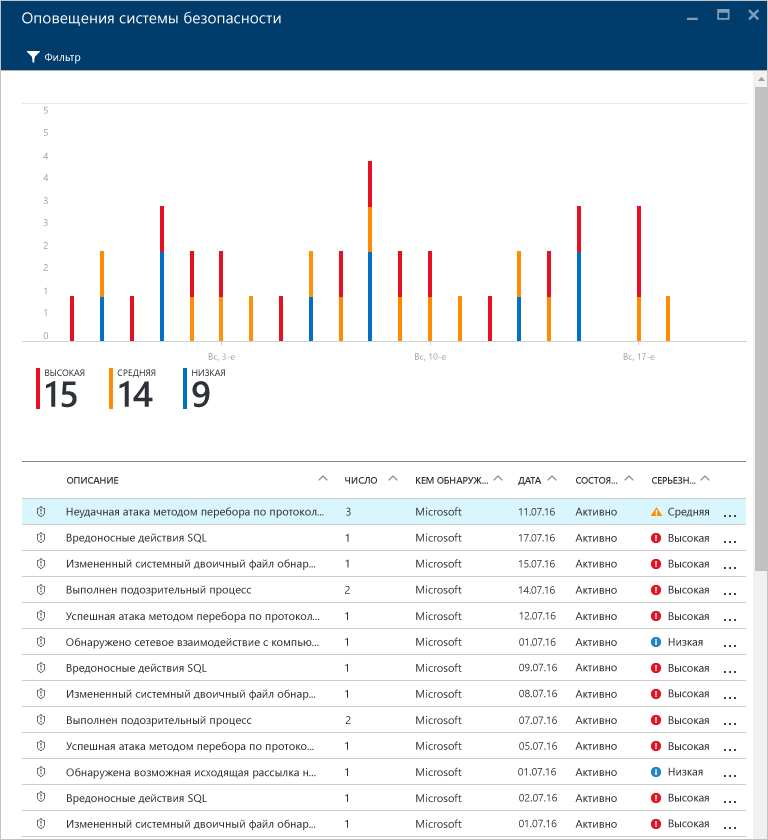
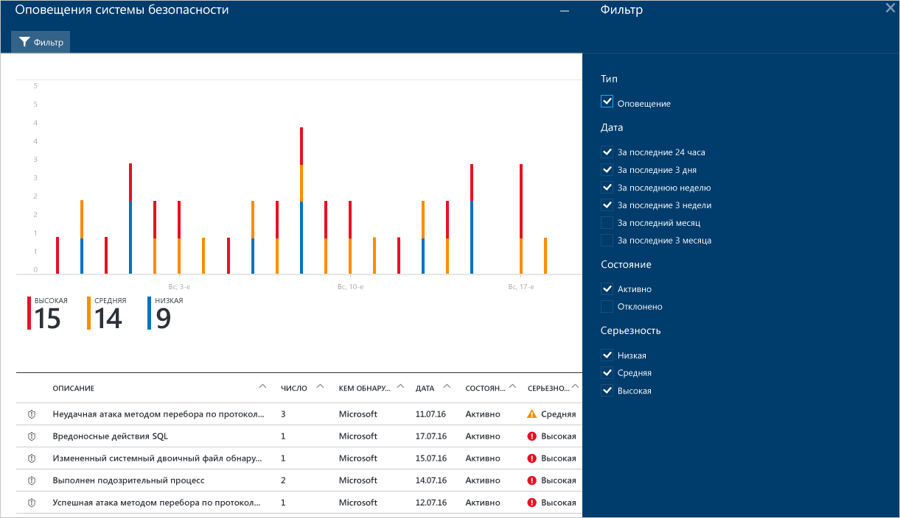
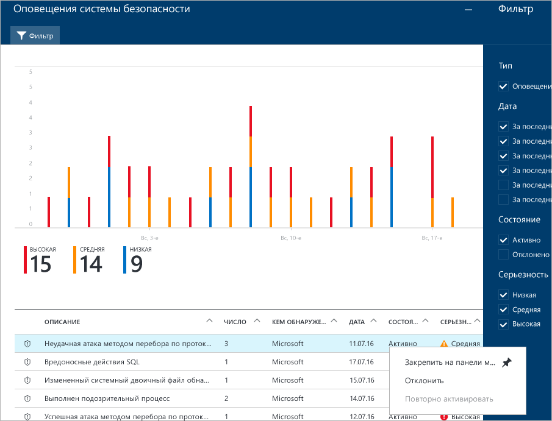
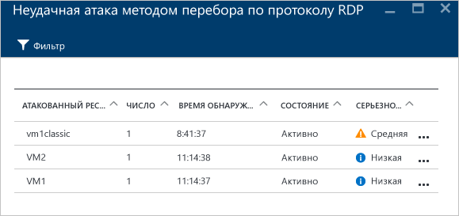
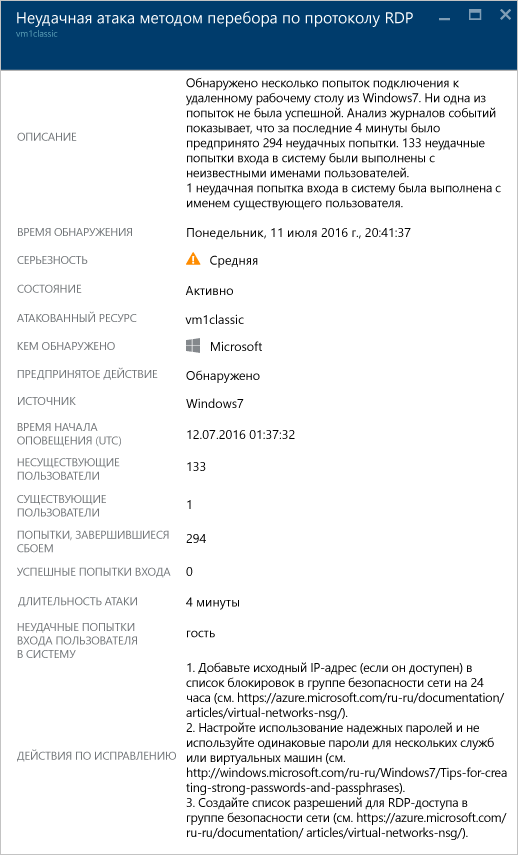

<properties
   pageTitle="Управление оповещениями безопасности в Центре безопасности Azure и реагирование на них | Microsoft Azure"
   description="Этот документ помогает использовать возможности Центра безопасности Azure для управления и реагирования на оповещения безопасности."
   services="security-center"
   documentationCenter="na"
   authors="YuriDio"
   manager="swadhwa"
   editor=""/>

<tags
   ms.service="security-center"
   ms.topic="hero-article"
   ms.devlang="na"
   ms.tgt_pltfrm="na"
   ms.workload="na"
   ms.date="09/19/2016"
   ms.author="yurid"/>

# Управление оповещениями безопасности в Центре безопасности Azure и реагирование на них
Этот документ помогает использовать возможности центра безопасности Azure для управления оповещениями безопасности и реагирования на них.

> [AZURE.NOTE] Чтобы включить расширенное обнаружение, выполните обновление до стандартного центра безопасности Azure. Бесплатный пробный период составляет 90 дней. Чтобы выполнить обновление, выберите ценовую категорию в [политике безопасности](security-center-policies.md). Дополнительные сведения см. на [странице с ценами](https://azure.microsoft.com/pricing/details/security-center/).

## Что такое оповещения системы безопасности?
Центр безопасности автоматически собирает, анализирует и объединяет данные журналов, поступающие от ресурсов Azure, сети и подключенных решений партнеров, таких как брандмауэры и решения для защиты конечных точек, для выявления реальных угроз и сокращения ложных срабатываний. Список приоритетных оповещений системы безопасности отображается в центре безопасности вместе с информацией, необходимой для быстрого анализа проблемы, и рекомендациями по устранению атаки. Центр безопасности Azure также собирает в разделе [Инциденты](security-center-incident.md) оповещения, направленные на удаление шаблонов цепочки.

> [AZURE.NOTE] Дополнительные сведения о способах обнаружения угроз в центре безопасности см. в статье [Возможности обнаружения центра безопасности Azure](security-center-detection-capabilities.md).

## Управление оповещениями системы безопасности

Текущие оповещения отображаются на плитке **Оповещения системы безопасности**. Чтобы просмотреть дополнительные сведения о каждом оповещении, откройте портал Azure и сделайте следующее:

1. В центре безопасности на панели мониторинга вы увидите плитку **Оповещения системы безопасности**.

    

2.  Щелкните эту плитку, чтобы открыть колонку **Оповещения системы безопасности** с дополнительными сведениями об оповещениях, как показано ниже.

    

В нижней части этой колонки содержатся сведения для каждого оповещения. Чтобы отсортировать данные, щелкните соответствующий столбец. Ниже приводятся определения столбцов:

- **Оповещение** — краткое описание оповещения.
- **Число** — список всех оповещений определенного типа, обнаруженных в определенный день.
- **Обнаружено** — служба, отвечающая за активацию оповещения.
- **Дата** — дата возникновения события.
- **Состояние** — текущее состояние оповещения. Существует два типа состояний.
    - **Активно** — обнаружено оповещение системы безопасности.
    - **Отклонено** — оповещение системы безопасности отклонено пользователем. Это состояние обычно используется для оповещений, которые были исследованы, однако не были признаны фактической атакой.

- **Серьезность** — уровень серьезности. Может быть высоким, средним или низким.

### Фильтрация оповещений

Оповещения можно фильтровать по дате, состоянию и уровни серьезности. Фильтрация оповещений нужна в ситуациях, когда требуется сузить область просматриваемых оповещений системы безопасности. Например, вам может потребоваться проверить оповещения системы безопасности, возникшие за последние 24 часа, поскольку вы исследуете потенциальное нарушение безопасности в системе.

1. В колонке **Оповещения системы безопасности** щелкните **Фильтр**. Откроется колонка **Фильтр**, в которой можно выбрать дату, состояние и уровень серьезности.

	

2. 	После анализа оповещения системы безопасности может выясниться, что оно ложно для вашей среды или указывает на ожидаемое поведение определенного ресурса. Как бы то ни было, если выяснилось, что оповещение системы безопасности неприменимо, вы можете отклонить его, а затем отфильтровать из представления. Оповещение системы безопасности можно отклонить двумя способами. Щелкните оповещение правой кнопкой мыши и выберите команду **Отклонить** или наведите указатель мыши на элемент, щелкните три точки справа, а затем выберите пункт **Отклонить**. Отклоненные оповещения системы безопасности можно просмотреть, щелкнув **Фильтр** и выбрав **Отклоненные**.

	

### Реагирование на оповещения системы безопасности

Выберите оповещение системы безопасности, чтобы получить дополнительные сведения о событиях, вызвавших оповещение, и (при необходимости) действиях, которые следует предпринять для устранения атаки. Оповещения системы безопасности группируются по типу и дате. Если щелкнуть оповещение системы безопасности, откроется колонка, содержащая список сгруппированных оповещений.

В этом случае запущенные оповещения относятся к подозрительной активности протокола удаленного рабочего стола (RDP). В первом столбце показано, какие ресурсы подверглись атаке, во втором — количество атак на ресурс, в третьем — время атаки, в четвертом — состояние оповещения, а в пятом — уровень серьезности атаки. Ознакомьтесь с этими сведениями, затем щелкните ресурс, подвергшийся атаке. Откроется новая колонка.

В этой колонке в поле **Описание** содержатся дополнительные сведения о событии. Эти дополнительные сведения содержат причину появления предупреждения системы безопасности, целевой ресурс, IP-адрес источника (если применимо) и рекомендации по устранению этой причины. В некоторых случаях IP-адрес источника будет пустым (недоступным), так как не все журналы событий безопасности Windows включают IP-адрес.

Исправления, предлагаемые Центром безопасности Azure, зависят от оповещения системы безопасности. В некоторых случаях для реализации рекомендуемого исправления могут потребоваться другие возможности Azure. Например, способ исправления для этой атаки — поместить в черный список IP-адрес, с которого исходит атака, с помощью [списка управления доступом к сети](../virtual-network/virtual-networks-acl.md) или правила [группы безопасности сети](../virtual-network/virtual-networks-nsg.md).

> [AZURE.NOTE] Дополнительные сведения о различных типах оповещений см. в статье [Типы оповещений системы безопасности в центре безопасности Azure](security-center-alerts-type.md).

## Дополнительные материалы

В этом документе вы ознакомились с подробными сведениями о настройке политик безопасности в Центре безопасности. Дополнительные сведения о Центре безопасности см. в следующих статьях:

- [Обработка инцидентов в центре безопасности Azure](security-center-incident.md)
- [Возможности обнаружения центра безопасности Azure](security-center-detection-capabilities.md)
- [Руководство по планированию использования центра безопасности Azure и работе в нем](security-center-planning-and-operations-guide.md)
- [Центр безопасности Azure: часто задаваемые вопросы](security-center-faq.md). Часто задаваемые вопросы об использовании этой службы.
- [Блог по безопасности Azure](http://blogs.msdn.com/b/azuresecurity/). Публикации блога, посвященные безопасности в Azure и соответствию требованиям.

<!---HONumber=AcomDC_0921_2016--->