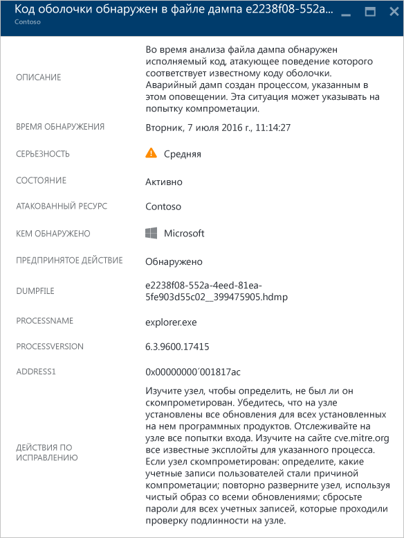
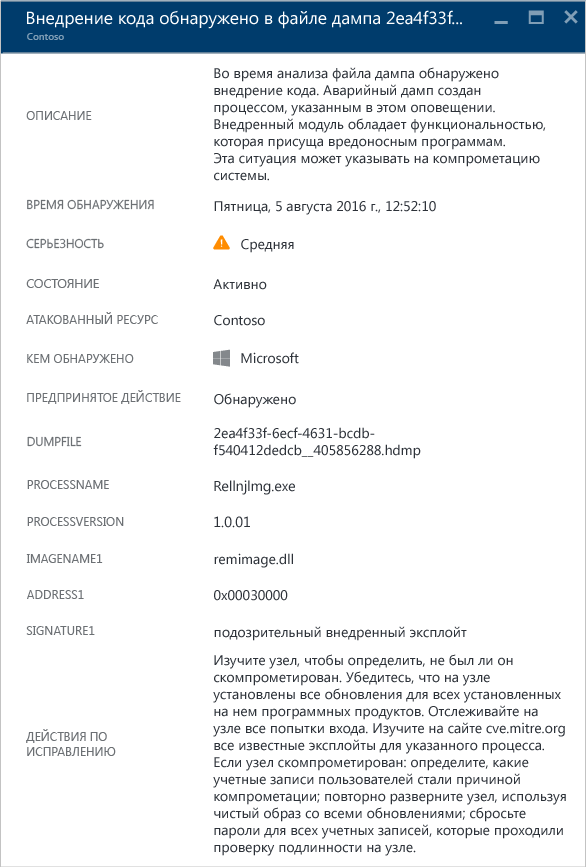
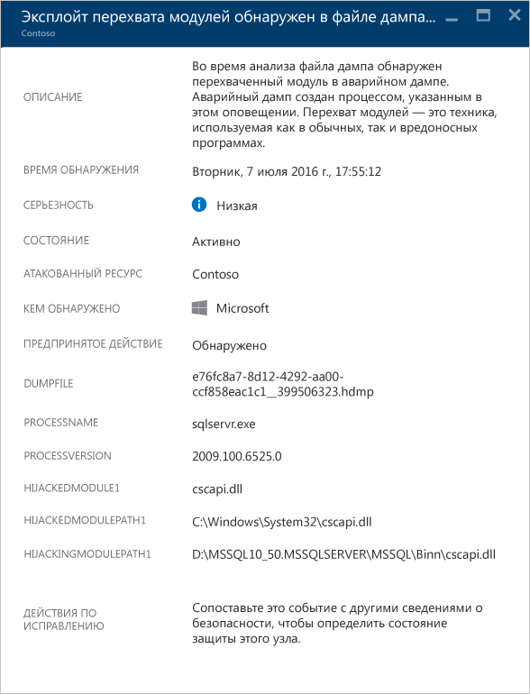
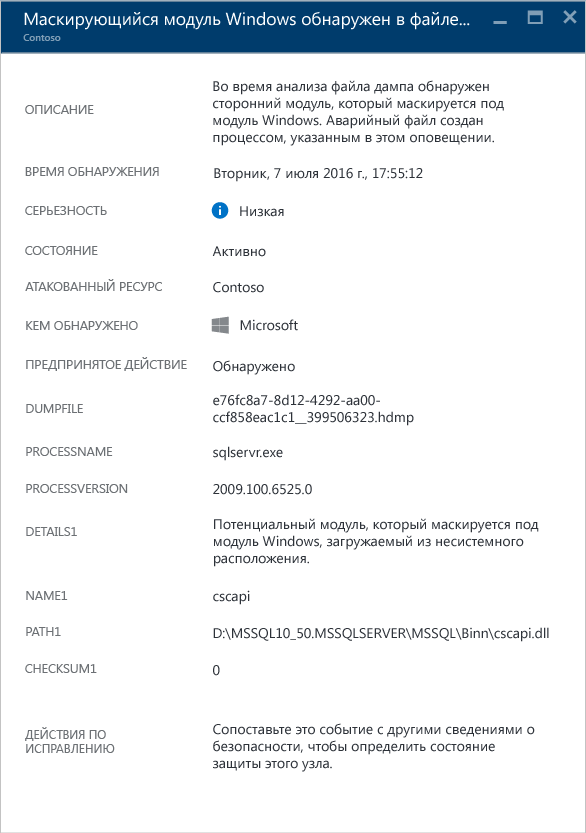
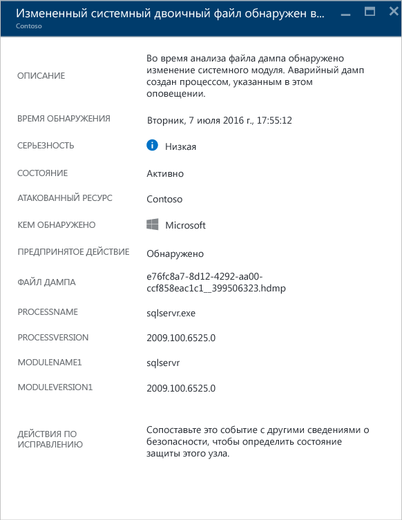

<properties
   pageTitle="Управление оповещениями безопасности в Центре безопасности Azure и реагирование на них | Microsoft Azure"
   description="Этот документ помогает использовать возможности Центра безопасности Azure для управления и реагирования на оповещения безопасности."
   services="security-center"
   documentationCenter="na"
   authors="YuriDio"
   manager="swadhwa"
   editor=""/>

<tags
   ms.service="security-center"
   ms.topic="hero-article"
   ms.devlang="na"
   ms.tgt_pltfrm="na"
   ms.workload="na"
   ms.date="08/26/2016"
   ms.author="yurid"/>

# Управление оповещениями безопасности в Центре безопасности Azure и реагирование на них
Этот документ помогает использовать возможности центра безопасности Azure для управления оповещениями безопасности и реагирования на них.

> [AZURE.NOTE] Чтобы включить расширенное обнаружение, выполните обновление до стандартного центра безопасности Azure. Бесплатный пробный период составляет 90 дней. Чтобы выполнить обновление, выберите ценовую категорию в [политике безопасности](security-center-policies.md). Дополнительные сведения см. на [странице с ценами](https://azure.microsoft.com/pricing/details/security-center/).

## Что такое оповещения системы безопасности?
Центр безопасности автоматически собирает, анализирует и объединяет данные журналов, поступающие от ресурсов Azure, сети и подключенных решений партнеров, таких как брандмауэры и решения для защиты конечных точек, для выявления реальных угроз и сокращения ложных срабатываний. Список приоритетных оповещений системы безопасности отображается в центре безопасности вместе с информацией, необходимой для быстрого анализа проблемы, и рекомендациями по устранению атаки. Центр безопасности Azure также собирает в разделе [Инциденты](security-center-incident.md) оповещения, направленные на удаление шаблонов цепочки.

> [AZURE.NOTE] Дополнительные сведения о способах обнаружения угроз в центре безопасности см. в статье [Возможности обнаружения центра безопасности Azure](security-center-detection-capabilities.md).

## Управление оповещениями системы безопасности

Текущие оповещения отображаются на плитке **Оповещения системы безопасности**. Чтобы просмотреть дополнительные сведения о каждом оповещении, откройте портал Azure и сделайте следующее:

1. В центре безопасности на панели мониторинга вы увидите плитку **Оповещения системы безопасности**.

    

2.  Щелкните эту плитку, чтобы открыть колонку **Оповещения системы безопасности** с дополнительными сведениями об оповещениях, как показано ниже.

    

В нижней части этой колонки содержатся сведения для каждого оповещения. Чтобы отсортировать данные, щелкните соответствующий столбец. Ниже приводятся определения столбцов:

- **Оповещение** — краткое описание оповещения.
- **Число** — список всех оповещений определенного типа, обнаруженных в определенный день.
- **Обнаружено** — служба, отвечающая за активацию оповещения.
- **Дата** — дата возникновения события.
- **Состояние** — текущее состояние оповещения. Существует два типа состояний.
    - **Активно** — обнаружено оповещение системы безопасности.
    - **Отклонено** — оповещение системы безопасности отклонено пользователем. Это состояние обычно используется для оповещений, которые были исследованы, однако не были признаны фактической атакой.

- **Серьезность** — уровень серьезности. Может быть высоким, средним или низким.

### Фильтрация оповещений

Оповещения можно фильтровать по дате, состоянию и уровни серьезности. Фильтрация оповещений нужна в ситуациях, когда требуется сузить область просматриваемых оповещений системы безопасности. Например, вам может потребоваться проверить оповещения системы безопасности, возникшие за последние 24 часа, поскольку вы исследуете потенциальное нарушение безопасности в системе.

1. В колонке **Оповещения системы безопасности** щелкните **Фильтр**. Откроется колонка **Фильтр**, в которой можно выбрать дату, состояние и уровень серьезности.

	

2. 	После анализа оповещения системы безопасности может выясниться, что оно ложно для вашей среды или указывает на ожидаемое поведение определенного ресурса. Как бы то ни было, если выяснилось, что оповещение системы безопасности неприменимо, вы можете отклонить его, а затем отфильтровать из представления. Оповещение системы безопасности можно отклонить двумя способами. Щелкните оповещение правой кнопкой мыши и выберите команду **Отклонить** или наведите указатель мыши на элемент, щелкните три точки справа, а затем выберите пункт **Отклонить**. Отклоненные оповещения системы безопасности можно просмотреть, щелкнув **Фильтр** и выбрав **Отклоненные**.

	

### Реагирование на оповещения системы безопасности

Выберите оповещение системы безопасности, чтобы получить дополнительные сведения о событиях, вызвавших оповещение, и (при необходимости) действиях, которые следует предпринять для устранения атаки. Оповещения системы безопасности группируются по типу и дате. Если щелкнуть оповещение системы безопасности, откроется колонка, содержащая список сгруппированных оповещений.

В этом случае запущенные оповещения относятся к подозрительной активности протокола удаленного рабочего стола (RDP). В первом столбце показано, какие ресурсы подверглись атаке, во втором — количество атак на ресурс, в третьем — время атаки, в четвертом — состояние оповещения, а в пятом — уровень серьезности атаки. Ознакомьтесь с этими сведениями, затем щелкните ресурс, подвергшийся атаке. Откроется новая колонка.

В этой колонке в поле **Описание** содержатся дополнительные сведения о событии. Эти дополнительные сведения содержат причину появления предупреждения системы безопасности, целевой ресурс, IP-адрес источника (если применимо) и рекомендации по устранению этой причины. В некоторых случаях IP-адрес источника будет пустым (недоступным), так как не все журналы событий безопасности Windows включают IP-адрес.

> [AZURE.NOTE] Исправления, предлагаемые Центром безопасности Azure, зависят от оповещения системы безопасности. В некоторых случаях для реализации рекомендуемого исправления могут потребоваться другие возможности Azure. Например, способ исправления для этой атаки — поместить в черный список IP-адрес, с которого исходит атака, с помощью [списка управления доступом к сети](../virtual-network/virtual-networks-acl.md) или правила [группы безопасности сети](../virtual-network/virtual-networks-nsg.md).

## Типы предупреждений безопасности
Действия, которые использовались для доступа к предупреждению о подозрительных действиях по протоколу удаленного рабочего стола, можно использовать и для доступа к предупреждениям другого типа. Ниже приведены некоторые примеры, оповещений, которые могут отображаться в оповещениях центра безопасности.

### Потенциальное внедрение кода SQL
Внедрение кода SQL — это атака, во время которой вредоносный код вставляется в строки, которые позже будут переданы на экземпляр SQL Server для анализа и выполнения. Все процедуры, создающие инструкции SQL, необходимо проверять на предмет уязвимости к внедрению, так как SQL Server выполняет все полученные запросы, являющиеся синтаксически правильными.

Это предупреждение содержит сведения, позволяющие идентифицировать атакуемый ресурс, время обнаружения и состояние атаки, а также ссылку на последующие этапы анализа инцидента.

### Обнаружение подозрительного исходящего трафика

Сетевые устройства можно обнаружить и профилировать так же, как и другие системы. Злоумышленники обычно начинают со сканирования или очистки портов. В следующем примере есть подозрительный трафик SSH с виртуальной машины, который может являться атакой методом подбора или очистки портов по протоколу SSH, направленной на внешний ресурс.

Это оповещение содержит информацию, которая позволяет определить ресурс, использованный для инициирования атаки, скомпрометированный компьютер, время обнаружения, а также использованные протокол и порт. Эта колонка также содержит список действий, которые помогут устранить проблему.

### Сетевое взаимодействие с вредоносным компьютером
 
Используя каналы Майкрософт для аналитики угроз, центр безопасности Azure может обнаружить скомпрометированные машины, которые взаимодействуют с вредоносными IP-адресами. В большинстве случаев этот компьютер является центром управления, отправляющим команды. В нашем примере центр безопасности Azure обнаружил, что обмен данными выполнялся с помощью вредоносной программы Pony Loader (также известной как [Fareit](https://www.microsoft.com/security/portal/threat/encyclopedia/entry.aspx?Name=PWS:Win32/Fareit.AF)).

Это оповещение содержит информацию, которая позволяет определить ресурс, использованный для инициирования атаки, атакованный ресурс, атакованный IP-адрес, атакующий IP-адрес и время обнаружения.

> [AZURE.NOTE] Настоящие IP-адреса удалены с этого снимка экрана в целях конфиденциальности.

### Обнаружение кода оболочки 

Код оболочки — это атакующий код, который выполняется, когда вредоносная программа воспользовалась уязвимостью программного обеспечения. Такое оповещение означает, что анализ с помощью аварийного дампа обнаружил исполняемый код, поведение которого типично для атакующих кодов вредоносных программ. Хотя невредоносная программа тоже может так себя вести, такое поведение нетипично для обычного программного обеспечения.

Следующие поля являются стандартными для всех оповещений аварийных дампов.

- Dumpfile (файл дампа) — имя файла аварийного дампа.
- Processname (имя процесса) — имя процесса, аварийно завершившего работу.
- Processversion (версия процесса) — версия процесса, аварийно завершившего работу.

Это оповещение содержит дополнительное поле:

- Address (адрес) — расположение кода оболочки в памяти.

Ниже приведен пример такого оповещения.

### Обнаружение внедрения кода

Внедрение кода — это вставка исполняемых модулей в выполняемые процессы или потоки. Вредоносные программы используют этот метод, чтобы получить доступ к данным, скрыть свое присутствие или избежать удаления. Такое оповещение означает, что анализ с помощью аварийного дампа обнаружил внедренный модуль.
 
Иногда разработчики подлинного программного обеспечения внедряют код без злого умысла. Например, они изменяют или расширяют существующее приложение или компонент операционной системы. Чтобы отличить вредоносные внедренные модули от нормальных, центр безопасности Azure проверяет, соответствует ли внедренный модуль профилю подозрительного поведения. В оповещении результат такой проверки отображается в поле Signature (подпись), а также отражается в уровне серьезности, описании оповещения и шагах по исправлению.

Кроме стандартных полей, описанных в разделе "Обнаружение кода оболочки", это оповещение содержит дополнительные поля.

- Address (адрес) — расположение внедренного модуля в памяти.
- Imagename (имя образа) — имя внедренного модуля. Обратите внимание, это поле может быть пустым, если для образа не указано имя.
- Signature (подпись) — указывает, соответствует ли внедренный модуль профилю подозрительного поведения. В следующей таблице показаны примеры результатов и их описание.

| **Значение подписи** | **Описание** |
|--------------------------------------|-------------------------------------------------------------------------------------------------------------------|
| Suspicious reflective loader exploit (подозрительная работа аналитического загрузчика) | Такое подозрительное поведение часто указывает на внедренный код загрузки независимо от загрузчика операционной системы. |
| Suspicious injected exploit (подозрение на внедренный эксплойт) | Указывает на вредоносное поведение, часто связанное с внедрением кода в память. |
| Suspicious injecting exploit (подозрение на внедрение эксплойта) | Указывает на вредоносное поведение, часто связанное с использованием внедренного в память кода. |
| Suspicious injected debugger exploit (подозрение на внедренный отладчик) | Указывает на вредоносное поведение, часто связанное с обнаружением или обходом отладчика. |
| Suspicious injected remote exploit (подозрение на удаленно внедренный эксплойт) | Указывает на вредоносное поведение, часто связанное со сценариями управления и контроля (C2). |

Ниже приведен пример такого оповещения.

### Обнаружение перехватов модулей

Windows использует библиотеки динамической компоновки (DLL) для предоставления программному обеспечению разрешения использовать стандартные функции системы Windows. Перехват DLL происходит, когда вредоносная программа изменяет порядок загрузки библиотек DLL, чтобы загрузить вредоносный атакующий код в память, где может выполняться произвольный код. Такое оповещение означает, что анализ с помощью аварийного дампа обнаружил, что два модуля с похожими именами загружаются из двух разных расположений. При этом один модуль хранится в стандартном расположении двоичных файлов системы Windows.

Разработчики подлинного программного обеспечения иногда изменяют порядок загрузки библиотек DLL без злого умысла, например для инструментирования, расширения возможностей операционной системы или приложений Windows. Чтобы отличить вредоносные изменения от потенциально неопасных изменений в порядке загрузки библиотек DLL, центр безопасности Azure проверяет, соответствуют ли загруженные модули подозрительному профилю. В оповещении результат такой проверки отображается в поле Signature (подпись), а также отражается в уровне серьезности, описании оповещения и шагах по исправлению. Анализ хранящейся на диске копии перехватывающего модуля (например, проверка цифровой подписи файлов или проверка на наличие вирусов) даст больше информации, которая поможет определить истинный характер перехватывающего модуля.

Кроме стандартных полей, описанных в разделе "Обнаружение кода оболочки", это оповещение содержит следующие поля:

- Signature (подпись) — указывает, соответствует ли перехватывающий модуль профилю подозрительного поведения.
- Hijackedmodule (перехваченный модуль) — имя перехваченного модуля системы Windows.
- Hijackedmodulepath (путь к перехваченному модулю) — путь к перехваченному модулю системы Windows.
- Hijackingmodulepath (путь к перехватывающему модулю) — путь к перехватывающему модулю.

Ниже приведен пример такого оповещения.

### Обнаружение маскирующихся модулей Windows

Вредоносные программы могут использовать стандартные имена двоичных файлов системы Windows (например, SVCHOST.EXE) или модули (например, NTDLL.DLLL), чтобы "смешаться в толпе" файлов и скрыть природу вредоносных программ от системных администраторов. Такое оповещение означает, что анализ с помощью аварийного дампа обнаружил, что файл дампа содержит модули, которые используют имена модулей системы Windows, но не отвечают другим критериям, характерным для модулей Windows. Анализ хранящейся на диске копии маскирующего модуля даст больше информации, которая поможет помочь определить истинный характер модуля. Анализ может состоять из таких этапов:

- Убедитесь, что рассматриваемый файл поставляется как часть пакета подлинного программного обеспечения.
- Проверьте цифровую подпись файла.
- Проверьте файл на наличие вирусов.

Кроме стандартных полей, описанных в разделе "Обнаружение кода оболочки", это оповещение содержит дополнительные поля.

- Details (подробные сведения) — указывает, допустимы ли метаданные модуля и был ли модуль загружен из системного расположения.
- Name (имя) — имя маскирующегося модуля Windows.
- Path (путь) — путь маскирующегося модуля Windows.

Оповещение также содержит некоторые поля из заголовка модуля PE, например Checksum (контрольная сумма) и Timestamp (метка времени). Эти поля отображаются, только если они присутствуют в модуле. Дополнительную информацию об этих полях см. в [спецификациях Microsoft PE и COFF](https://msdn.microsoft.com/windows/hardware/gg463119.aspx).

Ниже приведен пример такого оповещения.

### Обнаружение измененных системных двоичных файлов 

Вредоносные программы могут изменять основные системные двоичные файлы, чтобы получить скрытый доступ к данным или тайно храниться в поврежденной системе. Такое оповещение означает, что анализ с помощью аварийного дампа обнаружил, что базовые двоичные файлы ОС Windows изменены в памяти или на диске.

Разработчики подлинного программного обеспечения иногда изменяют системные модули в памяти без злого умысла, например для перенаправления или обеспечения совместимости приложений. Чтобы отличить вредоносные модули от потенциально неопасных, центр безопасности Azure проверяет, соответствуют ли измененные модули подозрительному профилю. Результат этой проверки отражается в уровне серьезности, описании оповещения и шагах по исправлению.

Кроме стандартных полей, описанных в разделе "Обнаружение кода оболочки", это оповещение содержит дополнительные поля.

- Modulename (имя модуля) — имя измененного системного двоичного файла.
- Moduleversion (версия модуля) — версия измененного системного двоичного файла.

Ниже приведен пример такого оповещения.

## См. также

В этом документе вы ознакомились с подробными сведениями о настройке политик безопасности в Центре безопасности. Дополнительные сведения о Центре безопасности см. в следующих статьях:

- [Обработка инцидентов в центре безопасности Azure](security-center-incident.md)
- [Возможности обнаружения центра безопасности Azure](security-center-detection-capabilities.md)
- [Руководство по планированию использования центра безопасности Azure и работе в нем](security-center-planning-and-operations-guide.md)
- [Центр безопасности Azure: часто задаваемые вопросы](security-center-faq.md). Часто задаваемые вопросы об использовании этой службы.
- [Блог по безопасности Azure](http://blogs.msdn.com/b/azuresecurity/). Публикации блога, посвященные безопасности в Azure и соответствию требованиям.

<!---HONumber=AcomDC_0831_2016-->