<properties
   pageTitle="Наблюдение за работоспособностью системы безопасности в Центре безопасности Azure | Microsoft Azure"
   description="Этот документ помогает вам начать работу с возможностями мониторинга в Центре безопасности Azure."
   services="security-center"
   documentationCenter="na"
   authors="YuriDio"
   manager="swadhwa"
   editor=""/>

<tags
   ms.service="security-center"
   ms.devlang="na"
   ms.topic="hero-article"
   ms.tgt_pltfrm="na"
   ms.workload="na"
   ms.date="09/22/2016"
   ms.author="yurid"/>

#Наблюдение за работоспособностью системы безопасности в Центре безопасности Azure
В статье описываются возможности мониторинга, доступные в Центре безопасности Azure для мониторинга соответствия политикам.

##Что такое наблюдение за работоспособностью системы безопасности?
Наблюдение часто определяется как отслеживание и ожидание возникновения события для реагирования на какую-либо ситуацию. Наблюдение за системой безопасности подразумевает наличие упреждающей стратегии аудита ресурсов для выявления систем, которые не соответствуют стандартам организации или рекомендациям.

##Наблюдение за работоспособностью системы безопасности
Когда вы включаете [политики безопасности](security-center-policies.md) для ресурсов в рамках подписки, центр безопасности проверяет состояние защиты ресурсов, чтобы определить потенциальные уязвимости. Хотя сведения о конфигурации сети становятся доступными сразу же, получение данных о конфигурации виртуальной машины, включая состояние обновления системы безопасности и конфигурации операционной системы, может занять больше часа. Сведения о состоянии безопасности ваших ресурсов, а также возникшие проблемы можно просмотреть в колонке **Работоспособность безопасности ресурсов**. Список таких проблем также можно просмотреть в колонке **Рекомендации**.

Дополнительные сведения о том, как применить рекомендации, см. в разделе [Реализация рекомендаций по безопасности в Центре безопасности Azure](security-center-recommendations.md).

Плитка **Resources security health** (Работоспособность безопасности ресурсов) позволяет отследить состояние защиты ресурсов. Ниже показан пример, когда выявлено несколько проблем с высоким и средним уровнем серьезности, на которые следует обратить внимание. Включенные политики безопасности будут влиять на типы элементов управления, которые отслеживаются.

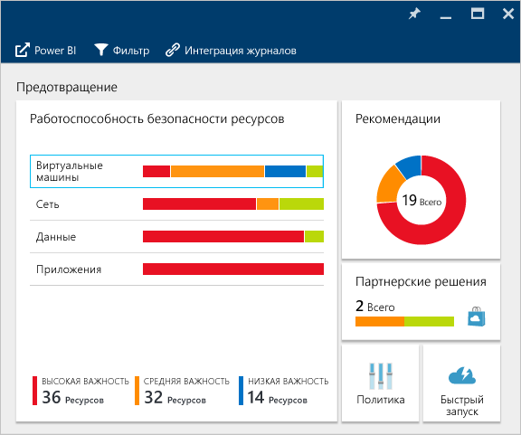

Если центр безопасности обнаружит уязвимость, которую необходимо устранить (например, на виртуальной машине отсутствуют обновления системы безопасности или для подсети не настроена [группа безопасности сети](../virtual-network/virtual-networks-nsg.md)), вы увидите эту информацию на плитке.

###Мониторинг работоспособности виртуальных машин
Если на плитке **Resources security health** (Работоспособность безопасности ресурсов) щелкнуть **Виртуальные машины**, откроется колонка **Виртуальные машины**. На ней представлены подробные сведения о подключении и защите, а также перечислены все виртуальные машины, отслеживаемые центром безопасности:

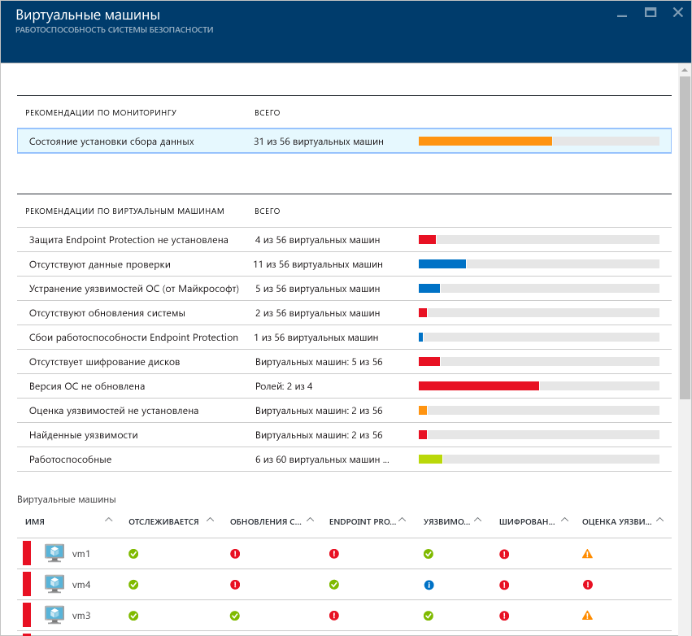

- Процесс внедрения
- Рекомендации по виртуальным машинам
- Виртуальные машины

В каждом разделе можно выбрать отдельный параметр, чтобы просмотреть подробные рекомендации по устранению выявленной проблемы. В следующих разделах они будут рассмотрены более подробно.

#### Мониторинг рекомендаций
В этом разделе указывается общее количество виртуальных машин, на которых инициализирован сбор данных, а также их текущее состояние. После инициализации сбора данных на всех виртуальных машинах можно настроить политики безопасности Центра безопасности. Если щелкнуть эту запись, откроется колонка **Data collection installation status** (Состояние инициализации сбора данных), в которой перечислены имена виртуальных машин. В столбце **СОСТОЯНИЕ ИНИЦИАЛИЗАЦИИ** отображено текущее состояние сбора данных, как показано ниже.

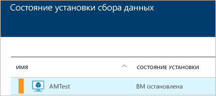

####Рекомендации по виртуальным машинам
В этом разделе приводятся [рекомендации по каждой виртуальной машине](security-center-virtual-machine-recommendations.md), отслеживаемой центром безопасности Azure. В первом столбце приводится описание проблемы (рекомендация), во втором — общее количество виртуальных машин, на которые эта проблема распространяется, а в третьем — степень серьезности проблемы:

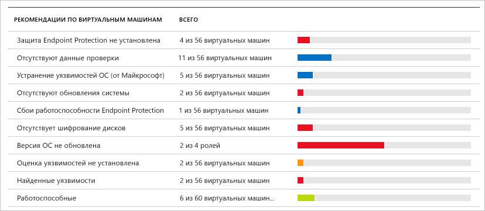

> [AZURE.NOTE] В колонке Networking Health (Работоспособность сети) в списке топологий сети отображаются только виртуальные машины минимум с одной общедоступной конечной точкой.

Каждая рекомендация включает набор действий, которые будут выполнены при ее выборе. Например, если щелкнуть рекомендацию **Отсутствуют обновления системы**, откроется колонка **Отсутствуют обновления системы**. В колонке перечислены виртуальные машины с отсутствующими исправлениями, а также указана важность этих обновлений:

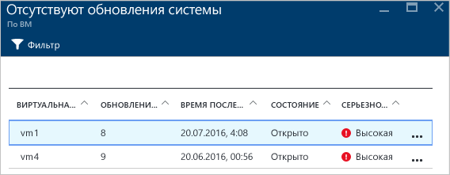

В колонке **Отсутствуют обновления системы** отображается таблица со следующими сведениями.

- **Виртуальная машина** — имя виртуальной машины, на которой отсутствуют обновления.
- **Обновления системы** — количество отсутствующих обновлений системы.
- **Время последнего сканирования** — время последней проверки виртуальной машины на наличие обновлений, выполненной Центром безопасности.
- **Состояние** — текущее состояние рекомендации:
	- **Открыто** — рекомендация еще не выполнена;
	- **Выполняется** — рекомендация уже применяется к соответствующим ресурсам, вам ничего не нужно делать;
	- **Устранено** — рекомендация выполнена (если проблема устранена, эта строка неактивна).
- **Серьезность**. Описание уровня серьезности конкретной рекомендации.
	- **Высокий** — уязвимость важных ресурсов (приложения, виртуальной машины, группы безопасности сети), которая требует внимания;
	- **Средний** — для завершения процесса или устранения уязвимости требуются второстепенные или дополнительные действия;
	- **Низкий** — уязвимость должна быть устранена, но не требует немедленного вмешательства. (По умолчанию рекомендации низкого уровня не отображаются, но вы можете отфильтровать их для просмотра.)

Чтобы просмотреть рекомендации более подробно, щелкните имя виртуальной машины. Для этой виртуальной машины откроется новая колонка со списком обновлений:

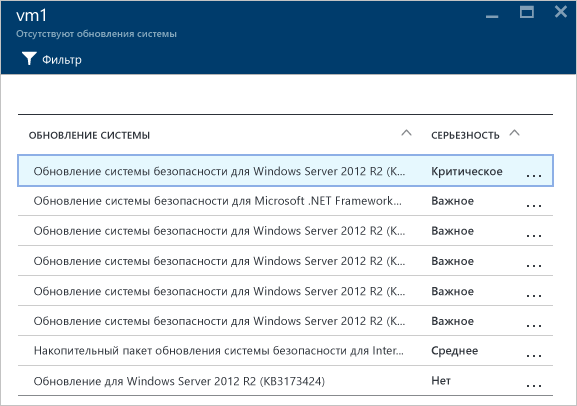

> [AZURE.NOTE] Приведенные здесь рекомендации по безопасности совпадают с указанными в колонке "Рекомендации". Дополнительные сведения о применении рекомендаций см. в разделе [Реализация рекомендаций по безопасности в Центре безопасности Azure](security-center-recommendations.md). Это относится не только к виртуальным машинам, но и ко всем ресурсам, доступным на плитке "Работоспособность ресурса".

####Раздел "Виртуальные машины"
В разделе "Виртуальные машины" содержатся общие сведения обо всех виртуальных машинах, а также рекомендации. В каждом столбце представлен один набор рекомендаций:

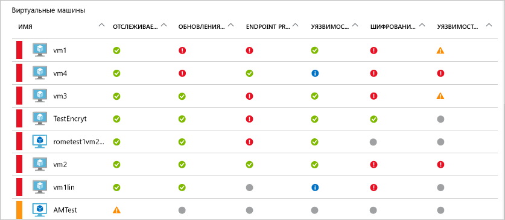

Под каждым таким набором отображается значок. Он указывает на тип рекомендации, которая связана с конкретной виртуальной машиной.

В приведенном выше примере для одной из виртуальных машин дана критическая рекомендация в отношении защиты конечных точек. Чтобы получить дополнительные сведения о виртуальной машине, щелкните ее. Откроется новая колонка с данными:

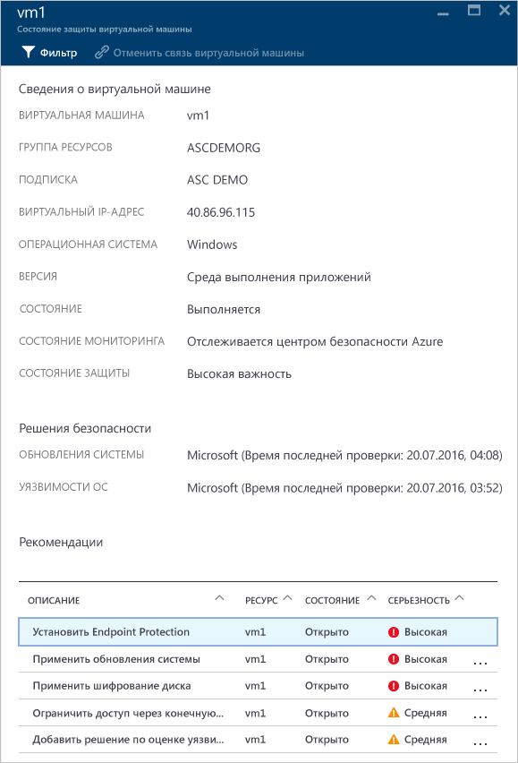

В этой колонке вы найдете сведения о безопасности виртуальной машины. В нижней части колонки указаны рекомендуемые действия и уровень серьезности для каждой проблемы.

#### Раздел облачных служб (предварительный просмотр)
Состояние работоспособности облачных служб включено в элемент работоспособности системы безопасности виртуальных машин. Если версия операционной системы устарела, создается рекомендация, как показано ниже.

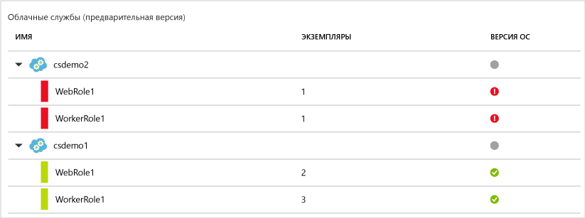

Чтобы обновить версию ОС, необходимо выполнить действия, приведенные в рекомендации. Например, если в одной из веб-ролей или рабочих ролей (сервер Windows запускается с автоматическим развертыванием вашего веб-приложения на IIS) щелкнуть предупреждение красного цвета, откроется новая колонка с более подробными сведениями об этой рекомендации, как показано ниже.

Чтобы просмотреть более подробные указания, касающиеся рекомендации, щелкните Update **OS version** (Обновить версию ОС) в столбце **ОПИСАНИЕ**. Откроется вкладка **Update OS version (Preview)** (Обновление версии ОС (предварительный просмотр)) с более подробными сведениями.

### Мониторинг виртуальных сетей
Если в элементе **Resources security health** (Работоспособность системы защиты ресурсов) щелкнуть **Сеть**, откроется колонка **Сеть** с дополнительными сведениями, как показано ниже.

####Рекомендации по сети

Как и в разделе со сведениями о работоспособности ресурсов виртуальных машин, в этой колонке (вверху) содержится сводный список проблем, а также (внизу) — список отслеживаемых сетей.

В разделе подробных сведений о состоянии сети перечисляются потенциальные проблемы безопасности и предлагаются [рекомендации](security-center-network-recommendations.md) по их устранению. Потенциальные проблемы могут включать следующее.

- Не установлен брандмауэр следующего поколения (NGFW).
- В подсетях не включены группы безопасности сети (NSG).
- На виртуальных машинах не включены NSG.
- Ограничен доступ через общедоступные внешние конечные точки.
- Исправные подключенные к Интернету конечные точки.

Если вы щелкнете одну из этих рекомендаций в новой колонке, откроется новая вкладка с подробными сведениями:

В этом примере в колонке **Настроить отсутствующие группы безопасности сети для подсетей** содержится список подсетей и виртуальных машин, не защищенных с помощью группы NSG. Щелкните подсеть, к которой нужно применить NSG. После этого откроется другая колонка.

В колонке **Выбрать группу безопасности сети** выберите самую подходящую группу безопасности сети для подсети или создайте новую.

####Раздел с подключенными к Интернету конечными точками

В разделе **Конечные веб-точки** можно просмотреть виртуальные машины, для которых уже настроена подключенная к Интернету конечная точка, а также ее текущее состояние.

Эта таблица содержит имя конечной точки, которая представляет виртуальную машину, IP-адрес для подключения к Интернету, а также текущее состояние серьезности NSG и NGFW. Эта таблица отсортирована по степени серьезности, как описано ниже:
- красный цвет (вверху) — высокий приоритет, проблему следует решить немедленно;
- оранжевый цвет — средний приоритет, проблему следует решить как можно скорее;
- оранжевый цвет (внизу) — работоспособное состояние.

####Раздел с топологией сети

В разделе **Топология сетей** отображается иерархическое представление ресурсов, как показано ниже.

Эта таблица (виртуальных машин и подсетей) отсортирована по серьезности в соответствии с описанием ниже:
- красный цвет (вверху) — высокий приоритет, проблему следует решить немедленно;
- оранжевый цвет — средний приоритет, проблему следует решить как можно скорее;
- оранжевый цвет (внизу) — работоспособное состояние.

К первому уровню этого представления топологии относятся [виртуальные сети](../virtual-network/virtual-networks-overview.md), [шлюзы виртуальных сетей](../vpn-gateway/vpn-gateway-site-to-site-create.md) и [виртуальная сеть (классическая)](../virtual-network/virtual-networks-create-vnet-classic-pportal.md). На втором уровне находятся подсети, а на третьем — виртуальные машины, которые принадлежат к этим подсетям. В правом столбце отображается текущее состояние NSG для этих ресурсов, как показано в следующем примере.

В нижней части колонки приводятся рекомендации для этой виртуальной машины, как описано выше. Можно щелкнуть рекомендацию, чтобы получить дополнительные сведения, или применить необходимый элемент управления безопасности или нужную конфигурацию.

###Данные мониторинга
Если на плитке **Resources security health** (Работоспособность безопасности ресурсов) щелкнуть **Данные**, откроется колонка **SQL**. Она содержит рекомендации по решению таких проблем, как отключенный аудит и отключенное прозрачное шифрование данных. Она также содержит [рекомендации](security-center-sql-service-recommendations.md), касающиеся общего состояния работоспособности базы данных.

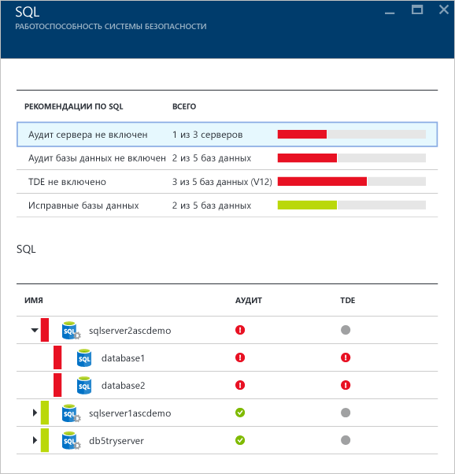

Вы можете щелкнуть любую из этих рекомендаций, чтобы получить дополнительные сведения о дальнейших действиях по устранению проблемы. В приведенном ниже примере показана развернутая рекомендация **Аудит базы данных не включен**.

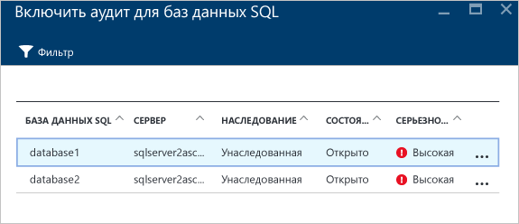

Колонка **Включить аудит для баз данных SQL** содержит следующую информацию:

- список баз данных SQL;
- сервер, на котором они размещены;
- сведения о том, унаследована ли эта настройка от сервера или она является уникальной для базы данных;
- текущее состояние проблемы;
- степень серьезности проблемы.

Если вы щелкнете базу данных, чтобы выполнить рекомендацию, откроется колонка **Аудит и обнаружение угроз**, как показано ниже.

Чтобы включить аудит, просто переведите переключатель для параметра **Аудит** в положение **ВКЛ.**

### Мониторинг приложений

Если рабочая нагрузка Azure включает в себя приложения, расположенные на [виртуальных машинах Resource Manager](../resource-manager-deployment-model.md) с открытыми веб-портами (TCP-порты 80 и 443), центр безопасности может отслеживать эти приложения для выявления потенциальных проблем безопасности и предлагать шаги по их устранению. Если щелкнуть плитку **Приложения**, откроется колонка **Приложения**. Она содержит раздел с рекомендациями по предотвращению проблем. Здесь также содержатся сведения о приложениях с разбивкой по узлам или виртуальным IP-адресам:

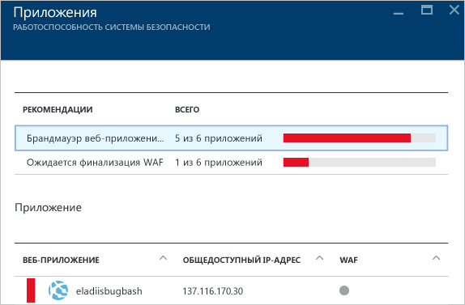

Как и прежде, вы можете просмотреть дополнительные сведения о проблеме и способах ее устранения, щелкнув нужную рекомендацию. Ниже представлен пример с приложением, которое определено как небезопасное веб-приложение. При выборе приложения, которое было признано небезопасным, открывается другая колонка со следующим доступным параметром:

В этой колонке содержится список всех рекомендаций для этого приложения. Если вы щелкнете рекомендацию **Добавление брандмауэра веб-приложения**, откроется колонка **Добавление брандмауэра веб-приложения** с вариантами установки стороннего брандмауэра веб-приложения (WAF), как показано ниже.

## См. также
В этом документе вы ознакомились с подробными сведениями о возможностях мониторинга в Центре безопасности Azure. Дополнительные сведения о Центре безопасности Azure см. в следующих статьях:

- [Настройка политик безопасности в Центре безопасности Azure](security-center-policies.md) — узнайте, как настроить параметры безопасности в Центре безопасности Azure.
- [Управление оповещениями безопасности в центре безопасности Azure и реагирование на них](security-center-managing-and-responding-alerts.md). Узнайте, как управлять оповещениями системы безопасности и реагировать на них.
- [Мониторинг решений партнеров с помощью центра безопасности Azure](security-center-partner-solutions.md). Узнайте, как отслеживать работоспособность партнерских решений.
- [Центр безопасности Azure: часто задаваемые вопросы](security-center-faq.md). Часто задаваемые вопросы об использовании этой службы.
- [Блог по безопасности Azure](http://blogs.msdn.com/b/azuresecurity/). Записи блога, посвященные безопасности и соответствию требованиям в Azure.

<!---HONumber=AcomDC_0928_2016-->