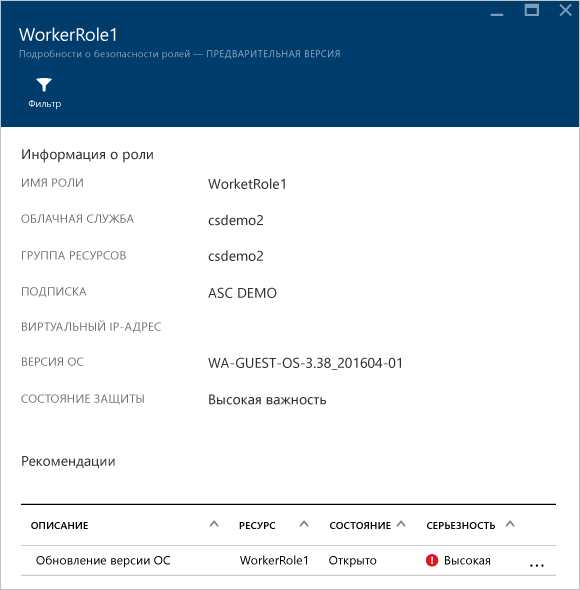
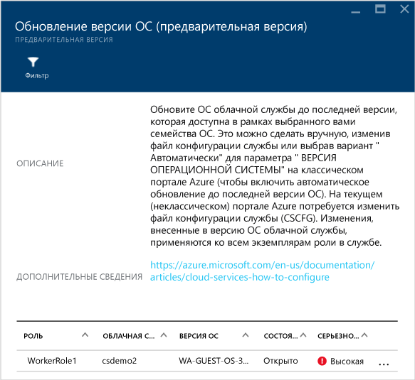
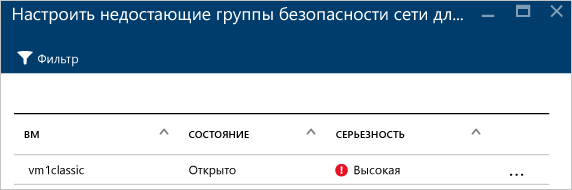
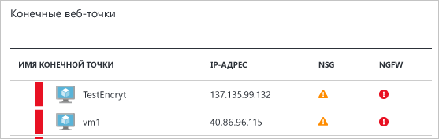
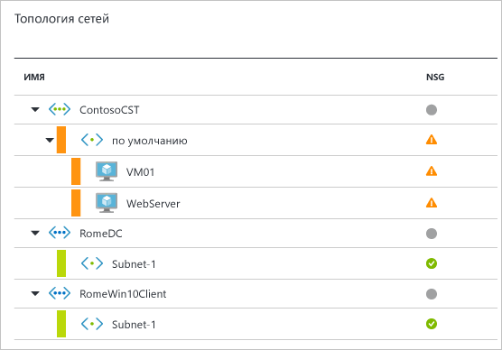
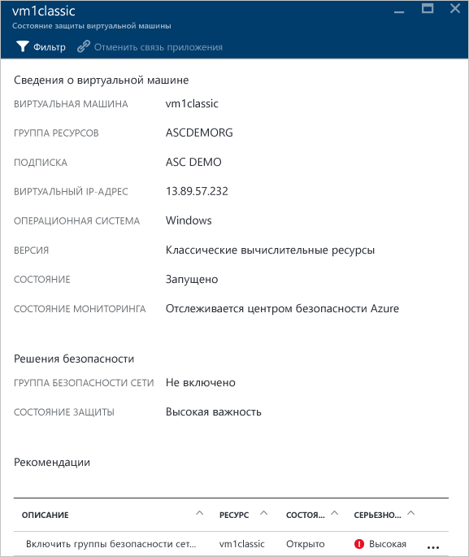
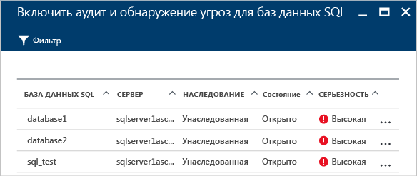
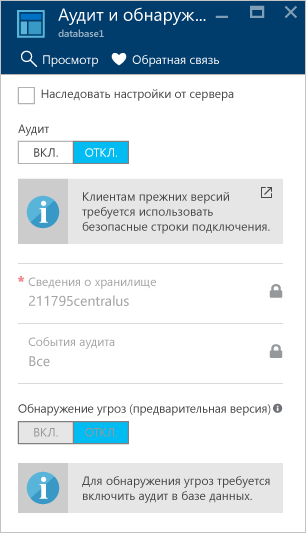
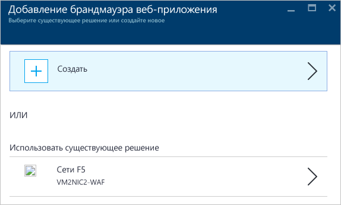

# Наблюдение за работоспособностью системы безопасности в Центре безопасности Azure
В этой статье описываются возможности мониторинга, доступные в центре безопасности Azure для наблюдения за соответствием политикам.

## Что такое наблюдение за работоспособностью системы безопасности?
Наблюдение часто определяется как отслеживание и ожидание возникновения события для реагирования на какую-либо ситуацию. Наблюдение за системой безопасности подразумевает наличие упреждающей стратегии аудита ресурсов для выявления систем, которые не соответствуют стандартам организации или рекомендациям.

## Наблюдение за работоспособностью системы безопасности
Когда вы включаете [политики безопасности](security-center-policies.md) для ресурсов в рамках подписки, центр безопасности проверяет состояние защиты ресурсов, чтобы определить потенциальные уязвимости. Хотя сведения о конфигурации сети становятся доступными сразу же, Сбор информации о конфигурации виртуальных машин и компьютеров, включая сведения о состоянии обновления системы безопасности и конфигурации операционной системы, может длиться час или дольше. Время выполнения операции зависит от числа виртуальных машин и компьютеров, установленных на агенте. Сведения о состоянии безопасности ваших ресурсов, а также возникшие проблемы можно просмотреть в разделе **Предотвращение**. Список таких проблем также можно просмотреть на плитке **Рекомендации**.

Дополнительные сведения о том, как применить рекомендации, см. в разделе [Внедрение рекомендаций по безопасности](security-center-recommendations.md).

Сведения о состоянии безопасности ресурсов можно просмотреть в разделе **Предотвращение**. В следующем примере можно увидеть, что на плитке каждого ресурса ("Вычисления", "Сети", Storage & Data (Хранилище и данные) и "Приложение") отображается общее количество обнаруженных проблем.

### Отслеживание работы вычислительных ресурсов
Если нажать кнопку **Вычисления**, появятся три вкладки:

- **Обзор** — содержит мониторинг и рекомендации.
- **Виртуальные машины и компьютеры** — содержит список всех виртуальных машин и компьютеров и их текущее состояние защиты.
- **Облачные службы** — содержит список веб-ролей и рабочих ролей, отслеживаемых с помощью центра безопасности.

На каждой вкладке может находиться несколько разделов, и в каждом разделе можно выбрать соответствующий параметр, чтобы просмотреть подробные рекомендации по устранению выявленной проблемы.

#### Мониторинг рекомендаций
В этом разделе указывается общее число виртуальных машин и компьютеров, на которых инициализирована автоматическая подготовка, а также их текущее состояние. В этом примере доступна одна рекомендация — **Проблемы с мониторингом работоспособности агентов**.  Выберите эту рекомендацию.

Откроется окно **Проблемы мониторинга работоспособности агентов**. Здесь перечислены виртуальные машины и компьютеры, для которых центру безопасности не удается выполнить мониторинг. Выберите виртуальную машину или компьютер, чтобы получить подробные сведения. **Состояние мониторинга** описывает причину, по которой центр безопасности недоступен для отслеживания. Список значений, описаний и шагов по устранению проблем, связанных с **состоянием мониторинга**, см. в [руководстве по устранению неполадок с центром безопасности](security-center-troubleshooting-guide.md#monitoring-agent-health-issues).

#### Рекомендации
В этом разделе приводятся [рекомендации по каждой виртуальной машине и компьютеру](security-center-virtual-machine-recommendations.md), которые отслеживает центр безопасности Azure. В первом столбце приводится описание проблемы (рекомендация), во втором — общее число виртуальных машин и компьютеров, на которые эта проблема распространяется, а в третьем — степень серьезности проблемы, как показано на снимке экрана ниже.

> [!NOTE]
> В колонке **Работоспособность сети** в списке **топологий сети** отображаются виртуальные машины, у которых есть как минимум одна общедоступная конечная точка.
>

Каждая рекомендация включает в себя набор действий, которые могут быть выполнены при ее выборе. Например, если щелкнуть рекомендацию **Отсутствуют обновления системы**, откроется список виртуальных машин и компьютеров, для которых отсутствуют обновления. Также отобразятся сведения об уровне серьезности отсутствующих обновлений, как показано на следующем снимке экрана:

Рекомендация **Отсутствуют обновления системы** содержит сводку критических обновлений в графическом формате для Windows и для Linux. Вторая часть содержит таблицу со следующими сведениями:

* **Имя** — имя отсутствующего обновления.
* **Число виртуальных машин и компьютеров** — общее число виртуальных машин и компьютеров, на которых отсутствуют это обновление.
* **Состояние**— текущее состояние рекомендации:
  * **Открыто**— рекомендация еще не выполнена;
  * **Выполняется** — сейчас рекомендация применяется к ресурсам (от вас не требуется никаких действий);
  * **Разрешено** — рекомендация уже применена (после устранения проблемы запись становится недоступной).
* **Серьезность**— описание уровня серьезности конкретной рекомендации.
  * **Высокий**— уязвимость важных ресурсов (приложения, виртуальной машины, группы безопасности сети), которая требует внимания;
  * **Средний**— для завершения процесса или устранения уязвимости требуются второстепенные или дополнительные действия;
  * **Низкий**— уязвимость должна быть устранена, но не требует немедленного вмешательства. (По умолчанию рекомендации низкого уровня не отображаются, но вы можете отфильтровать их для просмотра.)

Чтобы просмотреть подробные рекомендации, щелкните имя отсутствующего обновления в списке.

> [!NOTE]
> Приведенные здесь рекомендации по безопасности совпадают с указанными в параметре **Рекомендации**. Дополнительные сведения о том, как применить рекомендации, см. в разделе [Внедрение рекомендаций по безопасности](security-center-recommendations.md). Это относится не только к виртуальным машинам и компьютерам, но и ко всем ресурсам, доступным на плитке **Работоспособность ресурсов**.
>

#### Неотслеживаемые виртуальные машины
Виртуальная машина не отслеживается центром безопасности, если на ней не запущено расширение Microsoft Monitoring Agent. На виртуальной машине может быть установлен локальный агент, например прямой агент OMS или агент SCOM. Виртуальные машины с этими агентами определены как неотслеживаемые, так как эти агенты не полностью поддерживаются в центре безопасности. Чтобы использовать все преимущества центра безопасности, требуется расширение Microsoft Monitoring Agent.

Вы можете установить это расширение на виртуальной машине, которая не отслеживается, в дополнение к уже установленному локальному агенту. Настройте оба агента, подключив их к одному рабочему пространству. Так центр безопасности может взаимодействовать с расширением Microsoft Monitoring Agent и собирать данные.  Дополнительные сведения о том, как установить расширение Microsoft Monitoring Agent, см. в разделе [Включение расширения виртуальной машины Log Analytics](../log-analytics/log-analytics-quick-collect-azurevm.md#enable-the-log-analytics-vm-extension).

Чтобы узнать о причинах, по которым центру безопасности не удалось выполнить мониторинг виртуальных машин и компьютеров, инициализированных для автоматической подготовки, см. раздел [Проблемы с работоспособностью агента мониторинга](security-center-troubleshooting-guide.md#monitoring-agent-health-issues).

#### Раздел "Виртуальные машины и компьютеры"
Раздел "Виртуальные машины и компьютеры" содержит общие сведения обо всех виртуальных машинах и компьютерах, а также рекомендации. В каждом столбце представлен один набор рекомендаций, как показано на следующем снимке экрана.

В этом списке представлены четыре типа значков:

 Компьютер, который не относится к Azure.

 Виртуальная машина, развернутая с помощью модели Azure Resource Manager.

 Виртуальная машина, развернутая с помощью классической модели Azure.

 Виртуальные машины, которые идентифицируются только из рабочей области, которая является частью просматриваемой подписки. Сюда относятся виртуальные машины из других подписок, которые отправляют отчеты в рабочую область в этой подписке, и виртуальные машины без идентификатора ресурса, которые установлены с помощью прямого агента SCOM.

Под каждым таким набором отображается значок. Он указывает на виртуальную машину или компьютер, на которые следует обратить внимание, и содержит тип рекомендации. Можно также использовать параметр **Фильтр**, чтобы выбрать параметры для отображения на экране.

В приведенном выше примере для одной из виртуальных машин дана критическая рекомендация в отношении защиты конечных точек. Чтобы просмотреть подробные сведения о виртуальной машине, щелкните ее:

Здесь отображаются сведения о состоянии защиты виртуальной машины или компьютера. В нижней части указаны рекомендуемые действия и уровень серьезности для каждой проблемы.

#### Раздел "Облачные службы"
Рекомендация создается для облачных служб, если версия операционной системы устарела, как показано на следующем снимке экрана:

Чтобы обновить версию операционной системы, необходимо выполнить действия, приведенные в рекомендации (которые не касаются предыдущего примера). Если обновление будет доступно, вы получите предупреждение (оранжевого или красного цвета, в зависимости от степени серьезности проблемы). Если в веб-роли WebRole1 или рабочей роли WorkerRole1 (сервер Windows запускается с автоматическим развертыванием вашего веб-приложения на IIS) щелкнуть предупреждение, отобразятся подробные сведения об этой рекомендации, как показано на следующем снимке экрана:

Чтобы просмотреть более подробные указания, касающиеся рекомендации, щелкните **Обновление версии ОС** в столбце **Описание**.

  

### Мониторинг виртуальных сетей
Если щелкнуть плитку **Сеть**, откроется колонка **Сеть** с дополнительными сведениями, как показано на снимке экрана ниже.

#### Рекомендации по сети
Как и в разделе со сведениями о работоспособности ресурсов виртуальных машин, здесь содержится сводный список проблем (вверху), а также список отслеживаемых сетей (внизу).

В разделе подробных сведений о состоянии сети перечисляются потенциальные проблемы безопасности и предлагаются [рекомендации](security-center-network-recommendations.md)по их устранению. Потенциальные проблемы могут включать следующее.

* Не установлен брандмауэр следующего поколения.
* В подсетях не включены группы безопасности сети.
* В виртуальных машинах не включены группы безопасности сети.
* Ограничен доступ через общедоступные внешние конечные точки.
* Исправные конечные точки, подключенные к Интернету.

Если щелкнуть рекомендацию, отобразятся подробные сведения об этой рекомендации, как показано на снимке экрана ниже:

В этом примере в рекомендации **Настроить отсутствующие группы безопасности сети для подсетей** содержится список подсетей и виртуальных машин, не защищенных с помощью группы безопасности сети. Если щелкнуть подсеть, к которой нужно применить группу безопасности сети, появится колонка **Выбрать группу безопасности сети**. Здесь можно выбрать самую подходящую группу безопасности сети для подсети или создать новую.

#### Раздел с подключенными к Интернету конечными точками
В разделе **Конечные веб-точки** можно просмотреть виртуальные машины, для которых уже настроена подключенная к Интернету конечная точка, а также ее текущее состояние.

Эта таблица содержит имя конечной точки, которая представляет виртуальную машину, IP-адрес для подключения к Интернету, а также текущее состояние серьезности группы безопасности сети и брандмауэра следующего поколения. Эта таблица отсортирована по степени серьезности:

* красный цвет (вверху) — высокий приоритет, проблему следует решить немедленно;
* оранжевый цвет — средний приоритет, проблему следует решить как можно скорее;
* зеленый цвет (внизу) — работоспособное состояние.

#### Раздел с топологией сети
В разделе **Топология сетей** отображается иерархическое представление ресурсов, как показано на снимке экрана ниже.

Эта таблица (виртуальных машин и подсетей) отсортирована по степени серьезности:

* красный цвет (вверху) — высокий приоритет, проблему следует решить немедленно;
* оранжевый цвет — средний приоритет, проблему следует решить как можно скорее;
* зеленый цвет (внизу) — работоспособное состояние.

К первому уровню этого представления топологии относятся [виртуальные сети](../virtual-network/virtual-networks-overview.md), [шлюзы виртуальных сетей](/vpn-gateway/vpn-gateway-site-to-site-create.md) и [виртуальная сеть (классическая)](/virtual-network/virtual-networks-create-vnet-classic-pportal.md). На втором уровне находятся подсети, а на третьем — виртуальные машины, которые принадлежат к этим подсетям. В правом столбце отображается текущее состояние группы безопасности сети для этих ресурсов, как показано в следующем примере.

В нижней части колонки приводятся рекомендации для этой виртуальной машины, как описано выше. Можно щелкнуть рекомендацию, чтобы получить дополнительные сведения, или применить необходимый элемент управления безопасности или нужную конфигурацию.

### Мониторинг хранилища и данных

Если щелкнуть **Хранилище и данные** в разделе **Предотвращение**, откроется колонка **Ресурсы данных** с рекомендациями по SQL и хранилищу. Она также содержит [рекомендации](security-center-sql-service-recommendations.md), касающиеся общего состояния работоспособности базы данных. Дополнительные сведения о шифровании хранилищ см. в статье [Enable encryption for Azure storage account in Azure Security Center](security-center-enable-encryption-for-storage-account.md) (Включение шифрования для учетной записи хранения Azure в центре безопасности Azure).

В разделе **SQL Recommendations** (Рекомендации для SQL) вы можете щелкнуть любую рекомендацию, чтобы получить дополнительные сведения о дальнейших действиях по устранению проблемы. В следующем примере показана развернутая рекомендация **Database Auditing & Threat detection on SQL databases** (Аудит базы данных и обнаружение угроз для баз данных SQL).

Рекомендация **Включение аудита и обнаружение угроз для баз данных SQL** содержит следующую информацию:

* список баз данных SQL;
* сервер, на котором они размещены;
* сведения о том, унаследована ли эта настройка от сервера или она является уникальной для базы данных;
* текущее состояние проблемы;
* степень серьезности проблемы.

Если вы щелкнете базу данных, чтобы выполнить рекомендацию, откроется колонка **Аудит и обнаружение угроз**, как показано на снимке экрана ниже.

Чтобы включить аудит, переведите переключатель для параметра **Аудит** в положение **ВКЛ.**

### Мониторинг приложений

Если рабочая нагрузка Azure включает в себя приложения, расположенные на [виртуальных машинах (созданных с помощью модели Resource Manager)](../azure-resource-manager/resource-manager-deployment-model.md) с открытыми веб-портами (TCP-порты 80 и 443), центр безопасности может отслеживать эти приложения для выявления потенциальных проблем безопасности и предлагать шаги по их устранению. Если щелкнуть плитку **Приложения**, откроется колонка **Приложения**. Она содержит раздел с **рекомендациями по приложениям**. Здесь также показаны сведения о приложениях для каждого узла, IP-адреса или домена, а также указано, установлено ли решение WAF:

Как и в рекомендациях для других ресурсов, вы можете просмотреть дополнительные сведения о проблеме и способах ее устранения, щелкнув нужную рекомендацию. Ниже представлен пример с приложением, которое определено как небезопасное веб-приложение. При выборе приложения, которое определено как небезопасное, доступны следующие параметры:

Здесь содержится список всех рекомендаций для этого приложения. Если щелкнуть рекомендацию **Добавить брандмауэр веб-приложения**, откроется колонка **Добавление брандмауэра веб-приложения** с вариантами установки брандмауэра веб-приложения (WAF) от партнера, как показано на снимке экрана ниже.

## См. также
В этой статье вы ознакомились с подробными сведениями о возможностях мониторинга в центре безопасности Azure. Дополнительные сведения о Центре безопасности Azure см. в следующих статьях:

* [Настройка политик безопасности в центре безопасности Azure](security-center-policies.md) — узнайте, как настроить параметры безопасности в центре безопасности Azure.
* [Управление оповещениями безопасности в центре безопасности Azure и реагирование на них](security-center-managing-and-responding-alerts.md) — узнайте, как управлять оповещениями системы безопасности и реагировать на них.
* [Мониторинг решений партнеров с помощью центра безопасности Azure](security-center-partner-solutions.md) — узнайте, как отслеживать состояние работоспособности решений партнеров.
* [Центр безопасности Azure: часто задаваемые вопросы](security-center-faq.md) — часто задаваемые вопросы об использовании этой службы.
* [Блог по безопасности Azure](http://blogs.msdn.com/b/azuresecurity/) — публикации блога, посвященные безопасности и соответствию требованиям в Azure.
