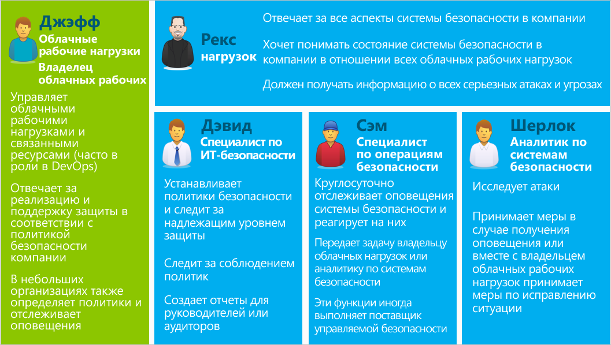

<properties
   pageTitle="Руководство по планированию использования центра безопасности Azure и работе в нем | Microsoft Azure"
   description="Этот документ поможет вам спланировать работу перед переходом на использование центра безопасности Azure. Кроме того, здесь содержатся рекомендации по ежедневно выполняемым операциям."
   services="security-center"
   documentationCenter="na"
   authors="YuriDio"
   manager="swadhwa"
   editor=""/>

<tags
   ms.service="security-center"
   ms.topic="hero-article" 
   ms.devlang="na"
   ms.tgt_pltfrm="na"
   ms.workload="na"
   ms.date="04/25/2016"
   ms.author="yurid"/>
 
# Руководство по планированию использования центра безопасности Azure и работе в нем
Это руководство предназначено для ИТ-специалистов, ИТ-архитекторов, аналитиков в сфере информационной безопасности и администраторов облака, организации которых планируют использовать центр безопасности Azure.

> [AZURE.NOTE] Сведения в этом документе относятся к предварительной версии Центра безопасности Azure.

## Обзор центра безопасности Azure
Центр безопасности Azure помогает вам выявлять и предотвращать угрозы, а также принимать ответные меры благодаря более полной информации о состоянии ресурсов Azure и контролю над их безопасностью. Он включает встроенные функции мониторинга безопасности и управления политиками для подписок, помогает выявлять угрозы, которые в противном случае могли бы оказаться незамеченными, и взаимодействует с широким комплексом решений по обеспечению безопасности.

Список вопросов, который может пригодиться при разработке и планировании, см. в статье [Центр безопасности Azure: часто задаваемые вопросы](security-center-faq.md).

## Руководство по планированию
В этом руководстве представлены шаги и задачи, которые помогут оптимизировать использование центра безопасности Azure с учетом требований к безопасности и модели управления облаком вашей организации. Чтобы воспользоваться всеми преимуществами центра безопасности Azure, важно понять, каким образом разные люди или группы в организации будут использовать эту службу. Это позволит обеспечить соответствие требованиям к безопасной разработке и эксплуатации, мониторингу, управлению и реагированию на инциденты. При планировании использования центра безопасности Azure следует учитывать такие ключевые области:

- роли безопасности и элементы контроля доступа;
- политики безопасности и рекомендации по ее обеспечению;
- сбор и хранение данных;
- текущий мониторинг безопасности; 
- реагирование на инциденты.

В следующем разделе вы узнаете, как спланировать работу каждой из этих областей и применить эти рекомендации в соответствии со своими требованиями.

## Роли безопасности и элементы контроля доступа 

В зависимости от размера и структуры организации центр безопасности могут использовать несколько пользователей и групп, чтобы выполнять различные задачи, связанные с безопасностью. Ниже представлен пример работы вымышленных пользователей, а также их ролей и обязанностей в сфере безопасности:

Центр безопасности Azure позволяет этим пользователям выполнять различные обязанности. Например:

**Джефф (владелец облачной рабочей нагрузки)**

- Просматривает и выполняет рекомендации центра безопасности на портале Azure. 
- Также может использовать систему отправки запросов, чтобы отслеживать изменения (указывает рекомендации с помощью API)

**Рекс (руководитель по информационной безопасности, директор по информационным технологиям)**

- Просматривает отчеты центра безопасности, используя Power BI или Excel.

**Дэвид (специалист по ИТ-безопасности)**

- Устанавливает политику безопасности и просматривает данные о работоспособности системы безопасности на портале Azure.
- Анализирует данные и создает отчеты в Power BI. 

**Сэм (специалист по операциям безопасности)**

- Просматривает и рассматривает оповещения центра безопасности на портале Azure. 
- Может использовать существующую панель мониторинга (указывает оповещения с помощью API).

**Шерлок (аналитик по системам безопасности)**

- Просматривает оповещения центра безопасности на портале Azure. 
- Может использовать существующую панель мониторинга (указывает оповещения с помощью API).
- Анализирует тенденции оповещений в Power BI. 
- Просматривает журналы событий в службе хранилища.

Центр безопасности Azure использует [управление доступом на основе ролей (RBAC)](../active-directory/role-based-access-control-configure.md), в котором предусмотрены [встроенные роли](../active-directory/role-based-access-built-in-roles.md). Эти роли можно назначать пользователям, группам и службам. Открыв центр безопасности Azure, пользователь будет видеть сведения, относящиеся только к тем ресурсам, к которым у него есть доступ, т. е. для которых ему назначена роль владельца, участника или читателя подписки или группы ресурсов, к которым относится ресурс. С учетом пользователей выше понадобятся следующие роли RBAC:

**Джефф (владелец облачной рабочей нагрузки)**

- владелец или участник группы ресурсов.

**Дэвид (специалист по ИТ-безопасности)**

- владелец или участник подписки.

**Сэм (специалист по операциям безопасности)**

- читатель подписки с возможностью просмотра оповещений;
- владелец или участник подписки (требуется для закрытия оповещений).

**Шерлок (аналитик по системам безопасности)**

- читатель подписки с возможностью просмотра оповещений;
- владелец или участник подписки (требуется для обработки или закрытия оповещений);
- может потребоваться доступ к службе хранилища.

Нужно также учитывать следующее:

- Только владельцы и участники подписки могут изменить политику безопасности.
- Только владельцы и участники подписки и группы ресурсов могут применить рекомендации по безопасности для ресурса.

Если вы планируете контролировать доступ, используя RBAC для центра безопасности Azure, определите, кто будет пользоваться им в организации, а также какие типы задач будут выполнять эти пользователи. Затем настройте RBAC соответствующим образом.

> [AZURE.NOTE] Рекомендуется назначить пользователям роли с минимальными разрешениями, необходимыми для выполнения их задач. Например, пользователям, которым нужно только просматривать сведения о состоянии безопасности ресурсов и не нужно выполнять какие-либо действия (к примеру, применять рекомендации или изменять политики), следует назначить роль читателя.

## Политики безопасности и рекомендации по ее обеспечению
Политика безопасности определяет набор средств контроля, которые рекомендуются для ресурсов в указанной подписке или группе ресурсов. В центре безопасности Azure вы можете настраивать политики в соответствии с требованиями безопасности вашей компании, типом приложений и конфиденциальностью данных.

Политики, включенные на уровне подписки, автоматически распространяются на все группы ресурсов в рамках подписки, как показано на схеме ниже:

Как показано на рисунке выше, группы ресурсов могут наследовать политики безопасности с уровня подписки.

В некоторых сценариях, когда в группе ресурсов есть ресурсы, требующие другого набора политик, наследование можно отключить и применить настраиваемые политики к определенной группе ресурсов.

Если для определенных групп ресурсов нужно установить настраиваемые политики, следует отключить наследование в группе ресурсов и изменить политики безопасности. Например, при наличии рабочих нагрузок, которые не требуют политики прозрачного шифрования данных SQL, отключите политику на уровне подписки и включите ее только в тех группах ресурсов, которым нужно ее использовать.
 
Начав создавать настраиваемые политики для разных групп ресурсов, необходимо спланировать их развертывание с учетом того, что в случае конфликта политик (подписки и группы ресурсов) больший приоритет должен быть у политики группы ресурсов.

> [AZURE.NOTE] Если нужно просмотреть, какие политики изменены, можно использовать [журналы аудита Azure](https://blogs.msdn.microsoft.com/cloud_solution_architect/2015/03/10/audit-logs-for-azure-events/). Изменения политик всегда регистрируются в журналах аудита Azure.

### Рекомендации по обеспечению безопасности

Перед настройкой политик безопасности следует ознакомиться со всеми [рекомендациями по обеспечению безопасности](security-center-recommendations.md) и определить, применимы ли они к различным подпискам и группам ресурсов, которые вы используете. Кроме того, важно понимать, какие действия нужно будет предпринять для реализации рекомендаций по обеспечению безопасности.

**Защита конечных точек**. Если для виртуальной машины не включено решение для защиты конечных точек, центр безопасности Azure порекомендует установить такое решение. Если вы уже установили предпочтительное решение для защиты конечных точек локально в своей организации, необходимо решить, будет ли использоваться та же антивредоносная программа в виртуальных машинах Azure. В центре безопасности Azure можно выбрать один из нескольких вариантов защиты конечных точек. Можно использовать антивредоносные программы Майкрософт или выбрать одно из множества интегрированных решений для защиты конечных точек от партнеров. Дополнительные сведения о развертывании антивредоносных программ с помощью центра безопасности Azure см. в статье [Включение защиты от вредоносных программ в центре безопасности Azure](security-center-enable-antimalware.md).

**Обновление системы**. Центр безопасности Azure определит виртуальные машины, в которых отсутствуют компоненты безопасности или критически важные обновления операционной системы. Выберите ответственного за обновление при необходимости, а также определите способ обновления. Во многих организациях используют службы WSUS, Центр обновления Windows или другие средства.

**Базовые конфигурации**. Если конфигурации операционной системы виртуальной машины не соответствуют базовым показателям, будут предоставлены рекомендации. Следует ознакомиться с набором базовых показателей [здесь](https://gallery.technet.microsoft.com/Azure-Security-Center-a789e335) и определить, как будут применяться конфигурации операционной системы.

**Шифрование дисков**. Если у вас есть незашифрованные диски виртуальной машины, центр безопасности Azure порекомендует применить шифрование дисков Azure, при котором используется BitLocker для Windows и DM-Crypt для Linux. Эти технологии обеспечивают шифрование томов для дисков операционной системы и данных. Выбрав рекомендацию, вы будете перенаправлены на [пошаговое руководство](security-center-disk-encryption.md) с указаниями по шифрованию.

Обратите внимание, что существует несколько сценариев шифрования. Необходимо спланировать уникальные требования для каждого из этих сценариев:

- шифрование новых виртуальных машин Azure из VHD, зашифрованных с помощью собственных ключей шифрования;
- шифрование новых виртуальных машин Azure, созданных из коллекции Azure;
- шифрование виртуальных машин Azure, работающих в среде Azure.

Для каждого из этих сценариев будут разные требования к планированию. Дополнительные сведения о каждом из этих сценариев см. в [техническом документе о шифровании дисков Azure](https://gallery.technet.microsoft.com/Azure-Disk-Encryption-for-a0018eb0).

**Брандмауэр веб-приложения**. Центр безопасности Azure определит виртуальные машины, в которых выполняются веб-приложения, и порекомендует установить брандмауэр веб-приложения (WAF). Оцените доступные партнерские решения, чтобы выбрать самое подходящее для своей организации, и определите способ лицензирования решения (решения партнеров могут поддерживать модели с использованием собственной лицензии и/или с оплатой по мере использования). Дополнительные сведения о развертывании брандмауэра веб-приложения в виртуальных машинах Azure с использованием центра безопасности Azure см. в статье [Добавление брандмауэра веб-приложения в Центре безопасности Azure](security-center-add-web-application-firewall.md).

**Виртуальные сети**. Центр безопасности Azure оценит инфраструктуру и конфигурацию [виртуальной сети Azure](https://azure.microsoft.com/documentation/services/virtual-network/), чтобы убедиться, что [группы безопасности сети](../virtual-network/virtual-networks-nsg.md) применяются и настроены должным образом с помощью правил входящего трафика. Вам нужно решить, какие правила трафика следует определить, и сообщить об этом сотрудникам, которые будут применять соответствующие рекомендации по обеспечению безопасности.

## Сбор и хранение данных

Настоятельно рекомендуется включить сбор данных для каждой подписки, так как это обеспечит доступность мониторинга безопасности для всех виртуальных машин. Сбор данных включается с помощью агента мониторинга Azure (ASMAgentLauncher.exe) и расширения "Мониторинг безопасности Azure" (ASMMonitoringAgent.exe).

Расширение "Мониторинг безопасности Azure" сканирует систему на наличие конфигураций, связанных с безопасностью, и собирает журналы данных безопасности на виртуальных машинах. Эти данные отправляются в указанную учетную запись хранения. На виртуальной машине также будет установлен диспетчер сканирования (ASMSoftwareScanner.exe), который будет служить сканером исправлений.

После включения сбора данных в политике безопасности на всех существующих и новых поддерживаемых виртуальных машинах, подготовленных к работе в Azure, будут автоматически установлены агент и расширения мониторинга. Агент не мешает работе и не влияет на производительность виртуальной машины.
 
Если в будущем вы захотите отключить сбор данных, это можно сделать в политике безопасности. Чтобы удалить ранее развернутые агенты мониторинга, выберите пункт меню "Удалить агенты".

> [AZURE.NOTE] Список поддерживаемых виртуальных машин см. в статье [Центр безопасности Azure: часто задаваемые вопросы](security-center-faq.md).

Для каждого региона, в котором у вас есть виртуальные машины, выберите учетную запись хранения, где хранятся данные, собираемые с этих виртуальных машин. Если вы не выберете учетную запись хранения для каждого региона, она будет создана автоматически. Можно выбрать место хранения по регионам или хранить все данные в одном месте. Политики безопасности можно настроить на уровне подписки Azure и на уровне группы ресурсов, но выбрать регион для учетной записи хранения можно только на уровне подписки.

Если вы используете общую учетную запись хранения для работы с различными ресурсами Azure, обязательно прочитайте статью [Целевые показатели масштабируемости и производительности службы хранилища Azure](../storage/storage-scalability-targets.md), в которой содержатся дополнительные сведения об ограничениях размера. К подписке также применяются ограничения учетных записей хранения. Чтобы узнать больше об этих ограничениях, просмотрите статью [Подписка Azure, границы, квоты и ограничения службы](../azure-subscription-service-limits).

> [AZURE.NOTE] Оплата использования этого хранилища не входит в цену центра безопасности Azure и взимается отдельно по обычным [тарифам для службы хранилища Azure](https://azure.microsoft.com/pricing/details/storage/).

При планировании производительности и масштабируемости следует также учитывать размер среды и ресурсов Azure, использующих учетную запись хранения. Дополнительные сведения см. в статье [Производительность хранилища Microsoft Azure и контрольный список масштабируемости](../storage/storage-performance-checklist.md).

## Текущий мониторинг безопасности

После первоначальной настройки и применения рекомендаций центра безопасности Azure следует рассмотреть рабочие процессы центра безопасности Azure.

Чтобы войти в центр безопасности Azure через портал Azure, нажмите кнопку **Обзор** и введите **Центр безопасности** в поле **Фильтр**. Информация будет отображаться в соответствии с примененными фильтрами.

Центр безопасности Azure не повлияет на выполнение обычных операций. Он будет выполнять пассивный мониторинг развертываний и предоставлять рекомендации в соответствии с включенными политиками безопасности.

Панель мониторинга центра безопасности Azure состоит из двух основных частей:

- Предотвращение 
- Обнаружение 

При первом включении сбора данных в центре безопасности Azure для текущей среды Azure обязательно просмотрите все рекомендации. Для этого щелкните колонку **Рекомендации** или просмотрите их для каждого ресурса (последовательно выберите **Виртуальная машина**, **Сети**, **SQL** и **Приложения**).

После выполнения всех рекомендаций все соответствующие ресурсы в разделе **Защита** должны быть отмечены зеленым цветом. С этого момента постоянный мониторинг станет проще, так как вы будете принимать меры в зависимости от изменений на плитках работоспособности системы безопасности ресурсов и рекомендаций по обеспечению безопасности ресурсов.

В разделе **Обнаружение** выполняется больше действий. Здесь появляются оповещения о текущих проблемах или о проблемах, произошедших в прошлом и обнаруженных элементами управления центра безопасности Azure и сторонними системами. На плитке "Оповещения системы безопасности" будут отображаться гистограммы с данными о количестве ежедневно обнаруживаемых оповещений об угрозах, а также их распределение по различным категориям серьезности (низкая, средняя, высокая). Дополнительные сведения об оповещениях системы безопасности см. в статье [Управление оповещениями безопасности в центре безопасности Azure и реагирование на них](security-center-managing-and-responding-alerts.md).

> [AZURE.NOTE] Кроме того, вы можете использовать Microsoft Power BI, чтобы визуализировать данные центра безопасности Azure. См. статью [Анализ данных центра безопасности Azure с помощью Power BI](security-center-powerbi.md).

### Мониторинг новых и измененных ресурсов

Большинство сред Azure динамичны. В них регулярно развертываются новые ресурсы с учетом конфигураций или изменений. Центр безопасности Azure предоставляет полные сведения о состоянии безопасности новых ресурсов.

При добавлении новых ресурсов (виртуальных машин, баз данных SQL) в среду Azure центр безопасности Azure автоматически обнаружит их и начнет следить за их безопасностью. Если в политике безопасности включен сбор данных, дополнительные возможности мониторинга будут включены для виртуальных машин автоматически.

1.	Чтобы выполнить мониторинг виртуальных машин, откройте плитку **Работоспособность системы безопасности ресурсов** и щелкните **Виртуальные машины**. Все проблемы, связанные со сбором данных, или соответствующие рекомендации будут отображаться в разделе **Рекомендации по мониторингу**.
2.	Просмотрите раздел **Рекомендации**, чтобы увидеть угрозы безопасности для нового ресурса, если они есть.
3.	Зачастую при добавлении в среду новых виртуальных машин изначально устанавливается только операционная система. Владельцу ресурса может потребоваться некоторое время, чтобы развернуть другие приложения, которые будут использоваться в этих виртуальных машинах. В идеале следует знать, для чего предназначена эта рабочая нагрузка. Будет ли она служить в качестве сервера приложений? Исходя из предназначения этой новой рабочей нагрузки, можно включить соответствующую **политику безопасности**. Это третий шаг в рабочем процессе.
4.	По мере добавления новых ресурсов в среду Azure, возможно, что на плитке **Оповещения системы безопасности** будут появляться новые оповещения. Всегда проверяйте наличие новых оповещений на этой плитке и предпринимайте меры согласно рекомендациям центра безопасности Azure.

Кроме того, необходимо регулярно отслеживать состояние существующих ресурсов, чтобы выявлять изменения конфигурации, которые привели к появлению угроз безопасности, несоответствию рекомендуемым базовым показателям и возникновению оповещений системы безопасности. Запустите панель мониторинга центра безопасности Azure. Там нужно регулярно следить за тремя основными аспектами.

1.	Панель **Работоспособность системы безопасности ресурсов** обеспечивает быстрый доступ к ключевым ресурсам. Используйте ее для мониторинга виртуальных машин, сетей, SQL и приложений. 
2.	На панели **Рекомендации** можно просмотреть рекомендации центра безопасности Azure. Мониторинг может показать, что рекомендации не приходят ежедневно. Это обычная ситуация, если вы выполнили все рекомендации при изначальной настройке центра безопасности Azure. Именно поэтому новые сведения могут не появляться в этом разделе ежедневно. Достаточно просматривать его по мере необходимости.
3.	Сведения на панели **Обнаружение** могут меняться с разной периодичностью. Всегда просматривайте оповещения системы безопасности и принимайте меры в соответствии с рекомендациями центра безопасности Azure. 

## Реагирование на инциденты

Центр безопасности Azure обнаруживает угрозы и оповещает о них по мере возникновения. Организациям необходимо отслеживать появление оповещений системы безопасности и принимать меры, необходимые для изучения атаки и устранения ее последствий.

> [AZURE.NOTE] Эта статья не предназначена для создания плана реагирования на инциденты. См. [Computer Security Incident Handling Guide](http://nvlpubs.nist.gov/nistpubs/SpecialPublications/NIST.SP.800-61r2.pdf) (Руководство по реагированию на инциденты системы безопасности компьютера) Национального института стандартов и технологии. Этот документ можно использовать в качестве справочного руководства по созданию такого плана.

Каждое оповещение системы безопасности содержит сведения, которые позволяют лучше понять характер атаки и определить возможные способы устранения риска. Некоторые оповещения также содержат ссылки на дополнительные сведения или другие источники сведений в Azure. Этими сведениями можно воспользоваться для дальнейшего исследования и устранения рисков.

В примере ниже показаны подозрительные действия с протоколом удаленного рабочего стола:

Как видно, в этой колонке показаны сведения о времени атаки, имени узла источника, целевой виртуальной машине, а также указаны рекомендации. В некоторых случаях сведения об источнике атаки могут отсутствовать. Дополнительные сведения о таком поведении см. в статье блога [Missing Source Information in Azure Security Center Alerts](https://blogs.msdn.microsoft.com/azuresecurity/2016/03/25/missing-source-information-in-azure-security-center-alerts/) (Отсутствие сведений об источнике в оповещениях центра безопасности Azure).

| **Уровень** | **Обнаружение атак** | **Предлагаемый способ устранения** |
|------------------|------------------------------------------|-----------------------------------------------------------------------------------------------|
| Сеть | Атака методом подбора с применением протокола удаленного рабочего стола | Уменьшение уязвимости: удаление ненужных открытых конечных точек, настройка списков управления доступом, использование надежного пароля |
| Виртуальные машины | Выполнение SVCHOST не в том каталоге | Перемещение виртуальной машины в другую изолированную подсеть, сканирование и повторное создание виртуальной машины |
| Приложение | Внедрение кода SQL в базе данных Azure | Усиление защиты конфигураций базы данных |

## Дальнейшие действия
В этом документе вы ознакомились с подробными сведениями о настройке политик безопасности в Центре безопасности. Дополнительные сведения о Центре безопасности см. в следующих статьях:

- [Наблюдение за работоспособностью системы безопасности в центре безопасности Azure](security-center-monitoring.md). Узнайте, как наблюдать за работоспособностью ресурсов Azure.
- [Центр безопасности Azure: часто задаваемые вопросы](security-center-faq.md). Часто задаваемые вопросы об использовании этой службы.
- [Блог по безопасности Azure](http://blogs.msdn.com/b/azuresecurity/). Публикации блога, посвященные безопасности Azure и соответствию требованиям.

<!---HONumber=AcomDC_0427_2016-->